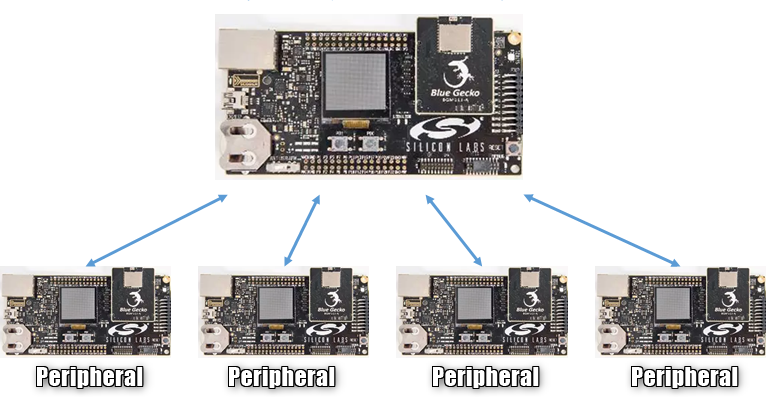
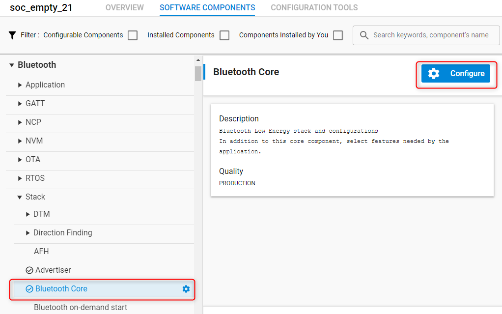
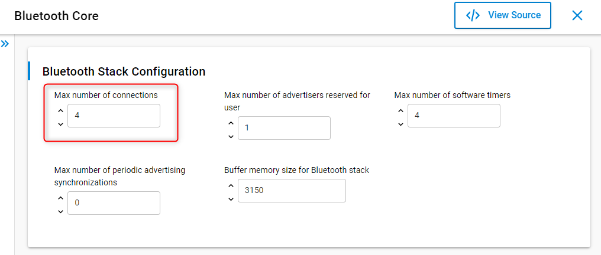
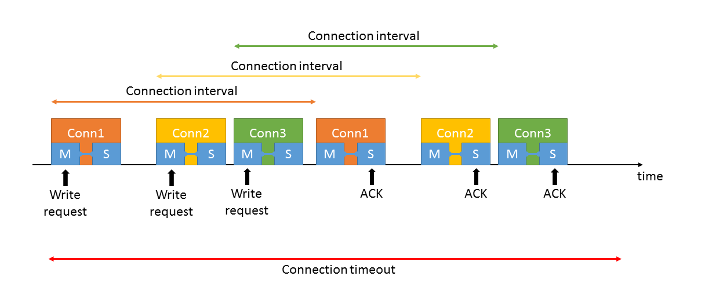
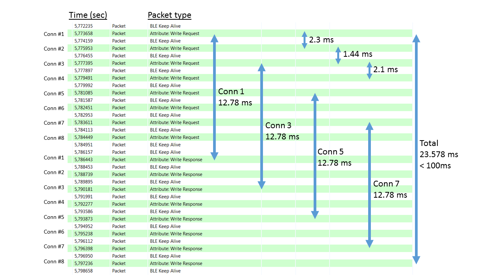

# Multi-Peripheral Topology

## Introduction

Silicon Labs Bluetooth stack supports simultaneous connection to multiple peripherals, with a maximum number of 32 peripherals. This page describes handling multiple connections in your Bluetooth application.



## Establishing Multiple Connections

A new connection (toward an advertising Bluetooth device) can be initiated with the *sl_bt_connection_open* command. This command starts a high-priority scan to find the next advertisement of the peer device and sends a connection request after the advertisement. If successful, a *sl_bt_evt_connection_opened* event is generated by the stack. After this, a second connection can be initiated with *sl_bt_connection_open*, while the first one is automatically kept alive.

Note that you cannot issue multiple *sl_bt_connection_open* commands immediately after each other even if you know all Bluetooth addresses you want to connect to. You always have to wait for the *sl_bt_evt_connection_opened* event to arrive before initiating a new connection. It is even better if you wait until the *sl_bt_evt_connection_parameters* event because at that moment the connection can be considered stable. To discover the GATT database of the remote device, do so before issuing the second *sl_bt_connection_open* command.

By default, four simultaneous connections are enabled in the stack. To increase the number of supported connections, go to the configuration of the **Bluetooth Core** software component and increase the *Maximum number of connections*:





## Saving Connection Handles

When a connection is opened, the stack returns a connection handle. Later, this handle can be used to differentiate between simultaneous connections. All connection-related commands require a connection handle and all connection-related events provide a connection handle. It is therefore important that you save the connection handles for future use, e.g., in a global variable.

```c
struct {
    bd_addr device_address;
    uint8_t address_type;
    uint8_t connection_handle;
} connections[8];
uint8_t live_connections = 0;

//...

  case sl_bt_evt_connection_opened_id:

    connections[live_connections].device_address = evt->data.evt_connection_opened.address;
    connections[live_connections].address_type = evt->data.evt_connection_opened.address_type;
    connections[live_connections].connection_handle = evt->data.evt_connection_opened.connection;
    live_connections++;

  break;
```

## Reading/Writing the Database of Multiple Peripherals

Unlike connection initiation, which has to be done sequentially, GATT operations can be initiated in parallel on multiple peripherals. For example, you can issue a read command on different connections immediately after each other, because each connection has its own state and buffers:

```c
for (uint8_t i = 0; i < live_connections; i++) {
    sl_bt_gatt_read_characteristic_value(connections[i], characteristic);
}
```

To read multiple values on the same connection, however, you still have to wait for the *sl_bt_evt_gatt_procedure_completed* event to arrive on that specific connection.

> In general, try to store a state variable for each connection to keep account of their state.

## Timing of Parallel Connections

Bluetooth connections use small connection windows to exchange data in every connection interval. At least an empty packet is sent in every connection interval, first by the central, then by the peripheral, and if there is data to send, the packets are extended. This ensures that no continuous receiving is needed and, most of the time, the device can go into sleep mode. The same behavior makes it possible to keep multiple connections alive easily at the same time. The connection windows of different connections are simply interleaved.



Connection windows are placed randomly in time domain, so some of the connections might be placed on top of each other. If this happens, the scheduler ensures that each connection gets enough time so that its supervision timeout does not expire. In this case, latency may increase on some connections, but in general all connections can be accessed at least once within the connection timeout (supervision timeout) interval.

For example, let's use 12.5 ms connections intervals and 100 ms timeout. In this case writing to 8 peripherals and getting the ACK responses from each of them takes 24–100 ms, depending on the result of the connection window allocating algorithm.



Writing in parallel to multiple peripherals means issuing multiple write commands immediately after each other. This puts the write commands in the task queue of the stack and they are processed in the next available connection window for each connection. Because connection windows are interleaved, ideally all write commands can be sent before the first ACK is received. Considering the transmission times, use a minimum connection interval of 12.5 ms when 8 peripherals are in use to ensure enough time for sending all write request before receiving write responses (ACKs).
