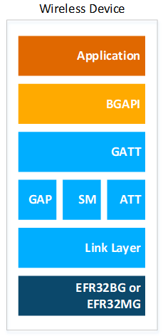
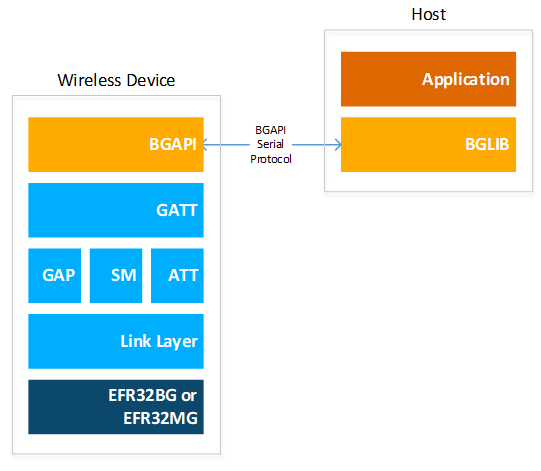
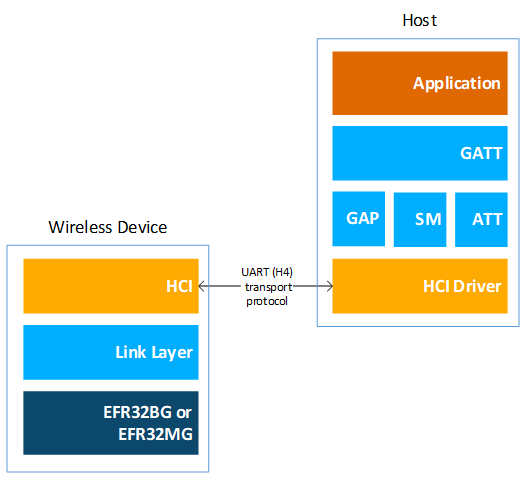
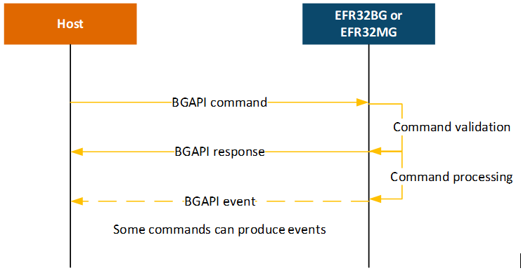
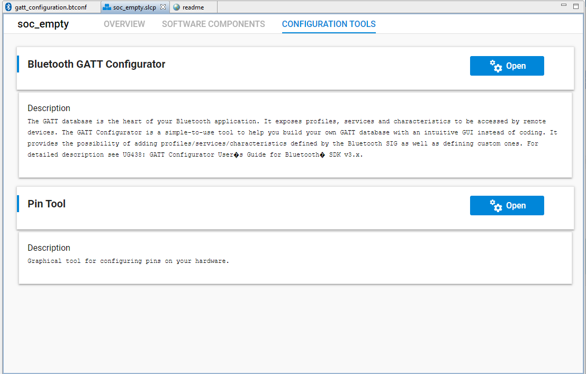
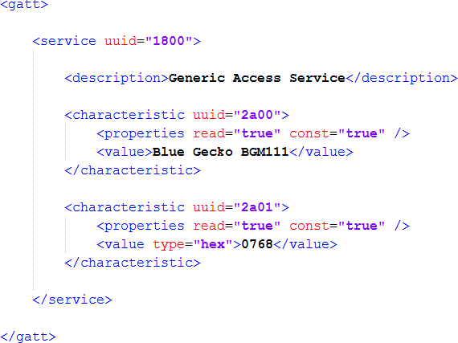

# Bluetooth Stack and SDK

This page provides an introduction to the Silicon Labs Bluetooth Low Energy (LE) stack and SDK.

## About the Bluetooth Stack

The v3.x Silicon Labs Bluetooth stack is an advanced Bluetooth 5-compliant protocol stack implementing the Bluetooth low energy standard. It supports multiple connections, concurrent central, peripheral, broadcaster, and observer roles. The v3.x Silicon Labs Bluetooth stack is meant for Silicon Labs EFR32 SoCs and modules.

The Silicon Labs Bluetooth stack provides multiple APIs for the developer to access the Bluetooth functionality. Three modes are supported:

1. Standalone mode, where both the Bluetooth stack and the application run in an EFR32SoC or module. The application can be developed with C programming language.

    

2. Network Co-Processor (NCP) mode, where the Bluetooth stack runs in an EFR32 and the application runs on a separate host MCU. For this use case, the Bluetooth stack can be configured into NCP mode where the API is exposed over a serial inter- face such as UART.

    

3. Radio Co-Processor (RCP) mode, where only the Link Layer of the Bluetooth stack runs on the EFR32, and the Host Layer of the stack, as well as the application, runs on a separate host MCU or PC. In this use case, the Host Layer is developed by a third party, since Silicon Labs’ Bluetooth stack is only built for EFR32 SoCs / modules. The Link Layer and the host layer communicate via HCI (Host-Controller Interface), which is a standard interface between the two layers. The HCI can be accessed via UART following the Bluetooth SIG's UART (H4) transport protocol or the Silicon Labs’ proprietary CPC (Co-Processor Communication) protocol.

    

### Bluetooth Stack Features

The features of the Silicon Labs Bluetooth stack are listed in the following tables.

**Series 1**

:::custom-table[Series 1]{heading=4, style=align-center, style=classic-theme}
|  Feature |  EFR32[B\|M]G1 |  EFR32[B\|M]G12 |  EFR32[B\|M]G13 |
|:----------|:----------------:|:-----------------:|:-----------------:|
| Qualified against Bluetooth® Core | > | > | 5.3 |
| Concurrent central, peripheral, broadcaster and observer modes | > | > | ✓ |
| Simultaneous connections | ✓ (up to 8) | ✓ (up to 32) | ✓ (up to 8) |
| LE secure connections | > | > | ✓ |
| LE Privacy 1.2 | Host-based | Host-based | Host-based |
| LE packet length extensions | > | > | ✓ |
| LE dual topology | > | > | ✓ |
| Link Layer Device Filtering | > | > | ✓ |
| LE Power Control | > | > | ✓ |
| Bluetooth 5 GATT caching | >  | > | ✓ |
| Bluetooth 5 2M PHY |  x | ✓ | ✓ |
| Bluetooth 5 LE coded PHY (LE Long Range) |  x | x | ✓ |
| Bluetooth 5 advertisement sets and scan event reporting | > | > | ✓ |
| Bluetooth 5 extended advertisements. |  x | ✓ (up to 1650B) | ✓ (up to 1650B) |
| Bluetooth 5 periodic advertisements  |  x | ✓ (up to 1650B) | ✓ (up to 1650B) |
| Bluetooth 5 periodic advertising synchronization | x | ✓ | ✓ |
| Directed advertising | > | > | ✓ |
| Adaptive Frequency Hopping | > | > | ✓ |
| L2CAP Connection Oriented Channels | > | > | ✓ |
| CTE transmitter | > | > | x |
| CTE receiver | > | > | x |
| Maximum throughput | 700 kbps over 1M PHY | 700 kbps over 1M PHY, 1300 kbps over 2M PHY | 700 kbps over 1M PHY, 1300 kbps over 2M PHY |
| Encryption | > | > | AES-128 |
| Pairing modes | > | > | Just works, numeric comparison, passkey entry, Out-Of-Band |
| Number of simultaneous bondings | > | > | Up to 13 with PS Store, up to 32 with NVM3 |
| Link Layer packet size | > | > | Up to 251 B |
| ATT protocol packet size | > | > | Up to 250 B |
| Supported Bluetooth profiles and services | > | > | All GATT based profiles and services are supported |
| Apple HomeKit | x | > | Before BLE SDK 6.0.0 |
| Host (NCP/RCP) interfaces | > | > | 4-wire UART with RTS/CTS control or 2-wire UART without RTS/CTS, GPIOs for sleep and wake-up management |
| Wi-Fi Coexistence | > | > | Using Packet Trace Arbitration (PTA) |
| Non-volatile memory | > | > | NVM3 or Persistent Store (PS)\*\* |
| Channel Sounding | > | > | x |
:::

\*\* Example applications in the SDK that are generated for these platforms will use PS by default.

**Series 2**

:::custom-table[Series 2]{heading=4, style=align-center, style=classic-theme}
|  Feature |  EFR32[B\|M]G21* |  EFR32[B\|M]G22 |  EFR32[B\|M]G24 | EFR32[B\|M]G26 | EFR32[B\|M]G27 | EFR32FG28 | EFR32[B\|M]G29 |
|----------|:------------------:|:-----------------:|:-----------------:|:-------------:|:-------------:|:-------------:|:-------------:|
| Qualified against Bluetooth® Core | > | > | 5.3 | > | > | > | 5.4 |
| Concurrent central, peripheral, broadcaster and observer modes | > | > | > | > | > | > | ✓ |
| Simultaneous connections | ✓ (up to 32) | ✓ (up to 8) | ✓ (up to 32) | ✓ (up to 32) | ✓ (up to 32) | ✓ (up to 32) | ✓ (up to 32) |
| LE secure connections | > | > | > | > | > | > | ✓ |
| LE Privacy 1.2 | > | > | > | > | > | > | ✓ |
| LE packet length extensions | > | > | > | > | > | > | ✓ |
| LE dual topology | > | > | > | > | > | > | ✓ |
| Link Layer Device Filtering | > | > | > | > | > | > | ✓ |
| LE Power Control | > | > | > | > | > | > | ✓ |
| Bluetooth 5 GATT caching | > | > | > | > | > | > | ✓ |
| Bluetooth 5 2M PHY | > | > | > | > | > | > | ✓ |
| Bluetooth 5 LE coded PHY (LE Long Range) | ✓ | ✓ | ✓ | ✓ | ✓ | x | ✓ |
| Bluetooth 5 advertisement sets and scan event reporting | > | > | > | > | > | > | ✓ |
| Bluetooth 5 extended advertisements. | > | > | > | > | > | > | ✓ (up to 1650B) |
| Bluetooth 5 periodic advertisements  | > | > | > | > | > | > | ✓ (up to 1650B) |
| Bluetooth 5 periodic advertising synchronization | > | > | > | > | > | > | ✓ |
| Directed advertising | > | > | > | > | > | > | ✓ |
| Adaptive Frequency Hopping | > | > | > | > | > | > | ✓ |
| L2CAP Connection Oriented Channels | > | > | > | > | > | > | ✓ |
| CTE transmitter | x | ✓ | ✓ | ✓ | ✓ | x | ✓ |
| CTE receiver | x | selected part numbers | selected part numbers | selected part numbers | x | x | x |
| Maximum throughput | > | > | > | > | > | > | 700 kbps over 1M PHY, 1300 kbps over 2M PHY |
| Encryption | > | > | > | > | > | > | AES-128 |
| Pairing modes | > | > | > | > | > | > | Just works, numeric comparison, passkey entry, Out-Of-Band |
| Number of simultaneous bondings | > | > | > | > | > | > | Up to 32 |
| Link Layer packet size | > | > | > | > | > | > | Up to 251 B |
| ATT protocol packet size | > | > | > | > | > | > | Up to 250 B |
| Supported Bluetooth profiles and services | > | > | > | > | > | > | All GATT based profiles and services are supported |
| Apple HomeKit | > | > | Before BLE SDK 6.0.0 | x | x | x | x |
| Host (NCP/RCP) interfaces | > | > | > | > | > | > | 4-wire UART with RTS/CTS control or 2-wire UART without RTS/CTS, GPIOs for sleep and wake-up management |
| Wi-Fi Coexistence | > | > | > | > | > | > | Using Packet Trace Arbitration (PTA) |
| Non-volatile memory | > | > | > | > | > | > | NVM3 |
| Channel Sounding | x | x | ✓ | x | x | x | x |
:::

\* EFR32MR21 has the same feature set as xG21, but works only in the RCP mode. The SoC and NCP modes are not supported.

**Series 3**

:::custom-table[Series 2]{heading=4, style=align-center, style=classic-theme}
|  Feature |  Si[M\|B]G301* |
|----------|:------------------:|
| Qualified against Bluetooth® Core | 6.0 |
| Concurrent central, peripheral, broadcaster and observer modes | ✓ |
| Simultaneous connections | ✓ (up to 32) |
| LE secure connections | ✓ |
| LE Privacy 1.2 | ✓ |
| LE packet length extensions | ✓ |
| LE dual topology | ✓ |
| Link Layer Device Filtering | ✓ |
| LE Power Control | ✓ |
| Bluetooth 5 GATT caching | ✓ |
| Bluetooth 5 2M PHY | ✓ |
| Bluetooth 5 LE Long Range | ✓ |
| Bluetooth 5 advertisement sets and scan event reporting | ✓ |
| Bluetooth 5 extended advertisements. | ✓ (up to 1650B) |
| Bluetooth 5 periodic advertisements  | ✓ (up to 1650B) |
| Bluetooth 5 periodic advertising synchronization | ✓ |
| Directed advertising | ✓ |
| Adaptive Frequency Hopping | ✓ |
| L2CAP Connection Oriented Channels | ✓ |
| CTE transmitter | x |
| CTE receiver | x |
| Maximum throughput | 700 kbps over 1M PHY, 1300 kbps over 2M PHY |
| Encryption | AES-128 |
| Pairing modes | Just works, numeric comparison, passkey entry, Out-Of-Band |
| Number of simultaneous bondings | Up to 32 |
| Link Layer packet size | Up to 251 B |
| ATT protocol packet size | Up to 250 B |
| Supported Bluetooth profiles and services | All GATT based profiles and services are supported |
| Apple HomeKit | x |
| Host (NCP/RCP) interfaces | 4-wire UART with RTS/CTS control or 2-wire UART without RTS/CTS, GPIOs for sleep and wake-up management |
| Wi-Fi Coexistence | Using Packet Trace Arbitration (PTA) |
| Non-volatile memory | NVM3 |
| Channel Sounding | x |
:::

### Bluetooth Qualification

All products using Bluetooth technology **must go through the Bluetooth SIG's Qualification Process**, even if the product does not have the Bluetooth logo or Bluetooth is not mentioned in the packaging and the documentation. In practice this means that, **before you can sell** a Bluetooth-enabled product to the market, the **product must be qualified** as an End Product through the Bluetooth SIG. The qualification listing has a [Declaration Fee](https://www.bluetooth.com/develop-with-bluetooth/qualification-listing/qualification-listing-fees/). There are online resources to learn more about the [Bluetooth Qualification Process](https://www.bluetooth.com/develop-with-bluetooth/qualification-listing/) as well as tutorials on the [Launch Studio](https://www.bluetooth.com/develop-with-bluetooth/build/test-tools/launch-studio/), which is the online tool used to complete the Bluetooth Qualification Process. If you need assistance to qualify your device, consider reaching out to your nearest [Bluetooth Qualification Consultant](https://www.bluetooth.com/develop-with-bluetooth/qualification-listing/qualification-consultants/).

#### End Product Listing Using Pre-Qualified Components

When qualifying your end-product based on the Silicon Labs Bluetooth stack, you will integrate the pre-qualified components listed in the table below, depending on which SDK version was used to build your application.

| **Bluetooth SDK version** | **Component** | **QDID and Subset ID** | **Expiry date (not applicable in QPRD v3.0 and above)** |
|---------------------------|---------------|------------------------|---------------------------------|
| V9.0.0.0 and above | Channel Sounding, Link Layer (Bluetooth 6.0) and Host stack (Bluetooth 6.0) | [Qualified Design details: Q317849](https://qualification.bluetooth.com/ListingDetails/240988)  | -- |
| V6.0.0.0 and above | Link Layer (Bluetooth 5.4) and Host stack (Bluetooth 5.4) | [Launch Studio Listing Details:216508](https://launchstudio.bluetooth.com/ListingDetails/187016)  | 20.7.2026 |
| V3.2.x and above | Link Layer (Bluetooth 5.3) | [Launch Studio Listing Details: 178212](https://launchstudio.bluetooth.com/ListingDetails/141145)  | 03.11.2024 |
| V2.13.12 and above only | Link Layer (Bluetooth 5.3) | [Launch Studio Listing Details: 214503](https://launchstudio.bluetooth.com/ListingDetails/141145)  | 03.11.2024 |
| V3.2.x and above | Host stack (Bluetooth 5.3) | [Launch Studio Listing Details: 175341](https://launchstudio.bluetooth.com/ListingDetails/137791)  | 09.09.2024 |
| V2.13.12 and above only | Host stack (Bluetooth 5.3) | [Launch Studio Listing Details: 214504](https://launchstudio.bluetooth.com/ListingDetails/137791)  | 09.09.2024 |
| V2.13.x and above through 2.13.11 | Link Layer (Bluetooth 5.2) | [Launch Studio Listing Details: 147971](https://launchstudio.bluetooth.com/ListingDetails/105576)  | 2.4.2023 |
| “ | Host stack (Bluetooth 5.2) | [Launch Studio Listing Details: 146950](https://launchstudio.bluetooth.com/ListingDetails/104376)  | 12.3.2023 |
| V2.11.x and above | Link Layer (Bluetooth 5.1) | [Launch Studio Listing Details: 127618](https://launchstudio.bluetooth.com/ListingDetails/80713)  | 3.3.2022 |
| “ | Host stack (Bluetooth 5.1) | [Launch Studio Listing Details: 126252](https://launchstudio.bluetooth.com/ListingDetails/78937)  | 10.2.2022 |
| V2.11.x and above | Link Layer (Bluetooth 5.0) | [Launch Studio Listing Details: 124272](https://launchstudio.bluetooth.com/ListingDetails/76437)  | 14.1.2022 |
| V2.6.x and above | Link Layer (Bluetooth 5.0) | [Launch Studio Listing Details: 99504](https://launchstudio.bluetooth.com/ListingDetails/11850)  | 8.10.2020 |
| " | Host stack (Bluetooth 5.0) | [Launch Studio Listing Details: 101550](https://launchstudio.bluetooth.com/ListingDetails/11849)  | 26.9.2020 |
| V2.0.x and above | Host stack (Bluetooth 4.2) | [Launch Studio Listing Details: 91422](https://launchstudio.bluetooth.com/ListingDetails/13590)  | 28.12.2019 |
| V1.0.x and above | Link Layer (Bluetooth 4.2) | [Launch Studio Listing Details: 81105](https://launchstudio.bluetooth.com/ListingDetails/25009)  | 17.4.2019 |
| " | Host stack (Bluetooth 4.2) | [Launch Studio Listing Details: 82817](https://launchstudio.bluetooth.com/ListingDetails/25010)  | 17.4.2019 |

Note: According to the Bluetooth SIG Qualification [Program Reference Document (PRD)](https://www.bluetooth.org/docman/handlers/DownloadDoc.ashx?doc_id=40972), the Assessment Date of the tested Component must be less than three years old at the time it is being imported into a Launch Studio project for a new End Product Listing (EPLs). After the expiration of a Component QDID (Qualified Design ID), a newer SDK version than the one used for the outdated QDID should be used to qualify your product. Newer QDIDs than the ones listed in the table above are possible if there are newer component versions. You can browse Silicon Labs valid Qualified Components and their Assessment Date by entering Silicon Laboratories in the search bar of [Launch Studio](https://launchstudio.bluetooth.com/Listings/Search). Contact Silicon Labs technical support if you need to use an older SDK version.

Note: Silicon Labs recommends using the latest SDK or SDKs for which Bluetooth Qualifications are not expired. Developing with a very old SDK (for example, starting with already expired components, such as with versions lower than v2.13.12 listed above) is not recommended as it will most likely be difficult to renew the expired component in order to be compliant with the latest Test Case Reference List (including Errata introduced in interim to fix specifications, test specifications, and any other bug fixes) in core layers, i.e. Link Layer and/or Host stack. Contact technical support if you need to use an older SDK version.

The above software-based pre-qualified components are two out of the three components to integrate when proceeding with the [Qualification Process with Required Testing](https://www.bluetooth.com/develop-with-bluetooth/qualification-listing/qualification-process-with-required-testing/). Despite the “Required Testing", you do not need to do any additional testing, given that the test reports are embedded in the pre-qualified components for the SIG to review.

In addition to these two software components, you must also have integrated a qualified RF-PHY component in your end-product listing. If you are designing with one of the Silicon Labs Bluetooth modules, refer to the module datasheet for the appropriate component QDID to use. If you are designing with an SoC, you may need to obtain your own RF-PHY qualification with the Bluetooth SIG, depending on your hardware design. In the latter case, consult your nearest [Bluetooth Qualification Consultant](https://www.bluetooth.com/develop-with-bluetooth/qualification-listing/qualification-consultants/), or Silicon Labs through the support portal, to understand if an existing Silicon Labs RF-PHY pre-qualification could be used.

#### End Product Listing Using Pre-Qualified Subsystems

| **Bluetooth SDK version and Hardware part (if any)** | **Subsystem** | **QDID** | **Expiry date (If applicable)** |
|---------------------------|---------------|------------------------|---------------------------------|
| V9.0.0.0 and above | Host stack (Bluetooth 6.0) Subsystem | [Qualified Design details: Q333162](https://qualification.bluetooth.com/ListingDetails/259372) | - |
| V6.0.0.0 and above | Host stack (Bluetooth 5.4) Subsystem | Launch Studio Listing Details: 215749 | - |
| V6.0.0.0 and above with BGM220S Radio | Controller (Bluetooth 5.4) Subsystem | Launch Studio Listing Details: 231196 | - |

For some of our hardware platforms (modules /SoCs), Silicon Labs has also listed or plan to list controller subsystems by integrating a pre-qualified RF-PHY component with the intended software based pre-qualified component in addition to the Host subsystem shown above. In this case, proceed with [Qualification Process with No Required Testing](https://www.bluetooth.com/develop-with-bluetooth/qualification-listing/qualification-process-with-no-required-testing/). In the “referenced qualified design” section, enter the Qualified Design IDs (QDID) for the design on which you are basing your project with no modification. No modification here refers to no changes in Hardware (using our reference design) and software (unmodified SDK).

#### Bluetooth Implementation Using Controller Components and Host Stack Subsystem

If you want to inherit the host subsystem in combination with controller components in your Product listing (Bluetooth implementation which is the same as End product listing as it has all the layers to make it work as a Bluetooth product), in Launch Studio, proceed with the [Qualification Process with Required Testing](https://www.bluetooth.com/develop-with-bluetooth/qualification-listing/qualification-process-with-required-testing/). Select "Controller Subsystem" in product types by using/inheriting  components for controller layers, i.e. qualified RF-PHY component and Link layer component. Continue as normal until you reach the Product Declaration section, where you can enter the Subsystem QDID in "Reference Qualified Design". All other sections are the same as any other product listing.

Note: In this process, a new QDID is assigned for your Controller subsystem; however, the DID is assigned for the whole Bluetooth implementation which includes controller and host layers. Only one listing fee (cost for purchase Declaration ID) is used in this process.

Silicon Labs does not provide pre-qualifications for adopted profiles. You must obtain these with your own end applications that implement the functionality as per the SIG profile specification.

This article is valid as per the current PRD v2.3 (Qualification Program Reference Document) on the Bluetooth SIG website. If there are any conflicts of opinion in the qualification process, then PRD v2.3 (Qualification Program Reference Document) or the Bluetooth SIG latest qualification program document have precedence over this article. Alternatively, you can contact a [Bluetooth Qualification Consultant](https://www.bluetooth.com/develop-with-bluetooth/qualification-listing/qualification-consultants/) or [Support Request (requires Bluetooth.com account)](https://support.bluetooth.com/hc/en-us/requests) with the Bluetooth SIG. Contact technical support if you need more information related to Silicon Labs products.

Note: There can also be newer QDIDs than the ones listed in the table above if there are newer component versions or subsystem versions (Host, Controller, or Profiles). You can browse valid Qualified Components/Subsystems and their Assessment Date by entering Silicon Laboratories in the search bar of [Launch Studio](https://launchstudio.bluetooth.com/Listings/Search).

### The Bluetooth Stack APIs

This section briefly describes the different software APIs available for the developer when developing a Bluetooth application either in SoC or NCP mode. In RCP mode the standard HCI is used, which is defined in the Bluetooth Core Specification and therefore is not discussed here.

#### The BGAPI Bluetooth API

The BGAPI is the Bluetooth API provided by the Silicon Labs Bluetooth stack. It provides access to all the Bluetooth functionality implemented by the Bluetooth stack, such as: the Generic Access Profile (GAP), connection manager, the security manager (SM), and GATT client and server.

In addition to the Bluetooth APIs, the BGAPI also provides access to a few other functions like the Direct Test Mode (DTM) API for RF testing purposes, the NVM (Non-Volatile Memory) API for reading and writing settings to and from the devices flash memory, the DFU (Device Firmware Update) API for field firmware updates, and the System API for various system level functions.

#### CMSIS and emlib

The Cortex Microcontroller Software Interface Standard (CMSIS) is a common coding standard for all ARM Cortex devices. The CMSIS library provided by Silicon Labs contains header files, defines (for peripherals, registers and bitfields), and startup files for all devices. In addition, CMSIS includes functions that are common to all Cortex devices, like interrupt handling, intrinsic functions, etc. Although it is possible to write to registers using hard-coded address and data values, it is recommended to use the defines to ensure portability and readability of the code.

To simplify programming Wireless Geckos, Silicon Labs developed and maintains a complete C function library called emlib that provides efficient, clear, and robust access to and control of all peripherals and core functions in the device. This library resides within the em_xxx.c (for example, em_dac.c) and em_xxx.h files in the SDK.

The emlib documentation is available on [https://docs.silabs.com](https://docs.silabs.com).

#### The BGAPI Serial Protocol and BGLIB Host API

When configured in NCP (network co-processor) mode, the Bluetooth stack also implements the BGAPI serial protocol. This allows the Bluetooth stack to be controlled over a serial interface such as UART from a separate host like an EFM32 microcontroller. The BGAPI serial protocol provides exactly the same Bluetooth APIs over UART as the BGAPI API when used in a standalone mode. Additionally, an extra command and an event are reserved for user messaging in case the interface should be extended with custom commands.

The BGAPI serial protocol is a lightweight, binary protocol that carries the BGAPI commands from the host to the Bluetooth stack and responses and events from the Bluetooth stack back to the host.

The Bluetooth SDK delivers a ready-made BGAPI serial protocol parser implementation, called BGLIB. It implements the serial protocol parser and C language function and events for all the APIs provided by the Bluetooth stack. The host code developed on top of BGLIB can be written to be identical to the code for the Wireless Gecko, which allows easy porting of the application code from the Wireless Gecko to a separate host or vice versa.

A Python based BGAPI serial protocol parser is also available here: [https://pypi.org/project/pybgapi/](https://pypi.org/project/pybgapi/)

The BGAPI serial protocol packet structure is described in the following table.

|  Byte |  Byte 0 |  Byte 1 |  Byte 2 |  Byte 3 |  Byte 4-255 |
|-------|---------|---------|---------|---------|-------------|
|  Explanation | Message type | Minimum payload length | Message class | Message ID | Payload |
|  Values | 0x20: command | 0x00 - 0xFF | 0x00 - 0xFF | 0x00 - 0xFF | Specific to command, response, or event |
|  “ | 0x20: response | 0x00 - 0xFF | 0x00 - 0xFF | 0x00 - 0xFF | Specific to command, response, or event |
|  “ | 0xA0: event | 0x00 - 0xFF | 0x00 - 0xFF | 0x00 - 0xFF | Specific to command, response, or event |

#### GATT Configuration

Bluetooth applications usually need a GATT database. The structure of the GATT database can be defined in the Bluetooth application. The Silicon Labs’ Bluetooth SDK provides two ways to define the GATT database:

- A static GATT database can be defined in compile time with the appropriate tools provided by the Bluetooth SDK. In this case the database structure is stored in the ROM, which means faster start-up time and lower memory usage.

- A dynamic GATT database can be defined in runtime with the appropriate BGAPI commands. In this case the database structure is stored in the RAM, which makes it more flexible. This is recommended in the NCP use case to avoid re-building the target code that runs on the Wireless Gecko.

**The Bluetooth Profile Toolkit GATT Builder**: The Bluetooth Profile Toolkit is a simple XML-based API and description language used to describe (static) GATT-based services and characteristics easily without the need to write them in code. The XML files can be easily written by hand based on the information contained in [Blue Gecko Bluetooth Profile Toolkit Developer Guide](/bluetooth/{build-docspace-version}/bluetooth-profile-toolkit-developers-guide). Use the Profile Toolkit GATT Builder if you are developing outside of Simplicity Studio, and follow the instructions in *Blue Gecko Bluetooth Profile Toolkit Developer Guide* to convert your GATT database into C code.

**The GATT Configurator**: Simplicity Studio includes the GATT Configurator, a tool that allows building the (static) GATT database in a visual way, without hand editing the XML file. It also automatically converts the database structure into C code upon saving. See the Simplicity Studio User's Guide section on the [GATT Configurator](https://docs.silabs.com/simplicity-studio-5-users-guide/latest/ss-5-users-guide-developing-with-project-configurator/bluetooth-gatt-configurator) for summary information, and [GATT Configurator User’s Guide for Bluetooth SDK v3.x](/bluetooth/{build-docspace-version}/gatt-configurator-users-guide-ble-btmesh) for details. Open the GATT Configurator in Simplicity Studio through the Project Configurator, Configuration Tools tab. Click **Open** and the GATT Configurator tool opens the file *gatt\_configuration.btconf* in a new tab.

*gatt\_configuration.btconf* gives the trunk of the GATT database. It is located inside the *config* \> *btconf* directory of your project. This file can be edited using the GATT Configurator.

The contents of the additional xml files in the *config \> btconf* folder will appear as *Contributed Items* in the GATT Configurator UI. See for example the in_place_ota_dfu.xml file provided by the OTA DFU software component. If these files are edited through GATT Configurator, they become a part of Custom BLE GATT and will be removed from the Contributed Items. Also, the contributed items (services and its characteristics) will move from the xml file to gatt_configuration.btconf file.

Upon saving *gatt\_configuration.btconf,* the GATT database developed with the GATT Configurator is converted to a .c file and an .h file and included in the application project as a pre-build step when the firmware is compiled. Then the GATT can be accessed with the Bluetooth stack GATT APIs or by a remote Bluetooth device.

**Building a Dynamic GATT database**: The GATT database can also be built dynamically from the application using the GATT database API class of the Bluetooth API if the Dynamic GATT Database software component is installed in your project, or if this API class is explicitly initialized. For more information, see the [Bluetooth API reference manual](/bluetooth/{build-docspace-version}/bluetooth-stack-api) and the corresponding section of [GATT Configurator User’s Guide for Bluetooth SDK v3.x](/bluetooth/{build-docspace-version}/gatt-configurator-users-guide-ble-btmesh). In NCP mode it is also possible to take a static GATT database code on the host side and turn it into dynamic API calls to transmit the database structure over UART. For more information, see [Using the Bluetooth Stack in Network Co-Processor Mode](/bluetooth/{build-docspace-version}/bluetooth-network-coprocessor-mode).

## About the Bluetooth SDK

The Bluetooth SDK is a full software development kit that enables you to develop applications on top of the Bluetooth stack using C programming language. The SDK also supports making standalone applications, where the Bluetooth stack and the application both run in the Wireless Gecko, or the network co-processor (NCP) architecture, where the application runs on an external host and the Bluetooth stack runs in the Wireless Gecko. SDK contents and folder structure are described in the following sections.

### Libraries

The following libraries are delivered with the Bluetooth SDK and must be included in C application projects.

|  Library |  Explanation |  Mandatory |
|----------|--------------|------------|
| libbluetooth.a | Bluetooth stack library | Yes |
| librail_efr32xg1_gcc_release.a | RAIL library for GCC | Yes for GCC projects on EFR32xG1 platform |
| librail_efr32xg12_gcc_release.a | RAIL library for GCC | Yes for GCC projects on EFR32xG12 platform |
| librail_efr32xg13_gcc_release.a | RAIL library for GCC | Yes for GCC projects on EFR32xG13 platform |
| librail_efr32xg14_gcc_release.a | RAIL library for GCC | Yes for GCC projects on EFR32xG14 platform |
| librail_efr32xg21_gcc_release.a | RAIL library for GCC | Yes for GCC projects on EFR32xG21 platform |
| librail_efr32xg22_gcc_release.a | RAIL library for GCC | Yes for GCC projects on EFR32xG22 platform |
| librail_efr32xg24_gcc_release.a | RAIL library for GCC | Yes for GCC projects on EFR32xG24 platform |
| librail_efr32xg27_gcc_release.a | RAIL library for GCC | Yes for GCC projects on EFR32xG27 platform |
| librail_efr32xg1_iar_release.a | RAIL library for IAR | Yes for IAR projects on EFR32xG1 platform |
| librail_efr32xg12_iar_release.a | RAIL library for IAR | Yes for IAR projects on EFR32xG12 platform |
| librail_efr32xg13_iar_release.a | RAIL library for IAR | Yes for IAR projects on EFR32xG13 platform |
| librail_efr32xg14_iar_release.a | RAIL library for IAR | Yes for IAR projects on EFR32xG14 platform |
| librail_efr32xg21_iar_release.a | RAIL library for IAR | Yes for IAR projects on EFR32xG21 platform |
| librail_efr32xg22_iar_release.a | RAIL library for IAR | Yes for IAR projects on EFR32xG22 platform |
| librail_efr32xg24_iar_release.a | RAIL library for IAR | Yes for IAR projects on EFR32xG24 platform |
| librail_efr32xg27_iar_release.a | RAIL library for IAR | Yes for IAR projects on EFR32xG27 platform |
| libpsstore.a | PSStore library | Yes, on series 1 |
| binapploader.o | Apploader for OTA updates | No |
| libcoex.a | Wi-Fi and Bluetooth coexistence | No |
| libnvm3_CM33_gcc.a / libnvm3_CM33_iar.a | - | Yes, on series 2 |

### Include Files

The following files are delivered with the Bluetooth SDK and must be included in C application projects.

:::custom-table{width=20%,40%,40%}
|  Library |  Explanation |  When needed |
|----------|--------------|--------------|
| bg_gattdb_def.h | Bluetooth GATT database structure definition. | Included automatically. |
| sl_bt_version.h | Bluetooth stack version in plain text. The boot event reports the same version values as this file has. | For convenient access to Bluetooth SDK version Information. Not mandatory for application development. |
| sl_bt_ll_config.h | Bluetooth Link Layer configuration data type definitions. Included by sl_bt_stack_config.h. | Included automatically. |
| sl_bt_stack_config.h | Bluetooth stack configuration data type definitions. Included by sl_bluetooth_config.h. | Included automatically. |
| sl_bluetooth_config.h | Bluetooth configuration. | Included automatically if application is generated with the Project Configurator. |
| sl_bt_types.h | Bluetooth API data type definitions. | Included automatically. |
| sl_bt_stack_init.h | Bluetooth feature and API initialization functions on SoC. | Included automatically if application is generated with the Project Configurator. |
| sl_bt_api.h | Bluetooth API declarations with comprehensive documentation. This is the single file for Bluetooth API in SoC or NCP mode. | Included automatically if application is generated with the Project Configurator. |
| sli_bt_api.h | Bluetooth API library in plain source code for NCP host applications. | Included automatically if application is generated with the Project Configurator. |
| sl_bt_ncp_host_api.c | Bluetooth API library in plain source code for NCP host applications. | Included automatically if application is generated with the Project Configurator. |
| sl_bt_ncp_host.h | An adaptation layer between host application and Bluetooth API serial protocol. | Included automatically if application is generated with the Project Configurator. |
| sl_bt_ncp_host.c | An adaptation layer between host application and Bluetooth API serial protocol. | Included automatically if application is generated with the Project Configurator. |
| sl_bt_rtos_adaptation.h | An adaptation layer for running Bluetooth in Micrium OS on SoC. | Included automatically if application is generated with the Project Configurator. |
| sl_bt_rtos_adaptation.c | An adaptation layer for running Bluetooth in Micrium OS on SoC. | Included automatically if application is generated with the Project Configurator. |
:::

### Platform Components

The following components are delivered with the Bluetooth SDK. The platform components are under the platform folder.

:::custom-table{width=20%,80%}
|  Folder |  Explanation |
|---------|--------------|
| bootloader | Gecko Bootloader source code and project files. |
| CMSIS | Silicon Laboratories CMSIS-CORE device headers. |
| common | Silicon Labs status codes |
| Device | EFR32BG and EFR32MG device files. |
| emdrv | A set of function-specific high-performance drivers for EFR32 on-chip peripherals. Drivers are typically DMA based and are using all available low-energy features. For most drivers, the API offers both synchronous and asynchronous functions. |
| emlib | A low-level peripheral support library that provides a unified API for all EFM32, EZR32 and EFR32 MCUs and SoCs from Silicon Laboratories.  |
| Halconfig | Peripheral configuration |
| Hwconf_data | Gather chip-specific hardware configuration |
| micrium_os | Micrium OS |
| middleware | Display driver for WSTK development kits  |
| radio | Silicon Labs RAIL (Radio Abstraction Interface Layer) library |
| service | Sleeptimer driver and configuration file. Used by the Bluetooth LE stack. |
:::
