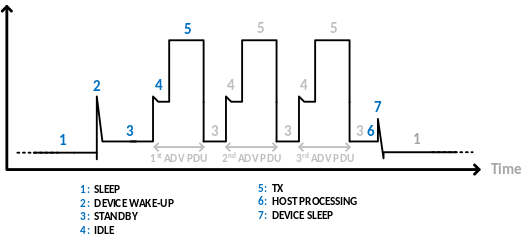
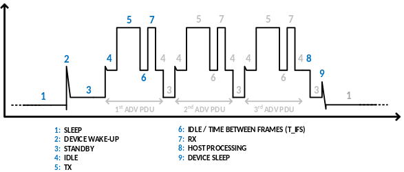
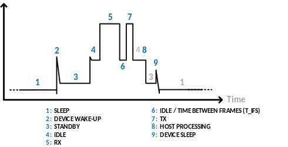
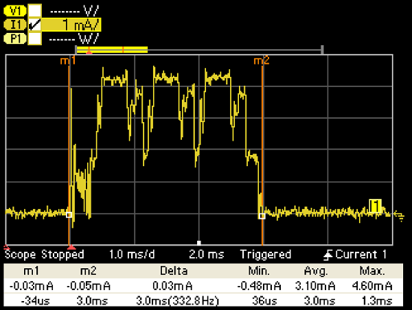
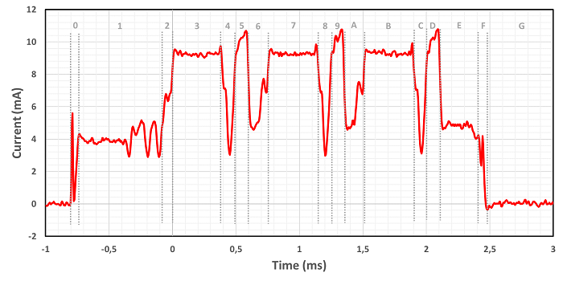
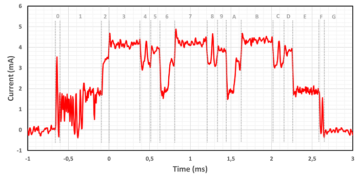
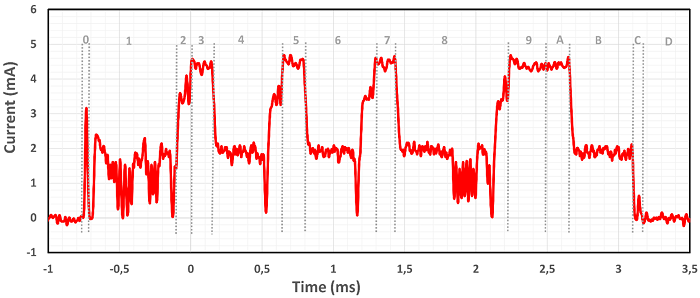
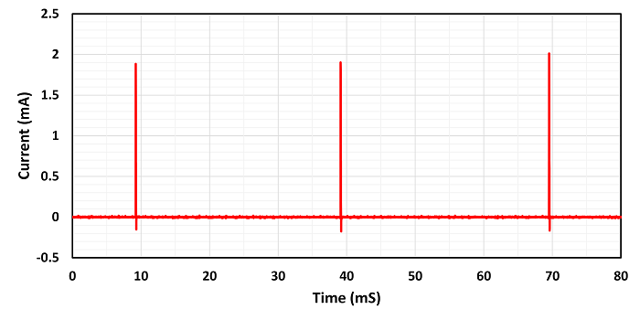
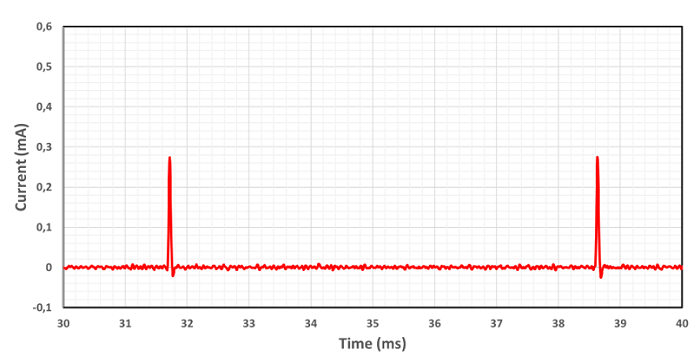

# Test Example

This section:

- Gives a brief overview of current profiles (for example, magnitude vs. time) commonly observed in Bluetooth Smart devices for reference.

- Provides an example showing the capture of power measurements for an EFR32BG radio board and their interpretation.

## Reference Current Profiles

The following figures show the form and breakdown of a typical current consumption profile for a Bluetooth Smart device while in an advertising or connection state.

General Current Profile for a Non-Connectable Advertising Event:

General Current Profile for a Connectable Advertising Event:

General Current Profile for a Connection Event:

## Measuring Power Consumption

Once you have gone through the setup and procedure steps outlined in *AN969: Measuring Power Consumption in Wireless Gecko Devices*, measuring the power consumption of an EFR32BG device is straightforward. This section provides an example of how to turn the captured current consumption profile to an actual set of power measurements giving useful information.

After running a test, use the scope cursors in the N6705B to measure every event in the current profile individually. The cursors can be enabled or disabled by pressing the Scope View button under "Measure" in the front panel of the DC analyzer. To scroll the cursors over the waveform, rotate the marker 1 and marker 2 knobs under "Waveform Display." The following figure shows a screenshot of a current profile with the scope cursors enabled. This current profile is a zoomed-in view of a large periodic burst corresponding to the current consumed by the SoC while broadcasting a beacon every 100 ms.

**Note**: Measurements are enabled by default when the scope cursors are active.

Current Profile Segment Measured with Scope Cursors - Device: Series 2 EFR32BG22:

### Measuring Power Consumption of SoC – iBeacon on Series 1 Devices

Per the application’s default settings, the Series 1 EFR32BG1 device broadcasts a beacon with a frame of 46 octets every 100 ms, at a 0 dBm TX output power level, running from the DCDC converter. The figure below shows the active portion only of the captured current profile for a beacon broadcast broken into individual events similarly to the reference profiles in [Reference Current Profiles](#reference-current-profiles). The table that follows summarizes the measurements recorded using the scope cursors. Notice that the numbering of events in the upper part of the figure corresponds to the columns in the table.

Current Profile for Series 1 EFR32BG1 SoC Running SoC-iBeacon Example Application (Active Only):

Power and Energy Measurements for the Current Profile in the figure above:

:::custom-table{heading=2}
|  | :custom-cell[UNIT]{style=table-cell-vertical} | :custom-cell[DEV WKUP]{style=table-cell-vertical} | :custom-cell[STANDBY]{style=table-cell-vertical} | :custom-cell[IDLE]{style=table-cell-vertical} | :custom-cell[TX_1]{style=table-cell-vertical} | :custom-cell[T_IFS]{style=table-cell-vertical} | :custom-cell[RX_1]{style=table-cell-vertical} | :custom-cell[STANDBY/IDLE]{style=table-cell-vertical} | :custom-cell[TX_2]{style=table-cell-vertical} | :custom-cell[T_IFS]{style=table-cell-vertical} | :custom-cell[RX_2]{style=table-cell-vertical} | :custom-cell[STANDBY/IDLE]{style=table-cell-vertical} | :custom-cell[TX_3]{style=table-cell-vertical} | :custom-cell[T_IFS]{style=table-cell-vertical} | :custom-cell[RX_3]{style=table-cell-vertical} | :custom-cell[POST PROCESS]{style=table-cell-vertical} | :custom-cell[DEV SLEEP]{style=table-cell-vertical} | :custom-cell[SLEEP]{style=table-cell-vertical} |
|:-:|:-:|:-:|:-:|:-:|:-:|:-:|:-:|:-:|:-:|:-:|:-:|:-:|:-:|:-:|:-:|:-:|:-:|:-:|
| ^ | |0 |1 |2 |3 |4 |5 |6 |7 |8 |9 |A |B |C |D |E |F |G |
| **Average Current** |mA |2.1 |4.0 |6.1 |9.2 |5.8 |9.9 |6.2 |9.3 |5.9 |10.0 |6.1 |9.3 |5.8 |9.9 |5.0 |2.7 |0.0025 |
| **Time** |μs |64 |650 |86 |397 |97 |101 |163 |391 |106 |97 |164 |387 |100 |105 |304 |63 |96725 |
| **Supply Voltage** |V |3.3 |3.3 |3.3 |3.3 |3.3 |3.3 |3.3 |3.3 |3.3 |3.3 |3.3 |3.3 |3.3 |3.3 |3.3 |3.3 |3.3 |
| **Power** |mW |6.9 |13.2 |20.1 |30.5 |19.1 |32.7 |20.5 |30.6 |19.5 |33.0 |20.1 |30.7 |19.1 |32.7 |16.5 |8.9 |0.008 |
| **Energy** |μJ |0.4 |8.6 |1.7 |12.1 |1.9 |3.3 |3.3 |12.0 |2.1 |3.2 |3.3 |11.9 |1.9 |3.4 |5.0 |0.6 |0.8 |
:::

The previous table shows the following:

- The captured current profile is divided into events numbered (in hex) 0 through G.

- The first and second rows show the measured average current for each event (in mA) and its duration (in µs).

- The third row shows the nominal supply level for the test device (3.3 V).

- The fourth row shows the average power for each event, calculated by multiplying the first and third rows.

- The fifth row shows the energy consumed by the device in each event, calculated by multiplying the fourth and second rows (and dividing by 1000 for units to match).

The following table summarizes the measurements in the table above, which leads to some useful observations.

- The TX, RX, and sleep average currents for the Series 1 EFR32BG1 SoC are 9.27 mA, 9.93 mA, and 2.5 μA respectively.

- In terms of energy, the Series 1 EFR32BG1 SoC consumes 75.5 µJ while broadcasting a beacon in connectable mode every 100 ms, out of which 74.7 µJ are used while the device is active and only 0.8 μJ while the device is sleeping.

- The previous observation implies that increasing the broadcast interval and, hence, keeping the device in sleep mode longer helps minimize energy consumption, as should be expected.

- Depending on the broadcasting interval, there is a point at which the sleep mode energy consumption will equal or exceed the energy consumed when the device is active, which can be verified independently.

Summary of Power Measurements for Series 1 EFR32BG1 SoC:

:::custom-table{style=align-center}
| > | | Time (µs) | Average Current (mA) | Energy (µJ) |
|:--:|:--:|:--:|:--:|:--:|
| **Full Event** | **0-G** | 100000 | 0.23 | 75.5 |
| **Active Only** | **0-F** | 3275 | 6.91 | 74.7 |
| **Sleep** | **G** | 96725 | 0.0025 | 0.8 |
| **TX** | **3, 7, B** | 1175 | 9.27 | 35.9 |
| **RX** | **5, 9, D** | 303 | 9.93 | 9.9 |
:::

### Measuring Power Consumption of SoC – iBeacon on Series 2 Devices

Per the application’s default settings, the Series 2 EFR32BG22 device broadcasts a beacon with a frame of 46 octets every 100 ms, at a 0 dBm TX output power level, running from the DCDC converter. The figure below shows the active portion only of the captured current profile for a beacon broadcast broken into individual events similarly to the reference profiles in [Reference Current Profiles](#reference-current-profiles). The table that follows summarizes the measurements recorded using the scope cursors. Notice that the numbering of events in the upper part of the figure corresponds to the columns in the table.

Current Profile for Series 2 EFR32BG22 SoC Running SoC-iBeacon Example Application (Active Only):

Power and Energy Measurements for the Current Profile in the Figure Above (EM2 Debug Disabled):

:::custom-table{heading=2}
|  | :custom-cell[UNIT]{style=table-cell-vertical} | :custom-cell[DEV WKUP]{style=table-cell-vertical} | :custom-cell[STANDBY]{style=table-cell-vertical} | :custom-cell[IDLE]{style=table-cell-vertical} | :custom-cell[TX_1]{style=table-cell-vertical} | :custom-cell[T_IFS]{style=table-cell-vertical} | :custom-cell[RX_1]{style=table-cell-vertical} | :custom-cell[STANDBY/IDLE]{style=table-cell-vertical} | :custom-cell[TX_2]{style=table-cell-vertical} | :custom-cell[T_IFS]{style=table-cell-vertical} | :custom-cell[RX_2]{style=table-cell-vertical} | :custom-cell[STANDBY/IDLE]{style=table-cell-vertical} | :custom-cell[TX_3]{style=table-cell-vertical} | :custom-cell[T_IFS]{style=table-cell-vertical} | :custom-cell[RX_3]{style=table-cell-vertical} | :custom-cell[POST PROCESS]{style=table-cell-vertical} | :custom-cell[DEV SLEEP]{style=table-cell-vertical} | :custom-cell[SLEEP]{style=table-cell-vertical} |
|:-:|:-:|:-:|:-:|:-:|:-:|:-:|:-:|:-:|:-:|:-:|:-:|:-:|:-:|:-:|:-:|:-:|:-:|:-:|
| ^ | |0 |1 |2 |3 |4 |5 |6 |7 |8 |9 |A |B |C |D |E |F |G |
| **Average Current** |mA |1.3 |1.3 |2.8 |4.3 |3.5 |3.8 |2.6 |4.2 |3.5 |3.9 |2.6 |4.2 |3.5 |3.8 |1.9 |0.5 |0.0014 |
| **Time** |μs |41 |542 |104 |382 |134 |109 |185 |388 |131 |109 |190 |385 |134 |116 |337 |57 |96656 |
| **Supply Voltage** |V |3.0 |3.0 |3.0 |3.0 |3.0 |3.0 |3.0 |3.0 |3.0 |3.0 |3.0 |3.0 |3.0 |3.0 |3.0 |3.0 |3.0 |
| **Power** |mW |4.0 |3.8 |8.5 |13.0 |10.4 |11.5 |7.8 |12.7 |10.4 |11.6 |7.7 |12.5 |10.4 |11.4 |5.6 |1.5 |0.004 |
| **Energy** |μJ |0.2 |2.0 |0.9 |5.0 |1.4 |1.3 |1.4 |4.9 |1.4 |1.3 |1.5 |4.8 |1.4 |1.3 |1.9 |0.1 |0.4 |
:::

The previous table shows the following:

- The captured current profile is divided into events numbered (in hex) 0 through G.

- The first and second rows show the measured average current for each event (in mA) and its duration (in µs).

- The third row shows the nominal supply level for the test device (3.0 V).

- The fourth row shows the average power for each event, calculated by multiplying the first and third rows.

- The fifth row shows the energy consumed by the device in each event, calculated by multiplying the fourth and second rows (and dividing by 1000 for units to match).

The following table summarizes the measurements in the previous table, which leads to some useful observations.

- The TX, RX, and sleep average currents for the Series 2 EFR32BG22 SoC are 4.24mA, 3.83 mA, and 1.4 μA respectively.

- In terms of energy, the Series 2 EFR32BG22 SoC consumes 31.0 µJ while broadcasting a beacon in connectable mode every 100 ms, out of which 30.6 µJ is used while the device is active and only 0.4 μJ while the device is sleeping.

- The previous observation implies that increasing the broadcast interval and, hence, keeping the device in sleep mode longer helps minimize energy consumption, as should be expected.

- Depending on the broadcasting interval, there is a point at which the sleep mode energy consumption will equal or exceed the energy consumed when the device is active, which can be verified independently.

Summary of Power Measurements for Series 2 EFR32BG22 SoC:

:::custom-table{style=align-center}
| > | |Time (µs) |Average Current (mA) |Energy (µJ) |
|:--:|:--:|:--:|:--:|:--:|
| **Full Event** | **0-G** | 100000 | 0.10 | 31.0 |
| **Active Only** | **0-F** | 3344 | 3.05 | 30.6 |
| **Sleep** | **G** | 96656 | 0.0014 | 0.4 |
| **TX** | **3, 7, B** | 1155 | 4.24 | 14.7 |
| **RX** | **5, 9, D** | 334 | 3.83 | 3.8 |
:::

### Measuring Power Consumption of SoC – AoA Asset Tag on Series 2 Devices

Per the application’s settings, the Series 2 EFR32BG22 device broadcasts CTE packets of length 160 µs every 20 ms, at a 0 dBm TX output power level, running from the DCDC converter. The figure below shows the active portion only of the captured current profile for an extended advertising with CTE packets broken into individual events similar to the reference profiles in [Reference Current Profiles](#reference-current-profiles). The first three transmission events, TX_1, TX_2, and TX_3, represent the power consumption for the advertising packets on the primary channels. These packets contain the information about the TX_4 event, i.e which secondary channel and the offset to the start time the auxiliary data with CTE will be transmitted. For the sake of convenience, the TX_4 event is divided into two sections (section 9 and A) that represent the power consumption during the transmission of the user data and CTE packet. The table that follows the graph summarizes the measurements recorded using the scope cursors. Notice that the numbering of events in the upper part of the figure corresponds to the columns in the table.

Current Profile for Series 2 EFR32BG2 SoC Running SoC AoA Asset Tag Example Application (Active Only):

Power and Energy Measurements for the Current Profile in the figure above (EM2 Debug Disabled):

:::custom-table{heading=2}
|  | :custom-cell[UNIT]{style=table-cell-vertical} | :custom-cell[DEV WKUP]{style=table-cell-vertical} | :custom-cell[STANDBY]{style=table-cell-vertical} | :custom-cell[IDLE]{style=table-cell-vertical} | :custom-cell[TX_1]{style=table-cell-vertical} | :custom-cell[STANDBY/IDLE]{style=table-cell-vertical} | :custom-cell[TX_2]{style=table-cell-vertical} | :custom-cell[STANDBY/IDLE]{style=table-cell-vertical} | :custom-cell[TX_3]{style=table-cell-vertical} | :custom-cell[STANDBY/IDLE]{style=table-cell-vertical} | :custom-cell[TX_4]{style=table-cell-vertical} | :custom-cell[TX_4 (CTE)]{style=table-cell-vertical} | :custom-cell[POST PROCESS]{style=table-cell-vertical} | :custom-cell[DEV SLEEP]{style=table-cell-vertical} | :custom-cell[SLEEP]{style=table-cell-vertical} |
|:-:|:-:|:-:|:-:|:-:|:-:|:-:|:-:|:-:|:-:|:-:|:-:|:-:|:-:|:-:|:-:|
| ^ | |0 |1 |2 |3 |4 |5 |6 |7 |8 |9 |A |B |C |D |
| **Average Current** |mA |1.32 |1.33 |3.28 |4.36 |2.23 |4.5 |2.28 |4.47 |1.93 |4.39 |4.39 |2.0 |0.5 |0.0014 |
| **Time** |μs |39 |607 |100 |153 |495 |142 |507 |139 |801 |251 |160 |442 |68 |16096 |
| **Supply Voltage** |V |3.0 |3.0 |3.0 |3.0 |3.0 |3.0 |3.0 |3.0 |3.0 |3.0 |3.0 |3.0 |3.0 |3.0 |
| **Power** |mW |3.96 |3.99 |9.84 |13.08 |6.69 |13.5 |6.84 |13.41 |5.79 |13.17 |13.17 |6.0 |1.5 |0.0042 |
| **Energy** |μJ |0.15 |2.42 |0.98 |2.0 |3.31 |1.92 |3.47 |1.86 |4.64 |3.31 |2.11 |2.65 |0.1 |0.07 |
:::

The previous table shows the following:

- The captured current profile is divided into events numbered (in hex) 0 through D.

- The first and second rows show the measured average current for each event (in mA) and its duration (in µs).

- The third row shows the nominal supply level for the test device (3.0 V).

- The fourth row shows the average power for each event, calculated by multiplying the first and third rows.

- The fifth row shows the energy consumed by the device in each event, calculated by multiplying the fourth and second rows (and dividing by 1000 for units to match).

The following table summarizes the measurements in the previous table, which leads to some useful observations.

- In terms of energy, the Series 2 EFR32BG22 SoC consumes ~29 µJ while transmitting CTE using Silicon Labs enhanced mode (i.e using extended advertising) every 20 ms, out of which ~28.9 µJ is used while the device is active and only 0.07 μJ while the device is sleeping.

- This observation implies that increasing the CTE advertising interval and, therefore, keeping the device in sleep mode longer helps minimize energy consumption, as is expected.

- Similarly, decreasing the CTE length from the default value 160 μs, to a smaller value ≥16 μs also helps reduce the energy consumption of the device further.

Summary of Power Measurements of a CTE Transmitter Series 2 EFR32BG22 SoC:

:::custom-table{style=align-center}
| > | |Time (µs) |Average Current (mA) |Energy (µJ) |
|:--:|:--:|:--:|:--:|:--:|
| **Full Event** | **0-D** | 20000 | 0.48 | 29.0 |
| **Active Only** | **0-C** | 3904 | 2.47 | 28.92 |
| **Sleep** | **D** |16096 | 0.0013 | 0.07 |
| **TX** | **3, 5, 7, 9, A** | 865 | 4.41 | 11.19 |
:::

### Sleep Mode Current Profiles When Using a DCDC Converter

Keep in mind that the SoC-iBeacon application runs the EFR32BG device from the DCDC converter in Low Power (LP) mode (see *AN0948: Power Configurations and DC-DC*). As result, a current spike is observed every time the output voltage of the DCDC converter is refreshed while the device is sleeping.

Current Profile for Series 1 EFR32BG1 SoC Running SoC-iBeacon Example Application (Sleep):

Current Profile for Series 2 EFR32BG22 SoC Running SoC-iBeacon Example Application (Sleep):

For beacons with a short broadcast interval (such as 100 ms or less), the measured average sleep current may differ from the datasheet sleep current for the device depending on (A) the number of current spikes observed during sleep and (B) the location of the spikes relative to the time interval used for sleep current averaging. For beacons with a long broadcast interval, however, the measured average sleep current and the datasheet sleep current for the device should be the same.
