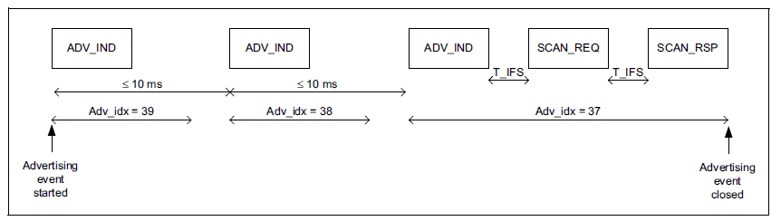
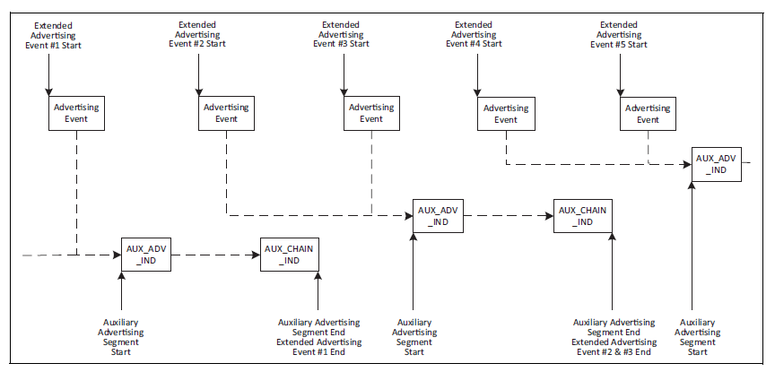

# Use Case #2: I want to broadcast data (such as information about a product/artwork)

As discussed in the previous section, Bluetooth beacons are the perfect solution for signalling the presence of a device or anything the device is attached to. However the 31 B payload length might be too short if you want to tell more about the product (for example, if you want to share descriptive information about a product/artwork to which the Bluetooth tag is attached).

If you need just a bit more payload in your advertisement, there is an option to use active scanning and scan reports to extend your advertisement payload with another 31 B.

If you want to broadcast much more data, Bluetooth 5 offers the possibility to use advertisement extensions with payload size up to 1650 B.

**Bluetooth features to be used**: legacy scannable advertisements, extended advertisements.

The length of **legacy advertisements** is limited to 31 B. However, if the advertisement type is set to *connectable-scannable* or *scannable-non-connectable*, then the device will listen for scan requests after each advertisement. Once a scan request is received (from an *active* scanner), the advertiser sends a scan report, which extends the original advertisement with an additional 31 B. This might be a good solution if you want to advertise just a bit more data than 31 B. A big advantage of this solution (from the perspective of energy consumption) is that the second half of the advertisement is only sent when requested. The disadvantage is obviously the limited payload length. The usage is similar to beacons except that the mode is different and you must also define a scan response packet when you set the data for the advertisement. Data can be set with `sl_bt_legacy_advertiser_set_data()` both for advertising and scan response packets.

**Extended advertisements** (or advertisement extension) is a concept introduced with Bluetooth 5. Bluetooth 5 defines advertisement extension packets that can be sent on the data channels (channel 0 to 36) to offload the advertising channels (channel 37, 38, 39). In this context the data channels are also called secondary advertising channels and the classic advertising channels are called primary advertising channels.

An extended advertisement always starts with a packet sent on the primary advertising channels, but this packet is only used to point to a specific time instance and specific secondary advertising channel where the actual advertising data will be sent. Since the traffic on the secondary advertising channels can be spread well, there is no 31 B limit on the packet length. Instead, a packet with 255 B payload can be sent, which can be further extended with additional packets, chained after the first one. The maximum length of data that can be sent on an extended advertisement chain is 1650 B. This allows you to broadcast a large amount of data. If it is still not enough, you can start multiple advertising sets in parallel, or you can periodically change the data in the advertisement.

**Bluetooth API to be used**:

- `sl_bt_advertiser_create_set()`

- `sl_bt_advertiser_set_timing()`

- `sl_bt_extended_advertiser_set_phy()`

- `sl_bt_advertiser_set_channel_map()`

- `sl_bt_extended_advertiser_set_data()`

- `sl_bt_extended_advertiser_start()`

- `sl_bt_system_set_tx_power()`

- `sl_bt_advertiser_set_report_scan_request()`

- `sl_bt_advertiser_configure()`

- `sl_bt_extended_advertiser_set_long_data()`

**Tips for low power consumption**:

- Consider the recommendations that are described in [Use Case #1: I want to signal the presence of a device](./use-case-1-i-want-to-signal-the-presence-of-a-device).

- Consider enabling scan request reporting with `sl_bt_advertiser_set_report_scan_request()`. In this case all scan requests sent by active scanners will be reported to the application (via the *sl\_bt\_evt\_advertiser\_scan\_request* event), and this can be used to trigger actions. For example a good practice is using a long advertising interval by default and change it to a shorter one once a scan request is detected. This ensures low power consumption while no active scanners are present and a low latency while scanners are present. You may also start an extended advertisement with more data, once a scan request is received.

- On secondary advertising channels you can use different PHYs with different data rates. If your scanner supports 2M PHY, it is recommended to use 2M PHY on the secondary channels. 2M PHY uses a 2x higher data rate than the default 1M PHY. This means almost 2x less power consumption because of 2x shorter packets. Set the PHY with `sl_bt_extended_advertiser_set_phy()`.

>**Note**: You can also use Coded PHY, which will result in higher power consumption but ensures a much longer range.
