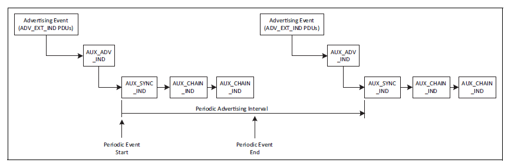

# Use Case #3: I want to broadcast/send data to low power receivers

When you broadcast data with legacy or extended advertisements, as described in [Use Case #2: I want to broadcast data (such as information about a product/artwork)](./use-case-2-i-want-to-broadcast-data-such-as-information-about-a-product-artwork.md), the transmitter might be low power, but the receivers must be scanning all the time to capture those advertisements, which consumes a lot of energy. In some use cases, however, receivers must be low power while receiving updates from a central device. In this use case periodic advertisements provide a solution. Periodic advertisements can broadcast data to many devices while ensuring low power consumptions on both sides.

**Bluetooth feature to be used**: periodic advertisements.

**Periodic advertisements** take extended advertisements to a higher level. With extended advertisement you always have to scan the primary advertising channels to find an advertisement. Periodic advertisements make it possible to sync on the advertisement once, and never go back to the primary channels. This is achieved by predictable timing of the advertisements sent on the secondary channels. While on the primary channels advertisement events are intentionally timed inaccurately (to avoid constant overlapping between two advertisements), secondary channels can use accurate timing. Therefore, once you find a periodic advertisement, and you know the advertising interval as well as the channel hopping sequence, you can follow the advertisement without going back to the primary channels. All the information that you need for syncing on a periodic advertisement (such as the periodic advertising interval) is included in an extended advertisement.

A huge benefit of periodic advertising is that the scanner device can go to sleep between two advertising events, because the time of the next event is known. Of course this is true only after the first periodic advertising event was found. Finding the first event still needs continuous scanning on the primary channels.

The maximum length of data that can be sent in a periodic advertisement is 1650 B, just as for extended advertisements. To broadcast more data, either start more periodic advertisements simultaneously, or change the data periodically.

**Bluetooth API to be used**:

- `sl_bt_system_set_tx_power()`

- `sl_bt_advertiser_create_set()`

- `sl_bt_advertiser_set_timing()`

- `sl_bt_extended_advertiser_set_phy()`

- `sl_bt_periodic_advertiser_set_data()`

- `sl_bt_extended_advertiser_start()`

- `sl_bt_periodic_advertiser_set_long_data()`

- `sl_bt_periodic_advertiser_start()`

- `sl_bt_sync_scanner_set_sync_parameters()`

- `sl_bt_sync_scanner_open()`

**Tips for low power consumption**:

- Consider the recommendations that are described in [Use Case #1: I want to signal the presence of a device](./use-case-1-i-want-to-signal-the-presence-of-a-device) and [Use Case #2: I want to broadcast data (such as information about a product/artwork)](./use-case-2-i-want-to-broadcast-data-such-as-information-about-a-product-artwork).

- It is important to know that the extended advertisements that carry the information about the periodic advertising do not have to have the same advertising interval that the periodic advertising has. In other words, sync info (sent in the extended advertisement) can be broadcasted more frequently than the periodic advertising interval, which makes it possible for the receiver to scan for a shorter time on the primary advertising channels, thereby saving some energy on the receiver side. Also, the sync info can be broadcasted less frequently than the periodic advertising interval, which saves energy on the transmitter side.

- The less accurate your Low Frequency Oscillator, the earlier the receiver device must wake up from sleep mode to ensure it receives the packets. Using a 32 kHz crystal oscillator (instead of the RC oscillator) is strongly suggested to save energy.
