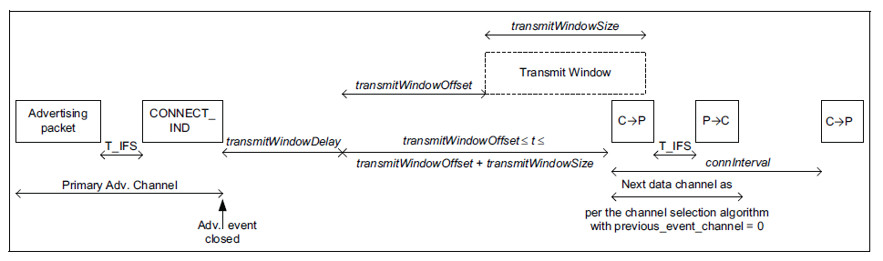

# Use Case #5: I want to connect to a device occasionally to exchange some data

Bluetooth Low Energy is a perfect solution if you want to query some data from a low energy device (such as a sensor), and process/display that data on a more powerful device. Similarly, it can be used to set configurations on low energy devices, or issue simple commands to the low energy devices. This is extremely useful if you want to spare the user interface on the low energy device.

If you want to issue simple commands, consider the approach described in [Use Case #4: I want to broadcast/send data from a low power transmitter](./use-case-4-i-want-to-broadcast-send-data-from-a-low-power-transmitter). In all other cases, you will need to create a Bluetooth connection with your low energy device to exchange data.

**Bluetooth feature to be used**: connections (also needs advertising and scanning).

Bluetooth connections are used to create a reliable two-way data link between two devices. The connection process is simple:

- The peripheral device is advertising and listening for connection requests for a limited time after each advertisement.

- The central device sends a connection request (right after an advertisement was received) and defines the connection interval.

- The central device sends at least one packet in each connection interval and the peripheral device responds with at least one packet in every Nth connection interval (where N-1 is the peripheral latency). If there is no data to send, an empty packet must be sent to keep the connection alive. Both devices can go into sleep mode between two connection events.

Bluetooth connections are reliable (packet loss is detected, and re-transmission is applied) and can also be secured with encryption and authentication. They are also low power because the devices must wake up only for a short time in every connection interval. Nevertheless, there are many settings that should be considered to make your application really low power.

This section focuses on connections that are meant to be kept alive for a short time.

**Bluetooth API to be used**:

- All the advertiser and scanner APIs

- `sl_bt_system_set_tx_power()`

- `sl_bt_system_linklayer_configure()`

- `sl_bt_gatt_set_max_mtu()`

- `sl_bt_gatt_server_set_max_mtu()`

- `sl_bt_connection_set_default_parameters()`

- `sl_bt_connection_set_default_preferred_phy()`

- `sl_bt_connection_open()`

**Tips for low power consumption**:

- Find the best advertising interval for your application. Too short an advertising interval mean high power consumption while too long an advertising interval mean high latency. Set the advertising interval with `sl_bt_advertiser_set_timing()`.

- Scanners usually parse the advertisements first and send the connection request after a subsequent advertisement. Therefore, it may be a good idea to send advertisements in bursts. For example, wait for 3 seconds, then send 10 advertisements with a 20-ms difference. Here you will need a timer (SleepTimer is recommended) to schedule the bursts, while the duration of the bursts can be set with `sl_bt_advertiser_set_timing()`.

- It may be also good to temporarily shorten the advertising interval when a scan request is detected (see [Use Case #2: I want to broadcast data (such as information about a product/artwork)](./use-case-2-i-want-to-broadcast-data-such-as-information-about-a-product-artwork)). Listen for the *sl\_bt\_evt\_advertiser\_scan\_request* event, stop advertising, adjust the timing, and restart advertising.

- The main parameters of a Bluetooth connection are connection interval, peripheral latency, and timeout. These parameters can be set with `sl_bt_connection_set_default_parameters()`.

  - If your connection is short (that is, it does not take more than a few connection events), choose a short connection interval and no peripheral latency to ensure lower latency.

  - If your connection is a bit longer (several seconds, for example because of manual triggers), then probably there will be periods where only empty packets are sent. Consider using a somewhat longer connection interval here, because too many empty packets will result in an unnecessary power consumption increase. Also apply peripheral latency so that the peripheral does not have to respond to all packets from the central device. See details in [Use Case #6: I want to maintain a long-term connection with occasional data exchange](./use-case-5-i-want-to-connect-to-a-device-occasionally-to-exchange-some-data).

- Although the connection process is simple and fast, usually every connection starts with some parameter exchange. The peer devices usually exchange:

  - Supported features

  - Connection parameters

  - MTU size

These parameter exchanges take a while, and increase both latency and energy consumption. To save the most power you can disable these procedures:

- Feature exchange can be disabled with `sl_bt_system_linklayer_configure()`, see the API reference,

- Connection parameter exchange can be disabled by setting the same default connection parameters on both devices,

- MTU size exchange can be disabled by setting the MTU size to the default 23 B on both devices. Use `sl_bt_gatt_set_max_mtu()` and `sl_bt_gatt_server_set_max_mtu()`.

  >**Note**: Disabling these procedures will result in limited functionality, but this is usually not an issue if you want to exchange some data quickly.

- After parameter exchange, the central device usually discovers the services in the GATT database of the peripheral device. Again, This causes higher latency and more energy consumption. To avoid this, either

  - Use hard-coded attribute handles when reading/writing characteristics on the remote device, or

  - Discover the database once, save the discovered attribute handles, and check the database hash on the subsequent connections to see if the attribute handles changed since the last connection. See [GATT Caching](/bluetooth/{build-docspace-version}/bluetooth-gatt/gatt-caching) for more details.

- Bluetooth 5 supports multiple data rates via 1M, 2M and Coded PHY. Consider changing the preferred PHY from the default 1M to 2M PHY with `sl_bt_connection_set_default_preferred_phy()`. The increased datarate will result in shorter packet transmission times, which means lower power consumption.

- Set the TX power according to the expected distance between the devices with `sl_bt_system_set_tx_power()`. If the devices are expected to be close to each other, TX power can be decreased to save energy. You may also set the TX power according to the received RSSI level.

  - On the scanner side (central), check the RSSI level of the advertisements (see events *sl\_bt\_evt\_scanner\_legacy\_advertisement\_report* and *sl\_bt\_evt\_scanner\_extended\_advertisement\_report*).

  - On the advertiser side (peripheral), check the RSSI level of the scan requests (see *sl\_bt\_evt\_advertiser\_scan\_request* event).

- Consider applying application-level security. Although Bluetooth security is able to protect your connections very well against malicious attackers, it needs some data exchange on the Bluetooth connection. In some cases it might be better to send encrypted / signed content over a non-secured connection, and do the decryption / signature check in the application, just to save some energy by not sending encryption requests and responses.

- The GATT layer supports both acknowledged (read, write) and un-acknowledged (notify, write_without_response) data transfer. The latter one needs less data transmission and hence less energy.

   >**Note**: Although un-acknowledged data transfer means there is no acknowledgement from the other side, the link layer still ensures reliable data transfer by detecting packet loss and re-transmitting lost packets.
