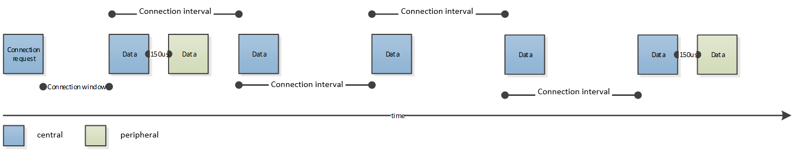

# Use Case #6: I want to maintain a long-term connection with occasional data exchange

Whether it is better to open a short-term connection every time you want to read data from your peripheral device or to keep a long-term connection alive with occasional data exchange depends on the use case. Here are some aspects to be considered:

- Short-term connections allow you to move away from the peripheral device between two data exchanges. Long-term connections suppose that the peer devices stay close to each other.

- Short-term connections use more energy on the peripheral side because peripheral devices must advertise all the time to be connectable. Long-term connections use more energy on the central side because the central device must send a packet in every connection interval, while the peripheral latency allows the peripheral device to respond only every Nth packet from the central.

- Short-term connections have higher latency introduced by the connection process. Long-term connections have higher sum energy consumption.

In addition to these, if you connect to your peripheral device with a mobile phone, and trigger actions (read/write) manually, it also counts as a long-term connection because manual triggers are usually slow.

This page focuses on how to save energy while keeping alive a long-term connection. If you decide on using short-term connections, refer to [Use Case #5: I want to connect to a device occasionally to exchange some data](./use-case-5-i-want-to-connect-to-a-device-occasionally-to-exchange-some-data).

**Bluetooth feature to be used**: connections (also needs advertising and scanning).

While in the case of short-term connections the focus is on the connection creation process, long-term connections need optimized power consumption while keeping the connection alive. A huge benefit of Bluetooth Low Energy is that the devices do not have to listen on a channel all the time to receive packets, which would result in high energy consumption. Instead packets are always sent and received at the beginning of connection intervals. The longer the connection interval, the lower the consumption, but it also results in a higher latency. The connection interval, therefore, must be set as a trade-off between power consumption and latency.

One way to further decrease power consumption is using peripheral latency. Setting peripheral latency to N means that the peripheral device can skip N connection intervals and send a response packet to the central device in every (N+1)th connection interval. Note that this is just an option. The peripheral can always decide to respond a packet from the central earlier. This ensures both low latency and low energy consumption on the peripheral side.

**Bluetooth API to be used:**

- All the advertiser and scanner APIs

- `sl_bt_system_set_tx_power()`

- `sl_bt_connection_set_default_parameters()`

- `sl_bt_connection_set_default_preferred_phy()`

- `sl_bt_connection_open()`

- `sl_bt_connection_set_parameters()`

- `sl_bt_connection_set_preferred_phy()`

- `sl_bt_connection_disable_slave_latency()`

- `sl_bt_connection_set_power_reporting()`

- `sl_bt_connection_set_remote_power_reporting()`

**Tips for low power consumption**:

- Too short an advertising interval mean high power consumption while too long an advertising interval mean high latency. Set the advertising interval with `sl_bt_advertiser_set_timing()`.

- Use peripheral latency. If the data exchanged is triggered by the peripheral, then the peripheral latency can be set to a high number, because it saves energy and the peripheral is still able to send data in any connection interval. If the data exchange is triggered by the central, then you should be more careful, because the central cannot reach the peripheral in any connection interval. Set the peripheral latency with `sl_bt_connection_set_default_parameters()`.

- Decrease the connection interval during data exchange and increase it while no data exchange is expected. There are two methods to achieve this:

  - If you know in advance (6 connection intervals earlier) when the data exchange is due, you can update the connection parameters (and hence the connection interval). As an example, the connection interval can be set to one second in 'stand-by' state, while it can be temporarily decreased to 20 ms during data exchange. Note that the parameter update process takes 6 connection intervals, therefore an instant switch cannot be achieved. Connection parameters can be updated with `sl_bt_connection_set_parameters()`. Note that the peer devices must agree on the parameters. If there is no common range for the parameters, the central device decides.

  - Another solution is to set the connection interval to be short, and the peripheral latency to be high. For example, a 20 ms connection interval and a peripheral latency of 49 connection events means that the peripheral needs to wake up once a second. In this case the peripheral can apply the peripheral latency in the ’stand-by’ state, while it can temporarily disable peripheral latency during data exchange with `sl_bt_connection_disable_slave_latency()`. This method means a high power consumption on the central side, but also ensures an instant switch in the transmission rate when needed.

- Bluetooth 5 supports multiple data rates via 1M, 2M and Coded PHY. Consider changing the preferred PHY from the default 1M to 2M PHY with `sl_bt_connection_set_default_preferred_phy()`. The increased data rate will result in shorter packet transmission time, which means lower power consumption.

- Set the TX power according to the expected distance between the devices with `sl_bt_system_set_tx_power()`. If the devices are expected to be close to each other, TX power can be decreased to save energy.

- The Silicon Labs Bluetooth stack also supports LE Power control which means that the TX power is adjusted automatically (by the stack) so that the received signal strength falls into a given range. If the positions of your devices are not fixed, it is worth enabling this feature by installing the *PowerControl* software component. Note: This feature must be supported by both devices. You should also set the minimum and maximum enabled TX power with `sl_bt_system_set_tx_power()` and configure the so-called Golden Range for the RSSI in the configuration of the *PowerControl* software component. The Golden Range is the range to keep the RSSI in in on the receiver side. If the RSSI goes below this range, the receiver instructs the transmitter to increase its TX power (if possible). If the RSSI goes above this range, the receiver instructs the transmitter to decrease its TX power (if possible).

- The GATT layer supports both acknowledged (read, write) and un-acknowledged (notify, write_without_response) data transfer. The latter needs less data transmission and hence uses less energy. Note: Although un-acknowledged data transfer means there is no acknowledgement from the other side, the link layer still ensures reliable data transfer by detecting packet loss and re-transmitting lost packets.
