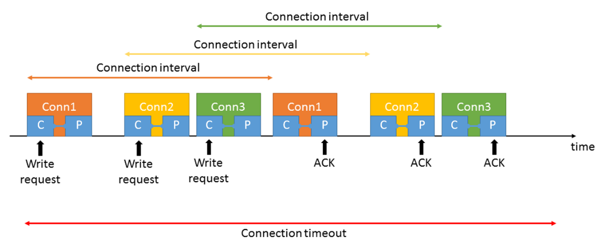

# Use Case #8: I want to exchange data with many peripheral devices

Bluetooth Low Energy allows a device to connect to many other devices at the same time. One central device can connect to multiple peripheral devices, and one peripheral device can also connect to many central devices. Some devices may even work as a central and a peripheral at the same time. Therefore exchanging data with multiple devices is not an issue, at least not up to a certain number of devices. Keeping many parallel connections alive will suffer from many collisions and requires heavy scheduling tasks from the stack. Silicon Labs’ Bluetooth stack supports up to 32 simultaneous connections. If more devices are to be served, the active connections can be rotated among the devices or other solutions should be found like communicating using advertisements. This section gives recommendations for such use cases.

**Bluetooth feature to be used**: connections, legacy advertising, extended advertising, periodic advertising.

Parallel Bluetooth connections are achieved by interleaving connection events. Since the devices are passive between two connection events, it is easy to schedule them without overlapping. To make this possible, however, you should set the connection parameters (connection interval, supervision timeout) accordingly. For example, a 7.5 ms connection interval should not be used if there are 32 active connections. Also, the connections should preferably use the same interval, or the intervals should be the multiples of a common base value.

Since the central device decides when to start the first connection event, centrals can manage parallel connections better than peripherals.

If you need to communicate with more than 32 devices or you just want to save power, consider using periodic advertising. Any number of devices can sync on a periodic advertisement, and it also means low power consumption (see [Use Case #3: I want to broadcast / send data to low power receivers](./use-case-3-i-want-to-broadcast-send-data-to-low-power-receivers)). Periodic advertising, however, also means a one-way communication, so if you want to report back data, you can either send it in an advertisement, or you can create a temporary connection.

Remember that, although periodic advertising is broadcasting data, you can still add Bluetooth addresses to the data to mark the intended recipients. While it is not a secure way of communication, it can be very efficient – and it is still possible to encrypt the data with a shared secret that only the recipient knows.

**Bluetooth API to be used**:

- Check previous sections based on the chosen solution.

**Tips for low power consumption**:

- When using multiple parallel connections, make sure there are no overlapping connection events. Overlapping results in retransmission and therefore higher consumption.

  - Choose the connection parameters wisely as described above, and

  - install the *Even Connection Scheduling Algorithm* software component in your projects.

- Sending data on a periodic advertisement might be a good solution, but remember that when you send data to one (or some) recipients, all the synced devices must be receiving and hence consume energy. To solve this issue, either:

  - Send only a short command in the advertisement, for example a command that instructs one recipient to start connectable advertising, and then create a connection to send more data.

  - Create multiple periodic advertisements, for example one for devices with odd Bluetooth addresses and one for devices with even Bluetooth addresses. This will halve the devices that must receive data sent to a given recipient.

  - Create one periodic advertisement for commands and one for data. In this case all devices can listen for commands and only active recipients can sync on the data-carrier advertisement.
