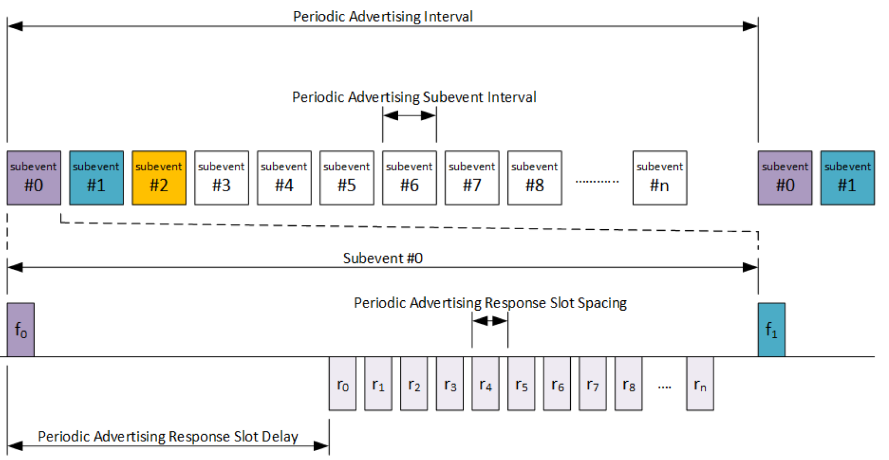

# Use Case #9: I want to exchange data with many low-power peripheral devices

Using multiple simultaneous connections is a valid option for data transfer for many use cases, as shown in [Use Case #8: I want to exchange data with many peripheral devices](./use-case-8-i-want-to-exchange-data-with-many-peripheral-devices). This, however, might not be the most optimal method to communicate with large number of devices, or with devices which has extremely restricted energy budget.

Bluetooth 5.4 introduced a feature called Periodic Advertising with Responses (PAwR). Just as with Periodic Advertisements ([Use Case #3: I want to broadcast / send data to low power receivers](./use-case-2-i-want-to-broadcast-data-such-as-information-about-a-product-artwork)), in PAwR the Broadcaster will send data to multiple receiving devices, or Observers, synchronized to the advertising train. And since the Observers are also able to respond back to the Broadcaster, this makes the PAwR networks suitable for use cases in which a central device needs to have low-bandwidth bidirectional communication with multiple low power devices on the network. The most known application is the Bluetooth Electronic Shelf Label (ESL) profile, which utilizes PAwR for communication between the low-power ESLs and access points.

**Bluetooth feature to be used**: Periodic Advertising with Responses (PAwR)

Sending the advertising data happens during *Periodic Advertising with Response events* (PAwR events), which occurs every *Periodic Advertising Interval*.  Each of the PAwR events consists of one or more (up to 128) subevents, during which the Broadcaster will send a packet to the Observers which are synchronized to the specific subevent. Since it is up to the application layer how many devices (and what kind of devices) are synchronized to any of the subevents, forming different kinds of PAwR networks is extremely flexible.

Each subevent has then one or more (up to 255) response slots, during which the Observer can send back the response. With 128 subevents and 255 response slots per subevent, the PAwR network can have a bidirectional communication with up to 32,640 devices per PAwR train, which will exceed any connection based one-to-many Bluetooth network.

Bluetooth 5.4 specification also introduced another important feature, Encrypted Advertising Data (EAD). Until now, encrypting the advertising data has been handled on application level at best, but now there is a standardized mechanism to have encrypted advertisements. The EAD can be used with any type of advertisements, including scan responses, but it can be extremely useful with PAwR and the response data.

**Bluetooth API to be used**:

- `sl_bt_advertiser_create_set()`

- `sl_bt_pawr_advertiser_start()`

- `sl_bt_pawr_advertiser_set_subevent_data()`

- `sl_bt_pawr_sync_set_response_data()`

- `sl_bt_past_receiver_set_default_sync_receive_parameters()`

**Tips for low power consumption**:

- Consider the recommendations that are described in [Use Case #3: I want to broadcast/send data to low power receivers](./use-case-3-i-want-to-broadcast-send-data-to-low-power-receivers).

- The way how Observers are mapped to different subevents can have significant impact on the PAwR network timing parameters used, and this way to how often the Observers are required to wake up for PAwR events. This is use case or application specific, but document [Bluetooth LE Electronic Shelf Label](/bluetooth/{build-docspace-version}/bluetooth-electronic-shelf-label) will have couple of examples how to start optimizing the PAwR network.
