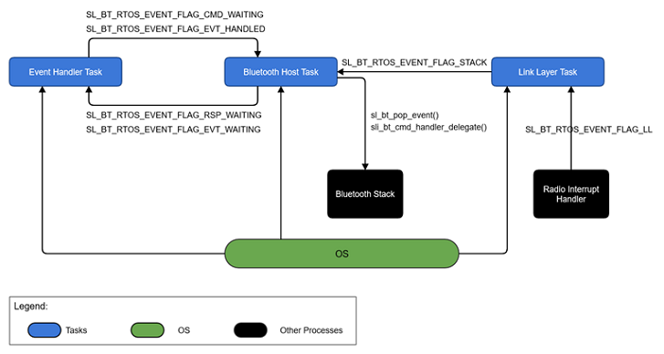
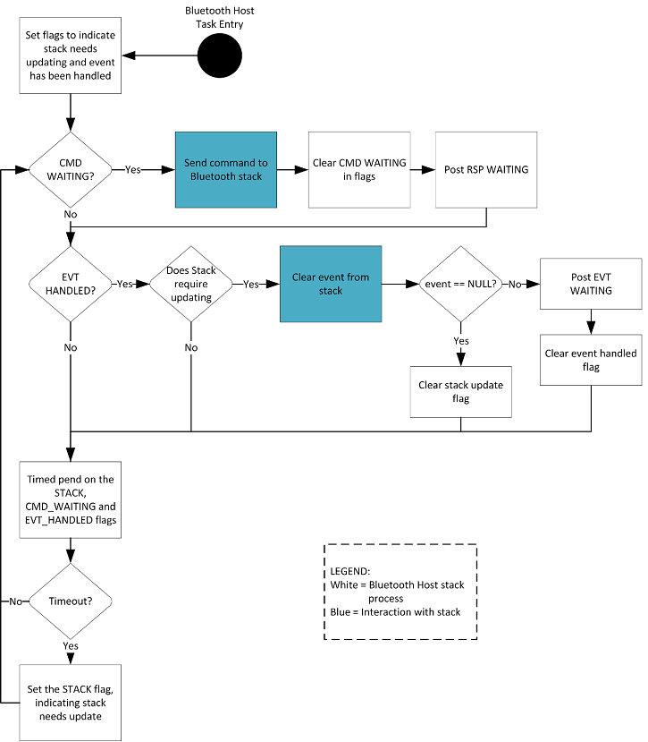

# System Architecture

The **SOC-Empty** example application with Micrium RTOS or FreeRTOS support requires several tasks in order to operate

- Link Layer Task
- Bluetooth Host Task
- Event Handler Task
- Idle Task

Silicon Labs has implemented these tasks for the Micrium RTOS and FreeRTOS.

Note that there are ready-made examples for the following:

- Bluetooth – SoC Empty (*bare metal*)
- Bluetooth – SoC Empty FreeRTOS
- Bluetooth – SoC Empty Micrium OS

Since Simplicity SDK 2024.12, these are also available for Bluetooth mesh:

- Bluetooth Mesh – SoC Empty (*bare metal*)
- Bluetooth Mesh – Soc Empty FreeRTOS
- Bluetooth Mesh – Soc Empty Micrium OS

## Inter-Task Communication

Before describing the tasks, it is important to understand how the tasks communicate with each other. The tasks in this application synchronize with each other through the use of a number of flags. The flags are internal of the `sl_bt_rtos_adaptation` layer. These flags are summarized in the following table:

| FLAG |Sender |Receiver |Purpose |
|-|-|-|-|
| SL_BT_RTOS_EVENT_FLAG_STACK |Link Layer Task |Bluetooth Host Task |Bluetooth stack needs an update, call sl_bt_pop_event() |
| SL_BT_RTOS_EVENT_FLAG_LL |Radio Interrupt |Link Layer Task |Link Layer needs an update, call sl_bt_priority_handle() |
| SL_BT_RTOS_EVENT_FLAG_CMD_WAITING |Event Handler and Application Tasks |Bluetooth Host Task |Command is ready in shared memory, call sli_bt_cmd_handler_delegate() |
| SL_BT_RTOS_EVENT_FLAG_RSP_WAITING |Bluetooth Host Task |Event Handler and Application Tasks |Response is ready in shared memory. |
| SL_BT_RTOS_EVENT_FLAG_EVT_WAITING |Bluetooth Host Task |Event Handler Task |Event is ready in shared memory. |
| SL_BT_RTOS_EVENT_FLAG_EVT_HANDLED |Event Handler Task |Bluetooth Host Task |Event is handled and shared memory is free to use for next event. |

The following diagram illustrates how these flags are used in synchronizing the tasks.

In addition to these flags, a mutex is used by the gecko command handler to make it thread-safe. This makes it possible to call BGAPI commands from multiple tasks.

## Link Layer Task

The purpose of this task is to update the upper link layer. The link layer task waits for the `SL_BT_RTOS_EVENT_FLAG_LL` flag to be set before running. The upper link layer is updated by calling `sl_bt_priority_handle()`. The `SL_BT_RTOS_EVENT_FLAG_LL` flag is set by `sli_bt_rtos_ll_callback()`, which is a callback function specified to `scheduler_callback` in the stack configuration. The callback is called from a kernel-aware interrupt handler (lower link layer). This task is given the highest priority.

## Bluetooth Host Task

The purpose of this task is to update the Bluetooth stack, issue events, and handle commands. This task waits for any of the `SL_BT_RTOS_EVENT_FLAG_STACK`, `SL_BT_RTOS_EVENT_FLAG_CMD_WAITING` and `SL_BT_RTOS_EVENT_FLAG_EVT_HANDLED` flags to be set before running. The `SL_BT_RTOS_EVENT_FLAG_STACK` flag is set by `sli_bt_rtos_stack_callback()`, which is a callback function specified to `stack_schedule_callback` in the stack configuration. This task has higher priority than the Event Handler Task and any of the Application Tasks, but lower than the Link Layer Task.

Before this task starts running, it prepares the application to run the Bluetooth stack. This task calls `sl_bt_init()` to initialize and configure the Bluetooth stack, and then calls `sl_bt_rtos_create_tasks()` to create the Link Layer Task and Event Handler Task.

### Updating the Stack

The Bluetooth stack must be updated periodically. The Bluetooth Host Task updates the stack by calling `sl_bt_event_pending()` and reads the next stack event from the stack by calling `sl_bt_pop_event()`. This allows the stack to process messages from the link layer as well as its own internal messages for timed actions that it needs to perform.

### Issuing Events

The Bluetooth Host Task sets the `SL_BT_RTOS_EVENT_FLAG_EVT_WAITING` flag to indicate to the event handler task that an event is ready to be retrieved. Only one event can be retrieved at a time. The `SL_BT_RTOS_EVENT_FLAG_EVT_WAITING` flag is cleared by the Event Handler Task when it has retrieved the event. The `SL_BT_RTOS_EVENT_FLAG_EVT_HANDLED` flag is set by the Event Handler Task to indicate that event handling is complete.

### Command Handling

Commands can be sent to the stack from multiple tasks. Responses to these commands are forwarded to the calling task. Commands and responses are synchronized with the `SL_BT_RTOS_EVENT_FLAG_CMD_WAITING` and `SL_BT_RTOS_EVENT_FLAG_RSP_WAITING` flags and the BluetoothMutex mutex.

Commands are prepared and sent to the stack by a helper function called `sli_bt_cmd_handler_rtos_delegate()`. This function is called by any of the BGAPI functions and is made re-entrant through the use of a mutex. The function starts by pending on the mutex. When it gains control of the mutex the command is prepared and placed into shared memory, then the `SL_BT_RTOS_EVENT_FLAG_CMD_WAITING` flag is set to indicate to the stack that a command is waiting to be handled. This flag is cleared by the Bluetooth Host Task to indicate that the command has been sent to the stack and that it is now safe to send another command.

Then execution pends on the `SL_BT_RTOS_EVENT_FLAG_RSP_WAITING` flag, which is set by the Bluetooth Host Task when the command has been executed. This indicates that a response to the command is waiting. Finally, the mutex is released.

The following diagram illustrates how the Bluetooth Host Task operates.

1. On task startup, the `SL_BT_RTOS_EVENT_FLAG_STACK` is set to indicate that the stack needs updating and the `SL_BT_RTOS_EVENT_FLAG_EVT_HANDLED` flag is set to indicate that no event is currently being handled.

2. If the `SL_BT_RTOS_EVENT_FLAG_CMD_WAITING` flag is set, `sli_bt_cmd_handler_rtos_delegate()` is called to handle the command.

3. If the `SL_BT_RTOS_EVENT_FLAG_STACK` and the `SL_BT_RTOS_EVENT_FLAG_EVT_HANDLED` flags are set, `sl_bt_pop_event()` is called to get an event from the stack. If an event is found waiting, the `SL_BT_RTOS_EVENT_FLAG_EVT_WAITING` flag is set and the `SL_BT_RTOS_EVENT_FLAG_EVT_HANDLED` flag is cleared to indicate to the Event Handler Task that an event is ready to be handled and to the Bluetooth Host Task that an event is currently in the process of being handled. Otherwise, the `SL_BT_RTOS_EVENT_FLAG_STACK` flag is cleared to indicate that the stack does not require updating.

4. At this point, the task checks to see if the stack requires updating and whether any events are waiting to be handled. If no events are waiting to be handled and the stack does not need updating then it is safe to sleep and the Bluetooth Host Task does a pend on the `SL_BT_RTOS_EVENT_FLAG_STACK`, `SL_BT_RTOS_EVENT_FLAG_EVT_HANDLED` and `SL_BT_RTOS_EVENT_FLAG_CMD_WAITING` flags.

5. Steps 2 – 4 are repeated indefinitely.

## Event Handler Task

The purpose of this task is to handle events sent by the Bluetooth stack. This task waits for the `SL_BT_RTOS_EVENT_FLAG_EVT_WAITING` flag to be set. This flag is set by the Bluetooth Host Task to indicate that there is an event waiting to be handled. Once this flag has been set, sl_bt_process_event() is called to handle the event. Finally, the `SL_BT_RTOS_EVENT_FLAG_EVT_HANDLED` flag is set to indicate to the Bluetooth Host Task that the event has been handled and the Event Handler Task is ready to handle another event. This task has a lower priority than the Bluetooth Host Task and Link Layer Task.

This task handles the `gatt_server_user_write_request` event for the user-type OTA control characteristic and boot the device to OTA DFU mode. This task then dispatches events to `sl_bt_on_event()`, which needs to be integrated in the application.

## Idle Task

When no tasks are ready to run, the OS calls the Idle Task. The Idle Task puts the MCU into lowest available sleep mode, EM2, by default.
