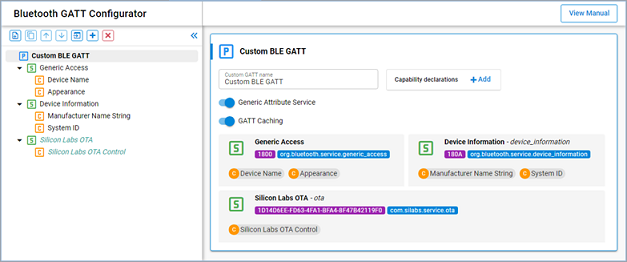
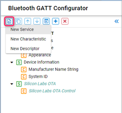
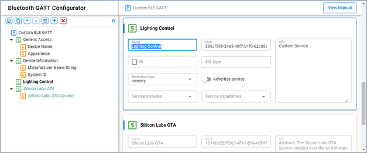
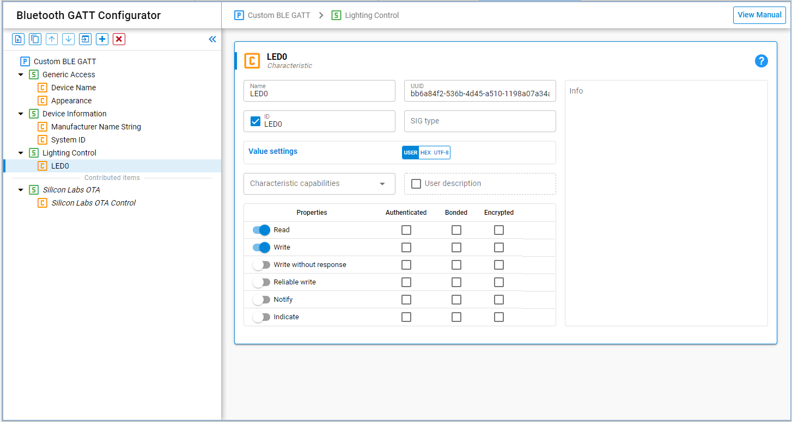
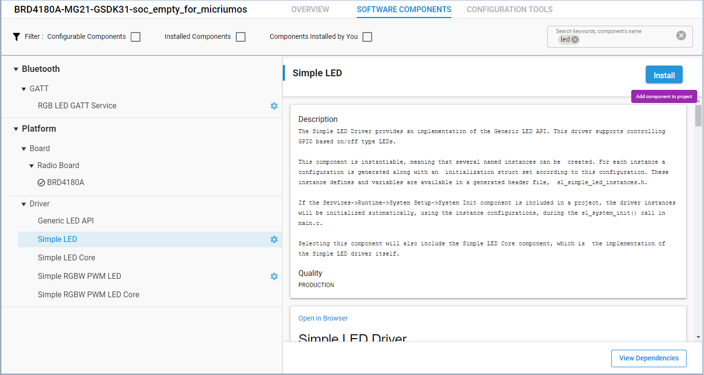
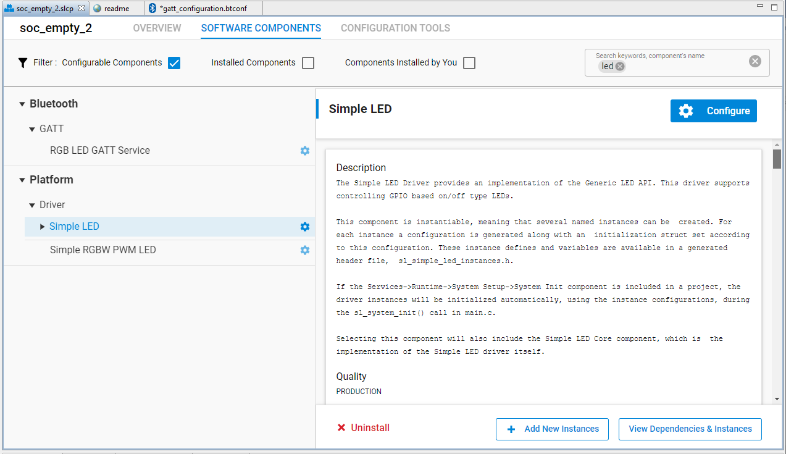
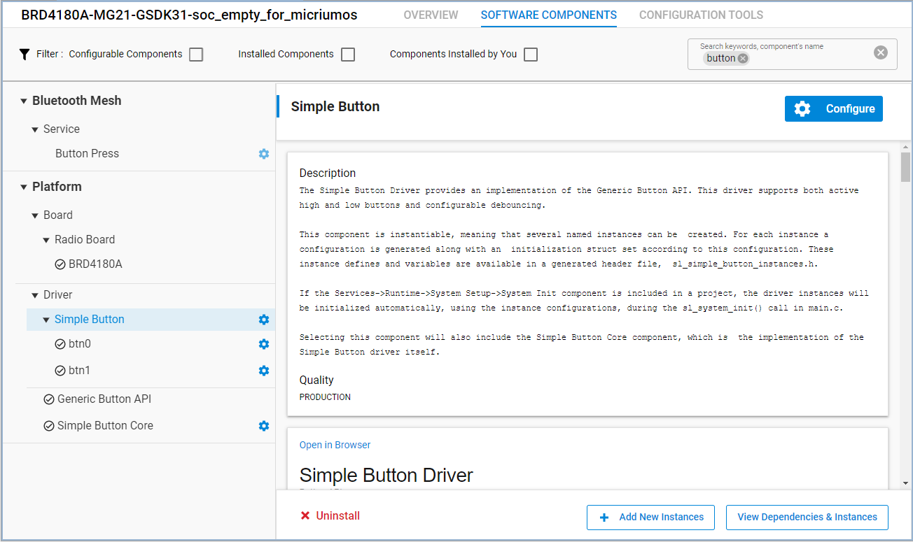
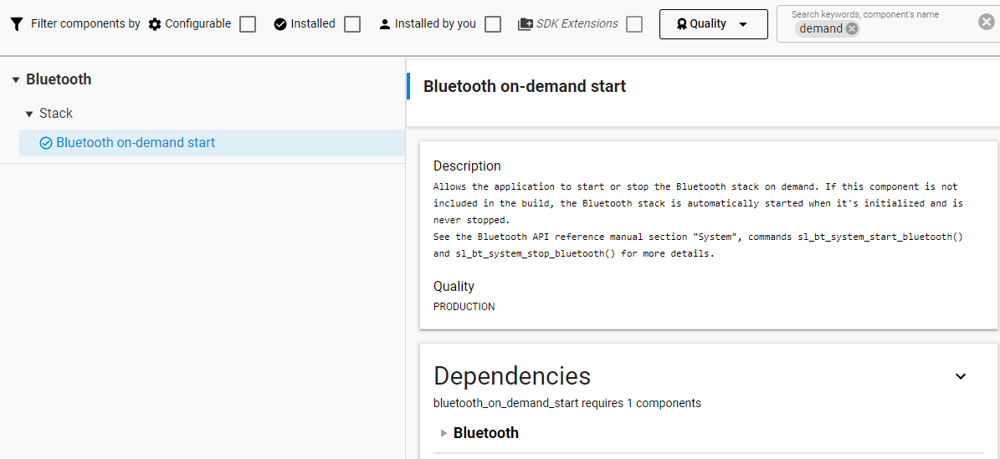

# Application Integration

This section describes the Bluetooth event handler and application tasks, and how they are used to implement a sample Bluetooth device.

## Bluetooth Event Handler

The Bluetooth Event Handler implemented in `sl_bt_on_event()`, part of the event handler task, takes a pointer to an event and handles it accordingly. A full list of events can be found in the Silicon Labs Bluetooth API Documentation (see [Additional Resources](04-additional-resources)). Some events triggered by the stack are mainly informative and do not require the application to do anything. Because this is a simple application, it handles only a small set of events as follows:

- system_boot: This event indicates that the Bluetooth stack is initialized and ready to receive commands. This is where you set the discoverability and connectability modes.

- connection_closed: This event is triggered when a connection is closed. Advertising is restarted in this event to allow future connections.

## Customizing the Application

This section describes some common tasks such as customizing GATT attributes, adding event handlers, and adding support for other peripherals.

### GATT Services and Characteristics

This section describes how to add a service and characteristic to control an LED on the Wireless Starter Kit. One of the tools provided with Simplicity Studio is the Bluetooth GATT Configurator. This tool provides a graphical interface for creating and editing the GATT database.

1. Open the Bluetooth GATT Configurator on the **CONFIGURATION TOOLS** tab in an open project or by double-clicking the file `config/btconf/gatt_configuration.btconf` in the Simplicity Studio Project Explorer.

   

2. Create a new service. Select **Custom BLE GATT** in the left pane. Click the **Add New Item** icon in the top left corner and select **New Service**.

   

3. Select the created Custom Service and name the service **Lighting Control**, as shown in the following figure.

   

4. Add a characteristic.

   - Select the **Lighting Control** service. Click the **Add New Item** icon in the top left corner and select **New Characteristic**.

   - Select the created Custom Characteristic and name the characteristic **LED0** at the right.

   - Check the **id** checkbox and enter **LED0** for the ID.

   - Set **Value Settings** to **User**.

   - Set the Properties **Read** and **Write** toggle switches.

   The characteristic should now look like the following figure.

   

5. Click **Save** and Simplicity Studio will automatically update the generated source code.

### Event Handlers

This section discusses how to add event handlers for reading from and writing to the GATT characteristic added in [GATT Services and Characteristics](#gatt-services-and-characteristics). The characteristic has write and read permissions. It is a user type so the application needs to handle the following events:

- gatt_server_user_write_request
- gatt_server_user_read_request

The Simple LED Driver component is required to access the LEDs on the Wireless Starter Kit. Simplicity Studio provides the Software Components Configuration tool to manage driver and API components.

1. Open the Project Configurator by double-clicking the `soc_empty.slcp` file in the Simplicity Studio Project Explorer. Click the **SOFTWARE COMPONENTS** tab on the top.

2. Enter **led** in the search field in the top right corner. Select **Simple LED** in the left pane and click **Install**, as shown in the following figure.

   

3. A **Create A Component Instance** window appears. Leave the default instance name **led0** and click **Done**.

4. Click **Add New Instances**. A **Create A Component Instance** window appears.

5. Leave the default instance name as **led1** and click **Done**. It should now look like the following figure.

   

After you have created the **led0** and **led1** instances of the Simple LED Driver component, the LED driver is automatically installed and turned on. The application can access directly the LED0 and LED1 by calling LED APIs.

Add the following code in `app.c` to include the header file that has declarations of functions to set and clear the LEDs.

```C
#include "sl_simple_led_instances.h"
```

As described in [Bluetooth Event Handler](#bluetooth-event-handler), Bluetooth events for the application should be handled in `sl_bt_on_event()`. Add the following code to implement the user write request handler.

```C
case sl_bt_evt_gatt_server_user_write_request_id:
  if (evt->data.evt_gatt_server_user_write_request.characteristic == gattdb_LED0) {
    if (evt->data.evt_gatt_server_user_write_request.value.data[0]) {
      sl_led_turn_on(&sl_led_led0);
    }
    else {
      sl_led_turn_off(&sl_led_led0);
    }
    sl_bt_gatt_server_send_user_write_response(
      evt->data.evt_gatt_server_user_write_request.connection,
      evt->data.evt_gatt_server_user_write_request.characteristic,
      0);
  }
break;
```

This event handler verifies that the characteristic to be written is the LED0 characteristic, and then turns the LED0 either on or off depending on the data written. Finally, it sends a response to the remote GATT client to indicate that the write has been performed.

Add the following code to implement the user read request handler.

```C
case sl_bt_evt_gatt_server_user_read_request_id:
  if(evt->data.evt_gatt_server_user_read_request.characteristic == gattdb_LED0) {
    led0_state = sl_led_get_state(&sl_led_led0);
    sl_bt_gatt_server_send_user_read_response(
      evt->data.evt_gatt_server_user_read_request.connection,
      evt->data.evt_gatt_server_user_read_request.characteristic,
      0,
      1, &led0_state, &sent_len);
  }
break;
```

This event handler sends the state of the LED0 to the client. The event handling requires the two variables `led0_state` and `sent_len` declared in `sl_bt_on_event()` as in the following code.

```C
uint8_t led0_state = 0;
uint16_t sent_len = 0;
```

As your application requires, you can add similar handlers for other events in this way, as your application requires them. The event handlers implemented in `sl_bt_on_event()` should complete their work quickly. If your application needs to perform heavy or asynchronous work, you may need to creating create additional application tasks may be needed. This is discussed in [Adding Application Tasks](#adding-application-tasks).

### Adding Support for Other Peripherals

The easiest way to add support for other peripherals is through the use of Silicon Labs’ emlib/emdrv peripheral libraries. These libraries contain APIs for initializing and controlling the EFR32 family’s peripherals. A link to the documentation for these libraries is found in [Additional Resources](./04-additional-resources).

These libraries are packaged as software components and are included in the Silicon Labs Gecko Platform SDK. By using the Software Components Configuration tool, you can easily add the peripheral drivers and libraries to your projects. The tool also resolves dependencies and automatically installs the components that the peripheral component requires.

## Adding Application Tasks

You may need to add application tasks in your Bluetooth application to simplify the application implementation. It is especially useful when your application needs to execute a procedure that requires significant computation, is not promptly responsive, or is independent of Bluetooth events. This section demonstrates LED blinking on the Wireless Starter Kit where you will learn how to create an Application Task in your application.

To create application tasks, Micrium RTOS or FreeRTOS support needs to be added to the **SOC-Empty** example project. Follow the steps in [Micrium OS Configuration](./index.md#micrium-os-configuration) to install the **Micrium OS Kernel** component or in [FreeRTOS Configuration](./index.md#free-rtos-configuration) to install the **FreeRTOS Heap 3** component.

>**Note**: Even though the Bluetooth RTOS application example uses the CMSIS-RTOS2 API functions for the Bluetooth features, it is highly recommended that the user application code should not use CMSIS-RTOS2 API but instead use the native Micrium OS RTOS or FreeRTOS API to get the most out of the system. The CMSIS-RTOS2 API implementation does not support all the RTOS features, and is more suited to support easier Bluetooth stack porting to different RTOSes.

### Adding an Application Task with the Micrium OS RTOS

Include the header file in `app.c`.

```C
#include "os.h"
```

To create a Micrium RTOS task, you need to declare a Task Control Block (TCB), allocate a memory space as the stack of the task, write the task's code, and set the task name, priority, and other parameters required by the `OSTaskCreate()` API. The task's priority must be unique in the application and needs to be lower than the priorities of the Link Layer, Bluetooth Host Task, and Event Handler Task. The lower the number, the higher the priority. Therefore, Silicon Labs recommends that you specify priority numbers greater than or equal to **10** to your application tasks. Bluetooth stack task priorities can be found in the `sl_bt_rtos_config.h` and can be configured in the **Bluetooth Core** component under **Bluetooth – RTOS**.

Add the following code at the global level in `app.c`.

```C
//Application task
#define SL_BT_RTOS_APPLICATION_PRIORITY         10u
#ifndef APPLICATION_STACK_SIZE
#define APPLICATION_STACK_SIZE (1000 / sizeof(CPU_STK))
#endif
static  void  ApplicationTask (void  *p_arg);
static  OS_TCB   ApplicationTaskTCB;
static  CPU_STK  ApplicationTaskStk[APPLICATION_STACK_SIZE];
```

Add the following code in `app_init()` to create the task.

```C
RTOS_ERR os_err;
//Application task
OSTaskCreate(&ApplicationTaskTCB,
             "Application Task",
             ApplicationTask,
             0u,
             SL_BT_RTOS_APPLICATION_PRIORITY,
             &ApplicationTaskStk[0u],
             APPLICATION_STACK_SIZE / 10u,
             APPLICATION_STACK_SIZE,
             0u,
             0u,
             0u,
             (OS_OPT_TASK_STK_CHK | OS_OPT_TASK_STK_CLR),
             &os_err);
```

Then, write the task's code in `ApplicationTask()`. A task usually runs infinitely and needs to yield execution to other tasks when it has completed. An execution yield means freeing up CPU time for other tasks. This is usually achieved by calling a time or event API. The following code is the task implementation that turns the LED1 on or off every 1 second.

```C
//Application task
static  void  ApplicationTask (void  *p_arg)
{
  RTOS_ERR  os_err;
  (void)p_arg;
  while (DEF_TRUE) {
    // Put your application code here!
    OSTimeDlyHMSM(0, 0, 1, 0,
                  OS_OPT_TIME_DLY | OS_OPT_TIME_HMSM_NON_STRICT,
                  &os_err);
    sl_led_toggle(&sl_led_led1);
  }
}
```

### Implementing a Time- and Event-Driven Task with the Micrium OS RTOS

A task can be time-driven, event-driven, or both time- and event-driven. The model determines when the procedure is executed:

1. A timer expires.
2. An event occurs.
3. Either 1 or 2.

The Link Layer Task, Bluetooth Host Task, and Event Handler Task are event-driven and the LED toggling task demonstrated in [Adding Application Tasks](#adding-application-tasks) is time-driven.

The LED toggling task demonstrated in [Adding Application Tasks](#adding-application-tasks) is a good example to be changed to a time- and event-driven task. This task calls a time API to suspend itself for a period of specific time. A time- and event-driven task requires an event API that supports timeout so the task suspends its execution until either an event occurs or a timeout expires. This section demonstrates how an LED blinks at different frequencies based on whether or not a button on the Wireless Starter Kit is pushed.

The Simple Button component is required to access the buttons on the Wireless Starter Kit. Follow the steps in [Event Handlers](#event-handlers) to install the component and create the **btn0** and **btn1** instances in the Software Components Configuration tool as shown in the following figure.



Add the following code in `app.c` to include the header file that has the declaration of the button state changed callback function.

```C
#include "sl_simple_button_instances.h"
```

The demonstration uses Micrium Event Flag Management APIs for inter-task communication. The principle of the Event Flag Management is that a task waits for a flag or some flags in an event flag group to be set and another task sets a flag in the same event flag group when a corresponding event occurs. A flag is a bit of a 32-bit variable. Therefore, flags are a bit pattern, which is a combination of bits of a 32-bit variable.

The easiest way for tasks using an event flag group is to declare it as a global variable. Add the following code at the global level in `app.c`.

```C
OS_FLAG_GRP application_event_flags;
#define APPLICATION_EVENT_FLAG_BTN_ON    ((OS_FLAGS)1)
#define APPLICATION_EVENT_FLAG_BTN_OFF   ((OS_FLAGS)2)
```

Add the following code in `app_init()` to create the event flag group before creating the Application Task.

```C
OSFlagCreate(&application_event_flags,
             "Application Flags",
             (OS_FLAGS)0,
             &os_err);
```

Next, modify the task's code in `ApplicationTask()` as follows. The task calls `OSFlagPend()` to suspend its execution and waits for any of the `APPLICATION_EVENT_FLAG_BTN_ON` and `APPLICATION_EVENT_FLAG_BTN_OFF` flags to be set. The task resumes to execute if any of the flags is set or when the timeout interval_ms expires. Therefore, the task toggles the LED1 at periodic intervals when no flag is set and changes the interval when a flag is set.

If you want to implement an event-driven task in this example, call `OSFlagPend()` with 0 as the third parameter and the task will wait forever until any of the flags is set.

```C
//Application task
static  void  ApplicationTask (void  *p_arg)
{
  RTOS_ERR  os_err;
  (void)p_arg;
  uint32_t  interval_ms;
  OS_RATE_HZ  tick_rate;
  OS_FLAGS  flags;
  tick_rate = OSTimeTickRateHzGet(&os_err);
  interval_ms = 1 * tick_rate;
  while (DEF_TRUE) {
    // Put your application code here!
    flags = OSFlagPend(&application_event_flags,
                       (OS_FLAGS)APPLICATION_EVENT_FLAG_BTN_ON + APPLICATION_EVENT_FLAG_BTN_OFF,
                       interval_ms,
                       OS_OPT_PEND_BLOCKING + OS_OPT_PEND_FLAG_SET_ANY + OS_OPT_PEND_FLAG_CONSUME,
                       NULL,
                       &os_err);
    if (flags & APPLICATION_EVENT_FLAG_BTN_ON) {
      interval_ms = tick_rate / 5;  //200ms
      flags &= ~APPLICATION_EVENT_FLAG_BTN_ON;
    }
    if (flags & APPLICATION_EVENT_FLAG_BTN_OFF) {
      interval_ms = 1 * tick_rate;  //1s
      flags &= ~APPLICATION_EVENT_FLAG_BTN_OFF;
    }
    sl_led_toggle(&sl_led_led1);
  }
}
```

Finally, write the code in the callback function `sl_button_on_change()` to set the flags. The button driver calls this function when the state of the Button0 or Button1 has changed. The function sets the `APPLICATION_EVENT_FLAG_BTN_ON` flag when a button is pushed and sets the `APPLICATION_EVENT_FLAG_BTN_OFF` flag when a button is released. The code should like the following.

```C
void sl_button_on_change(const sl_button_t *handle)
{
  RTOS_ERR os_err;
  if (sl_button_get_state(handle) == SL_SIMPLE_BUTTON_PRESSED) {
    OSFlagPost(&application_event_flags,(OS_FLAGS)APPLICATION_EVENT_FLAG_BTN_ON,OS_OPT_POST_FLAG_SET,&os_err);
  }
  else if (sl_button_get_state(handle) == SL_SIMPLE_BUTTON_RELEASED) {
    OSFlagPost(&application_event_flags,(OS_FLAGS)APPLICATION_EVENT_FLAG_BTN_OFF,OS_OPT_POST_FLAG_SET,&os_err);
  }
}
```

The LED toggling task now is event-driven when a button is pushed or released. It is also time-driven when no button is pushed or released. This will demonstrate:

1. The LED1 blinks every 1 second.
2. When a button is pushed and remains pushed, the LED1 blinks every 0.2 seconds.
3. When the button is released, the LED1 resumes blinking every 1 second.

### Adding an Application Task with the FreeRTOS

Include the header file in `app.c`.

```C
#include"FreeRTOS.h"
#include "task.h"
```

To create a FreeRTOS task, you must declare a task data structure (TCB), allocate a memory space as the stack of the task, write the task's code, and set the task name, priority, and other parameters required by the `xTaskCreateStatic()` API. The task's priority must be unique in the application and must be lower than the priorities of the Link Layer, Bluetooth Host Task, and Event Handler Task. The lower the number, the higher the priority. Therefore, Silicon Labs recommends that you specify priority numbers greater than or equal to **10** for your application tasks. Bluetooth stack task priorities can be found in the `sl_bt_rtos_config.h` and can be configured in the **Bluetooth Core** component under **Bluetooth – RTOS**.

Add the following code at the global level in `app.c`.

```C
//Application task
#define SL_BT_RTOS_APPLICATION_PRIORITY         10u
static  void  vTaskApplication(void * pvParameters);
_ALIGNED(8) static StackType_t thread_application_stk[250 & 0xFFFFFFF8u];
_ALIGNED(4) static StaticTask_t thread_application_cb;
```

Add the following code in `app_init()` to create the task.

```C
//Application task
  xTaskCreateStatic((TaskFunction_t)vTaskApplication,
                    "Application Task",
                    sizeof(thread_application_stk) / sizeof(StackType_t),
                    NULL,
                    (UBaseType_t)SL_BT_RTOS_APPLICATION_PRIORITY,
                    thread_application_stk,
                    &thread_application_cb);
```

Then, write the task's code in `vTaskApplication()`. A task usually runs infinitely and needs to yield execution to other tasks when it has completed. An execution yield means freeing up CPU time for other tasks. This is usually achieved by calling a time or event API. The following code is the task implementation that turns the LED1 on or off every 1 second.

```C
//Application task
static void vTaskApplication(void * pvParameters)
{
  (void)pvParameters;
  while (1) {
    // Put your application code here!
    vTaskDelay(1000);
    sl_led_toggle(&sl_led_led1);
  }
}
```

### Adding Initialization with the FreeRTOS

Initializing peripherals may require enabling interrupts. FreeRTOS disables interrupts until the scheduler is started, therefore these operations should be initiated in a separate task. The following code is the task implementation that initializes the relative humidity and temperature (RHT) sensor and logs the current temperature every 1 second.

```C
// Sensor task
static void vTaskSensor(void * pvParameters)
{
    (void)pvParameters;
    sl_status_t sc;
    int32_t temperature = 0;
    uint32_t humidity = 0;
    // Put your initialization code here!
    sl_sensor_rht_init();
    while (1) {
        // Put your application code here!
        vTaskDelay(1000);
        sc = sl_sensor_rht_get(&humidity,
                               &temperature);
        sl_app_assert(sc == SL_STATUS_OK,
                       "Error reading temperature");
        sl_app_log("Temperature: %5.2f C\n",
                   (float)temperature / 1000);
    }
}
```

Beginning with SDK v3.1.2, logging and assertion are enhanced. Therefore, the code above can be rewritten as:

```C
// Sensor task
static void vTaskSensor(void * pvParameters)
{
  (void)pvParameters;
  sl_status_t sc;
  int32_t temperature = 0;
  uint32_t humidity = 0;
  // Put your initialization code here!
  sl_sensor_rht_init();
  while (1) {
    // Put your application code here!
    vTaskDelay(1000);
    sc = sl_sensor_rht_get(&humidity,
                           &temperature);
    app_assert_status(sc);
    app_log("Temperature: %5.2f C\n",
            (float)temperature / 1000);
  }
}
```

### Implementing a Time- and Event-Driven Task with the FreeRTOS

A task can be time-driven, event-driven, or both time- and event-driven. The model determines when the procedure is executed:

1. A timer expires.
2. An event occurs.
3. Either 1 or 2.

The Link Layer Task, Bluetooth Host Task, and Event Handler Task are event-driven and the LED toggling task demonstrated in [Adding Application Tasks](#adding-application-tasks) is time-driven.

The LED toggling task demonstrated in [Adding Application Tasks](#adding-application-tasks) is a good example to be changed to a time- and event-driven task. This task calls a time API to suspend itself for a period of specific time. A time- and event-driven task requires an event API that supports timeout so the task suspends its execution until either an event occurs or a timeout expires. This section demonstrates how an LED blinks at different frequencies based on whether or not a button on the Wireless Starter Kit is pushed.

The Simple Button component is required to access the buttons on the Wireless Starter Kit. Follow the steps in [Event Handlers](#event-handlers) to install the component and create the **btn0** and **btn1** instances in the Software Components Configuration tool as shown in the following figure.


Add the following code in `app.c` to include the header file that has the declaration of the button state changed callback function.

```C
#include "sl_simple_button_instances.h"
#include "event_groups.h"
```

The demonstration uses FreeRTOS Event Groups (or "flags") APIs for inter-task communication. The principle of the Event Group is a task waits for a bit (or a flag) or some bits (flags) in an Event Group to be set and another task sets a bit in the same Event Group when a corresponding event occurs. An Event Group has 24-bits implemented in the default configuration. Therefore, it is a bit pattern which is a combination of bits of a 24-bit variable.

The easiest way for tasks using an event flag group is to declare it as a global variable. Add the following code at the global level in `app.c`.

```C
// Declare a variable to hold the handle of the created Event Group.
EventGroupHandle_t xEventGroupApplicationHandle;
// Declare a variable to hold the data associated with the created Event Group.
StaticEventGroup_t xEventGroupApplicationData;
#define APPL_EVENT_GROUP_BIT_BTN_ON   ((EventBits_t)1)
#define APPL_EVENT_GROUP_BIT_BTN_OFF  ((EventBits_t)2)
```

Add the following code in `app_init()` to create the Event Group before creating the Application Task.

```C
xEventGroupApplicationHandle = xEventGroupCreateStatic( &xEventGroupApplicationData );
```

Next, modify the task's code in `vTaskApplication()` as follows. The task calls `xEventGroupWaitBits()` to suspend its execution and waits for any of the `APPL_EVENT_GROUP_BIT_BTN_ON` and `APPL_EVENT_GROUP_BIT_BTN_OFF` bits to be set. The task resumes to execute if any of the bits is set or when the timeout xTicksToWait expires. Therefore, the task toggles the LED1 at periodic intervals when no bit is set and changes the interval when a bit is set.

If you want to implement an event-driven operation in this example, comment out the`sl_led_toggle()` from the TimeOut part. The task then toggles LED1 only after any of the bits are set. It will naturally still time out, but in practice it is event-driven as it immediately starts waiting for events again. Also the timeout could be set as long as possible to get fewer timeouts.

```C
//Application task
static void vTaskApplication(void * pvParameters)
{
  (void)pvParameters;
  EventBits_t uxBits;
  TickType_t xTicksToWait = 1000 / portTICK_PERIOD_MS; // Wait maximum of 1000 ms
  while (1) {
    // Put your application code here!
    uxBits = xEventGroupWaitBits(
               xEventGroupApplicationHandle,   // The Event Group being tested.
               APPL_EVENT_GROUP_BIT_BTN_ON | APPL_EVENT_GROUP_BIT_BTN_OFF, // The bits to wait for
               pdTRUE,        // bits should be cleared before returning.
               pdFALSE,       // Don't wait for both bits, either bit will do.
               xTicksToWait );// Wait a maximum of 1000 ms (or 200 ms) for either bit to be set.
    if (uxBits & APPL_EVENT_GROUP_BIT_BTN_ON) {
      xTicksToWait = 200 / portTICK_PERIOD_MS; // Set timeout into 200 ms
      sl_led_toggle(&sl_led_led1);
    }
    else if (uxBits & APPL_EVENT_GROUP_BIT_BTN_OFF) {
      xTicksToWait = 1000 / portTICK_PERIOD_MS; // Set timeout into 1000 ms
      sl_led_toggle(&sl_led_led1);
    }
    else { // TimeOut
      sl_led_toggle(&sl_led_led1); // Comment out for an event-driven operation
    }
  }
}
```

Finally, write the code in the callback function `sl_button_on_change()` to set the bits. The button driver calls this function when the state of the Button0 or Button1 has changed. The function sets the `APPL_EVENT_GROUP_BIT_BTN_ON` bit when a button is pushed and sets the `APPL_EVENT_GROUP_BIT_BTN_OFF` bit when a button is released. The code should like the following.

```C
void sl_button_on_change(const sl_button_t *handle)
{
  if (sl_button_get_state(handle) == SL_SIMPLE_BUTTON_PRESSED) {
    xEventGroupSetBits(xEventGroupApplicationHandle, APPL_EVENT_GROUP_BIT_BTN_ON);
  }
  else if (sl_button_get_state(handle) == SL_SIMPLE_BUTTON_RELEASED) {
    xEventGroupSetBits(xEventGroupApplicationHandle, APPL_EVENT_GROUP_BIT_BTN_OFF);
  }
}
```

The LED toggling task now is event-driven when a button is pushed or released. It is also time-driven when no button is pushed or released. This will demonstrate:

1. The LED1 blinks every 1 second.
2. When a button is pushed and remains pushed, the LED1 blinks every 0.2 seconds.
3. When the button is released, the LED1 resumes blinking every 1 second.

### Bluetooth On-Demand Start

If the Bluetooth stack is not always used in the application, there is an option to de-initialize and initialize it again at any time. You can use the [Bluetooth start/stop APIs](/bluetooth/{build-docspace-version}/bluetooth-stack-api/sl-bt-system#sl-bt-system-start-bluetooth) for this. To use these APIs, add the Bluetooth on-demand start component to the project:



When this feature is included in the project, the Bluetooth stack will not be started automatically. It is the application’s responsibility to start and stop it. To test this feature, change the application code in the previously mentioned sample code:

```C
static void ApplicationTask (void *p_arg)
{
RTOS_ERR os_err;
(void)p_arg;
OS_FLAGS flags;
static bool stack_is_running = false;
while (DEF_TRUE) {
// Put your application code here!
    flags = OSFlagPend(&application_event_flags,
    (OS_FLAGS)APPLICATION_EVENT_FLAG_BTN_ON + APPLICATION_EVENT_FLAG_BTN_OFF,
    0,
    OS_OPT_PEND_BLOCKING + OS_OPT_PEND_FLAG_SET_ANY + OS_OPT_PEND_FLAG_CONSUME, NULL,
    &os_err);
    if (flags & APPLICATION_EVENT_FLAG_BTN_ON) {
        if (!stack_is_running){
            sl_bt_system_start_bluetooth();
        }
        else{
            sl_bt_system_stop_bluetooth();
          }
        stack_is_running = !stack_is_running;
    }
   }
}
```

> **Note**: When running on FreeRTOS, the Bluetooth On-Demand Start feature uses the vTaskDelete API to self-terminate the Bluetooth host stack task when the Bluetooth stack is stopped. FreeRTOS uses its idle task to clean up the task resources, and it is therefore important not to starve the idle task in an application that uses the On-Demand Start feature with FreeRTOS. See FreeRTOS documentation "The Idle Task" for more details.
