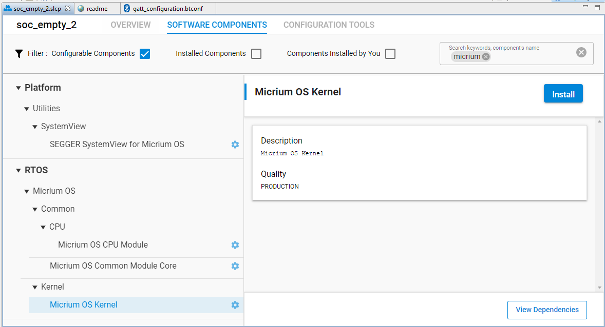
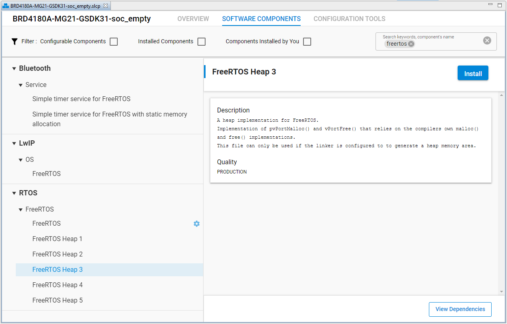

# Introduction

**This section replaces *AN1260: Integrating v3.x Silicon Labs Bluetooth Applications with Real-Time Operating Systems in SDK v3.x and Higher*. Further updates to this application note will be provided here.**

This section provides background information on the system architecture and event-based communication between a real-time operating system (RTOS) and the Bluetooth application. It then discusses user-defined tasks and describes how to customize an application. Since Simplicity SDK 2024.12, Bluetooth Mesh also has RTOS support. Specifically, this section describes how to integrate a v3.x Silicon Labs Bluetooth application with an RTOS, using the **SOC-Empty** example in Simplicity Studio as an illustration. As of Silicon Labs Bluetooth SDK version 3.1.0, the adaptation layer has been designed to work with Micrium OS RTOS and FreeRTOS, both using the CMSIS-RTOS2 API. Note that, by default, many of the EFR Bluetooth and Bluetooth Mesh examples are bare metal applications. To work with any other RTOS, the OS should have the following features:

- Tasks with priorities
- Flags for triggering task execution from interrupt context
- Mutexes

The solution places the handling of Bluetooth stack events into its own task, allowing the application to run other tasks when no Bluetooth events are pending. When no tasks are ready to run, the application will sleep.

>**Note**: Since Simplicity SDK 2024.12, there are three flavors of individual SoC Empty example applications for Bluetooth and Bluetooth Mesh: one running on bare metal, a second running FreeRTOS, and a third running Micrium OS.

## Prerequisites

You should have:

- A general understanding of RTOS concepts such as tasks, semaphores and mutexes.
- A working knowledge of Bluetooth Low Energy communications.
- A Wireless starter kit with an EFR32BG or EFR32MG radio board
- Installed and be familiar with using the following:
  - Simplicity Studio 5
  - IAR Embedded Workbench for ARM (IAR-EWARM) (optional - only use the version that is compatible with the SDK version, as listed in the SDK release notes). May be used as a compiler in the Simplicity Studio development environment as an alternative to GCC (The GNU Compiler Collection), which is provided with Simplicity Studio. Again, use only the GCC version that is compatible with the SDK version, as listed in the SDK release notes.
  - Bluetooth SDK v3.1.0 or above

If you need to familiarize yourself with any of these concepts, the following may be useful:

- [Bluetooth LE Fundamentals](/bluetooth/{build-docspace-version}/bluetooth-le-fundamentals)
- [Getting Started](/bluetooth/{build-docspace-version}/bluetooth-getting-started-overview)
- [µC/OS-III User Manual](https://micrium.atlassian.net/wiki/spaces/osiiidoc/pages/131322/Introduction) for an overview of RTOS fundamentals
- FreeRTOS
  - [RTOS Fundamentals](https://freertos.org/Documentation/01-FreeRTOS-quick-start/01-Beginners-guide/01-RTOS-fundamentals)
  - [FreeRTOS Kernel Developer Docs](https://freertos.org/features.html)

## Micrium OS Configuration

To have Micrium RTOS run in your application, the **Micrium OS Kernel** component needs to be added to your application project. The following procedure illustrates this using the **SOC-Empty** example project.

1. Double-click the `soc_empty.slcp` file in the Simplicity Studio Project Explorer to open the Project Configurator, and click the **SOFTWARE COMPONENTS** tab.

2. Enter **micrium** in the search field in the top right corner. Optionally, select the **Configurable Components** checkbox to shorten the component list.

3. Select **Micrium OS Kernel** in the left pane and click **Install**.

   

The **Micrium OS Kernel** component adds Micrium RTOS support to the **SOC-Empty** example project and configures the project to run the Bluetooth stack in multiple tasks. These tasks are discussed in [System Architecture](02-system-architecture.md).

The following components are added automatically when adding the **Micrium OS Kernel** component:

Generic RTOS related:

- Platform - CMSIS - CMSIS-RTOS2 Headers
- Platform - CMSIS - CMSIS-RTOS2 Initialization
- Platform - CMSIS - CMSIS-RTOS2 OS Tick
- Platform - Common - Common APIs for CMSIS-Compliant Kernels

Micrium OS related:

- RTOS - Micrium OS - Common  - Micrium OS CPU Module
- RTOS - Micrium OS - Kernel - Micrium OS Kernel
- Services – Micrium – Common - Micrium OS Common Libraries Module
- Services – Micrium – Common - Micrium OS Common Module Core

> **Note**: If the component **Simple timer service** is used in the application, a separate version for the Micrium OS called **Simple timer service for Micrium RTOS** should be used instead.

## FreeRTOS Configuration

To have FreeRTOS run in your application, add the **FreeRTOS** component and the preferred **FreeRTOS Heap** component (Heap 3 is used in the examples) to your application project.

To add the **FreeRTOS** component to the **SOC-Empty** example project:

1. Double-click the `soc_empty.slcp` file in the Simplicity Studio Project Explorer to open the Project Configurator, and click the **SOFTWARE COMPONENTS** tab.

2. Enter **freertos** in the search field in the top right corner.

3. Select **FreeRTOS Heap 3** in the left pane and click **Install**.

   

The **FreeRTOS Heap 3** component adds FreeRTOS support to the **SOC-Empty** example project and configures the project to run the Bluetooth stack in multiple tasks. These tasks are discussed in [System Architecture](02-system-architecture.md).

> **Note**: If the **FreeRTOS** component is added instead of the **FreeRTOS Heap 3** component, it will default to FreeRTOS Heap 4. To see more information about the FreeRTOS heap implementations, see the [FreeRTOS documentation](https://www.freertos.org/a00111.html).

The following components are added automatically when adding the **FreeRTOS Heap 3** component:

Generic RTOS related:

- Platform - CMSIS - CMSIS-RTOS2 Headers
- Platform - CMSIS - CMSIS-RTOS2 Initialization
- Platform - CMSIS - CMSIS-RTOS2 OS Tick
- Platform - Common - Common APIs for CMSIS-Compliant Kernels

FreeRTOS related:

- RTOS - FreeRTOS - FreeRTOS
- RTOS - FreeRTOS - FreeRTOS Heap 3
