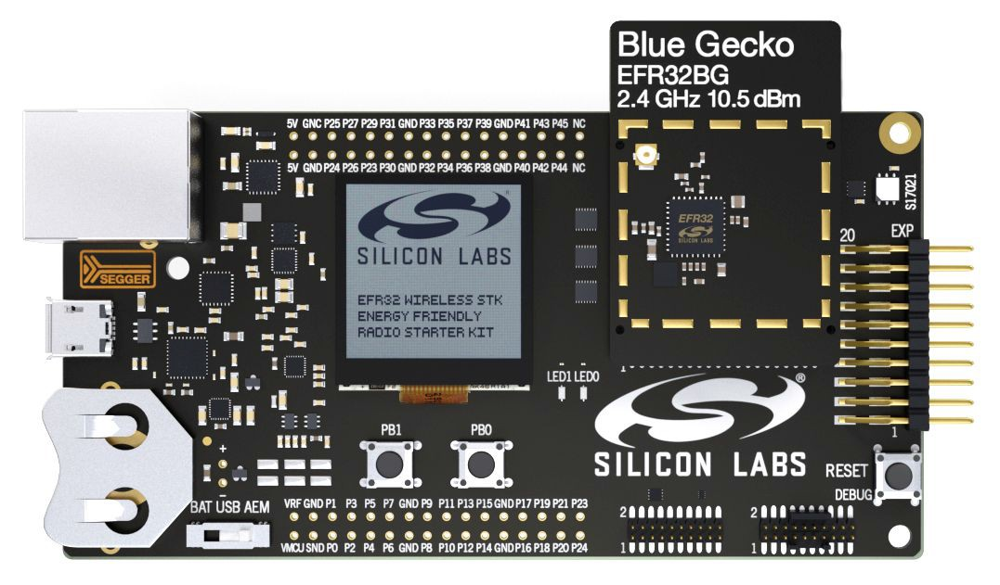
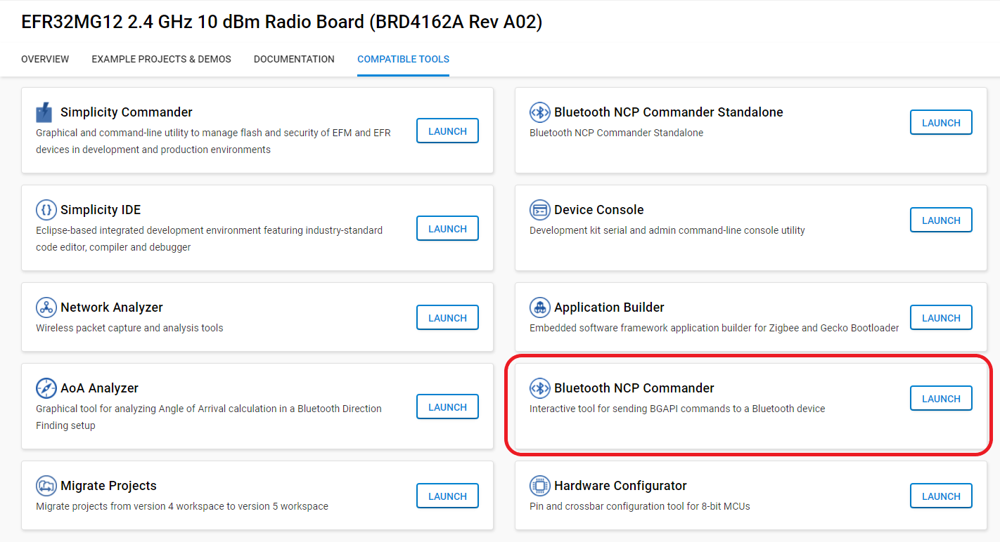
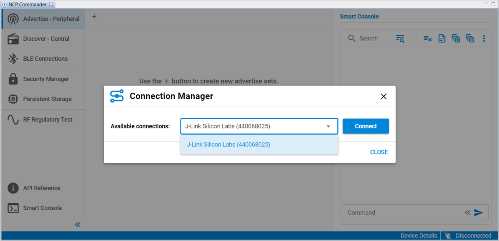
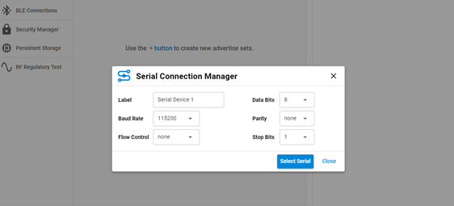
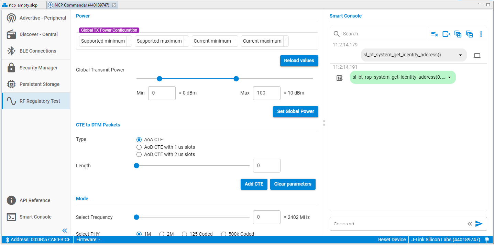
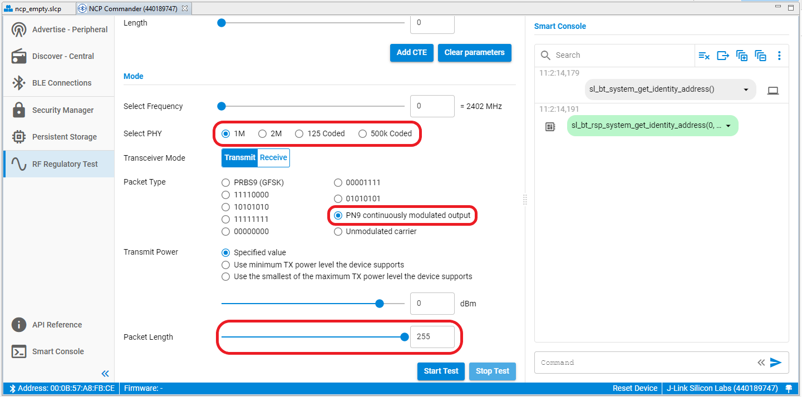
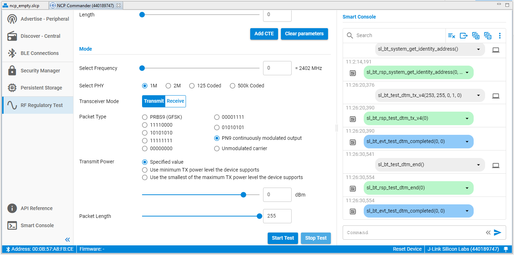

# Testing with Bluetooth NCP Commander

An easy way to perform the RF PHY tests with the EFR32xG SoCs and the BGM/MGM modules is to use a PC running a Silicon Labs tool as the Upper Tester. The SoC or module must be configured to operate in NCP mode, and must have the **Bluetooth > Stack > DTM > Test** component installed to add the DTM commands.

Two tools are available:

- Bluetooth NCP Commander

- Bluetooth NCP Commander Standalone

[Using the v3.x Silicon Labs Bluetooth Stack in Network Co-Processor Mode](https://docs.silabs.com/bluetooth/latest/bluetooth-network-coprocessor-mode/) discusses the basics of the NCP firmware, how to load it to a device, and provides an example to help familiarize you with the NCP mode. It also includes instructions on how to get started controlling and configuring the Bluetooth functionality through Bluetooth NCP Commander and Bluetooth NCP Commander Standalone demo programs.

This section describes using Bluetooth NCP Commander or Bluetooth NCP Commander Standalone for RF PHY testing, where an SoC or module in a radio board attached to the Wireless Starter Kit (WSTK) is the example DUT, as shown in the following figure.



## Using Bluetooth NCP Commander

Bluetooth NCP Commander is an easy-to-use tool that can be used for testing different stack features, by sending BGAPI commands to the target device. The tool has two versions: a version integrated in Simplicity Studio, which makes it easy to connect to your development kit and start testing, and a standalone version to test a board in an environment where Simplicity Studio cannot be installed, or if you want to test a custom board that can be accessed on UART interface, but not through a Simplicity Studio supported debug adapter using VCOM.

1. To open the integrated Bluetooth NCP Commander, select the target board in the **Debug Adapters** view, and check that the preferred SDK is set to **Gecko SDK Suite: Bluetooth**. Select the **Compatible Tools** tab, and click **Launch** next to Bluetooth NCP Commander.

   

2. To open the standalone tool, either navigate to C:\SiliconLabs\SimplicityStudio\v5\developer\adapter_packs\ncp_commander, and start NcpCommander.exe, or find the tool on the **Compatible Tools** tab or in the **Tools** menu.

3. If you use the integrated version, select the target device, and click **Connect**.

   

4. If you use the standalone tool, provide the UART interface settings, and then select the COM port on which the device can be accessed.

   

 Next, change to the **RF regulatory Test** view. The control dialog shown in the following figure opens. Depending on the SDK in use, the NCP Commander might present different views and contents.



In this dialog you can interact with the device and set the RF test parameters using the sliders and the radio buttons. All the necessary configuration options are provided, namely transmission power level, operational frequency, packet type and length, and whether to perform a transmit or receive test.

If you intend to perform transmit tests using anything other than the default transmit power, change the power and click **Set** next to the transmit power slider before launching the next test. Normally, the default value is the maximum allowed by the firmware for a particular SoC or module. Clicking **Set** executes the BGAPI’s `system_set_tx_power` command, which changes the power value.

When the configuration parameters for the test are complete, click **Start test**. The test runs until you click **Stop test**.

Depending on the SDK in use, Bluetooth NCP Commander might present different views and contents, such as in the following where no firmware uploading section exists.

The following figure shows the PHY selection option in NCP Commander, together with the option to select the PN9 continuously modulated carrier, and the possibility to extend the payload to up to 255 bytes:



The following figure shows an example of the commands and responses and events in an actual test:



In this example, the test is started by clicking **Start test**. After a DTM test is started, the device will only accept the `test_dtm_end` command, which is entered by clicking **Stop test**. The only other way to stop a test are by resetting the device or through a power-cycle.

>**Note**: Once a test is started the normal Bluetooth LE functionality is not available, in other words, advertising and scanning are not possible while a test is running, and similarly no connection can exist.

Another way to start and stop tests with NCP Commander is by entering the commands with the desired parameters in the command field of the Smart Console window, labeled **Command**. Such commands can be copy-pasted from the API reference, for example:

```C
sl_bt_test_dtm_tx_v4(0,37,19,1,0)
```

See the section below for more information.

## DTM Commands

When you click **Start test** in either Bluetooth NCP Commander or BGTool, the tool sends one of the BGAPI’s DTM commands over the host interface of the device. The command parameters correspond to the slider and radio button selections. The following summarizes the API’s DTM commands. The commands with their related responses and the event mentioned below are found in the *Bluetooth Software API v3 Reference*.

**`test_dtm_tx(packet_type, length, channel, phy)`**

**`test_dtm_tx_v4(packet_type, length, channel, phy, power_level)`**

Starts a transmitter test. The DUT returns a response indicating that the command was received successfully. Shortly after this, a `test_dtm_completed` event is triggered, indicating that the command was processed by the radio and the actual test mode is started. At this point, the device is sending Bluetooth LE packets continuously at a fixed interval defined in the specification. The test is stopped using the `test_dtm_end` command, which is also followed by a `test_dtm_completed` event.

Only when a `test_dtm_completed` event follows the `test_dtm_end` command, the event's `number_of_packets` field carries the actual number of packets sent during the test.

The type and length of each packet is set by the `packet_type` and `length` parameters. The newest firmware versions add a parameter called `phy` that allows the selection of the PHY among 1M, 2M, 125k Coded, and 500k Coded, when supported by the DUT. The power_level parameter is the TX power level in dBm, with a range of -127 to +20. This parameter also includes options to use the minimum TX power level that the device supports, or the smallest of the maximum TX power level that the device supports and the global maximum TX power setting in the stack.

Note that a special packet type named `test_pkt_carrier` exists that can be used to transmit a continuous unmodulated carrier. The length field is ignored in this mode.

Another special packet type named `test_pkt_pn9` can be used to transmit a continuous modulated carrier instead, by means of a PN9 stream offering a 100% duty cycle.

In general, for the regulatory testing PRBS9 and/or the continuous modulated carrier are used, whereas the other two packet payloads are used when testing for the Bluetooth qualification.

**`test_dtm_rx(channel, phy)`**

Starts a receiver test. The procedure is similar to the transmitter test described above. When ending the test with the `test_dtm_end` command, the expected `test_dtm_completed` event from the device carries in its `number_of_packets` field the actual number of packets received during the test.

**`test_dtm_end()`**

Can be issued at any time to end a transmitter or a receiver test. When the command is processed by the radio and the test has ended, a `test_dtm_completed` event is triggered.

## Using Other Methods

Using either Bluetooth NCP Commander or Bluetooth NCP Commander Standalone is just one of the ways to perform the RF PHY tests in the lab. In fact, the DTM commands from the BGAPI protocol are also available to any host MCU capable of issuing the BGAPI commands over the device’s host interface, for example when implementing a host program based on the BGLib library.

The commands can also be launched by a DUT operating in standalone mode, by means of a custom C program loaded onto the SoC/module. Users could start with the **SOC-Empty** example project, and customize it to simply have a test command autonomously launched at boot and terminated by a hard reset or after a timer has expired. Alternatively, the program could be designed to allow an incoming Bluetooth LE connection over which a remote device could write a dedicated GATT characteristic. The characteristic's content would define the test command the application should launch and how long this should run until a terminating event such as allowing the next connection or a reset.

Using this programming strategy, customers often prepare multiple firmware images for their test house, each containing the standalone functionality to launch a specific test at bootup, and then simply provide instructions to the test house on how to change firmware images.

### Notes and Limitations

1. The DTM tests discussed in this section are meant for regulatory testing as well as for Bluetooth qualification. All tests are designed to satisfy the guidelines normally set by the test houses that will conduct the regulatory evaluation.

2. During a 1M PHY transmit test where the typical 37 bytes of payload are used, subsequent packet transmissions are started at an interval of 625 µs. In this case, the packet transmission itself lasts 376 µs, resulting in a duty cycle of 60.2%. This comes from the fact that the packet used in the test is made of a preamble (8 bit) plus a sync word (32 bit) plus a packet type field (16 bit) plus the payload (296 bit) plus the CRC (24 bit), while the time to transmit one bit is 1 µs given the air-interface baud rate of 1 Mbit/s.

   The max payload size that can be configured with the `test_dtm_tx_v4` command can be up to 255 bytes, according to the LE Data Packet Length Extension introduced in the Core Specification version 4.2. Given all the new possible combinations of PHYs and packet lengths in the newest firmware versions, the duty cycle will actually depend now also on the interval between packets which is not fixed but calculated based on the information found in the Core Specification version 4.2 and 5.x, in chapter "*4.1.6 LE Test Packet Interval*" of Volume 6, Part F.

3. As of this version, no configuration option exists to define a fixed number of packets that the device would transmit after issuing the `test_dtm_tx_v4` command. One useful use case would be to estimate packets lost: the test setup would have a transmitter sending a number of packets known in advance and a receiver reporting the number of packets received (via the `test_dtm_completed` event).

   This could evaluate performance changes due to distance or other conditions, or be used during production to validate the quality of a product just manufactured. The workaround for the lack of such a configuration option is to let the unit transmit only for a fixed amount of time, calculated by taking into account the interval at which the packets are transmitted: in the example case of a 1M PHY and 37 bytes payload, having the interval between packets set to 625 µs, the packet rate is 1600 [packets/s].

>**Note**: Currently the `test_dtm_completed` event reports the actual packets sent during the test when the test mode launched with the `test_dtm_tx_v4` command is stopped. This is useful for a precise estimation of the PER when comparing the exact number of packets sent by the stack with the actual packets received by the receiver. The DTM communication response in 2-wire firmware does not report the sent packet count.
