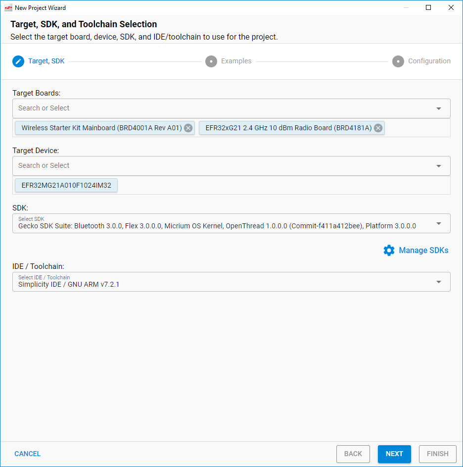
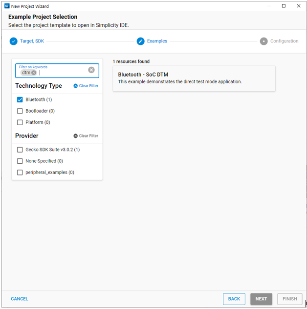
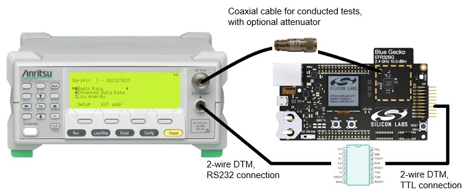
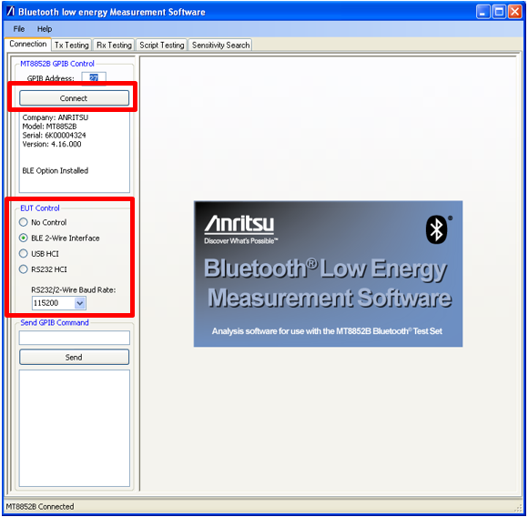
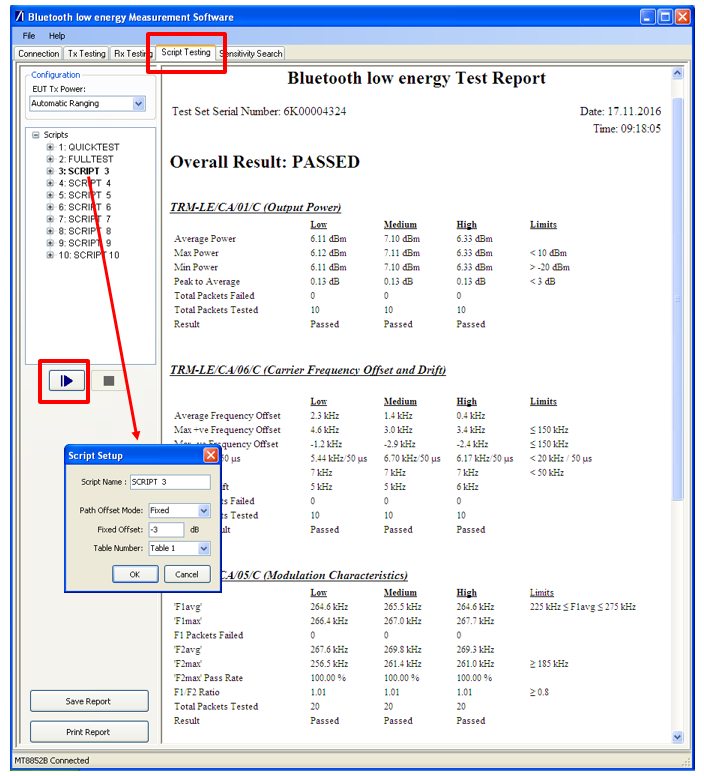
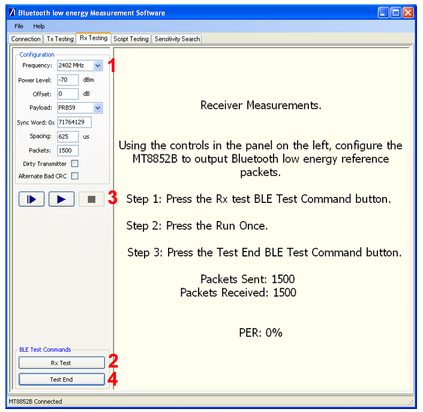
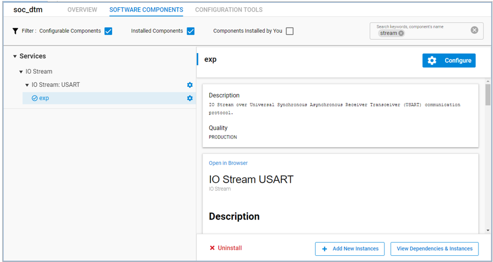
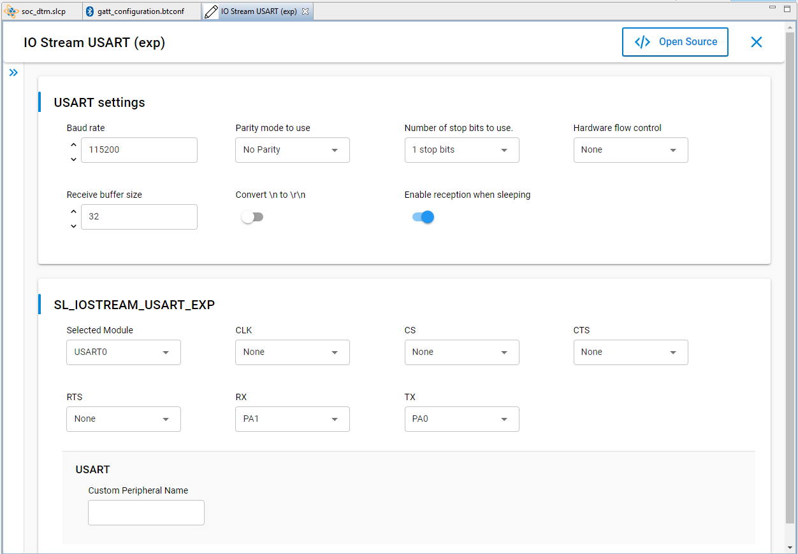
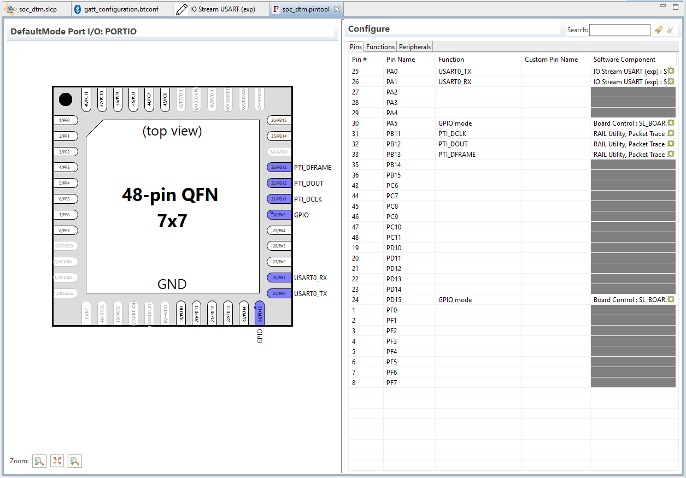

# Testing with the DTM 2-Wire Firmware

If a Bluetooth tester device is available, it should be used to evaluate the RF performance of the DUT, since such dedicated equipment is faster and offers automated and accurate testing. These benefits among others are achieved because the tester can control and configure the DUT in all the tests required for complete RF PHY evaluation. Such control is possible thanks to the DTM 2-wire capability and its related protocol, which are part of the Bluetooth specification.

To enable the DTM 2-wire communication between a commercial Bluetooth tester device (that is, the Upper Tester with the included RF PHY measurement capability) and the DUT, the latter needs to run a special firmware where the protocol is included. This special DTM 2-wire-capable firmware is available as an example application project in Bluetooth SDK v3x through Simplicity Studio® 5 (SSv5). This section provides a summary of the project creation and use process. It assumes you are familiar with building and flashing applications using the Bluetooth SDK v3.x with SSv5. For more information about these processes, see the online SSv5 User's Guide, available through the SSv5 help menu, or [Getting Started with Silicon Labs Bluetooth LE Development](https://docs.silabs.com/bluetooth/latest/bluetooth-getting-started-overview/).

To create the project in SSv5, in the Launcher perspective, select the correct DUT in the Debug Adapter view. This correctly prepopulates the Target Board and Target Device (SoC or module) settings. In the **File** menu, select **New > Simplicity Studio Project Wizard**. The **Target, SDK and Toolchain Selection** dialog opens. Verify the target hardware, SDK version, and toolchain are correct. Click **NEXT**.

The Example Project Selection dialog opens. Use the Technology Type and Keyword filters to search for a specific example, in this case **Bluetooth - SoC DTM**. Select it and click **NEXT**.

The Project Configuration dialog opens. You do not need to change any of the default values. Click **FINISH** to create the DTM example project.

The example application configuration is as follows:

- The hardware link to the Bluetooth tester is enabled over the device’s pins that, in its evaluation radio board, are mapped to the WSTK expansion header’s UART TX (pin 12) and UART RX (pin14).
- The link uses UART parameters of 115200, 8N1 with no hardware flow control.

You can use the example application as is if these settings are correct for your DUT. Refer to the documentation of a particular SoC or module and of its evaluation radio board to determine which pins are in use in order to have the DTM signaling routed to the intended expansion header pins. See [Customizing the SoC DTM Application](#customizing-the-soc-dtm-application) for more information on application customization.

After changing the configuration (if necessary), build the application image and flash it to the DUT. If the application is not working and cannot even be debugged, the bootloader might be missing from the DUT. The easiest way to program the bootloader is to flash a pre-compiled demo application (with bootloader) such as Empty SoC from the Launcher-perspective DEMOS-tab, then re-flash the Soc Dtm image.

## Connecting and Testing with the Bluetooth Tester

With the DTM firmware installed, the DUT is ready to be wired to the Bluetooth tester, as shown in the following figure.

Testing can be performed at the Upper Tester interface, normally through PC software, as shown in the example using Anritsu MT8852B as the Bluetooth tester.

First, establish the connection to the DUT with the correct parameters, as highlighted in the following figure.

Next, pre-existing or custom scripts can be used to start a suite of tests, as shown in the following figure. In the same figure the test report is displayed by the tester PC program, after the automated tests have completed, with an overall result of "Passed". Notice also the **Fixed Offset** field in the **Script Setup** box, which can be used to compensate for power loss, for example over the coaxial antenna cable in the case of conducted RF tests.

Any commercial Bluetooth tester should be capable of testing among others the Packet Error Rate (PER). In this test configuration, the Upper Tester first configures the DUT into receiving mode using the appropriate DTM 2-wire command (step 2 in the figure below after the test configuration by the user in step 1), and then the Upper Tester starts sending a defined number of packets at the RF TX power level configured by the user (step 3). When the test is ended by the user (step 4), the corresponding DTM 2-wire command is also sent to the DUT and, much as in the BGAPI `test_dtm_completed` event discussed earlier, the DUT reports over the 2-wire link the number of received packets so that the Upper Tester can calculate the PER, all according to the specification.

## Testing Equipment Considerations

Certain Bluetooth testers, like the Anritsu MT8852B mentioned in this application note, use RS232 interfaces to connect to a DUT for the DTM 2-wire, meaning that, when testing with the DTM firmware and a WSTK, for example, a level shifter is needed in order to interface to the device’s TTL logic.

Certain Bluetooth testers have no capability to generate RF signals with a power lower than a certain value, for example -90 dBm in the case of the Anritsu MT8852B mentioned in this application note. Given that modern SoCs/modules have a receiver sensitivity going well below that, an attenuator might be required for appropriate testing, to further decrease the power of a signal directed to the device in receiving test mode.

## Customizing the SoC DTM Application

Configuring the device to use other pins and UART settings for the 2-wire UART than the defaults is done by configuring the Software Component.

When you create a new project, the GATT Configurator is opened by default. To go to the Project Configurator, click the \<project>.slcp tab, or double-click the \<project>.slcp file in the Simplicity IDE Project Explorer view. Click the Software Components tab. Check the Configurable Components and Installed Components filters. Type "stream" in the search box. You should see only one IO Stream implementation named **exp**. Select **exp**.

Click **Configure** to open the Component Editor. Here you can configure the baud rate, pins, and other parameters. Make your change and close the Component Editor. Changes are autosaved.

Instead of configuring the component, you can change configurations in the Pin Tool. Double click the file \<project name>.pintool to open it.

You can change the pin position from the Configure editor Pins tab. Select a pin, click the function to display the **Function** dropdown list, and select a function. Click the Software Component symbol to open the Component Editor. Changes made in the Pin Tool are not autosaved.

Once your changes are complete, compile and flash to test them.

In the screenshot shown at the beginning of this page, a WSTK with a radio board carrying an EFR32BG21 was attached to the PC. More often a custom design is used instead, and this custom board is obviously not recognized by the Silicon Labs’ software. In this case, start the DTM firmware creation as described in the beginning of the chapter but select the correct Target Device in the Target, SDK and Toolchain Selection dialog. The Target Board is left empty with a custom design. Check the SDK as it might not be correct by default and also check the Toolchain.

From there the process continues as previously described. Most likely the UART pins will need some configuration, as described above.
