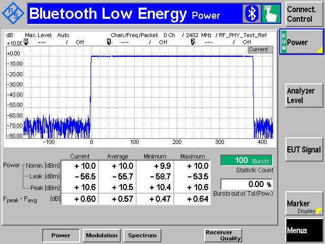
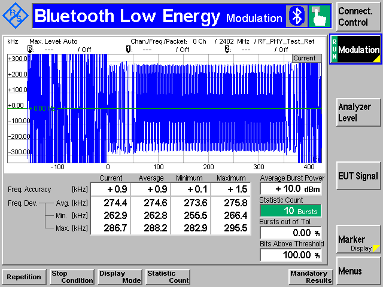
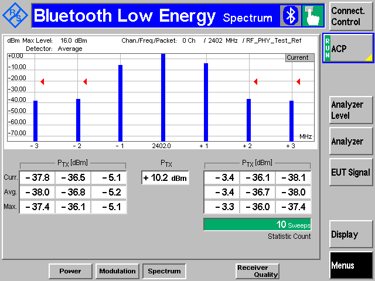
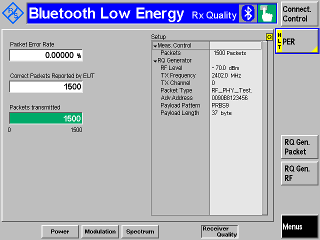

# Test Examples with the BGAPI Commands test_dtm_tx_v4 and test_dtm_rx

## Output Power—RF-PHY/TRM/BV-01-C

The power basic measurement is used to make all of the output power measurements.

In this example, the `test_dtm_tx_v4` command is used.

In this test mode, only the frequency and the output power are configurable parameters.

A spectrum analyzer is used to measure the power of the radio and must be connected through a compatible RF cable to the RF connector of the radio board.

It is also possible to test the output power with a separate Bluetooth tester device when the DTM firmware is installed in the DUT.

## Modulation—RF-PHY/TRM/BV-05-C and RF-PHY/TRM/BV-06-C

Used to make the modulation, and frequency offset and drift measurements.

In this example, the `test_dtm_tx_v4` command is used.

To follow the test specification, you need to be able to change your payload data pattern (either 1010 pattern or 11110000 pattern).

A spectrum analyzer is used to measure the modulation, frequency offset, and drift measurements of the radio and must be connected through a compatible RF cable to the RF connector of the radio board.

It is also possible to test by using a separate Bluetooth tester device provided that the DTM firmware is installed in the DUT.

## Spectrum—RF-PHY/TRM/BV-03-C

Used for in-band emissions measurements.

In this example, the `test_dtm_tx_v4` command is used.

A spectrum analyzer is used to measure the spectrum of the radio and must be connected through a compatible RF cable to the RF connector of the radio board.

It is also possible to use a separate Bluetooth tester device provided that the DTM firmware is installed in the DUT.

## Receiver Tests

Used to make all of the sensitivity-based measurements, as well as blocker measurements.

In this example, the `test_dtm_rx` command is used. In Bluetooth NCP Commander Standalone, the test is started by selecting **Low energy receive** and then pressing the **Start test** button.

A spectrum analyzer and two RF generators are used to validate the receiver tests and must be connected through a compatible RF cable to the RF connector of the radio board.

A separate Bluetooth tester device can be used, but you might have to consider adding to it an external signal generator to provide the second interferer or blocker signal.

