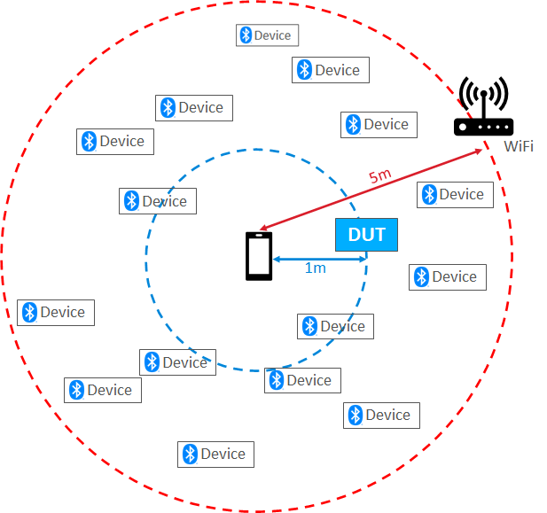

# Test Environment

The overall test environment is described in the figure below.

- The Device under test (DUT) was placed about 1 m away from the mobile phone against which the tests were executed.
- The testing was conducted in a generic office environment with
  - The closest WiFi access point was about 5 m away.
  - About 15 other interferers in the 2.4 GHz spectrum were active during the testing and were randomly located in the 5m range.

