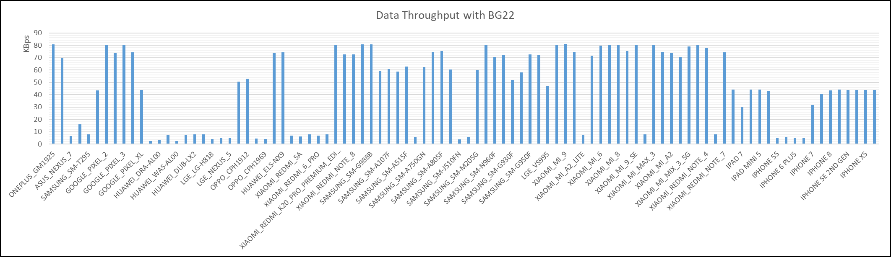
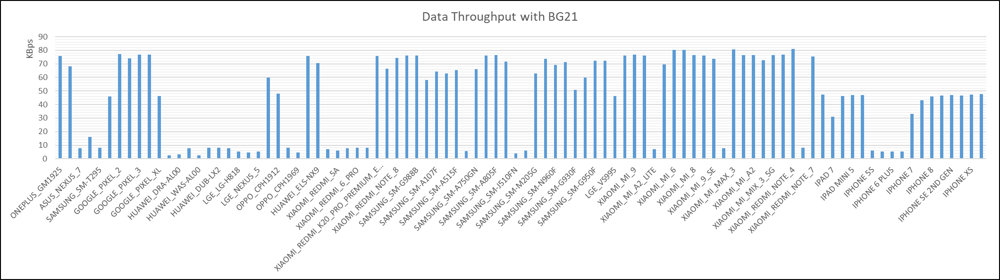
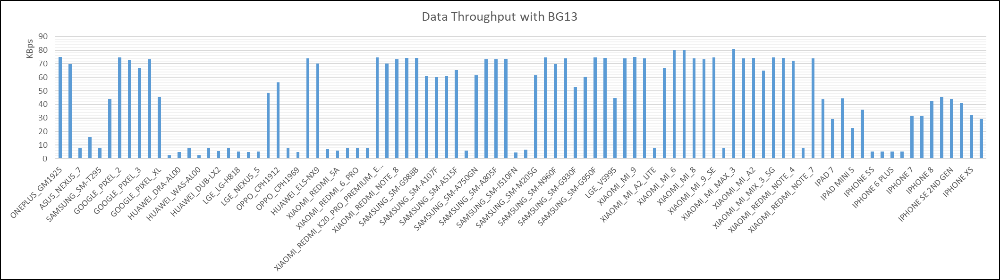
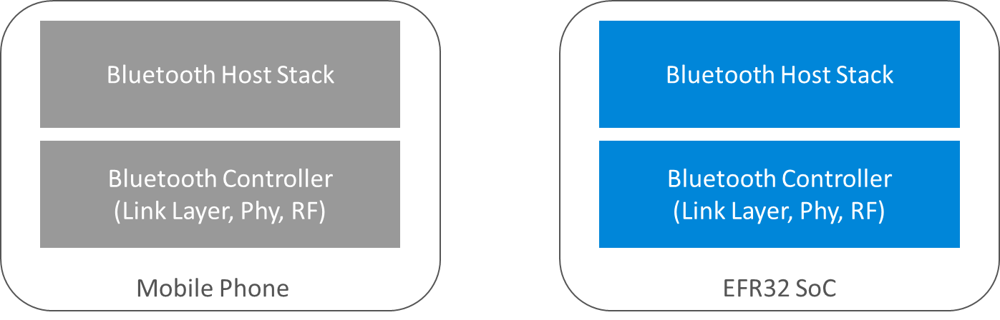

# Test Results

## Tested Phones

This section provides a list of phones and relevant information against which all the test cases mentioned in [Test Cases](./03-test-cases) were executed.

### Summary of Tested Phones

The table below gives a high-level view of the phones tested across iOS and Android platforms. It is to be noted that the choice of the version numbers has been made to provide a wide coverage. The earliest iOS version tested was 12.3 which was released in May 2019 and latest version is 14.4 which was released in January 2021. This included older devices like iPhone 5s which were released in 2013 upgraded to newer version of the OS. iPhone 11 pro was the latest of the iOS devices tested. Similarly, Android OS versions coverage ranged from 6.0 released in Oct 2015 to Android 10 released in Sep 2019 which at the time of testing was the latest of the generally available Android versions. The Android phones were sourced from various manufacturers across the world.

| OS Platform |Number of Phones |Version Coverage |
|-|-|-|
| iOS |17 |OS Version: 12.3, 12.4.8, 12.4.9, 13.3, 13.3.1, 13.4.1, 13.5.1, 13.6.1, 13.7, 14.2, 14.4 |
| Android |77 |OS Version: 6.0, 6.0.1, 7.0, 7.1.1, 7.1.2, 8.0.0, 8.1.0, 9, 10  API Level: 23, 24, 25, 26, 27, 28, 29   |

## Details of Tested Phones

**Notes**:

1. Phone code is the code that is provided by the phone and extracted by using the specific APIs

2. For Android, the OS version is to be read as Android: \<API_Level>_(\<Android version>)

3. For a test to be qualified as "Pass", the testing on all 3 SoC platforms have to pass.

| Sl No. |Device |Phone Code |OS Version |Test ID 1 |Test ID 2 |Test ID 3 |Test ID 4.1-4.10 |Test ID 5.1-5.8 |Test ID 6.1-6.2 |Test ID 7 |Test ID 8.1-8.3 |
|-|-|-|-|-|-|-|-|-|-|-|-|
| 1 |7 Pro |OnePlus_GM1925 |Android:28_(9) |Pass |Pass |Pass |Pass |Pass |Pass |Pass |Pass |
| 2 |8 Pro |OnePlus_IN2020 |Android:29_(10) |Pass |Pass |Pass |Pass |Pass |Pass |Pass |Pass |
| 3 |Asus nexus 7 |Asus_Nexus_7 |Android:23_(6.0.1) |Pass |Pass |Pass |Pass |Pass |Pass |Pass |Pass |
| 4 |G6 |LGE_LGM_G600L |Android:28_(9) |Pass |Pass |Pass |Pass |Pass |Pass |Pass |Pass |
| 5 |Galaxy Tab A 8.0 |Samsung_SM-T295 |Android:28_(9) |Pass |Pass |Pass |Pass |Pass |Pass |Pass |Pass |
| 6 |Google Pixel |Google_Pixel |Android:28_(9) |Pass |Pass |Pass |Pass |Pass |Pass |Pass |Pass |
| 7 |Google Pixel 2 |Google_Pixel_2 |Android:29_(10) |Pass |Pass |Pass |Pass |Pass |Pass |Pass |Pass |
| 8 |Google Pixel 2 XL |Google_Pixel_2_XL |Android:29_(10) |Pass |Pass |Pass |Pass |Pass |Pass |Pass |Pass |
| 9 |Google Pixel 3 |Google_Pixel_3 |Android:29_(10) |Pass |Pass |Pass |Pass |Pass |Pass |Pass |Pass |
| 10 |Google Pixel 3 XL |Google_Pixel_3_XL |Android:29_(10) |Pass |Pass |Pass |Pass |Pass |Pass |Pass |Pass |
| 11 |Google Pixel XL |Google_Pixel_XL |Android:29_(10) |Pass |Pass |Pass |Pass |Pass |Pass |Pass |Pass |
| 12 |Honor play |HUAWEI_COR_AL10 |Android:27_(8.1.0) |Pass |Pass |Pass |Pass |Pass |Pass |Pass |Pass |
| 13 |Huawei Enjoy 8 |HUAWEI_DRA_AL00 |Android:27_(8.1.0) |Pass |Pass |Pass |Pass |Pass |Pass |Pass |Pass |
| 14 |Huawei Nova 3i |HUAWEI_INE-LX2 |Android:28_(9) |Pass |Pass |Pass |Pass |Pass |Pass |Pass |Pass |
| 15 |Huawei Nova Youth Edition |HUAWEI_WAS_AL00 |Android:26_(8.0.0) |Pass |Pass |Pass |Pass |Pass |Pass |Pass |Pass |
| 16 |Huawei P30 Lite |HUAWEI_MAR-LX2 |Android:28_(9) |Pass |Pass |Pass |Pass |Pass |Pass |Pass |Pass |
| 17 |Huawei Y7 Pro |HUAWEI_DUB_LX2 |Android:27_(8.1.0) |Pass |Pass |Pass |Pass |Pass |Pass |Pass |Pass |
| 18 |Huawei Y9 Prime |HUAWEI_STK-L22 |Android:29_(10) |Pass |Pass |Pass |Pass |Pass |Pass |Pass |Pass |
| 19 |LG G4 |LGE_LG-H818 |Android:23_(6.0) |Pass |Pass |Pass |Pass |Pass |Pass |Pass |Pass |
| 20 |Mi 10 Pro |Xiaomi_Mi_10_Pro |Android:29_(10) |Pass |Pass |Pass |Pass |Pass |Pass |Pass |Pass |
| 21 |Motorola Nexus 6 |Motorola_Nexus_6 |Android:25_(7.1.1) |Pass |Pass |Fail |Pass |Pass |Pass |Pass |Pass |
| 22 |Nexus 5 |  LGE_Nexus_5 |Android:23_(6.0.1) |Pass |Pass |Pass |Pass |Pass |Pass |Pass |Pass |
| 23 |Oppo A1k |OPPO_CPH1923 |Android:28_(9) |Pass |Pass |Pass |Pass |Pass |Pass |Pass |Pass |
| 24 |Oppo A5s |OPPO_CPH1912 |Android:27_(8.1.0) |Pass |Pass |Pass |Pass |Pass |Pass |Pass |Pass |
| 25 |Oppo A7 |OppO_CPH1905 |Android:27_(8.1.0) |Pass |Pass |Pass |Pass |Pass |Pass |Pass |Pass |
| 26 |Oppo F11 Pro |OPPO_CPH1969 |Android:29_(10) |Pass |Pass |Pass |Pass |Pass |Pass |Pass |Pass |
| 27 |Oppo Reno |OPPO_CPH1917 |Android:28_(9) |Pass |Pass |Pass |Pass |Pass |Pass |Pass |Pass |
| 28 |P40 Pro |HUAWEI_ELS_NX9 |Android:29_(10) |Pass |Pass |Pass |Pass |Pass |Pass |Pass |Pass |
| 29 |Redmi 4X |Xiaomi_Redmi_4X |Android:25_(7.1.2) |Pass |Pass |Pass |Pass |Pass |Pass |Pass |Pass |
| 30 |Redmi 5A |Xiaomi_Redmi_5A |Android:25_(7.1.2) |Pass |Pass |Pass |Pass |Pass |Pass |Pass |Pass |
| 31 |Redmi 5plus |Xiaomi_Redmi_5_Plus |Android:27_(8.1.0) |Pass |Pass |Pass |Pass |Pass |Pass |Pass |Pass |
| 32 |Redmi 6Pro |Xiaomi_Redmi_6_Pro |Android:27_(8.1.0) |Pass |Pass |Pass |Pass |Pass |Pass |Pass |Pass |
| 33 |Redmi 7 |Xiaomi_Redmi_7 |Android:28_(9) |Pass |Pass |Pass |Pass |Pass |Pass |Pass |Pass |
| 34 |Redmi K20 pro (New) |Xiaomi_Redmi_K20_Pro_Premium_Edition |Android:29_(10) |Pass |Pass |Pass |Pass |Pass |Pass |Pass |Pass |
| 35 |Redmi K30 Pro |Xiaomi_Redmi_K30_Pro |Android:29_(10) |Pass |Pass |Pass |Pass |Pass |Pass |Pass |Pass |
| 36 |Redmi Note 8 (New) |Xiaomi_Redmi_Note_8 |Android:28_(9) |Pass |Pass |Pass |Pass |Pass |Pass |Pass |Pass |
| 37 |Redmi note5 |Xiaomi_Redmi_Note_5 |Android:28_(9) |Pass |Pass |Pass |Pass |Pass |Pass |Pass |Pass |
| 38 |S20 Ultra |Samsung_SM-G988B |Android:29_(10) |Pass |Pass |Pass |Pass |Pass |Pass |Pass |Pass |
| 39 |Samsung A10 |Samsung_SM-A105G |Android:28_(9) |Pass |Pass |Pass |Pass |Pass |Pass |Pass |Pass |
| 40 |Samsung A10s |Samsung_SM-A107F |Android:28_(9) |Pass |Pass |Pass |Pass |Pass |Pass |Pass |Pass |
| 41 |Samsung A30 |Samsung_SM-A305F |Android:28_(9) |Pass |Pass |Pass |Pass |Pass |Pass |Pass |Pass |
| 42 |Samsung A51 |SM-A515F |Android:29_(10) |Pass |Pass |Pass |Pass |Pass |Pass |Pass |Pass |
| 43 |Samsung A6 Plus |Samsung_SM-A605G |Android:26_(8.0.0) |Pass |Pass |Pass |Pass |Pass |Pass |Pass |Pass |
| 44 |Samsung A7 (2017) |Samsung_SM-A750GN |Android:26_(8.0.0) |Pass |Pass |Pass |Pass |Pass |Pass |Pass |Pass |
| 45 |Samsung A70 |Samsung_SM-A705F |Android:29_(10) |Pass |Pass |Pass |Pass |Pass |Pass |Pass |Pass |
| 46 |Samsung A80 |Samsung_SM-A805F |Android:29_(10) |Pass |Pass |Pass |Pass |Pass |Pass |Pass |Pass |
| 47 |Samsung A9 |Samsung_SM-A920F |Android:29_(10) |Pass |Pass |Pass |Pass |Pass |Pass |Pass |Pass |
| 48 |Samsung J5(2016) |Samsung_SM-J510FN |Android:25_(7.1.1) |Pass |Pass |Pass |Pass |Pass |Pass |Pass |Pass |
| 49 |Samsung J7 (2016) |Samsung_SM-J710F |Android:23_(6.0.1) |Pass |Pass |Pass |Pass |Pass |Pass |Pass |Pass |
| 50 |Samsung M20 |Samsung_SM-M205G |Android:28_(9) |Pass |Pass |Pass |Pass |Pass |Pass |Pass |Pass |
| 51 |Samsung Note 8 |Samsung_SM-N950F |Android:28_(9) |Pass |Pass |Pass |Pass |Pass |Pass |Pass |Pass |
| 52 |Samsung Note 9 |Samsung_SM-N960F |Android:29_(10) |Pass |Pass |Pass |Pass |Pass |Pass |Pass |Pass |
| 53 |Samsung S10 Plus |Samsung_SM-G975F |Android:29_(10) |Pass |Pass |Pass |Pass |Pass |Pass |Pass |Pass |
| 54 |Samsung S7 |Samsung_SM-G930F |Android:26_(8.0.0) |Pass |Pass |Pass |Pass |Pass |Pass |Pass |Pass |
| 55 |Samsung S7 Edge |Samsung_SM-G935F |Android:26_(8.0.0) |Pass |Pass |Pass |Pass |Pass |Pass |Pass |Pass |
| 56 |Samsung S8 |Samsung_SM-G950F |Android:26_(8.0.0) |Pass |Pass |Pass |Pass |Pass |Pass |Pass |Pass |
| 57 |Samsung S8 Plus |Samsung_SM-G955F |Android:26_(8.0.0) |Pass |Pass |Pass |Pass |Pass |Pass |Pass |Pass |
| 58 |V20 |LGE_VS995 |Android:24_(7.0) |Pass |Fail |Pass |Pass |Pass |Pass |Pass |Pass |
| 59 |V30 |LGE_LG-H931 |Android:28_(9) |Pass |Pass |Pass |Pass |Pass |Pass |Pass |Pass |
| 60 |Xiao Mi 9 |Xiaomi_MI_9 |Android:28_(9) |Pass |Pass |Pass |Pass |Pass |Pass |Pass |Pass |
| 61 |Xiao Mi 9T |Xiaomi_Mi_9T |Android:29_(10) |Pass |Pass |Pass |Pass |Pass |Pass |Pass |Pass |
| 62 |Xiao Mi A2 LITE |Xiaomi_Mi_A2_Lite |Android:28_(9) |Pass |Pass |Pass |Pass |Pass |Pass |Pass |Pass |
| 63 |Xiaomi 6 |Xiaomi_MI_6 |Android:28_(9) |Pass |Pass |Pass |Pass |Pass |Pass |Pass |Pass |
| 64 |Xiaomi 6X |Xiaomi_MI_6X |Android:27_(8.1.0) |Pass |Pass |Pass |Pass |Pass |Pass |Pass |Pass |
| 65 |Xiaomi 8 |Xiaomi_MI_8 |Android:28_(9) |Pass |Pass |Pass |Pass |Pass |Pass |Pass |Pass |
| 66 |Xiaomi 9 Pro (New) |Xiaomi_Mi9_Pro_5G |Android:28_(9) |Pass |Pass |Pass |Pass |Pass |Pass |Pass |Pass |
| 67 |Xiaomi 9SE |Xiaomi_MI_9_SE |Android:28_(9) |Pass |Pass |Pass |Pass |Pass |Pass |Pass |Pass |
| 68 |Xiaomi max2 |Xiaomi_MI_MAX_2 |Android:25_(7.1.1) |Pass |Pass |Pass |Pass |Pass |Pass |Pass |Pass |
| 69 |Xiaomi max3 |Xiaomi_MI_MAX_3 |Android:27_(8.1.0) |Pass |Pass |Pass |Pass |Pass |Pass |Pass |Pass |
| 70 |Xiaomi Mi 8 Lite |Xiaomi_MI_8_Lite |Android:27_(8.1.0) |Pass |Pass |Pass |Pass |Pass |Pass |Pass |Pass |
| 71 |Xiaomi Mi A2 |Xiaomi_Mi_A2 |Android:28_(9) |Pass |Pass |Pass |Pass |Pass |Pass |Pass |Pass |
| 72 |Xiaomi Mi A3 |Xiaomi_Mi_A3 |Android:28_(9) |Pass |Pass |Pass |Pass |Pass |Pass |Pass |Pass |
| 73 |Xiaomi MIX 3 |Xiaomi_Mi_MIX_3_5G |Android:28_(9) |Pass |Pass |Pass |Pass |Pass |Pass |Pass |Pass |
| 74 |Xiaomi MIX2S |Xiaomi_MIX_2S |Android:28_(9) |Pass |Pass |Pass |Pass |Pass |Pass |Pass |Pass |
| 75 |Xiaomi Note 4  |Xiaomi_Redmi_Note_4 |Android:23_(6.0) |Pass |Pass |Pass |Pass |Pass |Pass |Pass |Pass |
| 76 |Xiaomi Redmi 7A |Xiaomi_Redmi_7A |Android:28_(9) |Pass |Pass |Pass |Pass |Pass |Pass |Pass |Pass |
| 77 |Xiaomi Redmi Note 7 |Xiaomi_Redmi_Note_7 |Android:28_(9) |Pass |Pass |Pass |Pass |Pass |Pass |Pass |Pass |
| 78 |iPhone 8 Plus |iPhone 8 Plus |iOS 14.2 |Pass |Pass |Pass |Pass |Pass |Pass |Pass |Pass |
| 79 |iPhone 5S |iPhone 5S |iOS 12.4.9 |Pass |Pass |Pass |Pass |Pass |Pass |Pass |Pass |
| 80 |iPhone 6 |iPhone 6 |iOS 12.4.8 |Pass |Pass |Pass |Pass |Pass |Pass |Pass |Pass |
| 81 |iPhone X |iPhone X |IOS 13.6.1 |Pass |Pass |Pass |Pass |Pass |Pass |Pass |Pass |
| 82 |iPhone 7 Plus |iPhone 7 Plus |iOS 14.4 |Pass |Pass |Pass |Pass |Pass |Pass |Pass |Pass |
| 83 |iPhone Xs |iPhone  Xs |IOS 13.5.1 |Pass |Pass |Pass |Pass |Pass |Pass |Pass |Pass |
| 84 |iPhone 8  |iPhone 8 |iOS 14.2 |Pass |Pass |Pass |Pass |Pass |Pass |Pass |Pass |
| 85 |iPhone 6 Plus |iPhone 6 Plus |iOS 12.4.8 |Pass |Pass |Pass |Pass |Pass |Pass |Pass |Pass |
| 86 |iPhone 7 |iPhone 7 |iOS 13.3 |Pass |Pass |Pass |Pass |Pass |Pass |Pass |Pass |
| 87 |iPhone 6s |iPhone 6S |iOS 13.7 |Pass |Pass |Pass |Pass |Pass |Pass |Pass |Pass |
| 88 |iPhone SE |iPhone SE (2nd generation) |iOS 13.5.1 |Pass |Pass |Pass |Pass |Pass |Pass |Pass |Pass |
| 89 |11 Pro |iPhone 11 Pro |iOS 14.2 |Pass |Pass |Pass |Pass |Pass |Pass |Pass |Pass |
| 90 |iPad Mini 5  |iPad mini (5th generation) |iOS 13.4.1 |Pass |Pass |Pass |Pass |Pass |Pass |Pass |Pass |
| 91 |iPad 2019  |iPad (7th generation) |iOS 13.4.1 |Pass |Pass |Pass |Pass |Pass |Pass |Pass |Pass |
| 92 |iPad Air 3 |iPad Air(3rd generation) |iOS 13.3.1 |Pass |Pass |Pass |Pass |Pass |Pass |Pass |Pass |
| 93 |iPad Pro 11 2020  |iPAD 11 Pro |iOS 13.5.1 |Pass |Pass |Pass |Pass |Pass |Pass |Pass |Pass |
| 94 |iPhone Xs Max |iPhone XS Max |iOS 12.3 |Pass |Pass |Pass |Pass |Pass |Pass |Pass |Pass |

## Throughput Tests

The tables below represent the throughput test results across various SoC platforms that were tested. Note that the throughput depends on various factors that are dependent on the phone including the below key ones.

1. Bluetooth version number – v4.0 and 4.1 support lower PUD size (27 bytes) vs 4.2 and above (251 bytes)

2. Packets per connection interval – The max supported by iOS is 4 and that by Android is 6

3. Radio performance.

## Extended Set of Phones

 While the testing was done on a limited set of phones, the results can be extended to infer wider interoperability considering the overall system architecture and the Bluetooth qualification process.

The figure above provides a high-level architecture of the different components used in the testing on the mobile phones and on the EFR32 SoCs.

When testing with different mobile phones the components which vary across the phones are the Bluetooth Controller and Bluetooth Host Stack on the mobile phones. The Bluetooth qualification process states that "If an organization produces more than one product that incorporates the same Bluetooth design, those additional products can be listed within the same qualification at no additional cost" [1.]. This is utilized by several companies to qualify different models of the mobile phones using the same qualification ID when the Bluetooth design is the same. With reference to the figure above, Bluetooth design refers to the combination of Controller and Host Stack.

Combining the architecture and qualification process, it can be inferred with high level of confidence that mobile phones which share the same qualification ID of the phones against which testing is done will exhibit the same behavior and hence the same level of interoperability.

The table below provides a list of 2,256 devices arranged by the qualification ID that they share with one of the phones that has been tested with.

:::custom-table{width=20%,20%,30%,30%}
| Phone code |OS version |Qualification Reference |Models with Shared Qualification |
|-|-|-|-|
| OnePlus_GM1925 |Android_SDK:_28_(9) |128467 - End Product |OnePlus 7 Pro, GM1915OnePlus 7 Pro, GM1913OnePlus 7 Pro, GM1917OnePlus 7 Pro 5G, GM1920OnePlus 7 Pro 5G, GM1925OnePlus 7 Pro, GM1911OnePlus 7 Pro, GM1910OnePlus 7, GM1900OnePlus 7, GM1903OnePlus 7, GM1901 |
| OnePlus_IN2020 |Android_SDK:_29_(10) |144662 - End Product |Smart Phone, IN2017OnePlus 8 5G UW, IN2019OnePlus 8, IN2015OnePlus 8, IN2013OnePlus 8, IN2010OnePlus 8, IN2011OnePlus 8 Pro, IN2020OnePlus 8 Pro, IN2021OnePlus 8 Pro, IN2023OnePlus 8 Pro, IN2025 |
| Asus_Nexus_7 |Android_SDK:_23_(6.0.1) |None | |
| LGE_LGM_G600L |Android_SDK:_28_(9) |92094 - End Product |LG Mobile Phone, LGM-G600LLG Mobile Phone, LGM-G600KLG Mobile Phone, LGM-G600SLG Mobile Phone, LGM-G600LRLG Mobile Phone, LGM-G600SRLG Mobile Phone, LGM-G600KRLG Mobile Phone, LGM-G600LPLG Mobile Phone, LGM-G600SPLG Mobile Phone, LGM-G600KP |
| Samsung_SM-T295 |Android_SDK:_28_(9) |134106 - End Product |Galaxy Tab A, SM-T295Galaxy Tab A, SM-T295NGalaxy Tab A, SM-T297Galaxy Tab A, SM-T295CGalaxy Tab A, SM-T290 |
| Google_Pixel |Android_SDK:_28_(9) |85767 - End Product |Pixel, PixelPixel XL, Pixel XL |
| Google_Pixel_2 |Android_SDK:_29_(10) |98278 - End Product |Pixel 2, G011A |
| Google_Pixel_2_XL |Android_SDK:_28_(9) |98638 - End Product |LG Mobile Phone, G011C |
| Google_Pixel_3 |Android_SDK:_29_(10) |111802 - Controller Subsystem115459 - Host Subsystem |Pixel 3, G013APixel 3, G013BPixel 3 XL, G013CPixel 3 XL, G013D |
| Google_Pixel_3_XL |Android_SDK:_29_(10) |122387 - Profile Subsystem111802 - Controller Subsystem115459 - Host Subsystem |Pixel 3a XL, G020A G020B G020C G020DPixel 3a, G020E G020F G020G G020H |
| Google_Pixel_XL |Android_SDK:_29_(10) |85767 - End Product |Pixel, PixelPixel XL, Pixel XL |
| HUAWEI_COR_AL10 |Android_SDK:_27_(8.1.0) | 101927 - Host Subsystem86634 - Controller Subsystem107026 - Profile Subsystem |COL-AL10, COL-AL10COL-AL00, COL-AL00COL-TL10, COL-TL10COL-TL00, COL-TL00COL-L29, COL-L29Smart Phone,Honor, COR-TL00Smart Phone,Honor, COR-AL00Smart Phone,Honor, COR-AL10Smart Phone,Honor, COR-L29Smart Phone, HUAWEI, PAR-AL00Smart Phone, HUAWEI, PAR-TL00Smart Phone, HUAWEI, PAR-LX1Smart Phone, HUAWEI, PAR-LX9Smart Phone, HUAWEI, PAR-LX1MSmart Phone, HUAWEI, PAR-TL20Smart Phone, HUAWEI, INE-AL00Smart Phone, HUAWEI, INE-TL00Smart Phone, HUAWEI, SNE-AL00Smart Phone, HUAWEI, INE-LX1Smart Phone, HUAWEI, INE-LX2Smart Phone, HUAWEI, SNE-LX1Smart Phone, HUAWEI, SNE-LX2Smart Phone, HUAWEI, SNE-LX3Smart Phone, HUAWEI, JKM-LX1Smart Phone, HUAWEI, JKM-LX2Smart Phone, HUAWEI, JKM-LX3Smart Phone, HUAWEI, JKM-TL00Smart Phone, HUAWEI, JKM-AL00Smart Phone, HUAWEI, JKM-AL00aSmart Phone, HUAWEI, JKM-AL00bSmart Phone, HONOR, JSN-AL00Smart Phone, HONOR, JSN-AL00aSmart Phone, HONOR, JSN-TL00Smart Phone, HONOR, JSN-L21Smart Phone, HONOR, JSN-L22Smart Phone, HONOR, JSN-L42Smart Phone, HONOR, JSN-L23Smart Phone, HUAWEI, INE-LX2rSmart Phone, HUAWEI, INE-LX1rSmart Phone, HONOR, POT-LX1AFSmart Phone, HONOR, POT-LX1Smart Phone, HONOR, POT-LX3Smart Phone, HONOR, POT-LX2JSmart Phone, HUAWEI, VCE-TL00Smart Phone, HUAWEI, VCE-AL00Smart Phone, HONOR, POT-L72JSmart Phone, HONOR, POT-L62JSmart Phone, HONOR, HRY-AL00Smart Phone, HONOR, HRY-AL00aSmart Phone, HONOR, HRY-TL00Smart Phone, HONOR, HRY-LX1Smart Phone, HONOR, HRY-LX1MEBSmart Phone, HONOR, HRY-LX2Smart Phone, HUAWEI, POT-LX1Smart Phone, HUAWEI, POT-LX1AFSmart Phone, HUAWEI, POT-LX3Smart Phone, HUAWEI, POT-LX2JSmart Phone, HUAWEI, POT-L62JSmart Phone, HUAWEI, POT-L72JSmart Phone, HUAWEI, VCE-L22Smart Phone, HUAWEI, POT-TL00aSmart Phone, HUAWEI, POT-AL00Smart Phone, HUAWEI, POT-AL00aSmart Phone, HUAWEI, POT-LX1TSmart Phone, HUAWEI, MAR-TL00Smart Phone, HUAWEI, MAR-AL00Smart Phone, HUAWEI, MAR-LX2Smart Phone, HUAWEI, MAR-LX1ASmart Phone, HUAWEI, MAR-LX1MSmart Phone, HUAWEI, MAR-LX3ASmart Phone, HUAWEI, MAR-LX2JSmart Phone, HONOR, HRY-AL00TaSmart Phone, HONOR, HRY-AL00TSmart Phone, HONOR, HRY-TL00TSmart Phone, HONOR, HRY-LX1TSmart Phone, HONOR, ASK-AL00xSmart Phone, HONOR, ASK-AL00axSmart Phone, HONOR, ASK-TL00xSmart Phone, HONOR, ASK-TL00axSmart Phone, HONOR, ASK-LX1xSmart Phone, HONOR, ASK-LX2xSmart Phone, HONOR, ASK-LX2xSmart Phone, HUAWEI, ATR-AL00xSmart Phone, HUAWEI, ATR-AL00axSmart Phone, HUAWEI, ATR-TL00xSmart Phone, HUAWEI, ATR-TL00axSmart Phone, HUAWEI, ATR-LX1xSmart Phone, HUAWEI, ATR-LX2xSmart Phone, HUAWEI, ATR-LX3xSmart Phone, HUAWEI, STK-LX1aSmart Phone, HUAWEI, STK-LX1Smart Phone, HUAWEI, STK-L21Smart Phone, HUAWEI, STK-L21aSmart Phone, HUAWEI, STK-L22Smart Phone, HUAWEI, STK-L22aSmart Phone, HUAWEI, STK-LX3Smart Phone, HUAWEI, STK-LX3aSmart Phone, HUAWEI, STK-AL00Smart Phone, HUAWEI, STK-AL00aSmart Phone, HUAWEI, STK-TL00Smart Phone, HUAWEI, STK-TL00aSmart Phone, HUAWEI, STK-L23BAKSmart Phone, HUAWEI, GLK-TL00Smart Phone, HUAWEI, GLK-AL00Smart Phone, HUAWEI, GLK-LX1UrSmart Phone, HUAWEI, GLK-LX1USmart Phone, HUAWEI, GLK-LX1VrSmart Phone, HUAWEI, GLK-LX2rSmart Phone, HUAWEI, GLK-LX2Smart Phone, HUAWEI, GLK-LX1rSmart Phone, HUAWEI, GLK-LX1Smart Phone, HUAWEI, GLK-LX3rSmart Phone, HUAWEI, GLK-LX3Smart Phone, HUAWEI, MAR-LX1AmSmart Phone, HUAWEI, MAR-LX2mSmart Phone, HUAWEI, MAR-LX1MmSmart Phone, HUAWEI, MAR-LX3AmSmart Phone, HUAWEI, HWV33Smart Phone, HUAWEI, MAR-LX2JmSmart Phone, HUAWEI, MAR-LX1ASmart Phone, HUAWEI, MAR-LX1MSmart Phone, HUAWEI, MAR-LX3ASmart Phone, HUAWEI, MAR-LX2JSmart Phone, HUAWEI, AQM-AL00TSmart Phone, HUAWEI, AQM-AL00TaSmart Phone, HUAWEI, AQM-AL00Smart Phone, HUAWEI, AQM-AL00aSmart Phone, HUAWEI, AQM-TL00Smart Phone, HUAWEI, AQM-TL00aSmart Phone, HUAWEI, AQM-LX1MEBaSmart Phone, HUAWEI, AQM-LX1MEBSmart Phone, HUAWEI, AQM-LX2Smart Phone, HUAWEI, AQM-LX2aSmart Phone, HUAWEI, AQM-LX1Smart Phone, HUAWEI, AQM-LX1AFSmart Phone, HUAWEI, AQM-LX1aSmart Phone, HUAWEI, AQM-LX1AFaSmart Phone, HUAWEI, AQM-LX3Smart Phone, HUAWEI, AQM-LX3aSmart Phone, HUAWEI, LRA-AL00aSmart Phone, HUAWEI, LRA-AL00Smart Phone, HUAWEI, LRA-TL00Smart Phone, HUAWEI, LRA-TL00aSmart Phone, HUAWEI, LRA-LX1TSmart Phone, HUAWEI, LRA-LX1Smart Phone, HUAWEI, LRA-LX1AFSmart Phone, HUAWEI, LRA-LX3Smart Phone, HUAWEI, LRA-LX2JSmart Phone, HUAWEI, LRA-LX1TaSmart Phone, HUAWEI, LRA-LX1aSmart Phone, HUAWEI, LRA-LX1AFaSmart Phone, HUAWEI, LRA-LX3aSmart Phone, HUAWEI, LRA-LX2JaSmart Phone, HUAWEI, LRA-LX2Smart Phone, HUAWEI, LRA-LX2aSmart Phone, HUAWEI, GLK-LX1VmSmart Phone, HUAWEI, GLK-LX1UmSmart Phone, HUAWEI, GLK-LX2mSmart Phone, HUAWEI, GLK-LX1mSmart Phone, HUAWEI, GLK-LX3mPlay, COR-TL10Smart Phone, HUAWEI, MAR-TL00mSmart Phone, HUAWEI, MAR-AL00mSmart Phone, HUAWEI, GLK-AL00mSmart Phone, HUAWEI, GLK-TL00mSmart Phone, HONOR, HRY-AL10TaSmart Phone, HONOR, HRY-AL10Smart Phone, HONOR, HRY-AL10TSmart Phone, HONOR, HRY-TL00aSmart Phone, HONOR, HRY-TL00TaSmart Phone, HONOR, HRY-LX2TSmart Phone, HONOR, HRY-LX3Smart Phone, HONOR, HRY-LX3TSmart Phone, HUAWEI, POT-AL10aSmart Phone, HUAWEI, POT-AL10Smart Phone, HUAWEI, POT-AL20aSmart Phone, HUAWEI, POT-AL20Smart Phone, HUAWEI, POT-TL10aSmart Phone, HUAWEI, POT-TL10Smart Phone, HUAWEI, POT-LX2Smart Phone, HUAWEI, POT-LX2TSmart Phone, HUAWEI, POT-LX3TSmart Phone, HONOR, JAT-AL00Smart Phone, HONOR, JAT-TL00Smart Phone, HONOR, JAT-L29Smart Phone, HONOR, JAT-LX1Smart Phone, HONOR, JAT-LX3Smart Phone, HONOR, JAT-L41Smart Phone, HONOR, JAT-L29XSmart Phone, HONOR, JAT-LX1XSmart Phone, HONOR, JAT-L41XSmart Phone, HONOR, JAT-AL00Smart Phone, HONOR, JAT-TL00Smart Phone, HONOR, JAT-L29Smart Phone, HONOR, JAT-LX1Smart Phone, HONOR, JAT-LX3Smart Phone, HONOR, JAT-L41Smart Phone, HONOR, JAT-L29XSmart Phone, HONOR, JAT-LX1XSmart Phone, HONOR, JAT-L41XSmart Phone, HUAWEI, MRD-LX2Smart Phone, HUAWEI, MRD-LX3Smart Phone, HUAWEI, MRD-LX1Smart Phone, HUAWEI, MRD-LX1NSmart Phone, HUAWEI, MRD-LX1FSmart Phone, HUAWEI, MRD-TL00Smart Phone, HUAWEI, MRD-AL00Smart Phone, HUAWEI, MRD-LX3XSmart Phone, HUAWEI, MRD-LX2XSmart Phone, HUAWEI, MRD-LX1XSmart Phone, HUAWEI, MRD-LX1FXSmart Phone, HUAWEI, MAR-TL00mSmart Phone, HUAWEI, MAR-AL00mSmart Phone, HUAWEI, GLK-AL00mSmart Phone, HUAWEI, GLK-TL00mSmart Phone, HUAWEI, GOG-AL00Smart Phone, HUAWEI, GOG-AL10Smart Phone, HUAWEI, GOG-TL00Smart Phone, HUAWEI, GOG-TL10Smart Phone, HUAWEI, GOG-TL10Smart Phone, HUAWEI, GOG-LX2Smart Phone, HUAWEI, GOG-LX2ASmart Phone, HUAWEI, GOG-LX2BSmart Phone, HUAWEI, GOG-LX1MSmart Phone, HUAWEI, GOG-LX1MASmart Phone, HUAWEI, GOG-LX1MBSmart Phone, HUAWEI, GOG-LX1Smart Phone, HUAWEI, GOG-LX1ASmart Phone, HUAWEI, GOG-LX1BSmart Phone, HUAWEI, GOG-LX3Smart Phone, HUAWEI, GOG-LX3ASmart Phone, HUAWEI, GOG-LX3BHUAWEI/HONOR, JAT-AL00HUAWEI/HONOR, JAT-TL00HUAWEI/HONOR, JAT-L29HUAWEI/HONOR, JAT-LX1HUAWEI/HONOR, JAT-LX3HUAWEI/HONOR, JAT-L41HUAWEI/HONOR, JAT-L29XHUAWEI/HONOR, JAT-LX1XHUAWEI/HONOR, JAT-L41XHUAWEI/HONOR, MRD-LX3HUAWEI/HONOR, MRD-LX2HUAWEI/HONOR, MRD-LX1HUAWEI/HONOR, MRD-LX1NHUAWEI/HONOR, MRD-LX1FHUAWEI/HONOR, MRD-TL00HUAWEI/HONOR, MRD-AL00HUAWEI/HONOR, MRD-LX3XHUAWEI/HONOR, MRD-LX2XHUAWEI/HONOR, MRD-LX1XHUAWEI/HONOR, MRD-LX1FXHUAWEI/HONOR, KSA-LX9HUAWEI/HONOR, KSA-LX9XHUAWEI/HONOR, KSA-LX2HUAWEI/HONOR, KSA-LX3HUAWEI/HONOR, KSA-AL00HUAWEI/HONOR, KSA-TL00HUAWEI/HONOR, AMN-LX9XHUAWEI/HONOR, AMN-LX9HUAWEI/HONOR, AMN-LX1HUAWEI/HONOR, AMN-LX2HUAWEI/HONOR, AMN-LX3HUAWEI/HONOR, AMN-LX3XHUAWEI/HONOR, MED-LX3HUAWEI/HONOR, MED-LX2HUAWEI/HONOR, MED-LX1HUAWEI/HONOR, MED-LX1NHUAWEI/HONOR, MED-LX1FHUAWEI/HONOR, MED-TL00HUAWEI/HONOR, MED-AL00HUAWEI/HONOR, MOA-TL00HUAWEI/HONOR, MOA-AL00HUAWEI/HONOR, MOA-L29HUAWEI/HONOR, MOA-LX1HUAWEI/HONOR, MOA-LX3HUAWEI/HONOR, MOA-L41HUAWEI/HONOR, PKA-AL00HUAWEI/HONOR, PKA-TL00HUAWEI/HONOR, PKA-LX1HUAWEI/HONOR, PKA-LX2HUAWEI/HONOR, PKA-LX3HUAWEI/HONOR, PKA-LX9HUAWEI/HONOR, KEM-AL00HUAWEI/HONOR, KEM-TL00HUAWEI/HONOR, KEM-LX1HUAWEI/HONOR, KEM-LX2HUAWEI/HONOR, KEM-LX3HUAWEI/HONOR, KEM-LX9HUAWEI/HONOR, PEK-AL00HUAWEI/HONOR, PEK-AL10HUAWEI/HONOR, PEK-AL00aHUAWEI/HONOR, PEK-AL10aHUAWEI/HONOR, MKY-LX3HUAWEI/HONOR, JGA-AL00HUAWEI/HONOR, MKY-LX2HUAWEI/HONOR, MKY-LX1HUAWEI/HONOR, MKY-LX1NHUAWEI/HONOR, MKY-LX1FHUAWEI/HONOR, MKY-TL00HUAWEI/HONOR, MKY-AL00HUAWEI/HONOR, LPD-TL00HUAWEI/HONOR, LPD-AL00HUAWEI/HONOR, LPD-L29HUAWEI/HONOR, LPD-LX1HUAWEI/HONOR, LPD-LX3HUAWEI/HONOR, MNE-TL00HUAWEI/HONOR, MNE-AL00HUAWEI/HONOR, MNE-L29HUAWEI/HONOR, KNA-AL00HUAWEI/HONOR, KNA-TL00HUAWEI/HONOR, KNA-LX1HUAWEI/HONOR, KNA-LX2HUAWEI/HONOR, KNA-LX3HUAWEI/HONOR, KNA-LX9HUAWEI/HONOR, JGA-LX3HUAWEI/HONOR, JGA-LX2HUAWEI/HONOR, JGA-LX1HUAWEI/HONOR, JGA-LX1NHUAWEI/HONOR, JGA-LX1FHUAWEI/HONOR, JGA-TL00HUAWEI/HONOR, LPD-L41HUAWEI/HONOR, MNE-LX1HUAWEI/HONOR, MNE-LX3HUAWEI/HONOR, MNE-L41HUAWEI/HONOR, JDN2-L59HUAWEI/HONOR, JDN2-W59HNHUAWEI/HONOR, JDN2-AL50HNHUAWEI/HONOR, JDN2-AL50HUAWEI/HONOR, JDN2-W59HUAWEI/HONOR, WS8200HUAWEI/HONOR, WS8100HUAWEI/HONOR, WS8300HUAWEI/HONOR, WS8400HUAWEI/HONOR, WS8500HUAWEI/HONOR, WS8600HUAWEI/HONOR, WS8700HUAWEI/HONOR, WS8800HUAWEI/HONOR, WS8900HUAWEI/HONOR, WS8200HUAWEI/HONOR, WS8100HUAWEI/HONOR, WS8300HUAWEI/HONOR, WS8400HUAWEI/HONOR, WS8500HUAWEI/HONOR, WS8600HUAWEI/HONOR, WS8700HUAWEI/HONOR, WS8800HUAWEI/HONOR, WS8900HUAWEI/HONOR, MED-LX2HUAWEI/HONOR, MED-LX3HUAWEI/HONOR, MED-LX1HUAWEI/HONOR, MED-LX1NHUAWEI/HONOR, MED-LX1FHUAWEI/HONOR, MED-TL00HUAWEI/HONOR, MED-AL00HUAWEI/HONOR, MOA-TL00HUAWEI/HONOR, MOA-AL00HUAWEI/HONOR, MOA-L29HUAWEI/HONOR, MOA-LX1HUAWEI/HONOR, MOA-LX3HUAWEI/HONOR, MOA-L41HUAWEI/HONOR, PKA-AL00HUAWEI/HONOR, PKA-TL00HUAWEI/HONOR, PKA-LX1HUAWEI/HONOR, PKA-LX2HUAWEI/HONOR, PKA-LX3HUAWEI/HONOR, PKA-LX9HUAWEI/HONOR, KEM-AL00HUAWEI/HONOR, KEM-TL00HUAWEI/HONOR, KEM-LX1HUAWEI/HONOR, KEM-LX2HUAWEI/HONOR, KEM-LX3HUAWEI/HONOR, KEM-LX9HUAWEI/HONOR, PEK-AL00HUAWEI/HONOR, PEK-AL10HUAWEI/HONOR, PEK-AL00aHUAWEI/HONOR, PEK-AL10aHUAWEI/HONOR, KNA-AL00HUAWEI/HONOR, KNA-TL00HUAWEI/HONOR, KNA-LX1HUAWEI/HONOR, KNA-LX2HUAWEI/HONOR, KNA-LX3HUAWEI/HONOR, KNA-LX9HUAWEI/HONOR, GOG-AL10HUAWEI/HONOR, GOG-AL00HUAWEI/HONOR, GOG-TL00HUAWEI/HONOR, GOG-TL10HUAWEI/HONOR, GOG-LX2HUAWEI/HONOR, GOG-LX2AHUAWEI/HONOR, GOG-LX2BHUAWEI/HONOR, GOG-LX1MHUAWEI/HONOR, GOG-LX1MAHUAWEI/HONOR, GOG-LX1MBHUAWEI/HONOR, GOG-LX1HUAWEI/HONOR, GOG-LX1AHUAWEI/HONOR, GOG-LX1BHUAWEI/HONOR, GOG-LX3HUAWEI/HONOR, GOG-LX3AHUAWEI/HONOR, GOG-LX3BHUAWEI/HONOR, AQM- L41AHUAWEI/HONOR, MRD-LX1NXHUAWEI/HONOR, JAT-LX3XHUAWEI/HONOR, MED-LX9HUAWEI/HONOR, MOA-LX2HUAWEI/HONOR, MOA-LX9HUAWEI/HONOR, JGA-LX9HUAWEI/HONOR, MKY-LX9HUAWEI/HONOR, LPD-LX2HUAWEI/HONOR, LPD-LX9HUAWEI/HONOR, MNE-LX2HUAWEI/HONOR, MNE-LX9HUAWEI/HONOR, JFN-AN00HUAWEI/HONOR, JFN-AN10HUAWEI/HONOR, JFN-NX1HUAWEI/HONOR, JFN-NX2HUAWEI/HONOR, JFN-NX3HUAWEI/HONOR, JFN-AL00HUAWEI/HONOR, JFN-TL00HUAWEI/HONOR, JFN-LX1HUAWEI/HONOR, JFN-LX2HUAWEI/HONOR, JFN-LX3HUAWEI/HONOR, AQM-LX3aHUAWEI/HONOR, AQM-TL00aHUAWEI/HONOR, AQM-L62JHUAWEI/HONOR, AQM-AL00HUAWEI/HONOR, AQM-AL00aHUAWEI/HONOR, AQM-AL10HUAWEI/HONOR, AQM-AL10aHUAWEI/HONOR, AQM-AL20aHUAWEI/HONOR, AQM-AL20HUAWEI/HONOR, AQM-TL00HUAWEI/HONOR, AQM-TL00aHUAWEI/HONOR, AQM-TL10HUAWEI/HONOR, AQM-LX1HUAWEI/HONOR, AQM-LX1THUAWEI/HONOR, AQM-LX1AFHUAWEI/HONOR, AQM-L41AHUAWEI/HONOR, AQM-LX1BHUAWEI/HONOR, AQM-LX3HUAWEI/HONOR, AQM-LX1MEHUAWEI/HONOR, AQM-LX2HUAWEI/HONOR, AQM-LX2JHUAWEI/HONOR, AQM-LX62JHUAWEI/HONOR, AQM-LX3THUAWEI/HONOR, LRA-TL00aHUAWEI/HONOR, LRA-LX3TaHUAWEI/HONOR, LRA-AL00HUAWEI/HONOR, LRA-AL00aHUAWEI/HONOR, LRA-AL10HUAWEI/HONOR, LRA-AL10aHUAWEI/HONOR, LRA-TL00HUAWEI/HONOR, LRA-TL10HUAWEI/HONOR, LRA-TL10aHUAWEI/HONOR, LRA-AL20HUAWEI/HONOR, LRA-AL20aHUAWEI/HONOR, LRA-LX1HUAWEI/HONOR, LRA-LX1MEHUAWEI/HONOR, LRA-LX2HUAWEI/HONOR, LRA-LX2MEHUAWEI/HONOR, LRA-LX1THUAWEI/HONOR, LRA-LX2THUAWEI/HONOR, LRA-LX3THuawei / Honor , CV52Huawei / Honor, CV51Huawei / Honor , CV53Huawei / Honor , CV54Huawei / Honor, CV55Huawei / Honor , CV56HUAWEI/HONOR, JNY-AL10HUAWEI/HONOR, JNY-AL00HUAWEI/HONOR, JNY-TL00HUAWEI/HONOR, JNY-TL10HUAWEI/HONOR, JNY-LX2HUAWEI/HONOR, JNY-LX2AHUAWEI/HONOR, JNY-LX2BHUAWEI/HONOR, JNY-LX1MHUAWEI/HONOR, JNY-LX1MAHUAWEI/HONOR, JNY-LX1MBHUAWEI/HONOR, JNY-LX1HUAWEI/HONOR, JNY-LX1AHUAWEI/HONOR, JNY-LX1BHUAWEI/HONOR, JNY-LX3HUAWEI/HONOR, JNY-LX3AHUAWEI/HONOR, JNY-LX3BHUAWEI/HONOR, JNY-LX2JHUAWEI/HONOR, JNY-LX2JAHUAWEI/HONOR, JNY-LX2JBHUAWEI/HONOR, MAS-AL00HUAWEI/HONOR, MAS-AL10HUAWEI/HONOR, MAS-TL00HUAWEI/HONOR, MAS-TL10HUAWEI/HONOR, LRA-L41ATHUAWEI/HONOR, LRA-L41THUAWEI/HONOR, LRA-LX1BHUAWEI/HONOR, LRA-LX1BTHUAWEI/HONOR, LRA-LX3HUAWEI/HONOR, LRA-LX2JHUAWEI/HONOR, LRA-L62JHUAWEI/HONOR, MED-TL20HUAWEI/HONOR, MED-AL20HUAWEI/HONOR, MOA-TL20HUAWEI/HONOR, MOA-AL20HUAWEI/HONOR, JGA-TL20HUAWEI/HONOR, JGA-AL20HUAWEI/HONOR, MKY-TL20HUAWEI/HONOR, MKY-AL20HUAWEI/HONOR, LPD-TL20HUAWEI/HONOR, LPD-AL20HUAWEI/HONOR, MNE-TL20HUAWEI/HONOR, MNE-AL20HUAWEI/HONOR, MED-AL10HUAWEI/HONOR , MED-TL10HUAWEI/HONOR, MOA-TL10HUAWEI/HONOR, MOA-AL10HUAWEI/HONOR, PKA-AL20HUAWEI/HONOR, PKA-AL10HUAWEI/HONOR, PKA-TL10HUAWEI/HONOR, PKA-TL20HUAWEI/HONOR, KEM-AL20HUAWEI/HONOR, KEM-AL10HUAWEI/HONOR, KEM-TL10HUAWEI/HONOR, KEM-TL20HUAWEI/HONOR, PEK-AL20HUAWEI/HONOR, KNA-AL20HUAWEI/HONOR, KNA-AL10HUAWEI/HONOR, KNA-TL10HUAWEI/HONOR, KNA-TL20HUAWEI/HONOR, MKY-TL10HUAWEI/HONOR, JGA-TL10HUAWEI/HONOR, LPD-TL10HUAWEI/HONOR, OVL-TL10Smart Phone, HUAWEI/HONOR, BKK-AL30Smart Phone, HUAWEI/HONOR, BKK-AL20Smart Phone, HUAWEI/HONOR, DUB-AL10Smart Phone, HUAWEI/HONOR, DUB-AL10aSmart Phone, HUAWEI/HONOR, DUB-AL30HUAWEI/HONOR, AQM-LX1BTHUAWEI/HONOR, AQM-L41ATHUAWEI/HONOR, AQM-LX1METHUAWEI/HONOR, AQM-LX2THUAWEI/HONOR(1), LRA-L41AHUAWEI/HONOR, AMN-TL00HUAWEI/HONOR, AMN-AL00HUAWEI/HONOR, AMN-AL10HUAWEI/HONOR, KSA-AL10HUAWEI/HONOR, AMN-TL10HUAWEI/HONOR Smart Phone, MAR-LX1BHUAWEI/HONOR Smart Phone, MAR-LX2BHUAWEI/HONOR Smart Phone, MAR-LX3BmHUAWEI/HONOR Smart Phone, POT-AL10NOVA Smart Phone, MAR-LX1HHUAWEI/HONOR Smart Phone , JGA-AL30HUAWEI/HONOR Smart Phone, JGA-TL30HUAWEI/HONOR Smart Phone , JGA-AL10HUAWEI/HONOR Smart Phone , JGA-L41HUAWEI/HONOR Smart Phone , MKY-TL30HUAWEI/HONOR Smart Phone , MKY-AL30HUAWEI/HONOR Smart Phone , MKY-AL10HUAWEI/HONOR Smart Phone , MKY-L41HUAWEI/HONOR Smart Phone , LPD-TL30HUAWEI/HONOR Smart Phone , LPD-AL30HUAWEI/HONOR Smart Phone, LPD-AL10HUAWEI/HONOR Smart Phone , MNE-TL30HUAWEI/HONOR Smart Phone , MNE-AL30HUAWEI/HONOR Smart Phone , MNE-TL10HUAWEI/HONOR Smart Phone , MNE-AL10 |
| HUAWEI_DRA_AL00 |Android_SDK:_27_(8.1.0) |101927 - Host Subsystem67572 - Controller Subsystem96540 - Profile Subsystem104712 - Profile Subsystem |DRA-LX2, DRA-LX2DRA-TL00, DRA-TL00DRA-AL00, DRA-AL00DUA-AL00, DUA-AL00DUA-TL00, DUA-TL00DRA-L01, DRA-L01DRA-L21, DRA-L21DRA-LX3, DRA-LX3DUA-L22, DUA-L22DUA-LX3, DUA-LX3BG2-W09, BG2-W09Smart Phone, HUAWEI, DRA-LX5Smart Phone, HONOR, DUA-L32HUAWEI/HONOR Smart Phone, DUA-LX5 |
| HUAWEI_INE-LX2 |Android_SDK:_28_(9) | 101927 - Host Subsystem86634 - Controller Subsystem107026 - Profile Subsystem |COL-AL10, COL-AL10COL-AL00, COL-AL00COL-TL10, COL-TL10COL-TL00, COL-TL00COL-L29, COL-L29Smart Phone,Honor, COR-TL00Smart Phone,Honor, COR-AL00Smart Phone,Honor, COR-AL10Smart Phone,Honor, COR-L29Smart Phone, HUAWEI, PAR-AL00Smart Phone, HUAWEI, PAR-TL00Smart Phone, HUAWEI, PAR-LX1Smart Phone, HUAWEI, PAR-LX9Smart Phone, HUAWEI, PAR-LX1MSmart Phone, HUAWEI, PAR-TL20Smart Phone, HUAWEI, INE-AL00Smart Phone, HUAWEI, INE-TL00Smart Phone, HUAWEI, SNE-AL00Smart Phone, HUAWEI, INE-LX1Smart Phone, HUAWEI, INE-LX2Smart Phone, HUAWEI, SNE-LX1Smart Phone, HUAWEI, SNE-LX2Smart Phone, HUAWEI, SNE-LX3Smart Phone, HUAWEI, JKM-LX1Smart Phone, HUAWEI, JKM-LX2Smart Phone, HUAWEI, JKM-LX3Smart Phone, HUAWEI, JKM-TL00Smart Phone, HUAWEI, JKM-AL00Smart Phone, HUAWEI, JKM-AL00aSmart Phone, HUAWEI, JKM-AL00bSmart Phone, HONOR, JSN-AL00Smart Phone, HONOR, JSN-AL00aSmart Phone, HONOR, JSN-TL00Smart Phone, HONOR, JSN-L21Smart Phone, HONOR, JSN-L22Smart Phone, HONOR, JSN-L42Smart Phone, HONOR, JSN-L23Smart Phone, HUAWEI, INE-LX2rSmart Phone, HUAWEI, INE-LX1rSmart Phone, HONOR, POT-LX1AFSmart Phone, HONOR, POT-LX1Smart Phone, HONOR, POT-LX3Smart Phone, HONOR, POT-LX2JSmart Phone, HUAWEI, VCE-TL00Smart Phone, HUAWEI, VCE-AL00Smart Phone, HONOR, POT-L72JSmart Phone, HONOR, POT-L62JSmart Phone, HONOR, HRY-AL00Smart Phone, HONOR, HRY-AL00aSmart Phone, HONOR, HRY-TL00Smart Phone, HONOR, HRY-LX1Smart Phone, HONOR, HRY-LX1MEBSmart Phone, HONOR, HRY-LX2Smart Phone, HUAWEI, POT-LX1Smart Phone, HUAWEI, POT-LX1AFSmart Phone, HUAWEI, POT-LX3Smart Phone, HUAWEI, POT-LX2JSmart Phone, HUAWEI, POT-L62JSmart Phone, HUAWEI, POT-L72JSmart Phone, HUAWEI, VCE-L22Smart Phone, HUAWEI, POT-TL00aSmart Phone, HUAWEI, POT-AL00Smart Phone, HUAWEI, POT-AL00aSmart Phone, HUAWEI, POT-LX1TSmart Phone, HUAWEI, MAR-TL00Smart Phone, HUAWEI, MAR-AL00Smart Phone, HUAWEI, MAR-LX2Smart Phone, HUAWEI, MAR-LX1ASmart Phone, HUAWEI, MAR-LX1MSmart Phone, HUAWEI, MAR-LX3ASmart Phone, HUAWEI, MAR-LX2JSmart Phone, HONOR, HRY-AL00TaSmart Phone, HONOR, HRY-AL00TSmart Phone, HONOR, HRY-TL00TSmart Phone, HONOR, HRY-LX1TSmart Phone, HONOR, ASK-AL00xSmart Phone, HONOR, ASK-AL00axSmart Phone, HONOR, ASK-TL00xSmart Phone, HONOR, ASK-TL00axSmart Phone, HONOR, ASK-LX1xSmart Phone, HONOR, ASK-LX2xSmart Phone, HONOR, ASK-LX2xSmart Phone, HUAWEI, ATR-AL00xSmart Phone, HUAWEI, ATR-AL00axSmart Phone, HUAWEI, ATR-TL00xSmart Phone, HUAWEI, ATR-TL00axSmart Phone, HUAWEI, ATR-LX1xSmart Phone, HUAWEI, ATR-LX2xSmart Phone, HUAWEI, ATR-LX3xSmart Phone, HUAWEI, STK-LX1aSmart Phone, HUAWEI, STK-LX1Smart Phone, HUAWEI, STK-L21Smart Phone, HUAWEI, STK-L21aSmart Phone, HUAWEI, STK-L22Smart Phone, HUAWEI, STK-L22aSmart Phone, HUAWEI, STK-LX3Smart Phone, HUAWEI, STK-LX3aSmart Phone, HUAWEI, STK-AL00Smart Phone, HUAWEI, STK-AL00aSmart Phone, HUAWEI, STK-TL00Smart Phone, HUAWEI, STK-TL00aSmart Phone, HUAWEI, STK-L23BAKSmart Phone, HUAWEI, GLK-TL00Smart Phone, HUAWEI, GLK-AL00Smart Phone, HUAWEI, GLK-LX1UrSmart Phone, HUAWEI, GLK-LX1USmart Phone, HUAWEI, GLK-LX1VrSmart Phone, HUAWEI, GLK-LX2rSmart Phone, HUAWEI, GLK-LX2Smart Phone, HUAWEI, GLK-LX1rSmart Phone, HUAWEI, GLK-LX1Smart Phone, HUAWEI, GLK-LX3rSmart Phone, HUAWEI, GLK-LX3Smart Phone, HUAWEI, MAR-LX1AmSmart Phone, HUAWEI, MAR-LX2mSmart Phone, HUAWEI, MAR-LX1MmSmart Phone, HUAWEI, MAR-LX3AmSmart Phone, HUAWEI, HWV33Smart Phone, HUAWEI, MAR-LX2JmSmart Phone, HUAWEI, MAR-LX1ASmart Phone, HUAWEI, MAR-LX1MSmart Phone, HUAWEI, MAR-LX3ASmart Phone, HUAWEI, MAR-LX2JSmart Phone, HUAWEI, AQM-AL00TSmart Phone, HUAWEI, AQM-AL00TaSmart Phone, HUAWEI, AQM-AL00Smart Phone, HUAWEI, AQM-AL00aSmart Phone, HUAWEI, AQM-TL00Smart Phone, HUAWEI, AQM-TL00aSmart Phone, HUAWEI, AQM-LX1MEBaSmart Phone, HUAWEI, AQM-LX1MEBSmart Phone, HUAWEI, AQM-LX2Smart Phone, HUAWEI, AQM-LX2aSmart Phone, HUAWEI, AQM-LX1Smart Phone, HUAWEI, AQM-LX1AFSmart Phone, HUAWEI, AQM-LX1aSmart Phone, HUAWEI, AQM-LX1AFaSmart Phone, HUAWEI, AQM-LX3Smart Phone, HUAWEI, AQM-LX3aSmart Phone, HUAWEI, LRA-AL00aSmart Phone, HUAWEI, LRA-AL00Smart Phone, HUAWEI, LRA-TL00Smart Phone, HUAWEI, LRA-TL00aSmart Phone, HUAWEI, LRA-LX1TSmart Phone, HUAWEI, LRA-LX1Smart Phone, HUAWEI, LRA-LX1AFSmart Phone, HUAWEI, LRA-LX3Smart Phone, HUAWEI, LRA-LX2JSmart Phone, HUAWEI, LRA-LX1TaSmart Phone, HUAWEI, LRA-LX1aSmart Phone, HUAWEI, LRA-LX1AFaSmart Phone, HUAWEI, LRA-LX3aSmart Phone, HUAWEI, LRA-LX2JaSmart Phone, HUAWEI, LRA-LX2Smart Phone, HUAWEI, LRA-LX2aSmart Phone, HUAWEI, GLK-LX1VmSmart Phone, HUAWEI, GLK-LX1UmSmart Phone, HUAWEI, GLK-LX2mSmart Phone, HUAWEI, GLK-LX1mSmart Phone, HUAWEI, GLK-LX3mPlay, COR-TL10Smart Phone, HUAWEI, MAR-TL00mSmart Phone, HUAWEI, MAR-AL00mSmart Phone, HUAWEI, GLK-AL00mSmart Phone, HUAWEI, GLK-TL00mSmart Phone, HONOR, HRY-AL10TaSmart Phone, HONOR, HRY-AL10Smart Phone, HONOR, HRY-AL10TSmart Phone, HONOR, HRY-TL00aSmart Phone, HONOR, HRY-TL00TaSmart Phone, HONOR, HRY-LX2TSmart Phone, HONOR, HRY-LX3Smart Phone, HONOR, HRY-LX3TSmart Phone, HUAWEI, POT-AL10aSmart Phone, HUAWEI, POT-AL10Smart Phone, HUAWEI, POT-AL20aSmart Phone, HUAWEI, POT-AL20Smart Phone, HUAWEI, POT-TL10aSmart Phone, HUAWEI, POT-TL10Smart Phone, HUAWEI, POT-LX2Smart Phone, HUAWEI, POT-LX2TSmart Phone, HUAWEI, POT-LX3TSmart Phone, HONOR, JAT-AL00Smart Phone, HONOR, JAT-TL00Smart Phone, HONOR, JAT-L29Smart Phone, HONOR, JAT-LX1Smart Phone, HONOR, JAT-LX3Smart Phone, HONOR, JAT-L41Smart Phone, HONOR, JAT-L29XSmart Phone, HONOR, JAT-LX1XSmart Phone, HONOR, JAT-L41XSmart Phone, HONOR, JAT-AL00Smart Phone, HONOR, JAT-TL00Smart Phone, HONOR, JAT-L29Smart Phone, HONOR, JAT-LX1Smart Phone, HONOR, JAT-LX3Smart Phone, HONOR, JAT-L41Smart Phone, HONOR, JAT-L29XSmart Phone, HONOR, JAT-LX1XSmart Phone, HONOR, JAT-L41XSmart Phone, HUAWEI, MRD-LX2Smart Phone, HUAWEI, MRD-LX3Smart Phone, HUAWEI, MRD-LX1Smart Phone, HUAWEI, MRD-LX1NSmart Phone, HUAWEI, MRD-LX1FSmart Phone, HUAWEI, MRD-TL00Smart Phone, HUAWEI, MRD-AL00Smart Phone, HUAWEI, MRD-LX3XSmart Phone, HUAWEI, MRD-LX2XSmart Phone, HUAWEI, MRD-LX1XSmart Phone, HUAWEI, MRD-LX1FXSmart Phone, HUAWEI, MAR-TL00mSmart Phone, HUAWEI, MAR-AL00mSmart Phone, HUAWEI, GLK-AL00mSmart Phone, HUAWEI, GLK-TL00mSmart Phone, HUAWEI, GOG-AL00Smart Phone, HUAWEI, GOG-AL10Smart Phone, HUAWEI, GOG-TL00Smart Phone, HUAWEI, GOG-TL10Smart Phone, HUAWEI, GOG-TL10Smart Phone, HUAWEI, GOG-LX2Smart Phone, HUAWEI, GOG-LX2ASmart Phone, HUAWEI, GOG-LX2BSmart Phone, HUAWEI, GOG-LX1MSmart Phone, HUAWEI, GOG-LX1MASmart Phone, HUAWEI, GOG-LX1MBSmart Phone, HUAWEI, GOG-LX1Smart Phone, HUAWEI, GOG-LX1ASmart Phone, HUAWEI, GOG-LX1BSmart Phone, HUAWEI, GOG-LX3Smart Phone, HUAWEI, GOG-LX3ASmart Phone, HUAWEI, GOG-LX3BHUAWEI/HONOR, JAT-AL00HUAWEI/HONOR, JAT-TL00HUAWEI/HONOR, JAT-L29HUAWEI/HONOR, JAT-LX1HUAWEI/HONOR, JAT-LX3HUAWEI/HONOR, JAT-L41HUAWEI/HONOR, JAT-L29XHUAWEI/HONOR, JAT-LX1XHUAWEI/HONOR, JAT-L41XHUAWEI/HONOR, MRD-LX3HUAWEI/HONOR, MRD-LX2HUAWEI/HONOR, MRD-LX1HUAWEI/HONOR, MRD-LX1NHUAWEI/HONOR, MRD-LX1FHUAWEI/HONOR, MRD-TL00HUAWEI/HONOR, MRD-AL00HUAWEI/HONOR, MRD-LX3XHUAWEI/HONOR, MRD-LX2XHUAWEI/HONOR, MRD-LX1XHUAWEI/HONOR, MRD-LX1FXHUAWEI/HONOR, KSA-LX9HUAWEI/HONOR, KSA-LX9XHUAWEI/HONOR, KSA-LX2HUAWEI/HONOR, KSA-LX3HUAWEI/HONOR, KSA-AL00HUAWEI/HONOR, KSA-TL00HUAWEI/HONOR, AMN-LX9XHUAWEI/HONOR, AMN-LX9HUAWEI/HONOR, AMN-LX1HUAWEI/HONOR, AMN-LX2HUAWEI/HONOR, AMN-LX3HUAWEI/HONOR, AMN-LX3XHUAWEI/HONOR, MED-LX3HUAWEI/HONOR, MED-LX2HUAWEI/HONOR, MED-LX1HUAWEI/HONOR, MED-LX1NHUAWEI/HONOR, MED-LX1FHUAWEI/HONOR, MED-TL00HUAWEI/HONOR, MED-AL00HUAWEI/HONOR, MOA-TL00HUAWEI/HONOR, MOA-AL00HUAWEI/HONOR, MOA-L29HUAWEI/HONOR, MOA-LX1HUAWEI/HONOR, MOA-LX3HUAWEI/HONOR, MOA-L41HUAWEI/HONOR, PKA-AL00HUAWEI/HONOR, PKA-TL00HUAWEI/HONOR, PKA-LX1HUAWEI/HONOR, PKA-LX2HUAWEI/HONOR, PKA-LX3HUAWEI/HONOR, PKA-LX9HUAWEI/HONOR, KEM-AL00HUAWEI/HONOR, KEM-TL00HUAWEI/HONOR, KEM-LX1HUAWEI/HONOR, KEM-LX2HUAWEI/HONOR, KEM-LX3HUAWEI/HONOR, KEM-LX9HUAWEI/HONOR, PEK-AL00HUAWEI/HONOR, PEK-AL10HUAWEI/HONOR, PEK-AL00aHUAWEI/HONOR, PEK-AL10aHUAWEI/HONOR, MKY-LX3HUAWEI/HONOR, JGA-AL00HUAWEI/HONOR, MKY-LX2HUAWEI/HONOR, MKY-LX1HUAWEI/HONOR, MKY-LX1NHUAWEI/HONOR, MKY-LX1FHUAWEI/HONOR, MKY-TL00HUAWEI/HONOR, MKY-AL00HUAWEI/HONOR, LPD-TL00HUAWEI/HONOR, LPD-AL00HUAWEI/HONOR, LPD-L29HUAWEI/HONOR, LPD-LX1HUAWEI/HONOR, LPD-LX3HUAWEI/HONOR, MNE-TL00HUAWEI/HONOR, MNE-AL00HUAWEI/HONOR, MNE-L29HUAWEI/HONOR, KNA-AL00HUAWEI/HONOR, KNA-TL00HUAWEI/HONOR, KNA-LX1HUAWEI/HONOR, KNA-LX2HUAWEI/HONOR, KNA-LX3HUAWEI/HONOR, KNA-LX9HUAWEI/HONOR, JGA-LX3HUAWEI/HONOR, JGA-LX2HUAWEI/HONOR, JGA-LX1HUAWEI/HONOR, JGA-LX1NHUAWEI/HONOR, JGA-LX1FHUAWEI/HONOR, JGA-TL00HUAWEI/HONOR, LPD-L41HUAWEI/HONOR, MNE-LX1HUAWEI/HONOR, MNE-LX3HUAWEI/HONOR, MNE-L41HUAWEI/HONOR, JDN2-L59HUAWEI/HONOR, JDN2-W59HNHUAWEI/HONOR, JDN2-AL50HNHUAWEI/HONOR, JDN2-AL50HUAWEI/HONOR, JDN2-W59HUAWEI/HONOR, WS8200HUAWEI/HONOR, WS8100HUAWEI/HONOR, WS8300HUAWEI/HONOR, WS8400HUAWEI/HONOR, WS8500HUAWEI/HONOR, WS8600HUAWEI/HONOR, WS8700HUAWEI/HONOR, WS8800HUAWEI/HONOR, WS8900HUAWEI/HONOR, WS8200HUAWEI/HONOR, WS8100HUAWEI/HONOR, WS8300HUAWEI/HONOR, WS8400HUAWEI/HONOR, WS8500HUAWEI/HONOR, WS8600HUAWEI/HONOR, WS8700HUAWEI/HONOR, WS8800HUAWEI/HONOR, WS8900HUAWEI/HONOR, MED-LX2HUAWEI/HONOR, MED-LX3HUAWEI/HONOR, MED-LX1HUAWEI/HONOR, MED-LX1NHUAWEI/HONOR, MED-LX1FHUAWEI/HONOR, MED-TL00HUAWEI/HONOR, MED-AL00HUAWEI/HONOR, MOA-TL00HUAWEI/HONOR, MOA-AL00HUAWEI/HONOR, MOA-L29HUAWEI/HONOR, MOA-LX1HUAWEI/HONOR, MOA-LX3HUAWEI/HONOR, MOA-L41HUAWEI/HONOR, PKA-AL00HUAWEI/HONOR, PKA-TL00HUAWEI/HONOR, PKA-LX1HUAWEI/HONOR, PKA-LX2HUAWEI/HONOR, PKA-LX3HUAWEI/HONOR, PKA-LX9HUAWEI/HONOR, KEM-AL00HUAWEI/HONOR, KEM-TL00HUAWEI/HONOR, KEM-LX1HUAWEI/HONOR, KEM-LX2HUAWEI/HONOR, KEM-LX3HUAWEI/HONOR, KEM-LX9HUAWEI/HONOR, PEK-AL00HUAWEI/HONOR, PEK-AL10HUAWEI/HONOR, PEK-AL00aHUAWEI/HONOR, PEK-AL10aHUAWEI/HONOR, KNA-AL00HUAWEI/HONOR, KNA-TL00HUAWEI/HONOR, KNA-LX1HUAWEI/HONOR, KNA-LX2HUAWEI/HONOR, KNA-LX3HUAWEI/HONOR, KNA-LX9HUAWEI/HONOR, GOG-AL10HUAWEI/HONOR, GOG-AL00HUAWEI/HONOR, GOG-TL00HUAWEI/HONOR, GOG-TL10HUAWEI/HONOR, GOG-LX2HUAWEI/HONOR, GOG-LX2AHUAWEI/HONOR, GOG-LX2BHUAWEI/HONOR, GOG-LX1MHUAWEI/HONOR, GOG-LX1MAHUAWEI/HONOR, GOG-LX1MBHUAWEI/HONOR, GOG-LX1HUAWEI/HONOR, GOG-LX1AHUAWEI/HONOR, GOG-LX1BHUAWEI/HONOR, GOG-LX3HUAWEI/HONOR, GOG-LX3AHUAWEI/HONOR, GOG-LX3BHUAWEI/HONOR, AQM- L41AHUAWEI/HONOR, MRD-LX1NXHUAWEI/HONOR, JAT-LX3XHUAWEI/HONOR, MED-LX9HUAWEI/HONOR, MOA-LX2HUAWEI/HONOR, MOA-LX9HUAWEI/HONOR, JGA-LX9HUAWEI/HONOR, MKY-LX9HUAWEI/HONOR, LPD-LX2HUAWEI/HONOR, LPD-LX9HUAWEI/HONOR, MNE-LX2HUAWEI/HONOR, MNE-LX9HUAWEI/HONOR, JFN-AN00HUAWEI/HONOR, JFN-AN10HUAWEI/HONOR, JFN-NX1HUAWEI/HONOR, JFN-NX2HUAWEI/HONOR, JFN-NX3HUAWEI/HONOR, JFN-AL00HUAWEI/HONOR, JFN-TL00HUAWEI/HONOR, JFN-LX1HUAWEI/HONOR, JFN-LX2HUAWEI/HONOR, JFN-LX3HUAWEI/HONOR, AQM-LX3aHUAWEI/HONOR, AQM-TL00aHUAWEI/HONOR, AQM-L62JHUAWEI/HONOR, AQM-AL00HUAWEI/HONOR, AQM-AL00aHUAWEI/HONOR, AQM-AL10HUAWEI/HONOR, AQM-AL10aHUAWEI/HONOR, AQM-AL20aHUAWEI/HONOR, AQM-AL20HUAWEI/HONOR, AQM-TL00HUAWEI/HONOR, AQM-TL00aHUAWEI/HONOR, AQM-TL10HUAWEI/HONOR, AQM-LX1HUAWEI/HONOR, AQM-LX1THUAWEI/HONOR, AQM-LX1AFHUAWEI/HONOR, AQM-L41AHUAWEI/HONOR, AQM-LX1BHUAWEI/HONOR, AQM-LX3HUAWEI/HONOR, AQM-LX1MEHUAWEI/HONOR, AQM-LX2HUAWEI/HONOR, AQM-LX2JHUAWEI/HONOR, AQM-LX62JHUAWEI/HONOR, AQM-LX3THUAWEI/HONOR, LRA-TL00aHUAWEI/HONOR, LRA-LX3TaHUAWEI/HONOR, LRA-AL00HUAWEI/HONOR, LRA-AL00aHUAWEI/HONOR, LRA-AL10HUAWEI/HONOR, LRA-AL10aHUAWEI/HONOR, LRA-TL00HUAWEI/HONOR, LRA-TL10HUAWEI/HONOR, LRA-TL10aHUAWEI/HONOR, LRA-AL20HUAWEI/HONOR, LRA-AL20aHUAWEI/HONOR, LRA-LX1HUAWEI/HONOR, LRA-LX1MEHUAWEI/HONOR, LRA-LX2HUAWEI/HONOR, LRA-LX2MEHUAWEI/HONOR, LRA-LX1THUAWEI/HONOR, LRA-LX2THUAWEI/HONOR, LRA-LX3THuawei / Honor , CV52Huawei / Honor, CV51Huawei / Honor , CV53Huawei / Honor , CV54Huawei / Honor, CV55Huawei / Honor , CV56HUAWEI/HONOR, JNY-AL10HUAWEI/HONOR, JNY-AL00HUAWEI/HONOR, JNY-TL00HUAWEI/HONOR, JNY-TL10HUAWEI/HONOR, JNY-LX2HUAWEI/HONOR, JNY-LX2AHUAWEI/HONOR, JNY-LX2BHUAWEI/HONOR, JNY-LX1MHUAWEI/HONOR, JNY-LX1MAHUAWEI/HONOR, JNY-LX1MBHUAWEI/HONOR, JNY-LX1HUAWEI/HONOR, JNY-LX1AHUAWEI/HONOR, JNY-LX1BHUAWEI/HONOR, JNY-LX3HUAWEI/HONOR, JNY-LX3AHUAWEI/HONOR, JNY-LX3BHUAWEI/HONOR, JNY-LX2JHUAWEI/HONOR, JNY-LX2JAHUAWEI/HONOR, JNY-LX2JBHUAWEI/HONOR, MAS-AL00HUAWEI/HONOR, MAS-AL10HUAWEI/HONOR, MAS-TL00HUAWEI/HONOR, MAS-TL10HUAWEI/HONOR, LRA-L41ATHUAWEI/HONOR, LRA-L41THUAWEI/HONOR, LRA-LX1BHUAWEI/HONOR, LRA-LX1BTHUAWEI/HONOR, LRA-LX3HUAWEI/HONOR, LRA-LX2JHUAWEI/HONOR, LRA-L62JHUAWEI/HONOR, MED-TL20HUAWEI/HONOR, MED-AL20HUAWEI/HONOR, MOA-TL20HUAWEI/HONOR, MOA-AL20HUAWEI/HONOR, JGA-TL20HUAWEI/HONOR, JGA-AL20HUAWEI/HONOR, MKY-TL20HUAWEI/HONOR, MKY-AL20HUAWEI/HONOR, LPD-TL20HUAWEI/HONOR, LPD-AL20HUAWEI/HONOR, MNE-TL20HUAWEI/HONOR, MNE-AL20HUAWEI/HONOR, MED-AL10HUAWEI/HONOR , MED-TL10HUAWEI/HONOR, MOA-TL10HUAWEI/HONOR, MOA-AL10HUAWEI/HONOR, PKA-AL20HUAWEI/HONOR, PKA-AL10HUAWEI/HONOR, PKA-TL10HUAWEI/HONOR, PKA-TL20HUAWEI/HONOR, KEM-AL20HUAWEI/HONOR, KEM-AL10HUAWEI/HONOR, KEM-TL10HUAWEI/HONOR, KEM-TL20HUAWEI/HONOR, PEK-AL20HUAWEI/HONOR, KNA-AL20HUAWEI/HONOR, KNA-AL10HUAWEI/HONOR, KNA-TL10HUAWEI/HONOR, KNA-TL20HUAWEI/HONOR, MKY-TL10HUAWEI/HONOR, JGA-TL10HUAWEI/HONOR, LPD-TL10HUAWEI/HONOR, OVL-TL10Smart Phone, HUAWEI/HONOR, BKK-AL30Smart Phone, HUAWEI/HONOR, BKK-AL20Smart Phone, HUAWEI/HONOR, DUB-AL10Smart Phone, HUAWEI/HONOR, DUB-AL10aSmart Phone, HUAWEI/HONOR, DUB-AL30HUAWEI/HONOR, AQM-LX1BTHUAWEI/HONOR, AQM-L41ATHUAWEI/HONOR, AQM-LX1METHUAWEI/HONOR, AQM-LX2THUAWEI/HONOR(1), LRA-L41AHUAWEI/HONOR, AMN-TL00HUAWEI/HONOR, AMN-AL00HUAWEI/HONOR, AMN-AL10HUAWEI/HONOR, KSA-AL10HUAWEI/HONOR, AMN-TL10HUAWEI/HONOR Smart Phone, MAR-LX1BHUAWEI/HONOR Smart Phone, MAR-LX2BHUAWEI/HONOR Smart Phone, MAR-LX3BmHUAWEI/HONOR Smart Phone, POT-AL10NOVA Smart Phone, MAR-LX1HHUAWEI/HONOR Smart Phone , JGA-AL30HUAWEI/HONOR Smart Phone, JGA-TL30HUAWEI/HONOR Smart Phone , JGA-AL10HUAWEI/HONOR Smart Phone , JGA-L41HUAWEI/HONOR Smart Phone , MKY-TL30HUAWEI/HONOR Smart Phone , MKY-AL30HUAWEI/HONOR Smart Phone , MKY-AL10HUAWEI/HONOR Smart Phone , MKY-L41HUAWEI/HONOR Smart Phone , LPD-TL30HUAWEI/HONOR Smart Phone , LPD-AL30HUAWEI/HONOR Smart Phone, LPD-AL10HUAWEI/HONOR Smart Phone , MNE-TL30HUAWEI/HONOR Smart Phone , MNE-AL30HUAWEI/HONOR Smart Phone , MNE-TL10HUAWEI/HONOR Smart Phone , MNE-AL10 |
| HUAWEI_WAS_AL00 |Android_SDK:_26_(8.0.0) |80373 - End Product |, HUAWEI VNS-L31, HUAWEI VNS-L21, HUAWEI VNS-L22, HUAWEI VNS-L23, HUAWEI VNS-L53, NEM-AL10, NEM-TL00, NEM-TL00H, NEM-UL10, HUAWEI NMO-L21, NMO-L21, HUAWEI NMO-L31, NMO-L31, NEM-L21, NEM-L51, HUAWEI NMO-L22, NMO-L22, NEM-L22, HUAWEI NMO-L23, NMO-L23BTV-DL09, BTV-DL09BTV-W09, BTV-W09BLL-L21, BLL-L21BLL-L22, BLL-L22BLL-L23, BLL-L23BLN-AL10, BLN-AL10BLN-L21, BLN-L21BLN-L22, BLN-L22BLN-L24, BLN-L24BLN-TL00, BLN-TL00BLN-TL10, BLN-TL10VEN-L22, VEN-L22d-01J, d-01JBLN-AL20, BLN-AL20PRA-LX1, PRA-LX1PRA-LA1, PRA-LA1PRA-LX2, PRA-LX2PRA-LX3, PRA-LX3PRA-AL00, PRA-AL00PRA-AL00X, PRA-AL00XPRA-TL10, PRA-TL10WAS-L03T, WAS-L03TWAS-LX1, WAS-LX1WAS-LX1A, WAS-LX1AWAS-LX2, WAS-LX2WAS-LX2J, WAS-LX2JWAS-LX3, WAS-LX3WAS-AL00, WAS-AL00WAS-TL10, WAS-TL10BLN-AL30, BLN-AL30BLN-AL40, BLN-AL40608HW, 608HWBND-AL10, BND-AL10BND-TL10, BND-TL10BND-L21, BND-L21BND-L24, BND-L24BND-AL00, BND-AL00BND-L31, BND-L31BND-L34, BND-L34 |
| HUAWEI_MAR-LX2 |Android_SDK:_28_(9) | 101927 - Host Subsystem86634 - Controller Subsystem107026 - Profile Subsystem |COL-AL10, COL-AL10COL-AL00, COL-AL00COL-TL10, COL-TL10COL-TL00, COL-TL00COL-L29, COL-L29Smart Phone,Honor, COR-TL00Smart Phone,Honor, COR-AL00Smart Phone,Honor, COR-AL10Smart Phone,Honor, COR-L29Smart Phone, HUAWEI, PAR-AL00Smart Phone, HUAWEI, PAR-TL00Smart Phone, HUAWEI, PAR-LX1Smart Phone, HUAWEI, PAR-LX9Smart Phone, HUAWEI, PAR-LX1MSmart Phone, HUAWEI, PAR-TL20Smart Phone, HUAWEI, INE-AL00Smart Phone, HUAWEI, INE-TL00Smart Phone, HUAWEI, SNE-AL00Smart Phone, HUAWEI, INE-LX1Smart Phone, HUAWEI, INE-LX2Smart Phone, HUAWEI, SNE-LX1Smart Phone, HUAWEI, SNE-LX2Smart Phone, HUAWEI, SNE-LX3Smart Phone, HUAWEI, JKM-LX1Smart Phone, HUAWEI, JKM-LX2Smart Phone, HUAWEI, JKM-LX3Smart Phone, HUAWEI, JKM-TL00Smart Phone, HUAWEI, JKM-AL00Smart Phone, HUAWEI, JKM-AL00aSmart Phone, HUAWEI, JKM-AL00bSmart Phone, HONOR, JSN-AL00Smart Phone, HONOR, JSN-AL00aSmart Phone, HONOR, JSN-TL00Smart Phone, HONOR, JSN-L21Smart Phone, HONOR, JSN-L22Smart Phone, HONOR, JSN-L42Smart Phone, HONOR, JSN-L23Smart Phone, HUAWEI, INE-LX2rSmart Phone, HUAWEI, INE-LX1rSmart Phone, HONOR, POT-LX1AFSmart Phone, HONOR, POT-LX1Smart Phone, HONOR, POT-LX3Smart Phone, HONOR, POT-LX2JSmart Phone, HUAWEI, VCE-TL00Smart Phone, HUAWEI, VCE-AL00Smart Phone, HONOR, POT-L72JSmart Phone, HONOR, POT-L62JSmart Phone, HONOR, HRY-AL00Smart Phone, HONOR, HRY-AL00aSmart Phone, HONOR, HRY-TL00Smart Phone, HONOR, HRY-LX1Smart Phone, HONOR, HRY-LX1MEBSmart Phone, HONOR, HRY-LX2Smart Phone, HUAWEI, POT-LX1Smart Phone, HUAWEI, POT-LX1AFSmart Phone, HUAWEI, POT-LX3Smart Phone, HUAWEI, POT-LX2JSmart Phone, HUAWEI, POT-L62JSmart Phone, HUAWEI, POT-L72JSmart Phone, HUAWEI, VCE-L22Smart Phone, HUAWEI, POT-TL00aSmart Phone, HUAWEI, POT-AL00Smart Phone, HUAWEI, POT-AL00aSmart Phone, HUAWEI, POT-LX1TSmart Phone, HUAWEI, MAR-TL00Smart Phone, HUAWEI, MAR-AL00Smart Phone, HUAWEI, MAR-LX2Smart Phone, HUAWEI, MAR-LX1ASmart Phone, HUAWEI, MAR-LX1MSmart Phone, HUAWEI, MAR-LX3ASmart Phone, HUAWEI, MAR-LX2JSmart Phone, HONOR, HRY-AL00TaSmart Phone, HONOR, HRY-AL00TSmart Phone, HONOR, HRY-TL00TSmart Phone, HONOR, HRY-LX1TSmart Phone, HONOR, ASK-AL00xSmart Phone, HONOR, ASK-AL00axSmart Phone, HONOR, ASK-TL00xSmart Phone, HONOR, ASK-TL00axSmart Phone, HONOR, ASK-LX1xSmart Phone, HONOR, ASK-LX2xSmart Phone, HONOR, ASK-LX2xSmart Phone, HUAWEI, ATR-AL00xSmart Phone, HUAWEI, ATR-AL00axSmart Phone, HUAWEI, ATR-TL00xSmart Phone, HUAWEI, ATR-TL00axSmart Phone, HUAWEI, ATR-LX1xSmart Phone, HUAWEI, ATR-LX2xSmart Phone, HUAWEI, ATR-LX3xSmart Phone, HUAWEI, STK-LX1aSmart Phone, HUAWEI, STK-LX1Smart Phone, HUAWEI, STK-L21Smart Phone, HUAWEI, STK-L21aSmart Phone, HUAWEI, STK-L22Smart Phone, HUAWEI, STK-L22aSmart Phone, HUAWEI, STK-LX3Smart Phone, HUAWEI, STK-LX3aSmart Phone, HUAWEI, STK-AL00Smart Phone, HUAWEI, STK-AL00aSmart Phone, HUAWEI, STK-TL00Smart Phone, HUAWEI, STK-TL00aSmart Phone, HUAWEI, STK-L23BAKSmart Phone, HUAWEI, GLK-TL00Smart Phone, HUAWEI, GLK-AL00Smart Phone, HUAWEI, GLK-LX1UrSmart Phone, HUAWEI, GLK-LX1USmart Phone, HUAWEI, GLK-LX1VrSmart Phone, HUAWEI, GLK-LX2rSmart Phone, HUAWEI, GLK-LX2Smart Phone, HUAWEI, GLK-LX1rSmart Phone, HUAWEI, GLK-LX1Smart Phone, HUAWEI, GLK-LX3rSmart Phone, HUAWEI, GLK-LX3Smart Phone, HUAWEI, MAR-LX1AmSmart Phone, HUAWEI, MAR-LX2mSmart Phone, HUAWEI, MAR-LX1MmSmart Phone, HUAWEI, MAR-LX3AmSmart Phone, HUAWEI, HWV33Smart Phone, HUAWEI, MAR-LX2JmSmart Phone, HUAWEI, MAR-LX1ASmart Phone, HUAWEI, MAR-LX1MSmart Phone, HUAWEI, MAR-LX3ASmart Phone, HUAWEI, MAR-LX2JSmart Phone, HUAWEI, AQM-AL00TSmart Phone, HUAWEI, AQM-AL00TaSmart Phone, HUAWEI, AQM-AL00Smart Phone, HUAWEI, AQM-AL00aSmart Phone, HUAWEI, AQM-TL00Smart Phone, HUAWEI, AQM-TL00aSmart Phone, HUAWEI, AQM-LX1MEBaSmart Phone, HUAWEI, AQM-LX1MEBSmart Phone, HUAWEI, AQM-LX2Smart Phone, HUAWEI, AQM-LX2aSmart Phone, HUAWEI, AQM-LX1Smart Phone, HUAWEI, AQM-LX1AFSmart Phone, HUAWEI, AQM-LX1aSmart Phone, HUAWEI, AQM-LX1AFaSmart Phone, HUAWEI, AQM-LX3Smart Phone, HUAWEI, AQM-LX3aSmart Phone, HUAWEI, LRA-AL00aSmart Phone, HUAWEI, LRA-AL00Smart Phone, HUAWEI, LRA-TL00Smart Phone, HUAWEI, LRA-TL00aSmart Phone, HUAWEI, LRA-LX1TSmart Phone, HUAWEI, LRA-LX1Smart Phone, HUAWEI, LRA-LX1AFSmart Phone, HUAWEI, LRA-LX3Smart Phone, HUAWEI, LRA-LX2JSmart Phone, HUAWEI, LRA-LX1TaSmart Phone, HUAWEI, LRA-LX1aSmart Phone, HUAWEI, LRA-LX1AFaSmart Phone, HUAWEI, LRA-LX3aSmart Phone, HUAWEI, LRA-LX2JaSmart Phone, HUAWEI, LRA-LX2Smart Phone, HUAWEI, LRA-LX2aSmart Phone, HUAWEI, GLK-LX1VmSmart Phone, HUAWEI, GLK-LX1UmSmart Phone, HUAWEI, GLK-LX2mSmart Phone, HUAWEI, GLK-LX1mSmart Phone, HUAWEI, GLK-LX3mPlay, COR-TL10Smart Phone, HUAWEI, MAR-TL00mSmart Phone, HUAWEI, MAR-AL00mSmart Phone, HUAWEI, GLK-AL00mSmart Phone, HUAWEI, GLK-TL00mSmart Phone, HONOR, HRY-AL10TaSmart Phone, HONOR, HRY-AL10Smart Phone, HONOR, HRY-AL10TSmart Phone, HONOR, HRY-TL00aSmart Phone, HONOR, HRY-TL00TaSmart Phone, HONOR, HRY-LX2TSmart Phone, HONOR, HRY-LX3Smart Phone, HONOR, HRY-LX3TSmart Phone, HUAWEI, POT-AL10aSmart Phone, HUAWEI, POT-AL10Smart Phone, HUAWEI, POT-AL20aSmart Phone, HUAWEI, POT-AL20Smart Phone, HUAWEI, POT-TL10aSmart Phone, HUAWEI, POT-TL10Smart Phone, HUAWEI, POT-LX2Smart Phone, HUAWEI, POT-LX2TSmart Phone, HUAWEI, POT-LX3TSmart Phone, HONOR, JAT-AL00Smart Phone, HONOR, JAT-TL00Smart Phone, HONOR, JAT-L29Smart Phone, HONOR, JAT-LX1Smart Phone, HONOR, JAT-LX3Smart Phone, HONOR, JAT-L41Smart Phone, HONOR, JAT-L29XSmart Phone, HONOR, JAT-LX1XSmart Phone, HONOR, JAT-L41XSmart Phone, HONOR, JAT-AL00Smart Phone, HONOR, JAT-TL00Smart Phone, HONOR, JAT-L29Smart Phone, HONOR, JAT-LX1Smart Phone, HONOR, JAT-LX3Smart Phone, HONOR, JAT-L41Smart Phone, HONOR, JAT-L29XSmart Phone, HONOR, JAT-LX1XSmart Phone, HONOR, JAT-L41XSmart Phone, HUAWEI, MRD-LX2Smart Phone, HUAWEI, MRD-LX3Smart Phone, HUAWEI, MRD-LX1Smart Phone, HUAWEI, MRD-LX1NSmart Phone, HUAWEI, MRD-LX1FSmart Phone, HUAWEI, MRD-TL00Smart Phone, HUAWEI, MRD-AL00Smart Phone, HUAWEI, MRD-LX3XSmart Phone, HUAWEI, MRD-LX2XSmart Phone, HUAWEI, MRD-LX1XSmart Phone, HUAWEI, MRD-LX1FXSmart Phone, HUAWEI, MAR-TL00mSmart Phone, HUAWEI, MAR-AL00mSmart Phone, HUAWEI, GLK-AL00mSmart Phone, HUAWEI, GLK-TL00mSmart Phone, HUAWEI, GOG-AL00Smart Phone, HUAWEI, GOG-AL10Smart Phone, HUAWEI, GOG-TL00Smart Phone, HUAWEI, GOG-TL10Smart Phone, HUAWEI, GOG-TL10Smart Phone, HUAWEI, GOG-LX2Smart Phone, HUAWEI, GOG-LX2ASmart Phone, HUAWEI, GOG-LX2BSmart Phone, HUAWEI, GOG-LX1MSmart Phone, HUAWEI, GOG-LX1MASmart Phone, HUAWEI, GOG-LX1MBSmart Phone, HUAWEI, GOG-LX1Smart Phone, HUAWEI, GOG-LX1ASmart Phone, HUAWEI, GOG-LX1BSmart Phone, HUAWEI, GOG-LX3Smart Phone, HUAWEI, GOG-LX3ASmart Phone, HUAWEI, GOG-LX3BHUAWEI/HONOR, JAT-AL00HUAWEI/HONOR, JAT-TL00HUAWEI/HONOR, JAT-L29HUAWEI/HONOR, JAT-LX1HUAWEI/HONOR, JAT-LX3HUAWEI/HONOR, JAT-L41HUAWEI/HONOR, JAT-L29XHUAWEI/HONOR, JAT-LX1XHUAWEI/HONOR, JAT-L41XHUAWEI/HONOR, MRD-LX3HUAWEI/HONOR, MRD-LX2HUAWEI/HONOR, MRD-LX1HUAWEI/HONOR, MRD-LX1NHUAWEI/HONOR, MRD-LX1FHUAWEI/HONOR, MRD-TL00HUAWEI/HONOR, MRD-AL00HUAWEI/HONOR, MRD-LX3XHUAWEI/HONOR, MRD-LX2XHUAWEI/HONOR, MRD-LX1XHUAWEI/HONOR, MRD-LX1FXHUAWEI/HONOR, KSA-LX9HUAWEI/HONOR, KSA-LX9XHUAWEI/HONOR, KSA-LX2HUAWEI/HONOR, KSA-LX3HUAWEI/HONOR, KSA-AL00HUAWEI/HONOR, KSA-TL00HUAWEI/HONOR, AMN-LX9XHUAWEI/HONOR, AMN-LX9HUAWEI/HONOR, AMN-LX1HUAWEI/HONOR, AMN-LX2HUAWEI/HONOR, AMN-LX3HUAWEI/HONOR, AMN-LX3XHUAWEI/HONOR, MED-LX3HUAWEI/HONOR, MED-LX2HUAWEI/HONOR, MED-LX1HUAWEI/HONOR, MED-LX1NHUAWEI/HONOR, MED-LX1FHUAWEI/HONOR, MED-TL00HUAWEI/HONOR, MED-AL00HUAWEI/HONOR, MOA-TL00HUAWEI/HONOR, MOA-AL00HUAWEI/HONOR, MOA-L29HUAWEI/HONOR, MOA-LX1HUAWEI/HONOR, MOA-LX3HUAWEI/HONOR, MOA-L41HUAWEI/HONOR, PKA-AL00HUAWEI/HONOR, PKA-TL00HUAWEI/HONOR, PKA-LX1HUAWEI/HONOR, PKA-LX2HUAWEI/HONOR, PKA-LX3HUAWEI/HONOR, PKA-LX9HUAWEI/HONOR, KEM-AL00HUAWEI/HONOR, KEM-TL00HUAWEI/HONOR, KEM-LX1HUAWEI/HONOR, KEM-LX2HUAWEI/HONOR, KEM-LX3HUAWEI/HONOR, KEM-LX9HUAWEI/HONOR, PEK-AL00HUAWEI/HONOR, PEK-AL10HUAWEI/HONOR, PEK-AL00aHUAWEI/HONOR, PEK-AL10aHUAWEI/HONOR, MKY-LX3HUAWEI/HONOR, JGA-AL00HUAWEI/HONOR, MKY-LX2HUAWEI/HONOR, MKY-LX1HUAWEI/HONOR, MKY-LX1NHUAWEI/HONOR, MKY-LX1FHUAWEI/HONOR, MKY-TL00HUAWEI/HONOR, MKY-AL00HUAWEI/HONOR, LPD-TL00HUAWEI/HONOR, LPD-AL00HUAWEI/HONOR, LPD-L29HUAWEI/HONOR, LPD-LX1HUAWEI/HONOR, LPD-LX3HUAWEI/HONOR, MNE-TL00HUAWEI/HONOR, MNE-AL00HUAWEI/HONOR, MNE-L29HUAWEI/HONOR, KNA-AL00HUAWEI/HONOR, KNA-TL00HUAWEI/HONOR, KNA-LX1HUAWEI/HONOR, KNA-LX2HUAWEI/HONOR, KNA-LX3HUAWEI/HONOR, KNA-LX9HUAWEI/HONOR, JGA-LX3HUAWEI/HONOR, JGA-LX2HUAWEI/HONOR, JGA-LX1HUAWEI/HONOR, JGA-LX1NHUAWEI/HONOR, JGA-LX1FHUAWEI/HONOR, JGA-TL00HUAWEI/HONOR, LPD-L41HUAWEI/HONOR, MNE-LX1HUAWEI/HONOR, MNE-LX3HUAWEI/HONOR, MNE-L41HUAWEI/HONOR, JDN2-L59HUAWEI/HONOR, JDN2-W59HNHUAWEI/HONOR, JDN2-AL50HNHUAWEI/HONOR, JDN2-AL50HUAWEI/HONOR, JDN2-W59HUAWEI/HONOR, WS8200HUAWEI/HONOR, WS8100HUAWEI/HONOR, WS8300HUAWEI/HONOR, WS8400HUAWEI/HONOR, WS8500HUAWEI/HONOR, WS8600HUAWEI/HONOR, WS8700HUAWEI/HONOR, WS8800HUAWEI/HONOR, WS8900HUAWEI/HONOR, WS8200HUAWEI/HONOR, WS8100HUAWEI/HONOR, WS8300HUAWEI/HONOR, WS8400HUAWEI/HONOR, WS8500HUAWEI/HONOR, WS8600HUAWEI/HONOR, WS8700HUAWEI/HONOR, WS8800HUAWEI/HONOR, WS8900HUAWEI/HONOR, MED-LX2HUAWEI/HONOR, MED-LX3HUAWEI/HONOR, MED-LX1HUAWEI/HONOR, MED-LX1NHUAWEI/HONOR, MED-LX1FHUAWEI/HONOR, MED-TL00HUAWEI/HONOR, MED-AL00HUAWEI/HONOR, MOA-TL00HUAWEI/HONOR, MOA-AL00HUAWEI/HONOR, MOA-L29HUAWEI/HONOR, MOA-LX1HUAWEI/HONOR, MOA-LX3HUAWEI/HONOR, MOA-L41HUAWEI/HONOR, PKA-AL00HUAWEI/HONOR, PKA-TL00HUAWEI/HONOR, PKA-LX1HUAWEI/HONOR, PKA-LX2HUAWEI/HONOR, PKA-LX3HUAWEI/HONOR, PKA-LX9HUAWEI/HONOR, KEM-AL00HUAWEI/HONOR, KEM-TL00HUAWEI/HONOR, KEM-LX1HUAWEI/HONOR, KEM-LX2HUAWEI/HONOR, KEM-LX3HUAWEI/HONOR, KEM-LX9HUAWEI/HONOR, PEK-AL00HUAWEI/HONOR, PEK-AL10HUAWEI/HONOR, PEK-AL00aHUAWEI/HONOR, PEK-AL10aHUAWEI/HONOR, KNA-AL00HUAWEI/HONOR, KNA-TL00HUAWEI/HONOR, KNA-LX1HUAWEI/HONOR, KNA-LX2HUAWEI/HONOR, KNA-LX3HUAWEI/HONOR, KNA-LX9HUAWEI/HONOR, GOG-AL10HUAWEI/HONOR, GOG-AL00HUAWEI/HONOR, GOG-TL00HUAWEI/HONOR, GOG-TL10HUAWEI/HONOR, GOG-LX2HUAWEI/HONOR, GOG-LX2AHUAWEI/HONOR, GOG-LX2BHUAWEI/HONOR, GOG-LX1MHUAWEI/HONOR, GOG-LX1MAHUAWEI/HONOR, GOG-LX1MBHUAWEI/HONOR, GOG-LX1HUAWEI/HONOR, GOG-LX1AHUAWEI/HONOR, GOG-LX1BHUAWEI/HONOR, GOG-LX3HUAWEI/HONOR, GOG-LX3AHUAWEI/HONOR, GOG-LX3BHUAWEI/HONOR, AQM- L41AHUAWEI/HONOR, MRD-LX1NXHUAWEI/HONOR, JAT-LX3XHUAWEI/HONOR, MED-LX9HUAWEI/HONOR, MOA-LX2HUAWEI/HONOR, MOA-LX9HUAWEI/HONOR, JGA-LX9HUAWEI/HONOR, MKY-LX9HUAWEI/HONOR, LPD-LX2HUAWEI/HONOR, LPD-LX9HUAWEI/HONOR, MNE-LX2HUAWEI/HONOR, MNE-LX9HUAWEI/HONOR, JFN-AN00HUAWEI/HONOR, JFN-AN10HUAWEI/HONOR, JFN-NX1HUAWEI/HONOR, JFN-NX2HUAWEI/HONOR, JFN-NX3HUAWEI/HONOR, JFN-AL00HUAWEI/HONOR, JFN-TL00HUAWEI/HONOR, JFN-LX1HUAWEI/HONOR, JFN-LX2HUAWEI/HONOR, JFN-LX3HUAWEI/HONOR, AQM-LX3aHUAWEI/HONOR, AQM-TL00aHUAWEI/HONOR, AQM-L62JHUAWEI/HONOR, AQM-AL00HUAWEI/HONOR, AQM-AL00aHUAWEI/HONOR, AQM-AL10HUAWEI/HONOR, AQM-AL10aHUAWEI/HONOR, AQM-AL20aHUAWEI/HONOR, AQM-AL20HUAWEI/HONOR, AQM-TL00HUAWEI/HONOR, AQM-TL00aHUAWEI/HONOR, AQM-TL10HUAWEI/HONOR, AQM-LX1HUAWEI/HONOR, AQM-LX1THUAWEI/HONOR, AQM-LX1AFHUAWEI/HONOR, AQM-L41AHUAWEI/HONOR, AQM-LX1BHUAWEI/HONOR, AQM-LX3HUAWEI/HONOR, AQM-LX1MEHUAWEI/HONOR, AQM-LX2HUAWEI/HONOR, AQM-LX2JHUAWEI/HONOR, AQM-LX62JHUAWEI/HONOR, AQM-LX3THUAWEI/HONOR, LRA-TL00aHUAWEI/HONOR, LRA-LX3TaHUAWEI/HONOR, LRA-AL00HUAWEI/HONOR, LRA-AL00aHUAWEI/HONOR, LRA-AL10HUAWEI/HONOR, LRA-AL10aHUAWEI/HONOR, LRA-TL00HUAWEI/HONOR, LRA-TL10HUAWEI/HONOR, LRA-TL10aHUAWEI/HONOR, LRA-AL20HUAWEI/HONOR, LRA-AL20aHUAWEI/HONOR, LRA-LX1HUAWEI/HONOR, LRA-LX1MEHUAWEI/HONOR, LRA-LX2HUAWEI/HONOR, LRA-LX2MEHUAWEI/HONOR, LRA-LX1THUAWEI/HONOR, LRA-LX2THUAWEI/HONOR, LRA-LX3THuawei / Honor , CV52Huawei / Honor, CV51Huawei / Honor , CV53Huawei / Honor , CV54Huawei / Honor, CV55Huawei / Honor , CV56HUAWEI/HONOR, JNY-AL10HUAWEI/HONOR, JNY-AL00HUAWEI/HONOR, JNY-TL00HUAWEI/HONOR, JNY-TL10HUAWEI/HONOR, JNY-LX2HUAWEI/HONOR, JNY-LX2AHUAWEI/HONOR, JNY-LX2BHUAWEI/HONOR, JNY-LX1MHUAWEI/HONOR, JNY-LX1MAHUAWEI/HONOR, JNY-LX1MBHUAWEI/HONOR, JNY-LX1HUAWEI/HONOR, JNY-LX1AHUAWEI/HONOR, JNY-LX1BHUAWEI/HONOR, JNY-LX3HUAWEI/HONOR, JNY-LX3AHUAWEI/HONOR, JNY-LX3BHUAWEI/HONOR, JNY-LX2JHUAWEI/HONOR, JNY-LX2JAHUAWEI/HONOR, JNY-LX2JBHUAWEI/HONOR, MAS-AL00HUAWEI/HONOR, MAS-AL10HUAWEI/HONOR, MAS-TL00HUAWEI/HONOR, MAS-TL10HUAWEI/HONOR, LRA-L41ATHUAWEI/HONOR, LRA-L41THUAWEI/HONOR, LRA-LX1BHUAWEI/HONOR, LRA-LX1BTHUAWEI/HONOR, LRA-LX3HUAWEI/HONOR, LRA-LX2JHUAWEI/HONOR, LRA-L62JHUAWEI/HONOR, MED-TL20HUAWEI/HONOR, MED-AL20HUAWEI/HONOR, MOA-TL20HUAWEI/HONOR, MOA-AL20HUAWEI/HONOR, JGA-TL20HUAWEI/HONOR, JGA-AL20HUAWEI/HONOR, MKY-TL20HUAWEI/HONOR, MKY-AL20HUAWEI/HONOR, LPD-TL20HUAWEI/HONOR, LPD-AL20HUAWEI/HONOR, MNE-TL20HUAWEI/HONOR, MNE-AL20HUAWEI/HONOR, MED-AL10HUAWEI/HONOR , MED-TL10HUAWEI/HONOR, MOA-TL10HUAWEI/HONOR, MOA-AL10HUAWEI/HONOR, PKA-AL20HUAWEI/HONOR, PKA-AL10HUAWEI/HONOR, PKA-TL10HUAWEI/HONOR, PKA-TL20HUAWEI/HONOR, KEM-AL20HUAWEI/HONOR, KEM-AL10HUAWEI/HONOR, KEM-TL10HUAWEI/HONOR, KEM-TL20HUAWEI/HONOR, PEK-AL20HUAWEI/HONOR, KNA-AL20HUAWEI/HONOR, KNA-AL10HUAWEI/HONOR, KNA-TL10HUAWEI/HONOR, KNA-TL20HUAWEI/HONOR, MKY-TL10HUAWEI/HONOR, JGA-TL10HUAWEI/HONOR, LPD-TL10HUAWEI/HONOR, OVL-TL10Smart Phone, HUAWEI/HONOR, BKK-AL30Smart Phone, HUAWEI/HONOR, BKK-AL20Smart Phone, HUAWEI/HONOR, DUB-AL10Smart Phone, HUAWEI/HONOR, DUB-AL10aSmart Phone, HUAWEI/HONOR, DUB-AL30HUAWEI/HONOR, AQM-LX1BTHUAWEI/HONOR, AQM-L41ATHUAWEI/HONOR, AQM-LX1METHUAWEI/HONOR, AQM-LX2THUAWEI/HONOR(1), LRA-L41AHUAWEI/HONOR, AMN-TL00HUAWEI/HONOR, AMN-AL00HUAWEI/HONOR, AMN-AL10HUAWEI/HONOR, KSA-AL10HUAWEI/HONOR, AMN-TL10HUAWEI/HONOR Smart Phone, MAR-LX1BHUAWEI/HONOR Smart Phone, MAR-LX2BHUAWEI/HONOR Smart Phone, MAR-LX3BmHUAWEI/HONOR Smart Phone, POT-AL10NOVA Smart Phone, MAR-LX1HHUAWEI/HONOR Smart Phone , JGA-AL30HUAWEI/HONOR Smart Phone, JGA-TL30HUAWEI/HONOR Smart Phone , JGA-AL10HUAWEI/HONOR Smart Phone , JGA-L41HUAWEI/HONOR Smart Phone , MKY-TL30HUAWEI/HONOR Smart Phone , MKY-AL30HUAWEI/HONOR Smart Phone , MKY-AL10HUAWEI/HONOR Smart Phone , MKY-L41HUAWEI/HONOR Smart Phone , LPD-TL30HUAWEI/HONOR Smart Phone , LPD-AL30HUAWEI/HONOR Smart Phone, LPD-AL10HUAWEI/HONOR Smart Phone , MNE-TL30HUAWEI/HONOR Smart Phone , MNE-AL30HUAWEI/HONOR Smart Phone , MNE-TL10HUAWEI/HONOR Smart Phone , MNE-AL10 |
| HUAWEI_DUB_LX2 |Android_SDK:_27_(8.1.0) | 104653 - Controller Subsystem101927 - Host Subsystem96540 - Profile Subsystem104712 - Profile Subsystem |LDN-L01, LDN-L01LDN-L21, LDN-L21LDN-LX2, LDN-LX2LDN-LX3, LDN-LX3LDN-TL10, LDN-TL10LND-AL30, LND-AL30LND-AL40, LND-AL40LND-L29, LND-L29LND-TL30, LND-TL30LND-AL50, LND-AL50LND-TL40, LND-TL40LDN-AL10, LDN-AL10LND-TL50, LND-TL50LDN-AL00, LDN-AL00LDN-AL20, LDN-AL20LDN-TL00, LDN-TL00LDN-TL20, LDN-TL20AUM-AL20, AUM-AL20AUM-AL00, AUM-AL00AUM-TL00, AUM-TL00AUM-TL20, AUM-TL20ATU-AL10, ATU-AL10ATU-TL10, ATU-TL10ATU-L11, ATU-L11ATU-L21, ATU-L21ATU-L31, ATU-L31ATU-L22, ATU-L22ATU-L42, ATU-L42ATU-LX3, ATU-LX3AUM-L29, AUM-L29AUM-L41, AUM-L41AUM-L33, AUM-L33Smart Phone, HONOR, BKK-AL10Smart Phone, HONOR, BKK-AL00Smart Phone, HONOR, BKK-TL00Smart Phone, HONOR, BKK-L21Smart Phone, HUAWEI, DUB-AL00Smart Phone, HUAWEI, DUB-AL20Smart Phone, HUAWEI, DUB-TL00Smart Phone, HUAWEI, DUB-TL20Smart Phone, HUAWEI, DUB-LX1Smart Phone, HUAWEI, DUB-LX2Smart Phone, HUAWEI, DUB-LX3Smart Phone, HONOR, BKK-LX2Smart Phone, HUAWEI, DUB-TL00aSmart Phone, HUAWEI, DUB-AL00aSmart Phone, HONOR, BKK-AL20Smart Phone, HUAWEI, DUB-AL10aSmart Phone, HUAWEI, DUB-AL10Smart Phone, HUAWEI/HONOR, DUB-AL30Smart Phone, HUAWEI/HONOR, BKK-AL30 |
| LGE_LG-H818 |Android_SDK:_23_(6.0) |66928 - End Product |LG-PFMLG-VS986LG-F500LLG-F500SLG-F500KLGLS991LG-US991LG-H818LG-PFM_SubsetLG-H815PLG-H815ARLG-H815TRLG-H815LLG-H815KLG-H818NLG-H818PLG-H815LG-VS986WLG-AS986LG-AS991LG-H819LG-H815TLG-VS986BLG-VS986LDLG-VS986LELG-H815PX |
| Xiaomi_Mi_10_Pro |Android_SDK:_29_(10) |146349 - End Product |Mi 10, M2001J2GMi 10, M2001J2EMi 10, M2001J2CMi 10, M2001J2IMi 10 Pro, M2001J1EMi 10 Pro, M2001J1CMi 10 Pro, M2001J1GMi 10 Ultra, M2007J1SC |
| OPPO_CPH1923 |Android_SDK:_28_(9) |Not Available to Silicon Labs | |
| OPPO_CPH1912 |Android_SDK:_27_(8.1.0) |128457 - End Product |OPPO Mobile Phone, CPH1920AX5s, CPH1920A5s, CPH1910A5s, CPH1909A5s, CPH1912A7n, PCDT00A7n, PCDM00A9, PCAT10A9, PCAM10A9x, PCET00A9x, PCEM00F11, CPH1911F11, CPH1913F11, CPH1915F11, CPH1916 |
| OppO_CPH1905 |Android_SDK:_27_(8.1.0) |119078 - End Product |OPPO Mobile Phone, CPH1903A7, CPH1901AX7 A7, CPH1903A7, PBFT00A7, PBFM00A7, CPH1905 |
| OPPO_CPH1987 |Android_SDK:_28_(9) |Not Available to Silicon Labs |0 |
| OPPO_CPH1917 |Android_SDK:_29_(10) |128024 - End Product |OPPO Mobile Phone , CPH1917Reno, PCAM00Reno, CPH1917Reno, PCAT00K3, PCGM00K3, CPH1955K3, PCGT00 |
| HUAWEI_ELS_NX9 |Android_SDK:_29_(10) |138868 - Host Subsystem137431 - Controller Subsystem140076 - Profile Subsystem |https://launchstudio.bluetooth.com/ListingDetails/96444 |
| Xiaomi_Redmi_5_Plus |Android_SDK:_27_(8.1.0) |107188 - Controller Subsystem86918 - Host Subsystem |XiaoMi Redmi 5 Plus, MEG7XiaoMi Redmi 5 Plus, MEE7XiaoMi Redmi 5 Plus, MET7 |
| Xiaomi_Redmi_6_Pro |Android_SDK:_27_(8.1.0) |112808 - End Product |Redmi Note 5, M1803E7SGRedmi Note 5, M1803E7SHRedmi Note 6 Pro, M1806E7THRedmi Note 6 Pro, M1806E7TG |
| Xiaomi_Redmi_7 |Android_SDK:_28_(9) |127108 - End Product |Xiaomi Redmi 7, M1810F6LGXiaomi Redmi 7, M1810F6LHXiaomi Redmi 7, M1810F6G |
| Xiaomi_Redmi_K20_Pro_Premium_Edition |Android_SDK:_29_(10) |134727 - Controller Subsystem114535 - Host Subsystem |MI 9T Pro, M1903F11G |
| Xiaomi_Redmi_K30_Pro |Android_SDK:_29_(10) |147004 - End Product |POCO F2 Pro, M2004J11GRedmi K30 Pro 5G, M2001J11ERedmi K30 Pro 5G/Redmi K30 Pro 5G Zoom Edition, M2001J11IRedmi K30 Pro 5G, M2001J11C |
| Xiaomi_Redmi_Note_8 |Android_SDK:_28_(9) |137555 - End Product |Redmi Note8, M1908C3JGRedmi Note8, M1908C3JH |
| Xiaomi_Redmi_Note_5 |Android_SDK:_28_(9) |112808 - End Product |Redmi Note 5, M1803E7SGRedmi Note 5, M1803E7SHRedmi Note 6 Pro, M1806E7THRedmi Note 6 Pro, M1806E7TG |
| Samsung_SM-G988B |Android_SDK:_29_(10) |158725 - End Product156360 - Profile Subsystem156361 - Profile Subsystem156364 - Profile Subsystem156367 - Profile Subsystem156366 - Profile Subsystem156362 - Profile Subsystem156363 - Profile Subsystem |Galaxy S20 Ultra 5G, SM-G988B_DS |
| Samsung_SM-A105G |Android_SDK:_29_(10) |126589 - Host Subsystem100088 - Controller Subsystem124964 - Profile Subsystem |Galaxy A10, SM-A105FGalaxy A10, SM-A105F_DSGalaxy A10, SM-A105M_DSGalaxy A10, SM-A105G_DSGalaxy A10, SM-A105GGalaxy A10, SM-A105MGalaxy A10, SM-A105NGalaxy A10, SM-A105FN_DS |
| Samsung_SM-A107F |Android_SDK:_28_(9) |135247 - End Product |Galaxy A10s, SM-A107F_DSGalaxy A10s, SM-A107M_DSGalaxy A10s, SM-A107FGalaxy A10s, SM-A107MGalaxy M01s, SM-M017F_DS |
| Samsung_SM-A305F |Android_SDK:_28_(9) |123890 - Host Subsystem100088 - Controller Subsystem124964 - Profile Subsystem |Galaxy-A30, SM-A305FGalaxy-A30, SM-A305GGalaxy-A30, SM-A305GNGalaxy-A30, SM-A305NGalaxy-A30, SM-A305F_DSGalaxy-A30, SM-A305FN_DSGalaxy-A30, SM-A305GN_DSGalaxy-A30, SM-A305GT_DSGalaxy-A30, SM-A305G_DSGalaxy-A30, SM-A305FNGalaxy-A30, SM-A305YN |
| Samsung_SM-A505F |Android_SDK:_28_(9) |123895 - End Product124964 - Profile Subsystem |Galaxy-A50 , SM-A505FNGalaxy-A50, SM-A505GT_DSGalaxy-A50, SM-A505GN_DSGalaxy-A50, SM-A505G_DSGalaxy-A50, SM-A505FN_DSGalaxy-A50, SM-A505FM_DSGalaxy-A50, SM-A505F_DSGalaxy-A50, SM-A505GGalaxy-A50, SM-A505XGalaxy-A50, SM-A505GNGalaxy-A50, SM-A505FGalaxy-A50, SM-A505UGalaxy-A50, SM-A505FNGalaxy-A50, SM-A505YNGalaxy-A50, SM-A505WGalaxy-A50, SM-A505NGalaxy-A50, SM-S506DLGalaxy-A50, SM-A505U1 |
| SM-A515F |Android_SDK:_29_(10) |141913 - End Product141230 - Profile Subsystem141221 - Profile Subsystem124964 - Profile Subsystem141223 - Profile Subsystem141224 - Profile Subsystem141225 - Profile Subsystem141226 - Profile Subsystem141234 - Profile Subsystem141232 - Profile Subsystem141233 - Profile Subsystem |Galaxy-A51, SM-A515F_NGalaxy-A51, SM-A515FGalaxy-A51, SM-A515F_DSGalaxy-A51, SM-A515F_DSMGalaxy-A51, SM-A515F_DSNGalaxy-A51, SM-A515F_DSTGalaxy-A51, SM-A515X |
| Samsung_SM-A605G |Android_SDK:_26_(8.0.0) |110962 - End Product |Galaxy-A6-Plus , SM-A605FNGalaxy-A6-Plus , SM-A605FN_DSGalaxy-A6-Plus, SM-A605F_DSGalaxy-A6-Plus, SM-A605G_DSGalaxy-A6-Plus, SM-A605GN_DSGalaxy-A6-Plus, SM-A6050Galaxy-A6-Plus, SM-A6058Galaxy-A6-Plus, SM-A605GGalaxy-A6-Plus, SM-A605FGalaxy-A6-Plus, SM-A605GNGalaxy-A6-Plus, SM-A605XGalaxy-A6-Plus, SM-A605XCGalaxy-A6-Plus, SM-A605FNGalaxy-A6-Plus , SM-A605K |
| Samsung_SM-A750GN |Android_SDK:_26_(8.0.0) |117674 - Host Subsystem100088 - Controller Subsystem |Galaxy A7 2018, SM-A750FNGalaxy A7 2018, SM-A750NGalaxy-A7-2018, SM-A750F_DSGalaxy-A7-2018, SM-A750FN_DSGalaxy-A7-2018, SM-A750G_DSGalaxy-A7-2018, SM-A750GN_DSGalaxy-A7-2018, SM-A750GNGalaxy-A7-2018, SM-A750GGalaxy-A7-2018, SM-A750FGalaxy-A7-2018, SM-A750X |
| Samsung_SM-A705F |Android_SDK:_28_(9) |126131 - End Product124964 - Profile Subsystem |Galaxy-A70 , SM-A705FNGalaxy-A70, SM-A705GMGalaxy-A70, SM-A705FN_DSMGalaxy-A70, SM-A705XGalaxy-A70, SM-A7050Galaxy-A70, SM-A705FN_DSGalaxy-A70, SM-A705XCGalaxy-A70, SM-A705WGalaxy-A70, SM-A705MNGalaxy-A70, SM-A705FGalaxy-A70, SM-A705F_DSGalaxy-A70, SM-A705MN_DSGalaxy-A70, SM-A705GM_DSGalaxy-A70, SM-A705YN |
| Samsung_SM-A805F |Android_SDK:_28_(9) |129305 - End Product124964 - Profile Subsystem |Samsung Mobile Phone, SM-A805FGalaxy A80, SM-A805F_DSGalaxy A80, SM-A805FGalaxy A80, SM-A805F_DSMGalaxy A80, SM-A805NGalaxy A80, SM-A805XGalaxy A80, SM-A805XCGalaxy A80, SM-A8050 |
| Samsung_SM-A920F |Android_SDK:_29_(10) |124417 - End Product124964 - Profile Subsystem |Galaxy A9 2018, SM-A920FGalaxy A9 2018, SM-A920NGalaxy A9 2018, SM-A920F_DS |
| Samsung_SM-J510FN |Android_SDK:_25_(7.1.1) |100952 - End Product |SM-J510FN, SM-J510FNSM-J510H_DS, SM-J510H_DSGalaxy-J5, SM-J510H_DSGalaxy-J5, SM-J510FN |
| Samsung_SM-J710F |Android_SDK:_23_(6.0.1) |100611 - End Product |SM-J710FN, SM-J710FNSM-J710MN, SM-J710MNSM-J710F_DS, SM-J710F_DSSM-J710F, SM-J710FSM-J710FQ, SM-J710FQSM-J710FN_DS, SM-J710FN_DSSM-J710GN, SM-J710GNSM-J710K, SM-J710K |
| Samsung_SM-M205G |Android_SDK:_28_(9) |121921 - Host Subsystem100088 - Controller Subsystem |Galaxy-M20, SM-M205FGalaxy-M20, SM-M205F_DSGalaxy-M20, SM-M205FN_DSGalaxy-M20, SM-M205G_DSGalaxy-M20, SM-M205M_DSGalaxy-M20, SM-M205M |
| Samsung_SM-N950F |Android_SDK:_28_(9) |124394 - End Product124964 - Profile Subsystem |Galaxy Note 8, SM-N950F |
| Samsung_SM-N960F |Android_SDK:_29_(10) |123909 - Profile Subsystem116457 - End Product |Samsung Mobile Phone , SM-N960F |
| Samsung_SM-G975F |Android_SDK:_29_(10) |121766 - End Product |Samsung Mobile Phone , SM-G405F_DSSamsung Mobile Phone, SM-G405XSamsung Mobile Phone, SM-G405FSamsung Mobile Phone, SM-G405XNSamsung Mobile Phone, SM-G405NGalaxy S10+, SM-G975XGalaxy S10+, SM-G975F_DSGalaxy S10+, SM-G975FGalaxy S10+, SM-G975XNGalaxy S10+, SM-G975N |
| SM-G970F |Android_SDK:_29_(10) |122960 - End Product |Samsung Mobile Phone, SM-G400FSamsung Mobile Phone, SM-G400NSamsung Mobile Phone, SM-G400XNSamsung Mobile Phone, SM-G400XSamsung Mobile Phone, SM-G400F_DSGalaxy S10e, SM-G970NGalaxy S10e, SM-G970FGalaxy S10e, SM-G970XNGalaxy S10e, SM-G970XGalaxy S10e, SM-G970F_DS |
| Samsung_SM-G930F |Android_SDK:_26_(8.0.0) |110193 - End Product |Samsung Galaxy S7, SM-G930FSamsung Galaxy S7, SM-G930LSamsung Galaxy S7, SM-G930SSamsung Galaxy S7, SM-G930KSamsung Galaxy S7, SM-G930W8 |
| Samsung_SM-G935F |Android_SDK:_26_(8.0.0) |110511 - End Product |Galaxy S7 Edge, SM-G935FGalaxy S7 Edge, SM-G935KGalaxy S7 Edge, SM-G935LGalaxy S7 Edge, SM-G935SGalaxy S7 Edge, SM-G935W8 |
| Samsung_SM-G950F |Android_SDK:_26_(8.0.0) |123982 - End Product |Galaxy S8, SM-G950F |
| Samsung_SM-G955F |Android_SDK:_26_(8.0.0) |124224 - End Product |Galaxy S8+, SM-G955F |
| LGE_VS995 |Android_SDK:_24_(7.0) |85177 - End Product |LG-VS995, LG-VS995LG-H910, LG-H910LG-LS997, LG-LS997LG-H990T, LG-H990TLG-H910PR, LG-H910PRLG-H915, LG-H915LG-US996, LG-US996LG-H918, LG-H918LG-VS995S, LG-VS995SLG V20, LG-H910 |
| LGE_LG-H931 |Android_SDK:_28_(9) |96522 - End Product |LG-VS996, LG-VS996LG-AS998, LG-AS998LG-US998, LG-US998LG-H931, LG-H931LG-LS998, LG-LS998LG-H933, LG-H933LGM-V300L, LGM-V300LLGM-V300S, LGM-V300SLGM-V300K, LGM-V300KLG-H930, LG-H930LG-H930DS, LG-H930DSLG-H930K, LG-H930KLG-H930G, LG-H930GLG-H932, LG-H932LG-H932PR, LG-H932PRLG-H930D, LG-H930DLG V30, LG-H931 |
| Xiaomi_MI_9 |Android_SDK:_28_(9) |123912 - End Product |XiaoMi MI 9, M1902F1G |
| Xiaomi_Mi_9T |Android_SDK:_29_(10) |130653 - Controller Subsystem114535 - Host Subsystem |MI 9T, M1903F10G |
| Xiaomi_Mi_A2_Lite |Android_SDK:_27_(8.1.0) |116717 - End Product |Xiaomi MI A2 LITE, M1805D1SG |
| Xiaomi_MI_6 |Android_SDK:_28_(9) |98293 - End Product |Xiaomi Mi 6, MCE16Xiaomi Mi 6, MCT1Xiaomi MIX 2, MDE5Xiaomi MIX 2, MDT5Xiaomi Note 3, MCE8Xiaomi Note 3, MCT8 |
| Xiaomi_MI_6X |Android_SDK:_27_(8.1.0) |116110 - End Product | Xiaomi MI A2, M1804D2SG |
| Xiaomi_MI_8 |Android_SDK:_28_(9) |115812 - End Product |MI MIX2S, M1803D5XAMI 8, M1803E1APOCOPHONE F1, M1805E10A |
| Xiaomi_Mi9_Pro_5G |Android_SDK:_28_(9) |146631 - End Product |Redmi Note 9S, M2003J6A1GRedmi Note 9S, M2003J6A1RRedmi Note 9 Pro, M2003J6A1IRedmi Note 9 Pro Max, M2003J6B1IRedmi Note 9 Pro, M2003J6B2GPOCO M2 Pro, M2003J6CI |
| Xiaomi_MI_9_SE |Android_SDK:_28_(9) |127288 - Controller Subsystem114535 - Host Sybsystem |MI 9 SE, M1903F2G |
| Xiaomi_MI_MAX_3 |Android_SDK:_27_(8.1.0) |116759 - End Product |MI MAX3, M1804E4AMI 8 Lite, M1808D2TG |
| Xiaomi_MI_8_Lite |Android_SDK:_27_(8.1.0) |116759 - End Product |MI MAX3, M1804E4AMI 8 Lite, M1808D2TG |
| Xiaomi_Mi_A2 |Android_SDK:_28_(9) |116110 - End Product |Xiaomi MI A2, M1804D2SG |
| Xiaomi_Mi_A3 |Android_SDK:_29_(10) |136133 - End Product |Xiaomi Mi A3, M1906F9SH |
| Xiaomi_Mi_MIX_3_5G |Android_SDK:_28_(9) |121613 - End Product |Xiaomi MIX3, M1810E5A |
| Xiaomi_MIX_2S |Android_SDK:_28_(9) |115812 - End Product |MI MIX2S, M1803D5XAMI 8, M1803E1APOCOPHONE F1, M1805E10A |
| Xiaomi_Redmi_7A |Android_SDK:_28_(9) |134589 - End Product | Xiaomi Redmi 7A, M1903C3EGXiaomi Redmi 7A, M1903C3EH |
| Redmi Note 7 |Android_SDK:_29_(10) |123919 - End Product |Redmi Note7, M1901F7GRedmi Note7, M1901F7H |
| iPhone 8 Plus |iOS 14.2 |99179 - Host Subsystem96809 - Controller Subsystem62504 - Profile Subsystem |iPhone 8, A1863Apple TV 4K, A1842iPhone 8, A1905iPhone 8, A1906iPhone 8 Plus, A1864iPhone X, A1865iPhone 8 Plus, A1897iPhone X, A1901iPhone 8 Plus, A1898iPhone X, A1902iPhone 8, A1907iPhone 8 Plus, A1899iPhone X, A1903HomePod, A1639 |
| iPhone 5S |iOS 12.4.8 |Not Available to Silicon Labs |0 |
| iPhone 6 |iOS 12.4.8 |48083 - Profile Subsystem59997 - Controller Subsystem53915 - Host Subsystem |A1586, A1549, A1589 |
| iPhone X |IOS 13.6.1 |99179 - Host Subsystem96809 - Controller Subsystem62504 - Profile Subsystem |iPhone 8, A1863Apple TV 4K, A1842iPhone 8, A1905iPhone 8, A1906iPhone 8 Plus, A1864iPhone X, A1865iPhone 8 Plus, A1897iPhone X, A1901iPhone 8 Plus, A1898iPhone X, A1902iPhone 8, A1907iPhone 8 Plus, A1899iPhone X, A1903HomePod, A1639 |
| iPhone 7 Plus |iOS 14.2 |64104 - Host Subsystem62504 - Profile Subsystem86656 - Controller Subsystem | iPhone 7 Plus, A1661iPhone 7 Plus, A1785iPhone 7 Plus, A1786iPhone 7 Plus, A1784 |
| iPhone  Xs |IOS 13.5.1 |115456 - Controller Subsystem102170 - Profile Subsystem99179 - Host Subsystem |iPhone, A1921 A2101 A2102 A2104 A2103iPhone XR, A1984 A2105 A2106 A2108 A2107iPhone Xs, A1920 A2097 A2098 A2100 A2099iPhone Xs Max, A1921 A2101 A2102 A2104 A2103iPad Pro 11", A1980 A2013 A1934 A1979iPad Pro 12.9", A1876 A2014 A1895 A1893iPad mini, A2133 A2126 A2124 A2125iPad, A2152 A2153 A2123 A2154iPad mini 5, A2133 A2126 A2124 A2125iPad Air (3rd generation), A2152 A2153 A2123 A2154 |
| iPhone 8 |iOS 13.5.1 |99179 - Host Subsystem96809 - Controller Subsystem62504 - Profile Subsystem |iPhone 8, A1863Apple TV 4K, A1842iPhone 8, A1905iPhone 8, A1906iPhone 8 Plus, A1864iPhone X, A1865iPhone 8 Plus, A1897iPhone X, A1901iPhone 8 Plus, A1898iPhone X, A1902iPhone 8, A1907iPhone 8 Plus, A1899iPhone X, A1903HomePod, A1639 |
| iPhone 6 Plus |iOS 12.4.8 |Not Available to Silicon Labs | |
| iPhone 7 |iOS 13.3 |64104 - Host Subsystem62504 - Profile Subsystem86655 - Controller Subsystem |iPhone 7, A1660iPhone 7, A1779iPhone 7, A1780iPhone 7, A1778 |
| iPhone 6S |iOS 13.6.1 |Not Available to Silicon Labs | |
| iPhone SE (2nd generation) |iOS 13.5.1 |Not Available to Silicon Labs | |
| iPhone 11 Pro |iOS 14.2 |136497 - Controller Subsystem137333 - Profile Subsystem137332 - Host Subsystem |iPhone 11 Pro, A2160iPhone 11 Pro Max, A2161iPhone 11 Pro, A2217iPhone 11 Pro, A2215iPhone 11 Pro, A2216iPhone 11 Pro Max, A2218iPhone 11 Pro Max, A2220iPhone 11 Pro Max, A2219iPhone 11, A2111iPhone 11, A2221iPhone 11, A2223iPhone 11, A2222iPad Pro 12.9-inch, A2232iPad Pro 12.9-inch, A2069iPad Pro 12.9-inch, A2233iPad Pro 12.9-inch, A2229iPad Pro 11-inch, A2068iPad Pro 11-inch, A2230iPad Pro 11-inch, A2231iPad Pro 11-inch, A2228 |
| iPad mini (5th generation) |iOS 13.4.1 |115456 - Controller Subsystem102170 - Profile Subsystem99179 - Host Subsystem |iPhone, A1921 A2101 A2102 A2104 A2103iPhone XR, A1984 A2105 A2106 A2108 A2107iPhone Xs, A1920 A2097 A2098 A2100 A2099iPhone Xs Max, A1921 A2101 A2102 A2104 A2103iPad Pro 11", A1980 A2013 A1934 A1979iPad Pro 12.9", A1876 A2014 A1895 A1893iPad mini, A2133 A2126 A2124 A2125iPad, A2152 A2153 A2123 A2154iPad mini 5, A2133 A2126 A2124 A2125iPad Air (3rd generation), A2152 A2153 A2123 A2154 |
| iPad (7th generation) |iOS 13.4.1 |Not Available to Silicon Labs | |
| iPad Air(3rd generation) |iOS 13.3.1 |Not Available to Silicon Labs | |
| iPAD 11 Pro |iOS 13.5.1 |137333 (Profile Subsystem)137332 (Host Subsystem) |iPhone 11 Pro, A2160iPhone 11 Pro Max, A2161iPhone 11 Pro, A2217iPhone 11 Pro, A2215iPhone 11 Pro, A2216iPhone 11 Pro Max, A2218iPhone 11 Pro Max, A2220iPhone 11 Pro Max, A2219iPhone 11, A2111iPhone 11, A2221iPhone 11, A2223iPhone 11, A2222iPad Pro 12.9-inch, A2232iPad Pro 12.9-inch, A2069iPad Pro 12.9-inch, A2233iPad Pro 12.9-inch, A2229iPad Pro 11-inch, A2068iPad Pro 11-inch, A2230iPad Pro 11-inch, A2231iPad Pro 11-inch, A2228 |
| iPhone XS Max |iOS 12.3 |115456 - Controller Subsystem102170 - Profile Subsystem99179 - Host Subsystem |iPhone, A1921 A2101 A2102 A2104 A2103iPhone XR, A1984 A2105 A2106 A2108 A2107iPhone Xs, A1920 A2097 A2098 A2100 A2099iPhone Xs Max, A1921 A2101 A2102 A2104 A2103iPad Pro 11", A1980 A2013 A1934 A1979iPad Pro 12.9", A1876 A2014 A1895 A1893iPad mini, A2133 A2126 A2124 A2125iPad, A2152 A2153 A2123 A2154iPad mini 5, A2133 A2126 A2124 A2125iPad Air (3rd generation), A2152 A2153 A2123 A2154 |
| Motorola_Nexus_6 |Android_SDK:_25_(7.1.1) |Not available to Silicon Labs | |
| Xiaomi_Redmi_4X |Android_SDK:_25_(7.1.2) |73778 - Host Subsystem100220 - Controller Subsystem |Xiaomi RedMi 4X, MAG138Xiaomi RedMi 4X, MAI132Xiaomi RedMi 4X , MAE136Xiaomi RedMi 4X, MAT136 |
| Xiaomi_Redmi_5A |Android_SDK:_25_(7.1.2) |86918 - Host Subsystem100220 - Controller Subsystem |Redmi 5A, MCG3BRedmi 5A, MCI3BRedmi 5A, MCT3BRedmi 5A, MCE3B |
| Xiaomi_MI_MAX_2 |Android_SDK:_25_(7.1.1) |86918 - Host Subsystem98200 - Profile Subsystem98201 - Controller Subsystem |Xiaomi Mi MAX2, MDE40Xiaomi Mi MAX2, MDI40Xiaomi Mi MAX2, MDT4Xiaomi Mi 5X, MDE2Xiaomi Mi 5X, MDT2Xiaomi Mi A1, MDG2Xiaomi Mi A1, MDI2 |
| Xiaomi_Redmi_Note_4 |Android_SDK:_23_(6.0) |Not available to Silicon Labs | |
:::
