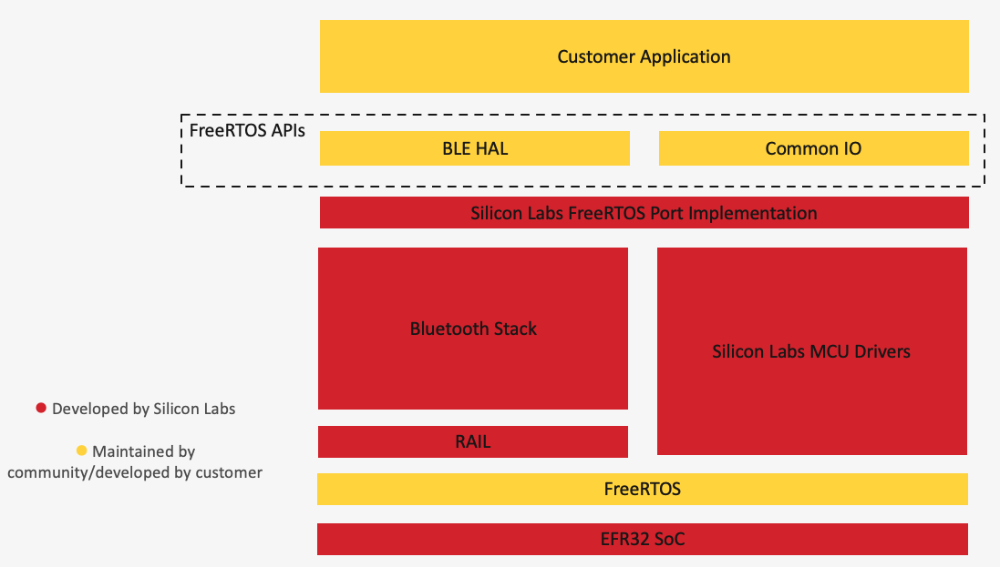

# FreeRTOS Architecture

FreeRTOS is an open-source software project started by started by Richard Barry, now backed by Amazon, which provides a snapshot of the FreeRTOS Real-Time Operating System Project along with a standardized API for wireless connectivity (Bluetooth LE) and common MCU peripherals, such as SPI, UART, GPIO, Flash, and so on. Silicon Labs has ported FreeRTOS and these abstraction layers onto its Bluetooth LE and MCU SDKs and incorporated various configuration tools in Simplicity Studio for ease of use with the EFR32 series of parts.

The following is an architecture diagram of how FreeRTOS works with Silicon Labs software development kits (SDKs).

The following sections describe the various sub-components of FreeRTOS.

## FreeRTOS

Silicon Labs uses FreeRTOS version 10.4.3 across the GSDK – both for FreeRTOS support and for other apps that use FreeRTOS.

## Abstraction Layers

While there are multiple modules in FreeRTOS, the two relevant for Silicon Labs’ implementation are BLE HAL and Common IO. These are used to control the Bluetooth LE networking stack functionality and hardware peripherals, respectively, and are discussed in the following sections.

### Common IO

FreeRTOS Common IO is an abstraction layer for common MCU hardware peripherals.

**Instantiable peripheral**. Common IO modules rarely can access different instances of a peripheral using an ID. Instead, a function to retrieve the instance descriptor must be provided. Simplicity Studio generates a standard file from a template file that provides the functionality for a specific module. A configuration .h file is generated for a specific peripheral instance with the default configuration values, including the peripheral ID to use when you call the Common IO module API. Another file is generated that appends the configurations for all instances in a table. This file also provides the function to return the instance descriptor based on the device ID. The following Common IO module are instantiable:

- adc
- flash
- flash
- gpio
- i2c
- pwm
- rtc
- spi
- timer
- uart
- Watchdog

>**Note**: Simplicity Studio can suggest instances for your evaluation board and will provide a functional default pin configuration, but you may want to change the peripheral ID to a value more appropriate for your use case or application.

**Non-instantiable peripheral**. These may only require a configuration file. The following modules are not instantiable:

- power
- reset
- temp sensor
- efuse

### BLE HAL

The GSDK implements the BLE HAL API as a translation layer on top of the Bluetooth Stack. The translation layer uses the Bluetooth Stack API to implement the functions of the BLE HAL API and maps events from the Bluetooth Stack to the corresponding callbacks in the BLE HAL API.

The Bluetooth Stack has its own configuration that must be set based on the requirements of the application on top of the BLE HAL API. For example, the configuration must enable enough advertisers and connections to match the application’s needs.

When the BLE HAL is used, the GATT database is defined programmatically by the application. The application makes calls to the BLE HAL API to create the GATT database services, descriptors, and characteristics. The project must include the dynamic GATT database feature. This is included by default in all FreeRTOS sample applications but can also be configured in the **Dynamic GATT database** component. The GATT Configurator does not need to be used.
