# FreeRTOS Bluetooth LE Sample Apps

GSDK 4.1.2 includes FreeRTOS Bluetooth LE example applications:

- **Amazon AWS – SoC MQTT over Bluetooth Low Energy** demonstrates how to use the MQTT over the Bluetooth LE service.
- **Amazon AWS – SoC Bluetooth GATT Server** demonstrates how to use the FreeRTOS Bluetooth LE middleware APIs to create a simple GATT server.

The architecture of the system includes the embedded application, a smartphone, and the AWS services in the cloud. Both examples use a smartphone to ensure a communication channel with the cloud and serial communication (via Virtual COM port) to interact with the embedded application.

## Prerequisites

To run an example system, the following items are needed:

- One of the following kits:
- Bluetooth Starter Kit for EFR32BG21 ([https://www.silabs.com/development-tools/wireless/efr32xg21-bluetooth-starter-kit](https://www.silabs.com/development-tools/wireless/efr32xg21-bluetooth-starter-kit?tab=overview)) running Secure Engine running firmware version 1.2.13 or later
- Development kit for EFR32BG24 ([https://www.silabs.com/development-tools/wireless/efr32xg24-pro-kit-10-dbm?tab=overview](https://www.silabs.com/development-tools/wireless/efr32xg24-pro-kit-10-dbm?tab=overview)), running Secure Engine with firmware version 2.2.0 or later
- Smartphone with Android or iOS
- A computer running Windows, MacOS, or Linux with:

  - Simplicity Studio 5 installed (installers are available on [https://www.silabs.com/developer-tools/simplicity-software-development-kit?tab=downloads](https://www.silabs.com/developer-tools/simplicity-software-development-kit?tab=downloads))

  - GSDK 4.1.2 or later with the Bluetooth SDK installed through Simplicity Studio

## Set Up the Silicon Labs Device and Software

1. Connect the starter kit mainboard, with radio board mounted, to your PC using the provided USB cable.

2. For best performance in Simplicity Studio, be sure that the power switch is in the Advanced Energy Monitoring or “AEM” position as shown in the following figure.

   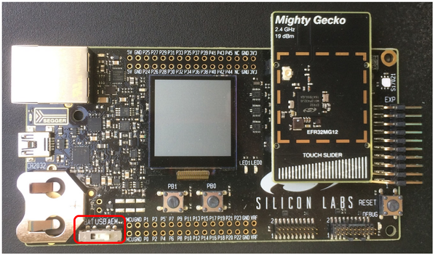

3. With your development kit connected, Install Simplicity Studio and the GSDK following the instructions in the **Getting Started** section of the [Simplicity Studio 5 User’s Guide](https://docs.silabs.com/simplicity-studio-5-users-guide/latest/ss-5-users-guide-getting-started/install-ss-5-and-software).

4. Once installation is complete, the development kit parts are displayed in the Simplicity Studio Debug Adapters view. Click the device to select it.

5. The General Information card on the Launcher Overview tab shows the device firmware and secure firmware versions, and whether updates are available. Silicon Labs recommends installing the latest version of both. For more information, see the About the Launcher \> Welcome and Device Tabs section in the [Simplicity Studio 5 User’s Guide](https://docs.silabs.com/simplicity-studio-5-users-guide/latest/ss-5-users-guide-about-the-launcher/welcome-and-device-tabs).

   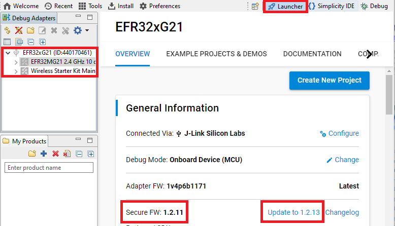

## Prepare the Cloud

Follow the instructions for setting up the cloud found on the Amazon Bluetooth LE demos site below.

[https://docs.aws.amazon.com/freertos/latest/userguide/ble-demo.html](https://docs.aws.amazon.com/freertos/latest/userguide/ble-demo.html)

These instructions cover:

- Amazon “Thing” Setup
- Cognito Setup
- IAM Policies
- AWS IoT Policy

### Amazon “Thing” Setup

Create an Amazon account ([https://aws.amazon.com/premiumsupport/knowledge-center/create-and-activate-aws-account/](https://aws.amazon.com/premiumsupport/knowledge-center/create-and-activate-aws-account/)) or log in with your existing one here: [https://aws.amazon.com/](https://aws.amazon.com/).

Open the [AWS IoT Console](https://console.aws.amazon.com/iot/home)  and create your Thing that is used to represent the device in the cloud (see the section **To Set up AWS IoT** at [https://docs.aws.amazon.com/freertos/latest/userguide/ble-demo.html](https://docs.aws.amazon.com/freertos/latest/userguide/ble-demo.html)). Make a note of the name of the Thing.

For Bluetooth LE examples using Cognito, the thing should be created without a certificate.

Do not forget to go to **AWS IoT Console \> Settings menu \> Device data endpoint** and make a note of the device data endpoint and the AWS region that is the part of the endpoint. This endpoint describes the target of the MQTT connection in the cloud.

### Cognito Setup

Cognito is required to use your mobile phone as a secure gateway to the cloud for the Bluetooth LE-enabled devices. You must create a User and an Identity pool to enable the application to connect to the cloud and manage devices.

Follow the steps in the section **To create an Amazon Cognito user pool.** Do not forget to make a note of the:

- User pool ID
- App client ID and app client secret (when creating Cognito User pool)
- Cognito Username and password
- Identity pool ID
- IAM roles for authenticated and unauthenticated identities to access Amazon Cognito

### IAM Policies

Open the IAM console and follow the instructions in the section **To create and attach an IAM policy to the authenticated identity**.

### AWS IoT Policy

Follow the instructions in the section **FreeRTOS Bluetooth Low Energy Mobile SDK demo application** for either Android or iOS SDK AWS IoT policy creation. This policy is different from the IAM policies above.

### Summary of Notes

Check your notes to verify that the following information is available:

<table>
<thead>
<tr>
<th>Note</th>
<th>Collected in</th>
<th>Used in</th>
<th>Example</th>
</tr>
</thead>
<tbody>
<tr>
<td>Thing name</td>
<td>Thing creation</td>
<td>Embedded application</td>
<td>MyThing</td>
</tr>
<tr>
<td>AWS IoT REST Endpoint</td>
<td>Thing creation</td>
<td>Embedded application</td>
<td>&lt;ALPHANUMERIC_STRING&gt;-ats.iot.us-east-2.amazonaws.com</td>
</tr>
<tr>
<td>AWS Region</td>
<td>Thing creation</td>
<td>Mobile application</td>
<td>us-east-2</td>
</tr>
<tr>
<td>User pool ID</td>
<td>Cognito User pool creation</td>
<td>
  <p>Cognito Identity pool creation</p>
  <p>Mobile Application</p>
</td>
<td>us-east-2_&lt;ALPHANUMERIC_STRING&gt;</td>
</tr>
<tr>
<td>App client ID</td>
<td>Cognito User pool creation</td>
<td>
  <p>Cognito Identity pool creation</p>
  <p>Mobile application</p>
</td>
<td>&lt;ALPHANUMERIC_STRING&gt;</td>
</tr>
<tr>
<td>Cognito Username</td>
<td>Cognito User pool creation</td>
<td>Mobile application (runtime login)</td>
<td>demouser</td>
</tr>
<tr>
<td>Cognito Password</td>
<td>Cognito User pool creation</td>
<td>Mobile application (runtime login)</td>
<td>PASSWORD</td>
</tr>
<tr>
<td>App client secret</td>
<td>Cognito User pool creation</td>
<td>Mobile application</td>
<td>&lt;ALPHANUMERIC_STRING&gt;</td>
</tr>
<tr>
<td>Identity pool ID</td>
<td>Cognito Identity pool creation</td>
<td>Mobile application</td>
<td>us-east-2: &lt;ALPHANUMERIC_STRING&gt;</td>
</tr>
<tr>
<td>IAM roles</td>
<td>Cognito Identity pool creation</td>
<td>IAM Policy setup</td>
<td>
  <p>Cognito_DemoUnauth_Role</p>
  <p>Cognito_DemoAuth_Role</p>
</td>
</tr>
</tbody>
</table>

## Create the Mobile Application

Android and iOS operating systems are supported by the mobile SDK from Amazon. The application can be found on GitHub at Android SDK for FreeRTOS Bluetooth Devices under amazon-freertos-ble-android-sdk/app and the iOS SDK for FreeRTOS Bluetooth Devices under amazon-freertos-ble-ios-sdk/Example/AmazonFreeRTOSDemo.

[https://github.com/aws/amazon-freertos-ble-android-sdk](https://github.com/aws/amazon-freertos-ble-android-sdk)

[https://github.com/aws/amazon-freertos-ble-ios-sdk](https://github.com/aws/amazon-freertos-ble-ios-sdk)

Follow the Bluetooth LE demo site instructions to install the IDE for the selected OS and to download the SDK.

- To import the application, select the **root** folder for the unpacked application.
- Use your notes above to complete the configuration settings according to your account and cloud settings.

Using the IDE and the SDK, you can build the application and run it on your phone.

## Create the Embedded Application

If you are not familiar with developing applications in Simplicity Studio 5, you can find more background in both the [Simplicity Studio 5 User's Guide](https://docs.silabs.com/simplicity-studio-5-users-guide/latest/ss-5-users-guide-overview/) and the [Bluetooth SDK Getting Started Guide](https://docs.silabs.com/bluetooth/latest/bluetooth-getting-started-overview/).

### Create the Project

To create the embedded application project, you should have connected the starter kit mainboard to your PC, installed Simplicity Studio and the GSDK, and updated device firmware, as described in section [Set Up the Silicon Labs Device and Software](#set-up-the-silicon-labs-device-and-software). Make sure that the target device is selected in the Debug Adapters view.

Select **File \> New... \> Silicon Labs Project Wizard...** On the first page verify that your connected part is selected. If not, select it (for example, BRD4181A) and click **NEXT**.

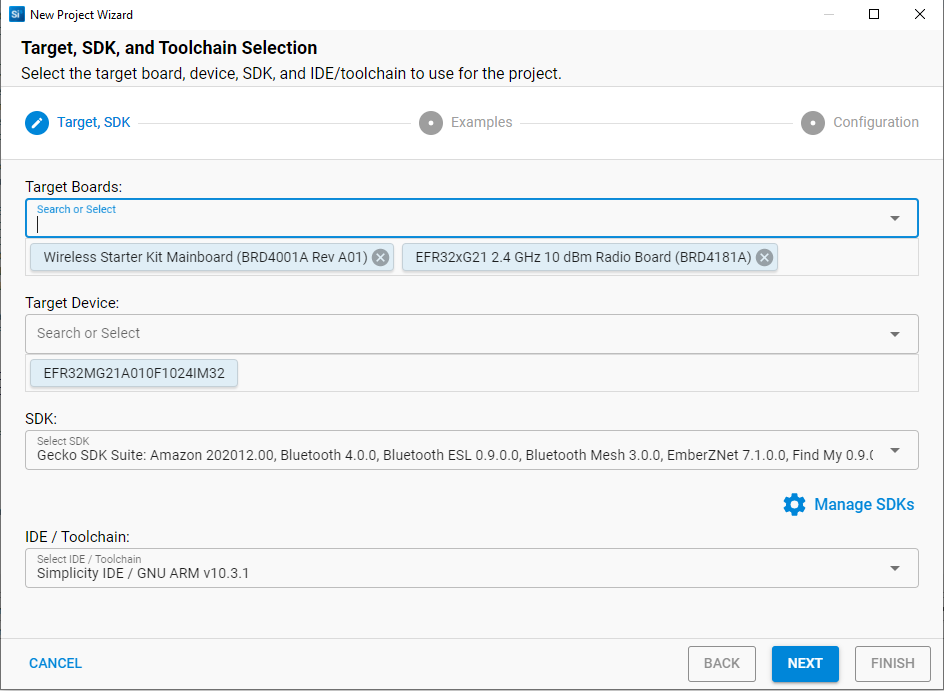

On the next page, under **Technology Type**, select **Amazon** to filter examples. Select the **Amazon AWS - SoC MQTT over Bluetooth Low Energy** example and click **NEXT**.

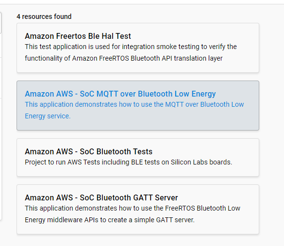

On the last page, optionally edit the project name and location. The linkage type of the SDK and the project sources can also be changed here. Click **FINISH** to open the Simplicity IDE. The project is created to the given location as shown in the Project Explorer view.

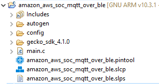

### Configure the Project

To configure the application, in the Project Explorer view find and open aws_clientcredential.h. The file can be found in \<project_dir\>/config/:

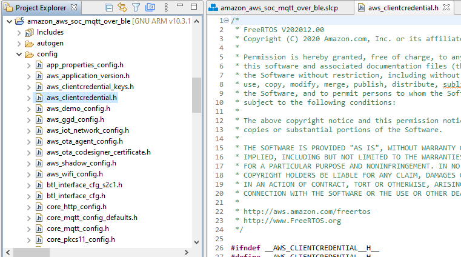

Edit the macros:

- Copy and paste the Thing name to clientcredentialIOT_THING_NAME
- Copy and paste the AWS IoT REST Endpoint to clientcredentialMQTT_BROKER_ENDPOINT

Example:

```C
#define clientcredentialMQTT_BROKER_ENDPOINT " <ALPHANUMERIC_STRING>-ats.iot.us-east-2.amazonaws.com"

#define clientcredentialIOT_THING_NAME "MyThing"
```

### Build and Flash the Application

To build the example application, click the build (hammer) icon on the toolbar. This creates a file \<project name\>.s37, which you can then flash to the device.

Note that, in order for this application to run, your device will also need a bootloader. An easy way to load a bootloader is to load any of the precompiled demo images, which come with the bootloader configured as part of the image. When you flash your application it overwrites the demo application, but the bootloader remains. For more information and detailed instructions, see [Using the Gecko Bootloader with Silicon Labs Bluetooth Applications](/bluetooth/{build-docspace-version}/using-gecko-bootloader-with-bluetooth-apps).

With the target board connected to Simplicity Studio over direct USB connection or ethernet, you can then flash the binary you just built to the device by right-clicking the .s37 file, clicking “Flash to Device…”, and then selecting your device.

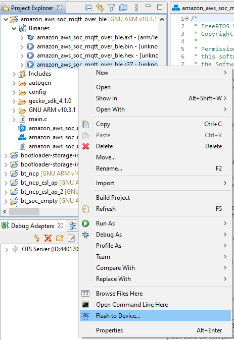

## Using the Demo

Open a serial console with the device, by right-clicking the device in the Debug Adapters view and selecting **Launch Console**. In the console interface, select the “Serial 1” tab.

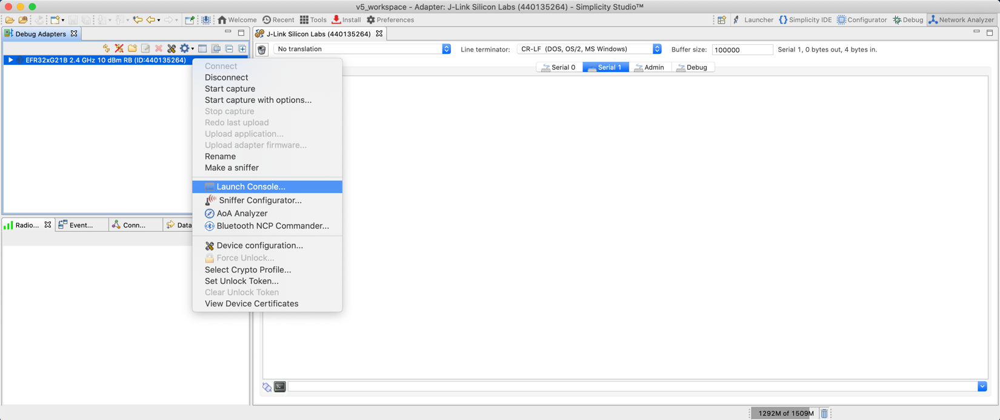

If you press the “reset” button on your board, the program will begin executing from the beginning. You should see the demo application start up with a “STARTING DEMO” message. Every few seconds, the device should print out a period (“.”) to show it is still running.

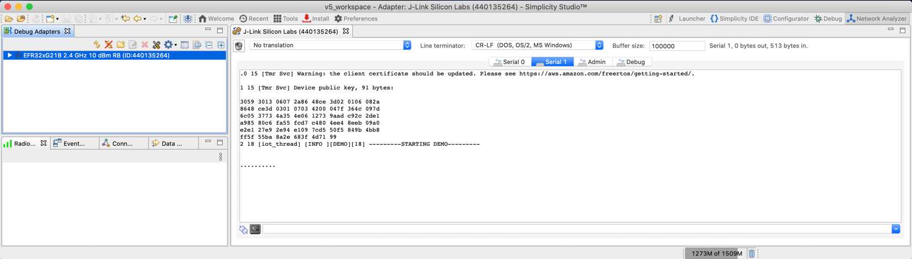

Log in to the AWS IoT Console and select the Test option to view the MQTT Test client.

On the Subscribe panel subscribe to the following topics:

- thing-name/example/topic1
- thing-name/example/topic2

Open the mobile application and log in with your Cognito username and password.

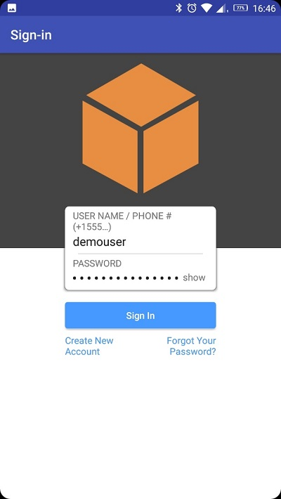

After logging in, tap the SCAN FOR BLE DEVICES control and find the board in the list. Slide the toggle and wait for the pairing request with the Numeric Comparison method on both devices (mobile, embedded).

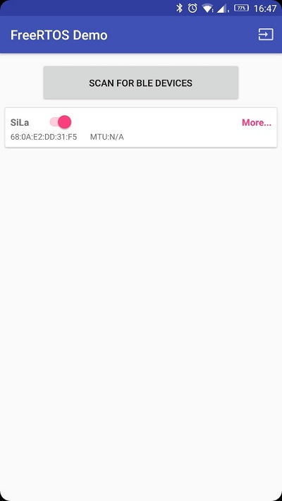

If the numbers are equal on both sides, accept the requests. On the embedded side, it can be done by sending an ‘y’ character.

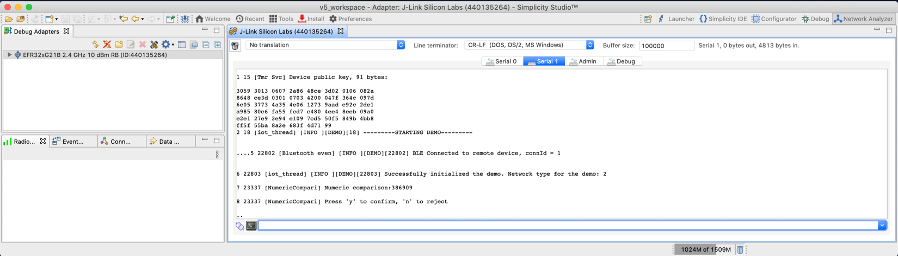

After the pairing is finished and the subscription is complete, the embedded application starts to publish to the topics and this can be seen on the MQTT Test Client site.
