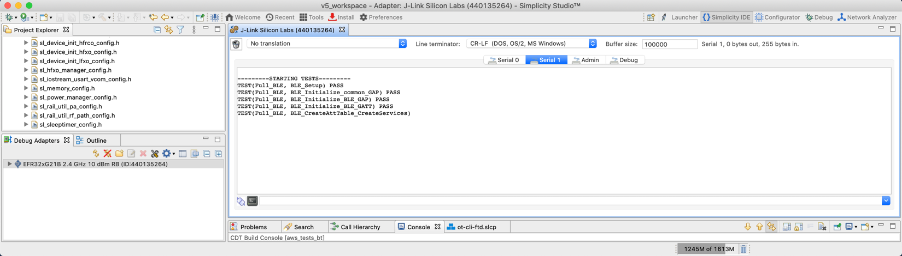

# FreeRTOS AWS Test Sample for Bluetooth LE

The **Amazon AWS - Peripheral Tests** example application demonstrates that the MCU peripheral components are working as expected on your design.

The **Amazon AWS – SoC Bluetooth Tests** application can be used with the **AWS IoT Device Tester (IDT) for FreeRTOS** to verify that the operating system and the libraries are working locally on your device and can communicate with the AWS IoT Cloud. It verifies the porting layers, interfaces and board device drivers and the libraries on the top of them to ensure connectivity.

The IDT generates test reports that can be used to participate in the AWS Device Qualification Program.

The test environment for Bluetooth LE consists of:

- A PC running the IDT application
- A Raspberry Pi running the testing software image
- The device/board under test running the **Amazon AWS – SoC Bluetooth Tests** example

The IDT testing workflow is illustrated in the following figure. In summary, the workflow starts with generating an MCU project to serve as the embedded application. Simplicity Studio or SLC-CLI can be used to generate the **Amazon AWS – SoC Bluetooth Tests** project.

When the command line IDT tester application starts, it connects to the Raspberry Pi tester device. It then verifies the project source code and modifies it by adding a generated UUID to make sure that the current setup is running on the MCU. Therefore, IDT testing requires user-defined scripts that IDT can call to build the generated MCU project and flash the firmware onto the Device Under Test.

After the flashing step, the IDT tester application starts the Bluetooth tests by reading the output of the Device Under Test coming over USART over USB VCOM and by instructing the Raspberry Pi tester device over LAN. Note that the latter function uses scripts that were previously generated (copied) into the project by SLC-CLI or Simplicity Studio.


The following sections provide detailed instructions for these steps.

## Prerequisites

The following is needed to run Bluetooth LE tests:

- Development kit for EFR32xG21 (for example, BRD4181A) and a Wireless Starter Kit (WSTK)
- A Raspberry Pi 4B or 3B+ with power supply
- Wireless LAN or LAN Router and an ethernet cable
- A micro-SD card and SD card adapter for the Raspberry Pi software
- A PC with

  - Simplicity Studio 5 (installers are available on [https://www.silabs.com/developer-tools/simplicity-software-development-kit?tab=downloads](https://www.silabs.com/developer-tools/simplicity-software-development-kit?tab=downloads)) and/or SLC-CLI (for Linux and Mac)

  - GSDK 4.1.2 or later

  - Simplicity Commander (if using SLC-CLI for project generation)

Preferred tools for project generation, building and flashing for different Operating Systems are shown in the following table.

|  | Windows | Linux | MacOS |
|--|---------|-------|-------|
| Project Generation | Simplicity Studio | Simplicity Studio or SLC-CLI | Simplicity Studio or SLC-CLI |
| Project Type | Simplicity Studio project | Makefile project | Makefile project |
| Build tool | Simplicity Studio headless build | make | make |
| Flash Tool | Simplicity Commander | Simplicity Commander | Simplicity Commander |

## Creating the Embedded Application

The application can be created using SLC-CLI or Simplicity Studio.

To create the project using Simplicity Studio, follow the procedures in section [Create the Embedded Application](./02-freertos-ble-sample-apps#create-the-embedded-application) to create the embedded application. Use the **Amazon AWS – SoC Bluetooth Tests** example. During project creation, it is important to select **Copy Contents** in the Configuration step since IDT will modify project sources.

To create a project using SLC-CLI, see the [SLC-CLI User Guide](https://docs.silabs.com/simplicity-studio-5-users-guide/latest/ss-5-users-guide-tools-slc-cli/). An example of the project generation call is:

```C
slc generate -p="app/amazon/example/amazon_aws_tests/amazon_aws_soc_bt_tests.slcp" -o="makefile" gcc -cp
-d="/path-to-workspace/amazon_aws_soc_bt_tests" --with="brd4181a"
```

The example has been configured to run Full Bluetooth LE tests, which can be verified in the *config/aws\_test\_runner\_config.h* config file located in the project folder.


## Verify the Embedded Application

To verify the generated project before running IDT, build and flash the firmware to your device and open a serial terminal. Building can be done using Simplicity Studio or make, depending on the project type. Flashing can be done using Simplicity Commander. More information about Simplicity commander can be found in the [Simplicity Commander Reference Guide](https://docs.silabs.com/simplicity-commander/latest/simplicity-commander-start/).

Verify that the application starts the tests after 5 seconds.



Disconnect the serial monitor by closing the port to let IDT run. Make sure to close Simplicity Studio before running IDT testing.

## Prepare the Raspberry Pi

Follow the instructions for setting up the Raspberry Pi found on the following Amazon site.

[https://docs.aws.amazon.com/freertos/latest/userguide/afr-bridgekeeper-dt-bt.html](https://docs.aws.amazon.com/freertos/latest/userguide/afr-bridgekeeper-dt-bt.html)

During the installation, make a note of the login settings for the Raspberry Pi:

- IP address
- Username
- Password or the private key file for the Public Key authentication

These are needed during the following steps for the IDT setup.

## Prepare the IDT

Download the software package containing IDT v4.0.3 and test suite version 1.5.1 for FreeRTOS 202012.00 (uses FreeRTOS 202012.00 LTS libraries) from here:

[https://docs.aws.amazon.com/freertos/latest/userguide/dev-test-versions-afr.html](https://docs.aws.amazon.com/freertos/latest/userguide/dev-test-versions-afr.html)

Follow the instructions here:

[https://docs.aws.amazon.com/freertos/latest/userguide/qual-steps.html](https://docs.aws.amazon.com/freertos/latest/userguide/qual-steps.html)

Besides the steps above, this provides additional information and examples for the configuration.

An example for device.json file follows. Modify the **serialPort** to correspond to your system.

```C
[

  {

    "id": "ble-test-raspberry-pi",

    "sku": "brd4181b",

    "features": [

      {

        "name": "BLE",

        "value": "Yes"

      },

      {

        "name": "Cellular",

        "value": "No"

      },

      {

        "name": "WIFI",

        "value": "No"

      },

      {

        "name": "OTA",

        "value": "No"

      },

      {

        "name": "TCP/IP",

        "value": "No"

      },

      {

        "name": "TLS",

        "value": "No"

      },

      {

        "name": "PKCS11",

        "value": "ecc"

      },

      {

        "name": "KeyProvisioning",

        "value": "Onboard"

      }

    ],

    "devices": [

      {

        "id": "brd4181b",

        "connectivity": {

          "protocol": "uart",

          "serialPort": "COM4"

        }

      }

    ]

  }

]
```

An example for the userdata.json file follows. Change the “/absolute-path-to/” to the locations on your system.

```C
{

  "sourcePath": "/absolute-path-to/amazon_aws_soc_bt_tests/gecko_sdk_4.1.0/util/third_party/aws_iot_libs",

  "vendorPath": "/absolute-path-to/amazon_aws_soc_bt_tests",

  "buildTool": {

    "name": "build_script",

    "version": "4.1",

    "command": [

      "/absolute-path-to/buildTool"

    ]

  },

  "flashTool": {

    "name": "flash_script",

    "version": "4.1",

    "command": [

      "/absolute-path-to/flashTool"

    ],

    "buildImageInfo": {

      "testsImageName": "tests.img",

      "demosImageName": "demos.img"

    }

  }

}
```

The sourcePath is an absolute path pointing to the FreeRTOS libraries in the generated **Amazon AWS – SoC Bluetooth Tests** project. Project name and SDK folder inside the project may vary. The default project name is **amazon\_aws\_soc\_bt\_tests**.

The vendorPath is the location of the generated **Amazon AWS – SoC Bluetooth Tests** project.

The buildTool and flashTool are user-defined scripts that can be used by IDT to build and flash the previously generated and modified project.

The scripts can be batch files for Windows (build.bat, flash.bat) and shell scripts for Linux/MacOS (build.sh, flash.sh).

The buildTool can call either Simplicity Studio headless build (on Windows) or make (on Linux/MacOS). The flashTool can call Simplicity Commander with command line options. More information about Simplicity commander can be found in the [Simplicity Commander Reference Guide](https://docs.silabs.com/simplicity-commander/latest/simplicity-commander-start/).

## Templates for Build and Flash Tools

Example of the buildTool (build.bat) for Windows:

```C
@echo off

echo Building project...

set STUDIO_PATH="<path_to_simplicity_studio>"

set PROJECT_NAME="<project_name>"

start /B /wait %STUDIO_PATH:"=%\studio.exe -nosplash -application org.eclipse.cdt.managedbuilder.core.headlessbuild -printErrorMarkers -no-indexer -cleanBuild %PROJECT_NAME%

exit 0
```

Example of the flashTool script (flash.bat) script for Windows:

```C
@echo off

echo Flashing project...

set STUDIO_PATH="<path_to_simplicity_studio>"

set PROJECT_BINARY="<path_to_firmware_binary>"

start /B /wait %STUDIO_PATH:"=%\developer\adapter_packs\commander\commander.exe flash %PROJECT_BINARY% --address 0x0

start /B /wait %STUDIO_PATH:"=%\developer\adapter_packs\commander\commander.exe device reset
```

Example of the buildTool (build.sh) for Linux / MacOS:

```C
#!/bin/bash

echo Building project…

export ARM_GCC_DIR=<path_to_arm_gcc_folder>

make -C <path_to_project_directory> -f <project_name>.Makefile
```

Example of the flashTool (flash.sh) for Linux / MacOS:

```C
#!/bin/bash

echo Flashing project...

COMMANDER_PATH="<path_to_simplicity_commander>"

PROJECT_BINARY="<path_to_firmware_binary>"

$COMMANDER_PATH flash $PROJECT_BINARY --address 0x0

$COMMANDER_PATH device reset
```

## Run IDT Testing for Bluetooth LE

To run the IDT test, first power up and log in to the Raspberry PI, which was configured in [Prepare the Raspberry Pi](#prepare-the-raspberry-pi). After login, connect to your Wi-Fi network (example: ifup wlan0).

On Windows, make sure that Simplicity Studio is closed before running IDT tester tool.

In the directory where the IDT tester tool is downloaded, go to the bin folder, and open a command line.

Start the test with the following command (modified as appropriate):

```C
devicetester_[linux|mac|win]_x86-64 run-suite --group-id FullBLE --userdata userdata.json
```

The tests can take up to 7-10 minutes. The results are printed continuously to the “results/**\<latest-test-results-id\>**/logs/FullBLE__Full_BLE.txt” file.
