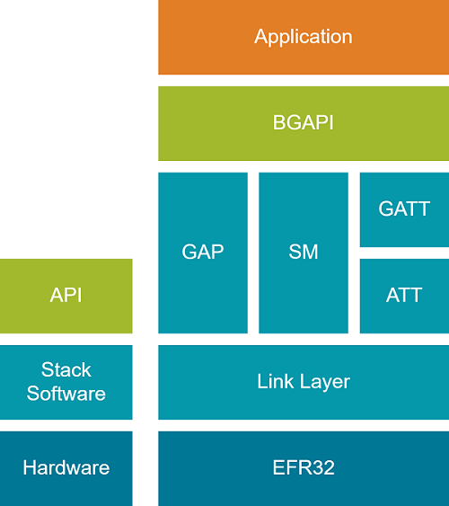
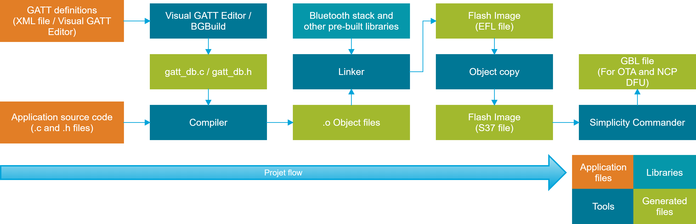

# Application Development Flow

The following figure describes the high-level firmware structure. The developer creates an application on top of the stack, which Silicon Labs provides as a precompiled object-file, enabling the Bluetooth connectivity for the end-device.

The Bluetooth stack contains following blocks.

- **Bootloader**: The Gecko Bootloader is not part of the stack but is provided with the Bluetooth SDK. See *UG266: Silicon Labs Gecko Bootloader User’s Guide for GSDK 3.2 and Lower*, [Silicon Labs Gecko Bootloader User's Guide for GSDK 4.0 and Higher (series 1 and 2 devices)](/bluetooth/{build-docspace-version}/bootloader-user-guide-gsdk-4), or [Silicon Labs Gecko Bootloader User’s Guide for Series 3 and Higher](/bluetooth/{build-docspace-version}/bootloader-user-guide-series3-and-higher), and [Using the Gecko Bootloader with Silicon Labs Bluetooth Applications](/bluetooth/{build-docspace-version}/using-gecko-bootloader-with-bluetooth-apps). For information on bootloading in general, see [Bootloader Fundamentals](/bluetooth/{build-docspace-version}/bootloader-fundamentals).

- **Bluetooth stack**: Bluetooth functionality consisting of link layer, generic access profile, security manager, attribute protocol, and generic attribute profile.

- **Bluetooth AppLoader**: An application that starts after the bootloader. It checks if the user application is valid and, if it is, AppLoader starts the application. If the application image is not valid, AppLoader starts the OTA process to try to receive a valid application image. This requires using the Gecko Bootloader.

## Application Build Flow

Building a project starts by defining the Bluetooth services and characteristics (GATT definitions) and by writing the application source code from Silicon Labs-provided examples or an empty project template, as described in the [Bluetooth Getting Started Guide](https://docs.silabs.com/bluetooth/latest/bluetooth-getting-started-overview/).

There are two ways to define Bluetooth services and characteristics. The first option is the Visual GATT Editor GUI in Simplicity Studio. This is a graphical tool for designing the GATT and for generating *gatt_db.c* and *gatt_db.h*. Additionally, it can import *.xml* GATT definition files. The Visual GATT Editor is the default tool for GATT definition and generation in Simplicity Studio projects.

The second option is to create an .*xml* according to the [Blue Gecko Bluetooth Profile Toolkit Developer's Guide](/bluetooth/{build-docspace-version}/bluetooth-profile-toolkit-developers-guide) and then use the BGBuild tool as a pre-compilation step to convert the GATT definition file into .c and .h. This method is used in IAR Embedded Workbench projects.

Compiling the project generates an object file, which is then linked with the pre-compiled libraries provided in the SDK. The output of the linking is a flash image that can be programmed to the supported Wireless Gecko devices.
