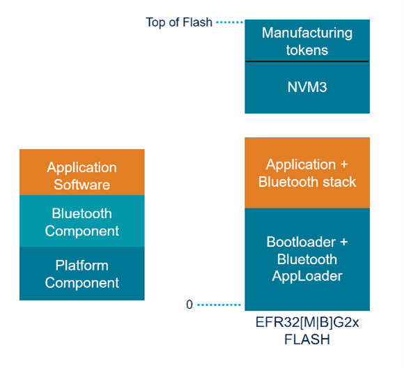

# Wireless Gecko Resources

The Bluetooth stack uses some of the Wireless Gecko’s resources, which are not available to the application. The following table lists the resources and describes their use by the stack. The first four resources (in red) are always used by the Bluetooth stack.

<table>
    <colgroup>
        <col width="10%"/>
        <col width="20%"/>
        <col width="25%"/>
        <col width="45%"/>
    </colgroup>
<thead>
<tr>
    <th>Category</th>
    <th>Resource</th>
    <th>Used in software</th>
    <th>Notes</th>
</tr>
</thead>
<tbody>
<tr>
<td>PRS</td>
<td>
    
<mark>PRS7</mark>

</td>
<td>PROTIMER RTC synchronization</td>
<td>PRS7 always used by the Bluetooth stack.</td>
</tr>
<tr>
<td rowspan="2">Timers</td>
<td>
    
<mark>RTCC</mark>

</td>
<td>EM2 timings</td>
<td>
    
The sleep timer uses RTCC in the default configuration.

    
In EFR32[M|B]G22, RTCC can be used by applications if the sleep timer is configured to use another resource. See <a href="https://docs.silabs.com/mcu/latest/efr32mg13/group-SLEEPTIMER" target="_blank">platform sleeptimer documentation</a>.

</td>
</tr>
<tr>
<td>
    
<mark>PROTIMER</mark>

</td>
<td>Bluetooth</td>
<td>The application does not have access to PROTIMER.</td>
</tr>
<tr>
<td>Radio</td>
<td>
    
<mark>RADIO</mark>

</td>
<td>Bluetooth</td>
<td>Always used and all radio registers are reserved for the Bluetooth stack.</td>
</tr>
<tr">
<td rowspan="5">GPIO</td>
<td>NCP</td>
<td>Host communication</td>
<td>
    
2 to 6 x I/O pins can be allocated for the NCP usage depending on used features (UART, RTS/CTS, wake-up and host wake-up).

    
Optional to use, and valid only for NCP use case.

</td>
</tr>
<tr>
<td>PTI</td>
<td>Packet trace</td>
<td>
    
2 to N x I/O pins.

    
Optional to use.

</td>
</tr>
<tr>
<td>TX enable</td>
<td>TX activity indication</td>
<td>
    
1 x I/O pin.

    
Optional to use.

</td>
</tr>
<tr>
<td>RX enable</td>
<td>RX activity indication</td>
<td>
    
1 x I/O pin.

    
Optional to use.

</td>
</tr>
<tr>
<td>COEX</td>
<td>Wi-Fi coexistence</td>
<td>
    
4 x I/O pin.

    
Optional to use.

</td>
</tr>
<tr>
<td>CRC</td>
<td>GPCRC</td>
<td>NVM3/PS Store</td>
<td>Can be used in application, but application should always reconfigure GPCRC before use, and GPCRC clock must not be disabled in CMU.</td>
</tr>
<tr>
<td>Flash</td>
<td>MSC</td>
<td>NVM3/PS Store</td>
<td>Can be used by the application.</td>
</tr>
<tr>
<td rowspan="2">CRYPTO</td>
<td>CRYPTO/Secure Element (SE)</td>
<td>Bluetooth link encryption</td>
<td>The CRYPTO/SE peripheral can only be accessed through the mbedTLS crypto library, not through any other means. The library should be able to do the scheduling between the stack and application access.</td>
</tr>
<tr>
<td>RADIOAES</td>
<td>Bluetooth link encryption</td>
<td>The application does not have access to RADIOAES</td>
</tr>
</tbody>
</table>

## Flash

The application and Bluetooth stack are executed from the flash memory. The flash can be split into blocks for the bootloader and the Bluetooth AppLoader, application + Bluetooth stack, and non-volatile memory, as shown in the following figure.

- The bootloader is essential to enable Bluetooth stack and application upgradeability. The bootloader has been designed to be future-proof for bootloader improvements and feature additions.

- The Bluetooth AppLoader provides OTA upgradability for the application. This is an optional feature, but using it requires that the bootloader is also used and it is implemented as bootloader communication plugin.

- NVM3 is a non-volatile data store (NVM), where both the Bluetooth stack and the application can store permanent data, such as Bluetooth bonding keys, application configuration data, hardware configurations, and so on. The NVM3 can be removed from the application if `bluetooth_feature_sm` is not included or if `bluetooth_feature_external_bonding_database` is included. See [Bluetooth Bonding Database](#bluetooth-bonding-database) for details.

- The application is located between the bootloader and NVM. The Bluetooth stack is a library that is linked with the application. The Bluetooth stack includes the actual Bluetooth firmware, including link layer, GAP, SM, ATT, and GATT layers.

- Manufacturing tokens storage is used for storing manufacturing tokens. It is located at end of main flash.

The following table shows the flash usage for each block. The estimates can vary between use cases, configurations, application resources, or SDK version.

<table>
    <colgroup>
        <col width="20%"/>
        <col width="auto"/>
        <col width="auto"/>
        <col width="auto"/>
        <col width="auto"/>
        <col width="auto"/>
        <col width="auto"/>
        <col width="auto"/>
        <col width="auto"/>
    </colgroup>
<thead>
<tr>
<th></th>
<th scope="col" class="vertical-text" class="cell-center">Compiler</th>
<th scope="col" class="vertical-text" class="cell-center">EFR32[M|B]G21</th>
<th scope="col" class="vertical-text" class="cell-center">EFR32[M|B]G21 with Vault</th>
<th scope="col" class="vertical-text" class="cell-center">EFR32[M|B]G22</th>
<th scope="col" class="vertical-text" class="cell-center">EFR32[M|B]G24</th>
<th scope="col" class="vertical-text" class="cell-center">EFR32[M|B]G26</th>
<th scope="col" class="vertical-text" class="cell-center">EFR32[M|B]G27</th>
<th scope="col" class="vertical-text" class="cell-center">EFR32[M|B]G29</th>
</tr>
</thead>
<tbody>
<tr>
<td>Bootloader (1)</td>
<td class="cell-center">--</td>
<td class="cell-center">16+56</td>
<td class="cell-center">16+56</td>
<td class="cell-center">24+48</td>
<td class="cell-center">24+48</td>
<td class="cell-center">24+48</td>
<td class="cell-center">24+48</td>
<td class="cell-center">24+48</td>
</tr>
<tr>
<td rowspan="2">soc-empty (2)</td>
<td class="cell-center">GCC</td>
<td class="cell-center">176</td>
<td class="cell-center">179</td>
<td class="cell-center">185</td>
<td class="cell-center">196</td>
<td class="cell-center">196</td>
<td class="cell-center">186</td>
<td class="cell-center">188</td>
</tr>
<tr>
<td class="cell-center">IAR</td>
<td class="cell-center">173</td>
<td class="cell-center">176</td>
<td class="cell-center">181</td>
<td class="cell-center">192</td>
<td class="cell-center">192</td>
<td class="cell-center">182</td>
<td class="cell-center">183</td>
</tr>
<tr>
<td>NVM3 (3)</td>
<td class="cell-center">--</td>
<td class="cell-center">40</td>
<td class="cell-center">40</td>
<td class="cell-center">40</td>
<td class="cell-center">40</td>
<td class="cell-center">40</td>
<td class="cell-center">40</td>
<td class="cell-center">40</td>
</tr>
<tr>
<td>Manufacturing tokens</td>
<td class="cell-center">--</td>
<td class="cell-center">8</td>
<td class="cell-center">8</td>
<td class="cell-center">8</td>
<td class="cell-center">8</td>
<td class="cell-center">8</td>
<td class="cell-center">8</td>
<td class="cell-center">8</td>
</tr>
</tbody>
</table>

**Notes**:

(1) The bootloader size includes the AppLoader communication plugin. The size in the table is the size reserved for Bootloader and AppLoader by default. The actual size can be smaller.

(2) *bt-soc-empty* is an example application provided in the Bluetooth SDK. It is compiled with high size optimizations. GCC uses the `-Os` flag, and IAR the `-Ohz` flag.

(3) NVM3 requires a minimum of 3 flash pages; the default configuration in the Bluetooth sample applications is 5 pages in the SDK. Refer to [Using Third Generation Non-Volatile Memory (NVM3) Data Storage](/bluetooth/{build-docspace-version}/using-third-generation-nonvolatile-memory) for further information about NVM3.

### Optimizing Flash Usage

**Dead Code Elimination**

 Bluetooth stack libraries are designed to benefit from the linker's dead code elimination optimization. With this optimization all unused code will be removed from application. Selected host stack GCC libraries have enabled LTO support with compiling options -flto and -ffat-lto-objects.This will help the linker to optimize unused code from the application.

To fully utilize this optimization feature, it is important not to call any function that is not needed for application. These include all initialization functions for the Bluetooth stack.

**Selective Initialization of Bluetooth Stack Components**

Each required stack component must be individually initialized. For more information, see [Bluetooth Stack Configuration](./04-configuring-bluetooth-stack-and-wireless-gecko-device#bluetooth-stack-configuration).

### Bluetooth Bonding Database

Bluetooth bonding database is stored in NVM. NVM3 size must be set so that the required number of bondings can fit to it. The follow- ing table shows how much NVM3 space each bonding will require at maximum in bytes including NVM3 overheads. The bonding database uses PSA ITS (internal trusted store) for storing the keys.

|  |EFR32[M\|B]G2x |EFR32[M\|B]G2x with Vault |
|-|-|-|
| Secure Connections Pairing |211 |299 |
| Legacy Pairing |311 |443 |

Note that during the first boot, the device tries to import keys from the old bonding database used in the SDK v3.1.1 and older into PSA ITS. If IRK (privacy key) import fails, all existing bondings are deleted, because IRK is shared with bonded devices. If importing certain bonding fails, that bonding is erased and importing will continue with the next one.

When deployed to Secure Vault High devices, sensitive keys such as the Long Term Key (LTK) are protected using the Secure Vault Key Management functionality. The table below shows the protected keys and their storage protection characteristics.

| Wrapped Key |Exportable/Non-Exportable |Notes |
|-|-|-|
| Remote Long Term Key (LTK) |Non-Exportable |-- |
| Local Long Term Key (legacy only) |Non-Exportable |-- |
| Remote Identity Resolving Key (IRK) |Exportable |Must be Exportable for future compatibility reasons |
| Local Identity Resolving Key (IRK) |Exportable |Must be Exportable because the key is shared with other devices |

Wrapped keys that are "Non-Exportable" can be used, but cannot be viewed or shared at runtime. Wrapped keys that are "Exportable" can be used or shared at runtime, but remain encrypted while stored in flash.

When the `bluetooth_feature_external_bonding_database` component is used, the application is responsible for storing the persistent bonding information. The Bluetooth stack will only store the local identity resolving key internally in this case. If `SL_BT_CONFIG_EXTERNAL_LOCAL_IRK`option in `bluetooth_feature_external_bonding_database` component has been set, the application is also responsible for storing the local identity resolving key persistently. The Bluetooth stack will request the application to send the local IRK to the Bluetooth stack when the stack is started. If `SL_BT_CONFIG_EXTERNAL_LOCAL_IRK` option is enabled it is possible to remove the NVM3 component from the application.

## Linking

The Bluetooth stack is delivered as a set of library files. The application links the Bluetooth stack libraries with the rest of application. The linker will then create an ELF-file, which contains the application code and data ready to be loaded into flash.

For generating OTA DFU files, the application's code and data must be linked into their own section in the ELF-file. This is automatically done with the linker files provided with the Gecko Platform.

The linker file reserves some memory from main flash for the bootloader. If AppLoader is included with the bootloader the space reserved for the bootloader is automatically increased when the application includes `apploader` component.

For more information on the OTA updates and how to enable them, refer to [Silicon Labs Gecko Bootloader User's Guide for GSDK 4.0 and Higher (series 1 and 2 devices)](/bluetooth/{build-docspace-version}/bootloader-user-guide-gsdk-4) or [Silicon Labs Gecko Bootloader User’s Guide for Series 3 and Higher](/bluetooth/{build-docspace-version}/bootloader-user-guide-series3-and-higher), and [Using the Gecko Bootloader with Silicon Labs Bluetooth Applications](/bluetooth/{build-docspace-version}/using-gecko-bootloader-with-bluetooth-apps).

## RAM

The Bluetooth stack reserves part of the RAM from the Wireless Gecko and leaves the unused RAM for the application.

RAM consumption of the Bluetooth functionality is divided into:

- Bluetooth stack

- Bluetooth object pools

- Bluetooth buffer memory

- Bluetooth GATT database

- C STACK

- C HEAP

The following table shows the RAM allocations that are done statically at link time.

:::custom-table{width=25%,35%,40%}
| Component |Static allocation at link time |Configurable by |
|-|-|-|
| Bluetooth stack |6 kB | -- |
| Bluetooth GATT database |Application-dependent (20 to 200 bytes) | -- |
| Call stack |2752 bytes |SL_STACK_SIZE |
:::

The following table shows the RAM allocations that are done dynamically from the heap at run time.

:::custom-table{width=25%,35%,40%}
| Component |Dynamic heap allocation at run time |Configurable by |
|-|-|-|
| Bluetooth stack |2 kB | -- |
| Bluetooth connection objects |1600 bytes = 400 bytes * 4 |SL_BT_CONFIG_MAX_CONNECTIONS |
| Bluetooth advertiser objects |160 bytes = 160 bytes * 1 |SL_BT_CONFIG_USER_ADVERTISERS |
| Bluetooth periodic advertising synchronization objects |0 bytes = 168 bytes * 0 |SL_BT_CONFIG_MAX_PERIODIC_ADVERTISING_SYNC |
| Bluetooth software timers |160 bytes = 40 bytes * 4 |SL_BT_CONFIG_MAX_SOFTWARE_TIMERS |
| Bluetooth buffer memory |3150 bytes |SL_BT_CONFIG_BUFFER_SIZE |
:::

### Bluetooth Stack

The Bluetooth stack allocates around 6 kB of static RAM and 2 kB of heap for its internal use. It includes Bluetooth stack software with low-level radio drivers and the application programming interface.

### Bluetooth Object Pools

The Bluetooth stack uses memory to store the necessary context for objects such as connections, advertisers, and periodic advertisement synchronizations. The number of these objects depends on the configuration. The table above summarizes the memory usage in the default configuration and shows which configuration items affect the number of objects allocated.

### Bluetooth Buffer Memory

The Bluetooth stack uses memory for buffering API events and the data transmitted in Bluetooth connections, advertising, and scanning. This buffer memory is allocated from the heap by the Bluetooth stack when the Bluetooth stack is started. The size of buffer memory in bytes is defined by the C-define `SL_BT_CONFIG_BUFFER_SIZE` in *sl_bluetooth_config.h*. The default value is an estimation for achieving adequate throughput and supporting multiple simultaneous connections. Consider increasing this value if the application needs higher data throughput over connections or uses advertising or scanning with long advertisement data.

### Bluetooth GATT Database

The Bluetooth GATT database uses statically-allocated RAM. The amount of RAM used depends on the user-defined GATT database and cannot be generalized. All characteristics with write enabled use as much RAM as their length defined. Plus, every attribute in GATT needs a few bytes of RAM for maintaining the Attribute permissions. Typical RAM usage is approximately 20 to 200 bytes.

### Call Stack

The Bluetooth stack requires at minimum a call stack to be reserved from RAM as summarized in the table above in [RAM](#ram). Application developers must allocate RAM for the application call stack on top of the memory required by the stack. The size of the call stack is configured by SL_STACK_SIZE in *sl_memory_config.h*.

### Heap Memory

The Bluetooth stack uses the heap to allocate storage for object contexts and the stack internal state. In addition to these allocations, the Bluetooth stack requires heap memory for asymmetric encryption operations using the elliptic curve algorithms during Bluetooth pairing.

The heap memory is allocated to the use of any available physical memory that would otherwise have remained unallocated.
