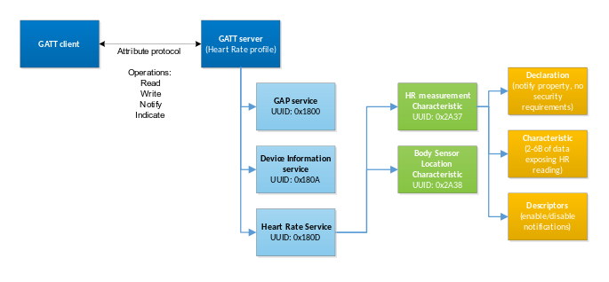

# Understanding Profiles, Services, Characteristics, and the Attribute Protocol

This section provides a basic explanation of Bluetooth profiles, services, and characteristics, and also explains how the Attribute protocol is used in the data exchange between the GATT server and client. Further information on these topics can be found on the Bluetooth SIG website at: [https://www.bluetooth.com/specifications/specs/](https://www.bluetooth.com/specifications/specs/).

## GATT-Based Bluetooth Profiles and Services

A *Bluetooth* profile specifies the structure in which data is exchanged. The profile defines elements, such as services and characteristics used in a profile, but it may also contain definitions for security and connection-establishment parameters. Typically a profile consists of one or more services which are needed to accomplish a high-level use case, such as heart-rate or cadence monitoring. Standardized profiles allow device and software vendors to build inter-operable devices and applications.

## Services

A service is a collection of data composed of one or more characteristics used to accomplish a specific function of a device, such as battery monitoring or temperature data, rather than a complete use case.

## Characteristics

A characteristic is a value used in a service, either to expose and/or exchange data and/or to control information. Characteristics have a well-defined known format. They also contain information about how the value can be accessed, what security requirements must be fulfilled, and, optionally, how the characteristic value is displayed or interpreted. Characteristics may also contain descriptors that describe the value or permit configuration of characteristic data indications or notifications.

## The Attribute Protocol

The Attribute protocol enables data exchange between the GATT server and the GATT client. The protocol also provides a set of operations, namely how to query, write, indicate, or notify the data and/or control information between the two GATT parties.

**Attribute Read Operation**

**Attribute Write Operation**

**Attribute Write without Response Operation**

**Attribute Indicate Operation**

**Attribute Notify Operation**

