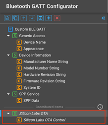

# Generating the Code Files

This section describes how to use Simplicity Studio or the `bgbuild` Python script and your IDE to generate the gatt_db.c/h code files from the gatt_configuration.btconf XML file.

## Using Simplicity Studio

When using the GATT Configurator in Simplicity Studio, the code files (gatt_db.c/gatt_db.h) are generated automatically each time the configuration is saved.

## Using bgbuild

The code files can be generated independently from the IDE, using the `bgbuild` Python script provided in the SDK:

$GSDK_PATH\protocol\bluetooth\bin\gatt\bgbuild.py

$GSDK_PATH is the installation directory of the selected GSDK, for example ~/SimplicityStudio/SDKs/gecko_sdk/.

The script requires installing Python 3 and the Jinja2 package by calling `pip install jinja2`. The script can parse only GATT configurations created with Simplicity Studio 5 / SDK v4.x, or written manually according to this user guide. The GATT Configurator can import older gatt.xml formats.

Mandatory argument:

- Path to the GATT XML files, or directories to find the XML files. Separate input with ";"

Optional arguments:

- -h, --help: display help message

- -o OUTDIR, --outdir OUTDIR: the output directory, where the files will be generated (Simplicity Studio 5 generates the sources into the autogen folder. Generating them somewhere else in the project structure could cause potential collisions.)

```C
python $GSDK_PATH/protocol/bluetooth/bin/gatt/bgbuild.py
~/SimplicityStudio/v5_workspace/btmesh_soc_empty/config/btconf/gatt_configuration.btconf
-o ~/SimplicityStudio/v5_workspace/btmesh_soc_empty/autogen/
```

In the Bluetooth GATT Configurator, the GATT can contain a **Contributed items** section. These are additional XML files that are non-modifiable from the user interface, but the source generation in Simplicity Studio will include them.



To produce the same result with `bgbuild`, you have to include the whole config/btconf folder.

```C
python $GSDK_PATH/protocol/bluetooth/bin/gatt/bgbuild.py
~/SimplicityStudio/v5_workspace/btmesh_soc_empty/config/btconf/
-o ~/SimplicityStudio/v5_workspace/btmesh_soc_empty/autogen/
```
