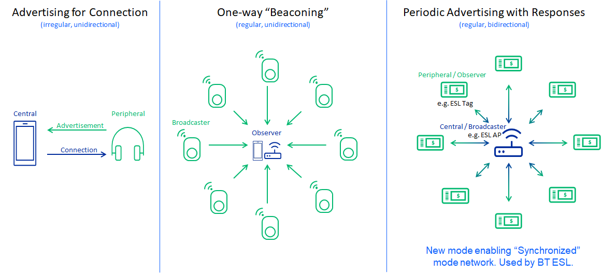
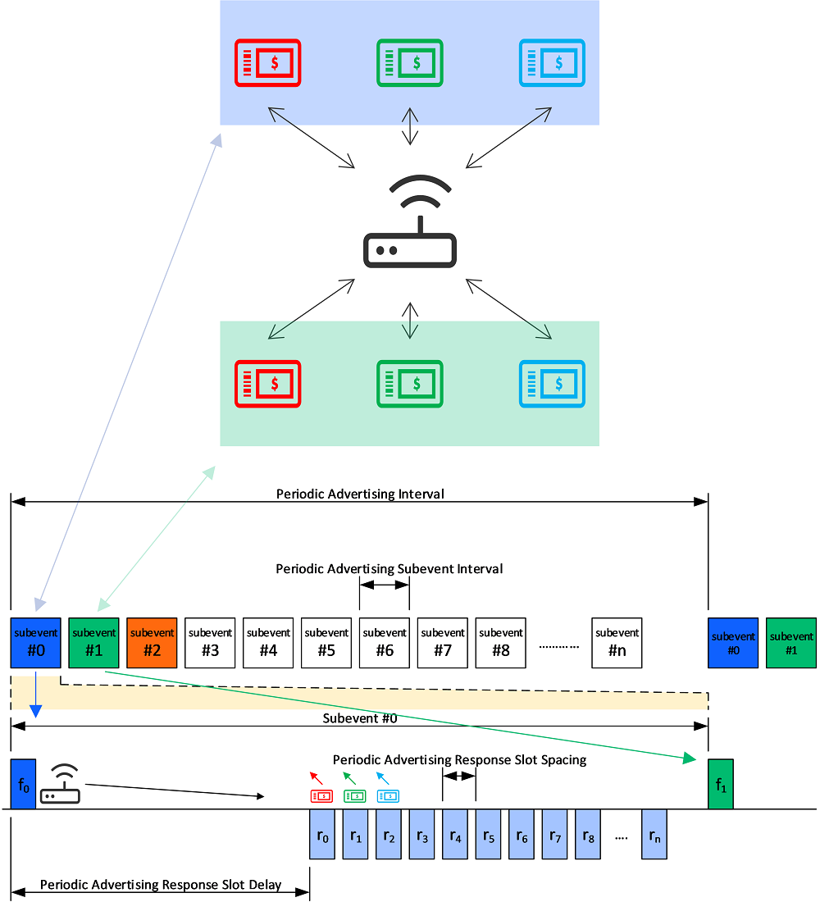
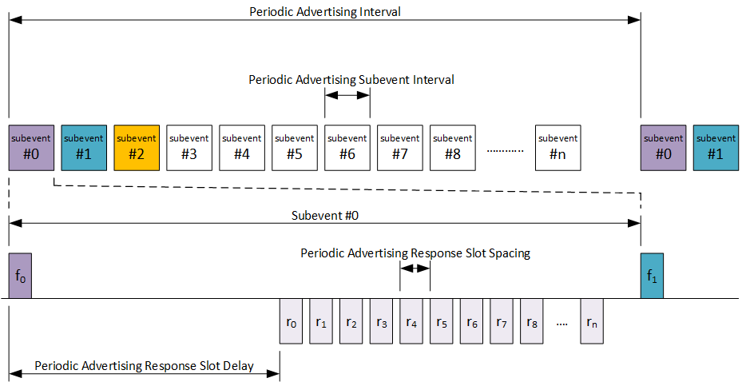
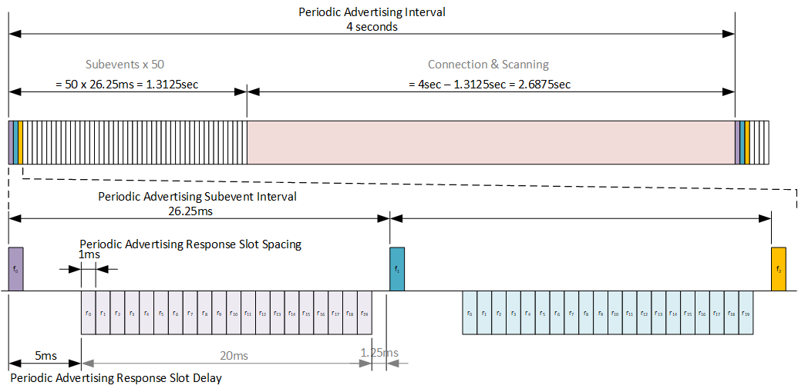
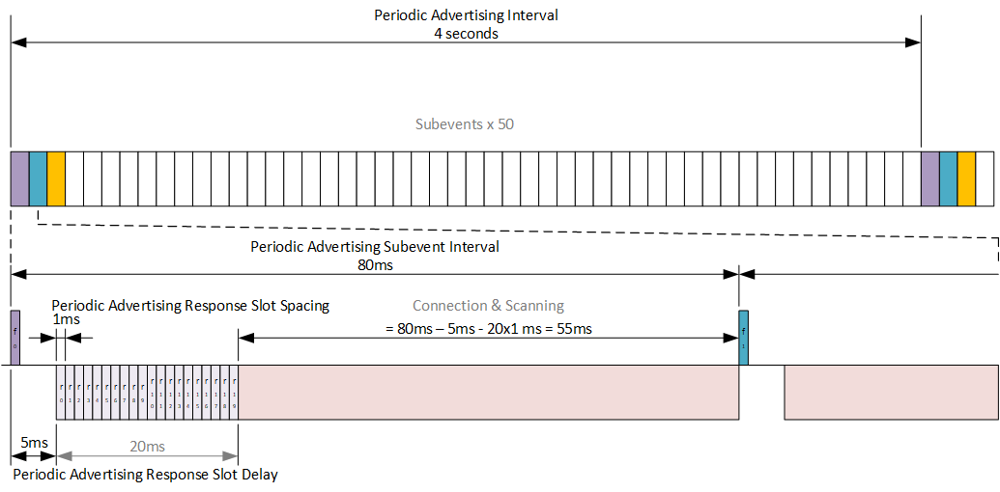
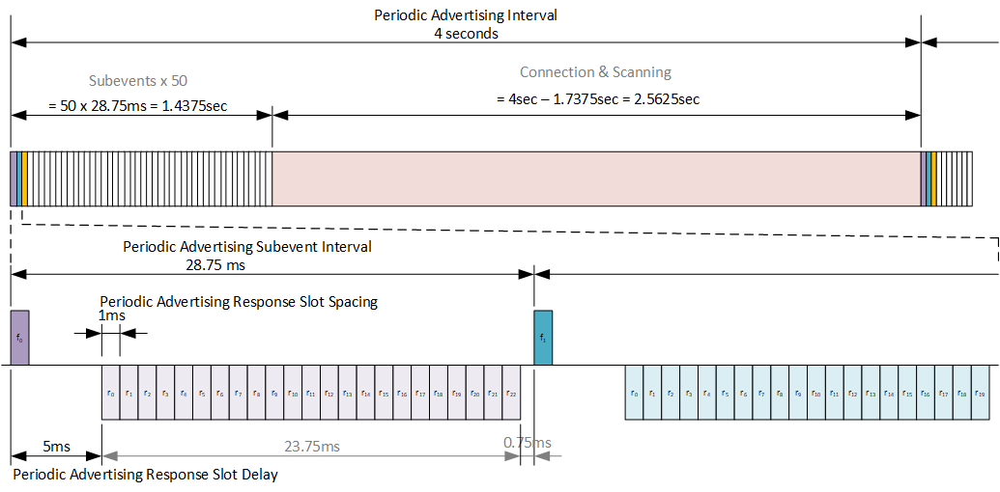
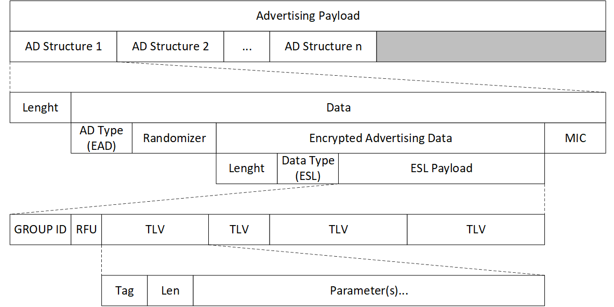

# Bluetooth ESL

## Periodic Advertising with Responses

This section describes the basics of the Bluetooth LE Periodic Advertising with Responses (PAwR) feature, how it is used in the BLE ESL application, and basics regarding how to form a PAwR network in BLE ESL.

### Introduction

Advertising in Bluetooth is commonly used between a Peripheral and a Central device for the Peripheral to indicate its aim to connect with the Central device. As an example, a Bluetooth headset (Peripheral, Advertiser) is advertising Connectable Advertisements and a mobile phone (Central device, Scanner) scans these advertisements. If an advertisement is received, the Central device establishes a Bluetooth Connection with the Peripheral device.

Bluetooth also defines "Connectionless" communication mode where a device advertises non-connectable advertisement packets, which can be received by the scanning device. An example of such an application is, for example, an asset tracking device, which is broadcasting (Broadcaster) the asset-specific identification information. An Observer device receiving these packets then detects that the broadcasting device is in proximity of the scanning device and then receives these broadcasted messages.

Bluetooth 5.0 defined a Periodic Advertisement feature. Periodic Advertising allows Non-connectable Advertisements to be sent at a fixed interval where advertising data can be sent. One or more Observers can then listen and receive these advertisements. Because the transmissions happen at a fixed interval, the Observer (and Broadcaster) can go to sleep between advertisement events instead of being in receive mode (Scanning) all the time. Periodic Advertisement could be used for example in a sensor network where sensor peripherals are advertising the sensor data periodically and a Central device can receive the sensor data without the need to scan all the time.

PAwR is a BLE extension (released in BT Core 5.4) to Periodic Advertising. In Periodic Advertising, the data communication is limited to be from the Broadcaster to the Observer. In PAwR, the roles of Broadcaster and Observer are swapped. The Central device becomes a Broadcaster, which advertises periodically by keeping up the PAwR train of packets. The Observer becomes a Peripheral device synchronized to the periodic advertisement train. Data from the Central device to the Peripheral device can be sent over the PAwR. The Peripheral device may send data to the Central device by placing the data in the dedicated Response Slot(s). PAwR makes it possible for thousands of Peripheral devices to synchronize to the Central device's periodic advertisement and allows exchange data between the Central device and Peripherals without the need to establish a connection.

Peripheral devices keep synchronization to the Central device by receiving the PAwR train transmitted by the Central device. At a minimum, the PAwR train transmitted by the Central device consists of an empty Advertising physical channel PDU.

The theoretical maximum payload size in PAwR packet is 251 bytes of Advertising Data. As an example, in the Electronic Shelf Label application (BT SIG defined Profile/Service), the payload is limited to 48 bytes.

### Periodic Advertising with Responses Basics

Periodic Advertising with Responses (PAwR) is kind of a Time Division Multiple Access (TDMA) system, where communication between nodes (single Central device and one or more Peripheral devices) happen in predefined time slots. The fundamental timing period is the "Periodic Advertising Interval" which is the interval of periodic advertisements sent by the Central device. Each Peripheral device receives the periodic advertisement once in the Periodic Advertising Interval to keep synchronization to the PAwR train.

Each Periodic Advertising Interval is divided into 1-128 Subevents and each Subevent to 0-255 Response Slots. In theory 128 x 255 = 32,640 Peripheral devices may be mapped to one PAwR train. The Periodic Advertising Interval can be between 7.5ms to ~82 seconds. The figure below shows the Periodic Advertising Interval divided into Subevents.

In each Subevent, the Central device transmits one Periodic Advertisement to all Peripherals in that particular Subevent. Each Peripheral has its unique Response Slot where it may send data to the Central device. The allocation of the Response Slots is application-specific. PAwR itself doesn't specify in any means the content of the data or the protocol for how the data should be handled by any of the devices.

### PAwR Timing

PAwR introduces several timing parameters to define the different intervals and delays. This allows endless possibilities to define the best parameters to meet the system/application bandwidth, latency, and energy consumption requirements.

The following timing parameters exist in PAwR:

- Periodic Advertising Interval (7.5ms - 81.91875sec)

  - Interval of the periodic advertisement train. PAI must be defined so that all the allocated Subevents fit into the PAI.

- Periodic Advertising Subevent Interval (7.5ms - 318.72ms)

  - Periodic Advertising Subevent Interval is the duration of one Subevent. All Subevents have the same duration. One Subevent includes one transmission from the Central device and possible Response Slots from the Peripherals. Periodic Advertising Subevent Interval must be defined so that all allocated Response Slots and the Periodic Advertising Response Slot Delay (see next bullet) fit into one Subevent.

- Periodic Advertising Response Slot Delay (1.25ms - 317.5ms)

  - Periodic Advertising Response Slot Delay is the duration between the Central device transmission to the first Response Slot. Periodic Advertising Response Slot Delay must be defined so that the Central device has enough time to transmit its message and be ready to receive the response in the first Response Slot.

- Response Slot Spacing (0.25ms – 31.875ms)

  - Response Slot Spacing is the duration of one Response Slot. All Response Slots have the same duration. One Response Slot includes one transmission from one Peripheral device to the Central device. Response Slot Spacing must be defined so that the whole Peripheral response fits into the Response Slot including the T_IFS (Inter Frame Space, min 150us).

Once the timing parameters of the PAwR are defined, the PAwR train is set up and Peripheral devices are synchronized after which the timing parameters cannot be (dynamically) changed.

### PAwR in BLE ESL

In BLE ESL, each ESL Tag belongs to one Subevent, in ESL context, called a Group. A maximum of 255 ESL Tags can be mapped to one Group (=Subevent). The ESL Service/Profile determines how the Response Slots are allocated for each ESL Tag. Each ESL doesn’t have its own predefined Response Slot; instead, the Response Slot is determined by the order of commands (TLVs, Tag Length Value) sent by the Central device (Access Point). More than one ESL Tag can be addressed in one Subevent. The first addressed command requiring the ESL Tag to respond is responded in the first Response Slot, the second addressed command responded in the second Response Slot, and so on. If there are multiple commands to one ESL Tag in a single AP message, the allocated Response Slot is based on the last addressed command. For example, ESL A receives command in 1st and 3rd TLV. ESL B receives command in 2nd TLV. The ESL A responds in 3rd Response Slot and ESL B in 2nd Response Slot.

The maximum payload size in BLE ESL Service/Profile is 48 bytes. The minimum command size is 2 bytes. Each ESL Payload starts with Group ID, which is 1 byte. This means that a maximum of 23 ESL Tags can be addressed in one Subevent, meaning that a maximum of 23 ESL Tags may have a respond in one Subevent. From the PAwR perspective, there may be more ESL Tags mapped to one Subevent than there are Response Slots allocated. In other words, a maximum of 23 Response Slots needs to be allocated to one Subevent because only a maximum of 23 ESL Tags can respond in one Subevent. This is an important factor when determining the PAwR parameters for the ESL Tag network. The maximum command size is 17 bytes, meaning a maximum of two commands fit to one message.

PAwR communication is not the only radio communication happening between the Access Point (Central device) and Peripheral devices (ESL Tags). Enough radio time for the Access Point must be reserved for other BLE activities like Scanning and Connection. This must be taken into account when determining the PAwR parameters. The Periodic Advertising Interval determines the overall latency of the system, because each ESL Tag has the opportunity to be accessed once in a Periodic Advertising Interval. On the other hand, each ESL Tag must listen/receive its dedicated Subevent to keep synchronized to the PAwR train. The Periodic Advertising Interval is then a trade of parameter between the system latency and ESL Tag power consumption. A short Periodic Advertising interval means short latency but higher power consumption and vice versa. Usually, a 1 to 10 second interval is used in similar types of proprietary ESL networks.

Some examples of how to select the PAwR timing parameters and how to allocate the Subevents are introduced below.

**1000 ESL Tags, 4 Second Periodic Advertising Interval, “Packed”**

In this example, 1000 ESL are mapped to minimum time Subevent. 50 Subevents are allocated, meaning 20 ESL Tags are mapped to one Subevent. Periodic Advertising Subevent Interval is calculated to fit 20 Response Slots. Response Slot Duration is defined to fit maximum ESL payload, additional protocol overhead and Inter Frame Space (T_IFS = 150us) between the Response Slots.

This mapping approach results to one 2.7 second slot for Connections and Scanning.

The access time for one ESL Tag is the maximum Periodic Advertising Interval, 4 seconds. Accessing individually all ESL Tags in the network will take 1 to 10 Periodic Advertising Intervals (4 – 10 seconds).

- Number Subevents

  - 50

- Number of Response Slots (= ESL Tags per Group)

  - 20

- Response Slot Duration

  - 1ms

- Periodic Advertising Subevent Interval

  - 26.25ms

  - 5ms Periodic Advertisement Response Slot Delay

  - 20 Response Slots x 1ms = 20ms for Response Slots

  - 1.25ms gap between Subevents

- Periodic Advertising Interval

  - 4 seconds

  - 50 Subevents x 26.25ms = 1.3125 seconds

  - 2.6875 seconds reserved for Connection & Scanning

- Single ESL Access Time

  - 4 seconds

- Total Time to access 1000 ESLs:

  - Minimum command size (2 bytes)

    - ROUNDUP(20 / 23) = 1

    - =\> 1 Advertising Intervals x 4 sec = 4 seconds

  - Maximum command size (17 bytes)

    - ROUNDUP(20 / 2) = 10

    - =\> 10 Advertising Intervals x 4 sec = 40 seconds

**1000 ESL Tags, 4 Second Periodic Advertising Interval, “Evenly Distributed”**

In this example, 1000 ESL are mapped to evenly along the Periodic Advertising Interval. 50 Subevents are allocated, meaning 20 ESL Tags are mapped to one Subevent. Periodic Advertising Subevent Interval is calculated by dividing the Periodic Advertising Interval to equal length Subevents. Response Slot Duration is defined to fit maximum ESL payload, additional protocol overhead and Inter Frame Space (T_IFS = 150us) between the Response Slots.

This mapping approach results to at least 55ms slot for Connections and Scanning every 80ms (Subevent).

The access time for one ESL Tag is the maximum Periodic Advertising Interval, 4 seconds. Accessing individually all ESL Tags in the network will take 1 to 10 Periodic Advertising Intervals (4 – 10 seconds).

- Number Subevents

  - 50

- Number of Response Slots (= ESL Tags per Group)

  - 20

- Periodic Advertising Interval

  - 4 seconds

- Response Slot Duration

  - 1ms

- Periodic Advertising Subevent Interval

  - 4000ms / 50 = 80ms

  - 5ms Periodic Advertisement Response Slot Delay

  - 20 Response Slots x 1ms = 20ms for Response Slots

  - 55-75ms gap between Subevents for Connection & Scanning

- Single ESL Access Time

  - 4 seconds

- Total Time to access 1000 ESLs:

  - Minimum command size (2 bytes)

    - ROUNDUP(20 / 23) = 1

    - =\> 1 Advertising Intervals x 4 sec = 4 seconds

  - Maximum command size (17 bytes)

    - ROUNDUP(20 / 2) = 10

    - =\> 10 Advertising Intervals x 4 sec = 40 seconds

**10000 ESL Tags, 4 Second Periodic Advertising Interval, “Packed”**

In this example, 10000 ESL are mapped to the minimum time Subevent. 50 Subevents are allocated, meaning 200 ESL Tags are mapped to one Subevent. Periodic Advertising Subevent Interval is calculated to fit 23 Response Slots. Response Slot Duration is defined to fit the maximum ESL payload, additional protocol overhead and Inter Frame Space (T_IFS = 150us) between the Response Slots.

This mapping approach results to one 2.6 second slot for Connections and Scanning.

The access time for one ESL Tag is maximum the Periodic Advertising Interval, 4 seconds. Accessing individually all ESL Tags in the network will take 1 to 10 Periodic Advertising Intervals (4 – 10 seconds).

- Number Subevents

  - 50

- Number of Response Slots

  - 23 (200 ESL Tags per Group)

- Response Slot Duration

  - 1ms

- Periodic Advertising Subevent Interval

  - 28.75ms

  - 5ms Periodic Advertisement Response Slot Delay

  - 23 Response Slots x 1ms = 23ms for Response Slots

  - 0.75ms gap between Subevents

- Periodic Advertising Interval

  - 4 seconds

  - 50 Subevents x 28.75ms = 1.4375 seconds

  - 2.5625 seconds reserved for Connection & Scanning

- Single ESL Access Time

  - 4 seconds

- Total Time to access 10000 ESLs:

  - Minimum command size (2 bytes)

    - ROUNDUP(200 / 23) = 9

    - =\> 9 Advertising Intervals x 4 sec = 36 seconds

  - Maximum command size (17 bytes)

    - ROUNDUP(200 / 2) = 100

    - =\> 100 Advertising Intervals x 4 sec = 400 seconds

## Encrypted Advertising Data (EAD)

In addition to PAwR, Bluetooth 5.4 introduced another feature which is essential for the Bluetooth Electronic Shelf Label service: Encrypted Advertising Data (EAD). The EAD is the first standardized method to use encryption for the advertisement data (also with responses), making the communication secure in connectionless modes. Prior to Bluetooth 5.4, encryption was only defined for connection-orientated communication.

The encrypted data will be encapsulated within an Advertising Data structure, as shown in the figure below. Bluetooth uses CCM algorithm to encrypt and authenticate the data, which includes the ESL specific payload, a 40-bit long Randomizer field (i.e., 5 octets of random data), and a 32-bit long Message Integrity Check (MIC) field.

