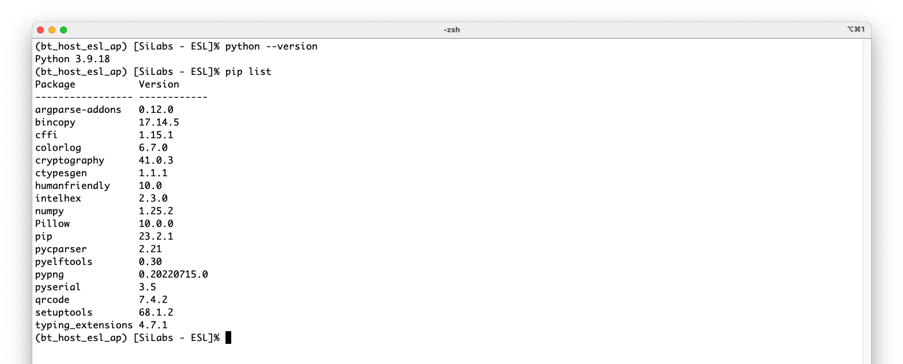
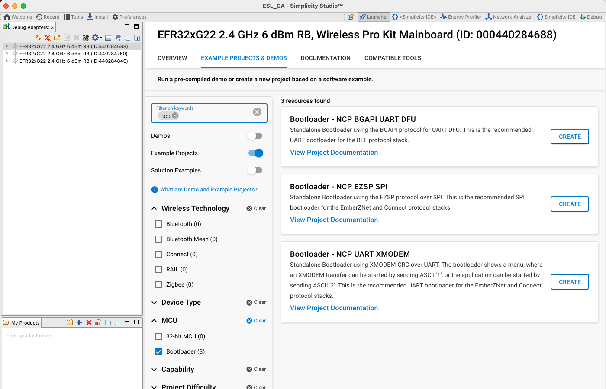
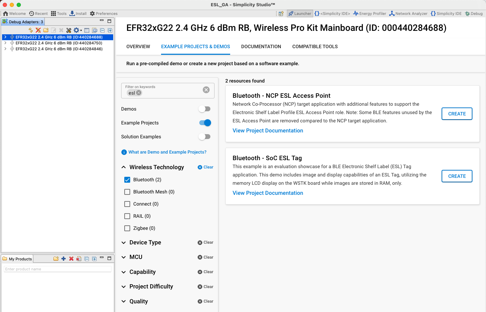
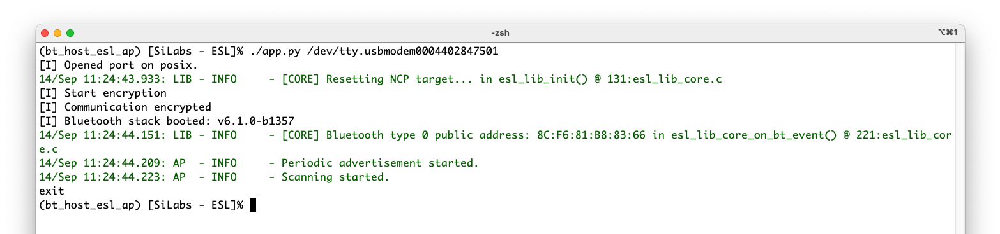
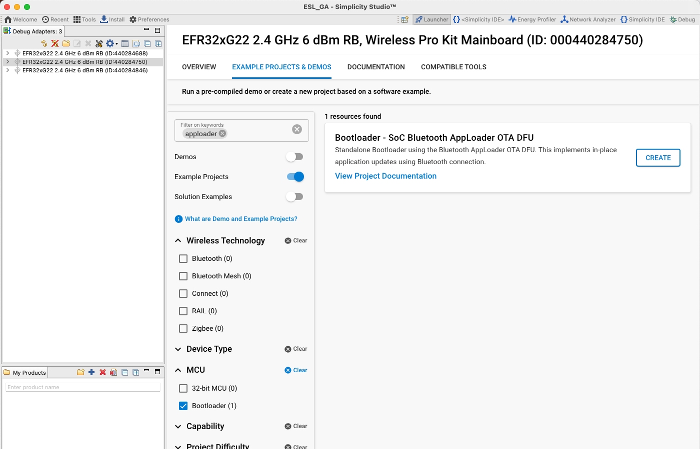
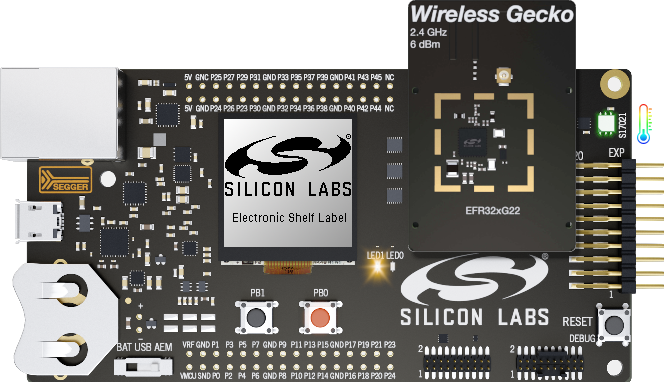

# Preparing the ESL Network

## Prerequisites

Requirements for building the ESL Tag example and the ESL Access point are:

- A computer with:
  - Latest version of Simplicity Studio
  - Python 3 (minimum version 3.9)
  - Python packages listed on \<sdk path\>/app/bluetooth/example_host/bt_host_esl_ap/requirements.txt.
- One EFR BLE radio board to be used with access point
- One or more WSTK + radio board sets as ESL Tag (BRD4182A radio board recommended). The ESL example project uses the WSTK LCD screen as the ESL display.

Refer to [Supported Radio Boards](./10-supported-radio-boards).

## ESL Access Point

All the core functionalities of the ESL access point (AP) are implemented as C program, with some additional parts, e.g., the command line interface, implemented with Python. The host program utilizes BGAPI binary protocol to control an EFR32 based radio in Network Co-processor (NCP) mode. Thus, the ESL AP requires an EFR32 based BLE device, and a host (PC) running the access point implementation. For more information about NCP, see [Using the Bluetooth Stack in Network Co-Processor Mode](/bluetooth/{build-docspace-version}/bluetooth-network-coprocessor-mode/).

The access point implementation is documented in the readme file, located in:

`<SDK>/app/bluetooth/example_host/bt_host_esl_ap/readme/`

### Install Python and Required Packages

The minimum required Python version is 3.9. In addition to the Python itself, the access point requires additional packages listed in the file `requirements.txt`, located at `<sdk path>/app/bluetooth/example_host/bt_host_esl_ap/`. The required packages can be installed by using the requirements.txt file.

On Linux / Mac, run the following from command line:

`python -m pip install -r requirements.txt`

On Windows, the command is a bit different:

`py -m pip install -r requirements.txt`

>**Note**: if Python3 isn’t the default Python version, the commands above might require using the format `python3 -m pip install <package>`. For further usage examples, check the pip documentation: [pip.pypa.io/en/stable/](https://pip.pypa.io/en/stable/).

If the pip command is added to the PATH variable, the installed packages can be listed with command `pip list`, or alternatively the installed packages can be listed by using the long command version: `python –m pip list` on Linux/Mac, or `py –m pip list` on Windows.

### Compiling the Access Point Software

After all the necessary Python packages have been installed, the access point host application can be built. Building the C application requires make tool, and a C compiler, e.g., GCC. On Windows, these can be installed using MinGW, and on Linux and Mac, using the package manager.

At the moment, the only supported build environment on Windows is MinGW-64. The makefiles make sure that the gcc is used with a proper prefix (x86_64-w64-mingw32-). The recommended build environment on Windows is MSYS2.

1. Download and install MSYS2: [www.msys2.org/](https://www.msys2.org/).

2. Open the Mintty bash. Make sure to start Mingw-w64 64 (mingw64.exe) when launching Mintty. 32-bit versions of MSYS2 will not work.

3. Install additional packages:

   `pacman -S make mingw-w64-x86_64-gcc mingw-w64-x86_64-python mingw-w64-x86_64-python-pip mingw-w64-x86_64-pkgconf`

4. Install ctypesgen with pip:

   `pip install ctypesgen`

>**Note**: MSYS requires Python and the `ctypesgen` Python package in order to compile the Access Point host software. It is however recommended to run the Access Point by using the native Windows Python enviroment instead of the Python installation on MSYS2, due to compatibility issues.

To build the project (Mac, Linux, and MSYS2 on Windows):

- Change to the exported project directory:

   `cd <sdk path>/app/bluetooth/example_host/bt_host_esl_ap`

- Build the project using the `make` command.

### ESL Access Point Hardware

The ESL access point (AP) Python implementation communicates with the ESL tags through a radio interface operating in Network Co-Processor (NCP) mode. Therefore, the EFR device operating as access point has to be programmed with **Bluetooth – NCP ESL Access Point** firmware.

### Bootloader for ESL AP

The first step is to build a bootloader for the EFR32 device operating as NCP, or AP, device. Select the device from the **Debug Adapters** list, and on the **EXAMPLE PROJECTS & DEMOS** tab, select the **Bootloader – NCP BGAPI UART DFU** example project.

Build the **Bootloader - NCP BGAPI UART DFU** project, and program it to the EFR device to be used as an access point. For more information on how to build or program devices using Simplicity Studio v5, see the [**Simplicity Studio® 5 User's Guide**](https://docs.silabs.com/simplicity-studio-5-users-guide/latest/ss-5-users-guide-overview/).

More information about the bootloaders can be found in [Silicon Labs Gecko Bootloader User's Guide for GSDK 4.0 and Higher (series 1 and 2 devices)](/bluetooth/{build-docspace-version}/bootloader-user-guide-gsdk-4) or [Silicon Labs Gecko Bootloader User’s Guide for Series 3 and Higher](/bluetooth/{build-docspace-version}/bootloader-user-guide-series3-and-higher).

### Access Point Firmware

The next step is to build the actual NCP firmware used by the access point. Select the **EXAMPLE PROJECTS & DEMOS** tab, and from the **Example Projects** list, select the **Bluetooth – NCP ESL Access Point**, and click **CREATE**.

Build the firmware and write the image to the target device to be used as the access point.

Successful access point creation can be verified by executing the AP script (app.py) located in folder `\<SDK path\>/app/bluetooth/example_host/bt_host_esl_ap/` via command line:

Linux:  `python app.py <serial device>`

- Example: `python app.py /dev/ttyACM0`

Mac:  `python app.py <serial device>`

- Example: `python app.py /dev/tty.usbmodem0004402847501`

Windows: `py -u app.py <serial device>`

- Example.: `py -u app.py COM3`

>**Note**: It is recommended to run the access point script on Windows with option `-u` to have the log streams unbuffered.

## ESL Tags

The SDK contains an ESL example project called **Bluetooth – SoC ESL Tag**, which can be easily compiled and programmed to an EFR32 based BLE radio board connected to a Wireless Starter Kit (WSTK) main board. The example project utilizes the WSTK’s onboard LCD, LEDs, and sensors and is therefore targeted for the WSTK and a radio board combination. It is however possible to compile the **Bluetooth – SoC ESL Tag** project also to custom hardware, but this will require some additional configuration steps.

### Bootloader for ESL Tags

Just as with the ESL access point device, the ESL Tags also require a bootloader to work properly. While the ESL AP needed a bootloader targeted for an NCP device, the ESL Tags require an Over-The-Air (OTA) DFU capable bootloader: **Bootloader – SoC Bluetooth AppLoader OTA DFU**. The example project can be created by selecting a correct device from the Debug Adapters list, and filtering the Bootloader example projects with keyword "apploader".

Building the bootloader for the tag and writing the image to the target device follows the same steps as with an access point NCP device.

### ESL Tag Firmware

To create the example project, first select the device from the Debug Adapters list, and then select the **EXAMPLE PROJECTS & DEMOS** tab. On this view, use the filtering options to show only the Bluetooth Example Projects, and/or use the **Filter on keywords** option to search for the ESL Tag example project, **Bluetooth – SoC ESL Tag**.

Again, as above, build the project and write the image to the target device(s) to be used as an ESL Tag(s).

After programming the ESL Tag target device(s), the WSTK LCD screen should change, indicating that the device is now running the ESL Tag example project.

