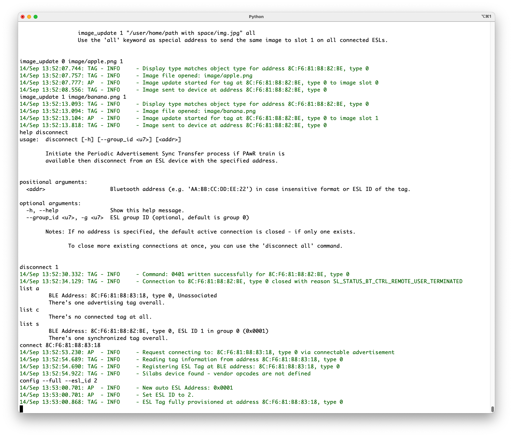

# The ESL Network

The ESL tags on the ESL network can be in one of five different states: Unassociated, Configuring, Synchronized, Updating, and Unsynchronized, as defined in the [Eletronic Shelf Label Service Specification](https://www.bluetooth.com/specifications/specs/), shown below. Transitions between states is controlled by the access point, based on the current state of the ESL tag.


The ESL access point emulator (`<SDK path>/app/bluetooth/example_host/bt_host_esl_ap/`) can be run on two different modes: automatic and manual mode. The detailed access point documentation is included with the source codes: `<SDK path>/app/bluetooth/example_host/bt_host_esl_ap/readme/readme.md`.

## ESL AP in Automatic Mode

On automatic mode, the ESL AP starts scanning for ESL tags, and once it finds one, creates a connection to it, reads the GATT database, writes configuration values (ESL ID and group ID, AP sync key, ESL Response key, Nonce, and current time), uploads two random images from the `<SDK path>/app/bluetooth/example_host/bt_host_esl_ap/image/` folder, and then closes the connection. The figure below shows the ESL AP state diagram in automatic mode. Once the ESL tag has been configured and the AP has closed the connection, the tag will be in the Synchronized state. At this point, the ESL tag will also show one of the uploaded, random images on the WSTK LCD screen.


The access point mode can be switched from automatic to manual and vice versa: `mode manual` will switch the AP to manual mode, and `mode auto` to automatic mode.

Running the AP in automatic mode will verify that both the AP and ESL tag(s) work as expected. If the image on the ESL tag's LCD screen has changed, it has been successfully configured by the AP and is now in the Synchronized state.

The application will be introduced in more details in chapters describing the Manual mode operation.

### Filter Accept List-based Auto Connect

Release SiSDK-2024.12 introduced a new addition to the auto mode, called a Filter Accept List-based auto connect. On the previous versions, the access point created a connection to the detected ESL Tags one by one, based on the received advertisements. This created some delays on the onboarding process, since the connection creation process could be initiated only when the previous one has been completed. While the connection initiation process is ongoing, the access point can't make use of the advertisements from other ESL Tags. Using multiple connections mitigates the overall onboarding time.

The new Filter Accept List-based approach brings the connection establishment closer to the BLE controller, as defined by the *Auto Connection Establishment* procedure on the Bluetooth Core Specification. In this approach, the application level adds the ESL Tag device addresses to the Filter Accept List, and the controller autonomously establishes a connection to the devices if the device address matches any of the addresses on the Filter Accept List. This way the BLE stack, and the application layer, continue working normally while the controller is establishing the connections. This speeds up the ESL Tag onboarding process significantly.

The new Filter Accept List-based connection mode is used by default, if the access point is started in auto mode. The connection initiation method can be selected with command `mode auto [{single, list}]`. With the `single` option, the access point will initiate connections to a single ESL Tag at time (as prior to SiSDK-2024.12 release), while the `list` option gives the possibility of utilizing the Filter Accept List and Initiator Filter Policy Core feature.

## ESL AP in Manual Mode

To start the AP in manual mode, use option `--cmd`:

`python app.py --cmd <serial device>`

The access point can also be started in more verbose mode with switch `-l <level>`, e.g.

`python app.py /dev/tty.usbmodem0004402847501 -l DEBUG`

In manual mode, the transitions between tag states are controlled with commands shown in the figure below.

The commands listed next to the states are the ones you can issue on the specific state.


**ESL Opcodes and Corresponding ESL AP Commands**

:::custom-table{width=10%,15%,40%,15%,20%}
| Opcode | Procedure | Description | AP Command | Notes |
|--------|-----------|-------------|------------|-------|
| 0x00 | Ping | Does nothing but solicits a response | `ping` | — |
| 0x01 | Unassociate from AP | Transitions the ESL from the Synchronized state to the Unassociated state | `unassociate` | — |
| 0x02 | Service Reset | Sets the Service Needed flag to False | `service_reset` | — |
| 0x03 | Factory Reset | Requests the ESL to unassociate from the AP and revert to its original state | `factory_reset` | — |
| 0x04 | Update Complete | Requests that the ESL return to the Synchronized state once synchronized | `update_complete` | Note: Only for testing purposes. |
| 0x10 | Read Sensor Data | Requests a response with sensor data, or an indication that data is not yet available | `read_sensor` | — |
| 0x11 | Refresh Display | Refreshes the current displayed image to keep the displayed image fresh on the display | `refresh_display` | — |
| 0x20 | Display Image | Displays a pre-stored image on an ESL display | `display_image` | — |
| 0x60 | Display Timed Image | Displays a prestored image on an ESL display at a specified time | `display_image (2)` | With options 'time', 'delay', or 'absolute' |
| 0xB0 | LED Control | Turns on/off an LED with a color/flashing pattern | `led` | — |
| 0xF0 | LED Timed Control | Turns on/off an LED with a color/flashing pattern at a specified time | `led (2)` | With options 'time', 'delay' or 'absolute' |
| 0x_F | Vendor-specific Tag | Allows vendors to specify their own commands | N/A | — |
:::

Optional parameters are listed with `[ ]`, while positional parameters are listed without parentheses. A `|` is used to denote “or” functionality. For example, a `command mandatory_param [ opt_param_1 | opt_param_2 ]` has the command itself (`command`), which requires a mandatory parameter (`mandatory_param`). In addition, the command can have optional parameter(s): either `opt_param_1` or `opt_param_2`. The parameters should follow the order as they have been presented on the command help.

In addition to the commands listed in the figure above, the access point uses a few other commands that are not dependent on the tag state. These are `exit`, `help`, `list`, `mode`, `sync`, `scan`, `script`, and `set_rssi_threshold`.

The `exit` command will terminate the access point application execution.

The `help` command will list all available commands, and `help <topic>` will show the detailed help of that specific command, as shown below.


The `list` command can be used to list all the tags the AP can receive. With option `a` (or `advertising`), the AP will list all tags currently advertising (e.g., the ones in Unassociated state), option `s` (or `synchronized`) will list all tags currently on Synchronized state, and option `c` (`connected`) will list all the tags the AP has connected to. In addition to these three most typical states, the tags in the Unsynchronized state can be listed with option `u` (`unsynchronized`). With additional option `-v` (`--verbose`), the AP will list more information of the listed tag, e.g., the AP Sync Key and the ESL Response Key, Display information, etc.

```C
list [-h] [--verbose] [--group_id <u7>] state [state ...]
```

As described in [ESL AP in Automatic Mode](#esl-ap-in-automatic-mode), the `mode` command can be used to switch between the automatic and manual mode.

```C
mode [-h] [{auto,manual}]
```

Command `sync` is used to start, or stop, sending synchronization packets to the ESL tags on network. The optional parameters can be used to set the periodic advertisement interval.

```C
sync [-h] [--millis] [--in_max <int>] [--in_min <int>] [--se_count <int>] [--se_interval <int>]  [--rs_delay <int>] [--rs_spacing <int>] [--rs_count <int>] [{start,stop,config}]
```

See [Periodic Advertising with Responses](04-bluetooth-esl#periodic-advertising-with-responses) for more information about selecting appropriate configuration for your needs.

The `scan` command is used to start / stop scanning the ESL tags.

```C
scan [-h] [--active] [{start,stop}]
```

The `script` command can be used to record and run scripts containing all possible commands used with the ESL network, making it easy to automate the access point operation.

The `help` command also lists a command `set_rssi_threshold`, which can be used to filter out ESL tags based on their RSSI values.

### Unassociated State

When an ESL tag is powered, it goes to the Unassociated state, in which the tag will send undirected, connectable advertisement packets. If the ESL AP has been configured to scan (`scan start`), all advertising tags heard by the AP can be listed with command `list a`.


For the ESL tags to stay in low power mode and still receive commands from the access point, the access point must send synchronization packages (with optional commands) to the tags. Enabling the synchronization packet transmission is controlled with command `sync start`. The synchronization configuration can be checked, and modified, with parameter `config`.


### Configuring State

In the Configuring state, the ESL tag is associated to an ESL network. The Configuring state can be entered only from the Unassociated state by creating a connection to the advertising ESL tag:

```C
connect <Bluetooth address>
connect 8C:F6:81:B8:82:BE
```

Once connected, the tag will be listed as connected, but still unassociated to the network.


Associating a connected ESL tag to the network happens via configuration by the access point. Configuring happens by writing new values to the writable characteristics and reading characteristics related to displays, images, sensors, and LEDs. Configuration is successfully completed after reading and writing the characteristics.

Use command `config` to write all the values at once (parameter `full`), or by using each individual item (parameters `esl_id`, `group_id`, `sync_key`, `response_key`, `nonce`, `time`, `absolute`).

```C
config [-h] [--full] [--esl_id <u8>] [--group_id <u7>] [--sync_key] [--response_key] [--time |
 --absolute <u32>] [device]

config --full --esl_id 1
```

It is possible to establish concurrent connections to multiple tags. In such case, the tag has to be addressed with option `[device]`. If there are multiple active connections, the previous `config` command should be given in format:

```C
config --full --esl_id 1 8C:F6:81:B8:82:BE
```


Configuring state is also the state (in addition to Updating state) in which transferring images to the ESL tags is possible. Transferring images to the connected ESL tag is done with command `image_update`:

```C
image_update [-h] [--group_id <u7>] [--label <str>] [--cropfit] [--raw | --display_index <u8>]  [--cw | --ccw | --flip] image_index imagefile_path  [[address]]
image_update 0 image/apple.png 1
image_update 1 image/banana.png 1
```

This will add two images to the connected ESL tag: a picture of an apple to image index 0, and a picture of a banana to image index 1.

The **Bluetooth – SoC ESL Tag** example project has been configured to store up to two images. The number of images can be changed via projects Software Components (for more details, see [Image Storage](07-modifying-the-bluetooth-esl-examples#image-storage)).


Once the ESL tag has been configured, and (optionally) all images are transferred to it, the access point can close the connection and this way change the tag to Synchronized state.

```C
disconnect [-h] [--group_id <u7>] [<addr>]
disconnect 1
```


Now the `connect`, `config`, `image_update`, and `disconnect` steps should be repeated for rest of the ESL tags to be associated to the network.

First, connection creation to the second tag.

```C
connect 8C:F6:81:B8:83:18
```

After connection creation, the second tag is still unassociated to the ESL network. Therefore, the next step is to associate it to the network by configuring it.

```C
config --full --esl_id 2
```



While the second ESL tag is still in the Configuring state, upload images to it.

```C
image_update 0 image/bread.png 2
image_update 1 image/chicken.png 2
```


Once the ESL tag has been associated to the network by configuring it, and it now has all necessary images to be shown on the onboard display, the connection to it can be closed and the tag will switch to the Synchronized state.

```C
disconnect 2
```

After configuring the second ESL tag (uploading images) and disconnecting from it, the second ESL tag will transition to Synchronized state. `list` command with the `verbose (v)` option will give more information about the tag, also shown after closing the connection.


### Synchronized State

In Synchronized state, the ESL tag is in low-power, low-bandwidth communications mode, receiving the synchronization packages (periodic advertisements) from the AP. The communication model is based on PAwR, which enables synchronization and sending small amount of data from the AP to thousands of ESL tags, while also providing a possibility for the tags to respond to the received messages, if directly addressed.

The Synchronized state is considered as the "main" state, in which the tag will spend most of its time. In this state, an access point can request the tag to display an image on the display(s), control the LEDs, and read sensor data from the tag. In addition, transition to the Updating state is controlled by the access point while the tag is in the Synchronized state.

In the Synchronized state, both the AP and ESL Tag must use the Encrypted Advertising Data feature described in [Encrypted Advertising Data (EAD)](04-bluetooth-esl#encrypted-advertising-data-ead). For further information, see the [Electronic Shelf Label Profile](https://www.bluetooth.com/specifications/specs/).

**Displaying Images**

In the Synchronized state, the access point can send control commands to the ESL tag, e.g., to display an image:

```C
display_image [-h] [--group_id <u7>] [--time <hh:mm:ss> | --absolute <u32>] [--delay <u32>]
    [--date <YYYY-MM-DD>] esl_id image_index display_index
```

Command:

```C
display_image 1 0 0
```

will display an apple on the WSTK LCD screen (screen index 0) on ESL tag 1, and command:

```C
display_image --delay 3000 2 0 0
```

will change the image on the WSTK LCD to bread on ESL tag 2 after 3000 ms.

The `display_image` command can also be used to display image on all ESL tags belonging to some group:

```C
display_image all 1 0 0
```

Now all ESL tags in group 0 (default) will display image from index 1, on WSTK LCD (display index 0). Thus, the ESL tag 1 will display a picture of a banana, and ESL tag 2 will display a picture of a chicken.


The Synchronized state also supports refreshing the (current image on) display:

```C
refresh_display [-h] [--group_id <u7>] esl_id display_index
```

**LEDs**

The Synchronized state can also be used to control the LED(s) on the ESL tag:

```C
led [-h] [--group_id <u7>] [--default] [--pattern <bits>] [--on_period <int[0,3]>]
       [--off_period <int[0,3]>] [--brightness <int[0,3]>] [--color <int[0,3]>] [--repeats <u15>  | --duration  <u15>] [--index <u8>] [--time <hh:mm:ss> | --absolute <u32>]
       [--date YYYY-MM-DD] [--delay <u32>] {on,off,flash} esl_id
```

For example, command:

```C
led --index 1 on 1
```

will turn on the LED1 on the WSTK used as ESL tag 1.

As shown by the `help led` output, the LED can be programmed to flash different patterns in addition to just turning it ON/OFF. For example, command:

```C
led --pattern 10101000111011101110001010100000 --on_period 75 --off_period 75 --brightness 3
--repeats 3 --index 0 flash 2
```

will flash the LED1 as configured with parameter `pattern`.

>**Note**: The **Bluetooth - SoC ESL Tag** example project has only one LED configured (index 0), which controls the LED1 on the WSTK.

An ESL tag can have multiple LEDs, and the LEDs support multiple configurations, flashing patterns, etc.


**Sensors**

List of sensors supported by an ESL tag can be checked with command `list --verbose s`:


Reading data from the sensors is done with command `read_sensor`, with parameters ESL ID and the sensor index:

```C
read_sensor [-h] [--group_id <u7>] esl_id sensor_index
```

The sensors are listed with indexes on descending order with `list --verbose s`, thus reading the current input voltage of an ESL tag 1 is achieved with command `read_sensor 1 0`.

Different sensors can be read with command `read_sensor <esl_id> <sensor_index> [g=<group_id>]`. Since the tags (to be read) are in Synchronized state, the `read` command will be sent via periodic advertisement, and the sensor value will be part of the response.

![Different sensors can be read with command read_sensor <esl_id> <sensor_index> [g=<group_id>]. Since the tags (to be read) are in Synchronized state, the read command will be sent via periodic advertisement, and the sensor value will be part of the response.](resources/sld679-image29.png)

### Updating State

To transfer larger data amounts to the ESL tag (e.g. new images), the ESL tag has to transition from the Synchronized state to the Updating state. This occurs by creating a connection to the tag.

```C
connect 2
```

Once the connection is created, the access point can transfer new images to the ESL tags currently in the Updating state:

```C
image_update 0 image/croissant.png 2
image_update 1 image/donut.png 2
```

Creating a connection to an ESL tag in Synchronized state will switch the tag into Updating state.


And once the data transfer is done, the tag can be switched back to the Synchronized state by the AP closing the connection to:

```C
disconnect 2
```

Even though the images on indexes 0 and 1 were updated, the image on the screen hasn’t been changed. The new images just uploaded to the tag can be now displayed on the WSTK LCD screen. Command:

```C
display_image 2 0 0
```

will display a picture of a croissant on the WSTK LCD screen (screen index 0).

After uploading new images to an ESL tag (in Updating state), the AP will close the connection to the tag, switching it back to synchronized state. Now the access point can again send commands to the tag via periodic advertisements.


The Updating state is also the state from which the ESL tags can be unassociated from the AP / network, or to do a factory reset.

To do the factory reset, first create a connection to switch the tag into Updating state:

```C
connect 1
```


Once the connection is created (i.e. the ESL tag is in Updating mode), use command:

```C
factory_reset [-h] [--group_id <u7>] [--pawr] address
```

to reset the ESL tag:

```C
factory_reset 1
```

After issuing the command, the ESL tag clears all the images from its memory, clears all settings, and returns to the Unassociated state. Verify this by listing all advertising tags, as shown below. Also, the image on the LCD screen is back to the one shown in [ESL Tag Firmware](05-preparing-the-esl-network#esl-tag-firmware).

Once the connection is created (i.e. the ESL tag is in Updating state), a factory reset can be commanded. After factory reset, the tag will be in Unassociated state, sending (undirected, connectable) advertising packages.


ESL tags can also be unassociated from the AP / network, with command `unassociate`:

```C
unassociate [-h] [--group_id <u7>] address
```

As shown in [ESL AP in Manual Mode](#esl-ap-in-manual-mode), tags can be unassociated either from the Synchronized state, or from the Updating state. As an example, use the latter method. To set the ESL tag 2 to the Unassociate state, first create a connection to it (i.e., set the tag to the Updating state):

```C
connect 2
```

To unassociate a tag from the ESL network, the tag has to be either in Synchronized state, or in Updating state.


Once the tag is in the Updating state (i.e. the access point has created connection to the tag), the `unassociate` command can be issued:

```C
unassociate 2
```

After the `unassociate` command, the ESL tag is in the Unassociated state, advertising, as shown below. As with `factory_reset` command, `unassociate` will also clear the images and LED states. But this is, however, controlled by the application. You have an option to keep the images and LED states, if needed, with slight modifications to the application.

ESL tags can also be set to Unassociated state without factory reset, with command `unassociate <ESL ID>`. This will set the ESL tag to unassociated state, but the tag will not clear the images, or e.g. the LED states.


Creating a connection to device `8C:F6:81:B8:82:BE` (factory reset) will set the device to the Configuring state as shown below.

```C
connect 8C:F6:81:B8:82:BE
```


Since the ESL tag memory was erased by the factory reset, the access point must be configured again, and optionally new images have to be transferred to the tag:

```C
config --full --esl_id 1
image_update 0 image/hamburger.png 1
image_update 1 image/pineapple.png 1
```

After creating the connection, the tag is still considered as Unassociated, and it requires writing the configuration. Once configuration is written, images can be uploaded to the tag.


Closing the connection to the tag will switch the tag to the Synchronized state, and the tag is again ready to receive commands from the AP via periodic advertisements as shown below.

```C
disconnect 1
display_image 1 0 0
```

After creating connection to the ESL tag previously reset, the tag will be in Configuring state, and requires to be configured. After reading/writing the GATT characteristics, the AP can transfer images to the tag, and after closing connection, the tag will be in Synchronized mode.


At this point the ESL tag 1 (`8C:F6:81:B8:82:BE`) is now in Synchronized state, displaying an image of a hamburger on the WSTK LCD display.

The second ESL tag (`8C:F6:81:B8:83:18`) is still in Unassociated state, advertising.

The ESL tag can be associated to the AP / network by creating a connection to it (the tag will be in Configuring state), and then closing the connection, after which the tag will be in Synchronized mode as shown below:

```C
connect 8C:F6:81:B8:83:18
config --full --esl_id 2
image_update 0 image/pizza.png 2
image_update 1 image/steak.png 2
```

Creating a connection to the ESL tag previously unassociated from the AP will set the tag to a Configuring state. The tag requires the AP to configure it in order to associate the tag to the network, but since the tag was unassociated from the network earlier instead of factory reset, all the images uploaded to the tag are still preserved.


Once the tag is configured, it can be switched to the Synchronized state by closing the connection. After this, the access point can again send commands to the tag via Periodic Advertising with Responses.

```C
disconnect 2
display_image 2 0 0
```

Since the tag `8C:F6:81:B8:83:18` was unassociated from the network instead of factory reset, all the images stored to it were preserved, and therefore the tag can display the images after associating to a network.


