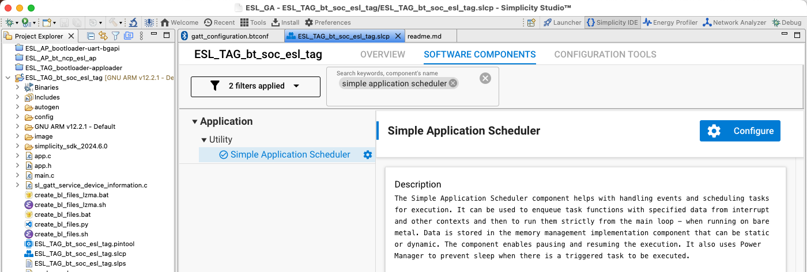
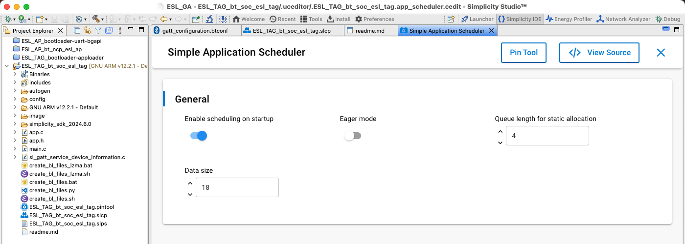
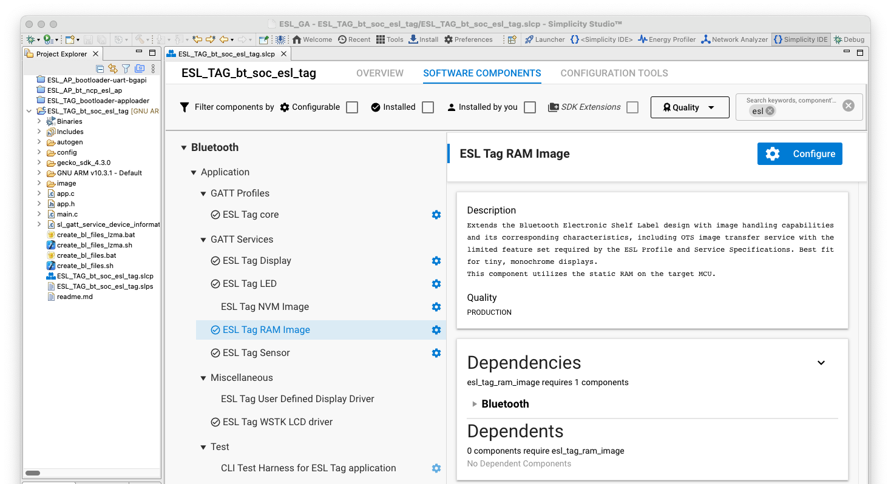
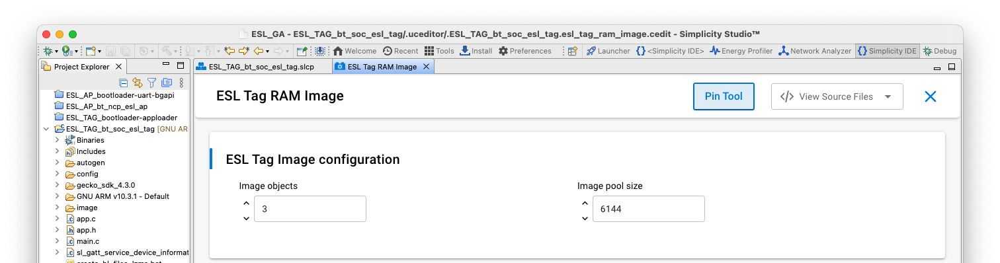
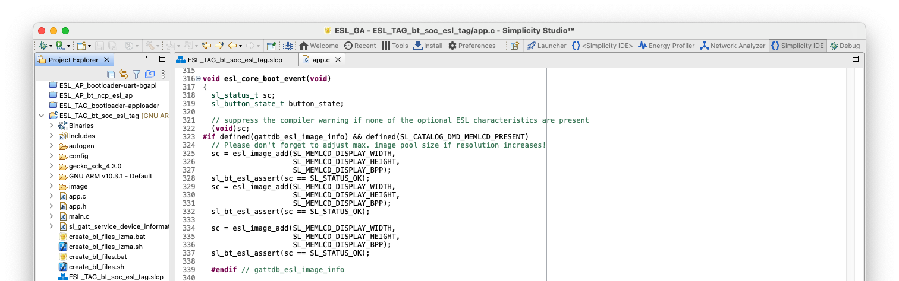
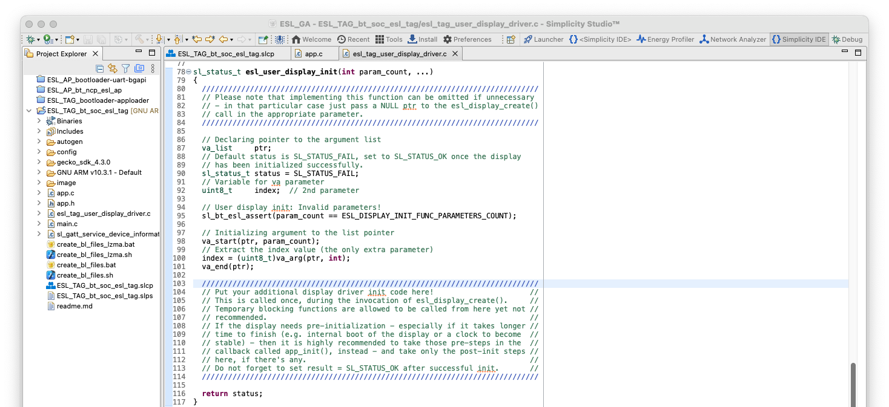
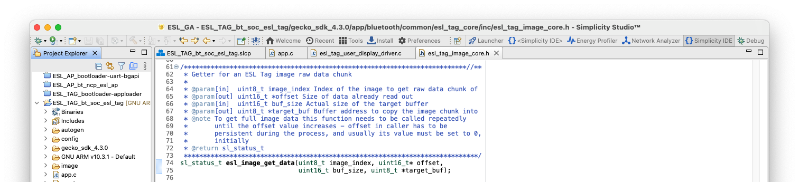
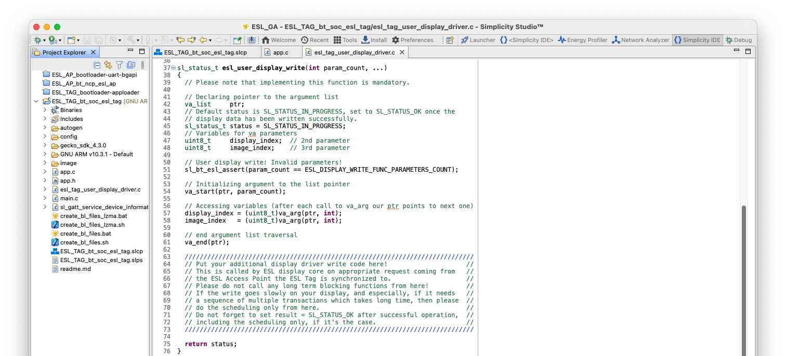
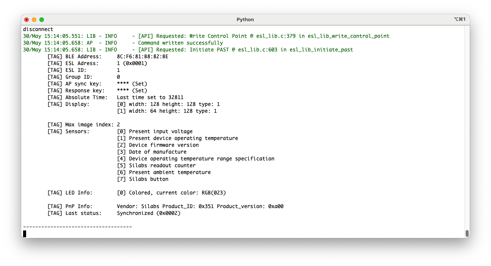
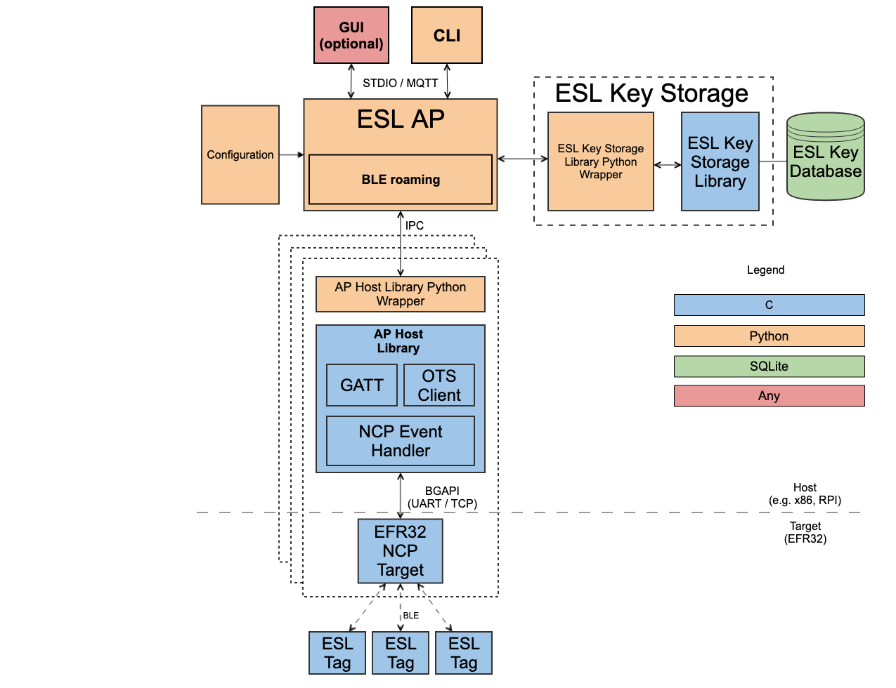

# Modifying the Bluetooth ESL examples

## Bluetooth – SoC ESL Tag Example

The **Bluetooth – SoC ESL Tag** example project can be further extended, with some of the features requiring only a configuration change, but the current API also supports a more extensive customization, e.g., adding additional displays. The **Bluetooth – SoC ESL Tag** is also a good starting point to for creating an ESL Tag application for a customer hardware.

For API documentation, see [ESL Tag core](/bluetooth/{build-docspace-version}/bluetooth-service-api/esl-tag-core).

### Simple Application Scheduler

The **Bluetooth - SoC ESL Tag** example uses a software component **Application \> Utility \> Simple Application Scheduler**, which requires configuration if the number of displays and/or LEDs changed.

The relevant part here is the **Queue length for static allocation** parameter. The value should be "2 + number of displays + number of LEDs". In case of unmodified **Bluetooth - SoC ESL Tag** example built for a WSTK and a radioboard this value is 4: 2 + one display + one LED.

### Image Storage

Out of the box, the **Bluetooth – SoC ESL Tag** example project can store two separate images to be displayed on the WSTK LCD. The number of images can be configured via **SOFTWARE COMPONENTS**. Select **Bluetooth > Application > GATT Services > ESL Tag RAM Image**, and then click **Configure**. This will open the option for increasing the number of images, and allocating more memory for them.

The next step is to add the new, additional image storages to the image registry. This happens by calling a function `esl_image_add()`, e.g. on app.c, function `esl_core_boot_event()`:

The function parameters are the width and height of the image, and number of bits representing a single pixel of the image.

The images can also be saved to tag’s non-volatile memory (NVM). Since the RAM and NVM options are mutually exclusive, the software component Bluetooth \> Application \> GATT Services \> ESL Tag RAM Image must be uninstalled first. Next, install the Bluetooth \> Application \> GATT Services \> ESL Tag NVM Image component, and optionally change the number of images configuration by clicking the **Configure** button. In addition, configure the storage space on NVM3 with the Services \> NVM3 \> NVM3 Default Config software component.

### Additional Displays

The **Bluetooth – SoC ESL Tag** example can be extended to support multiple displays, e.g. an electronic paper display (EPD). The example provides an API to add, or register, a new or additional display(s), and a template for the functions in which the display specific driver code should be placed to or called from.

To add an additional display, install the Bluetooth \> Application \> Miscellaneous \> ESL Tag User Defined Display Driver software package. This will include a file esl_tag_user_display_driver.c to the project, including the templates for the required functions.

In addition, in the Bluetooth \> Application \> GATT Services \> ESL Tag Display configuration, increase the Display instances to two (in case of one additional display).

It is also possible to replace the WSTK display with another one. In this case, the ESL Tag User Defined Display Driver should be installed, and the ESL Tag WSTK LCD driver uninstalled.

Also, the configuration for the interface (e.g., SPI or I2C) used by the external display and possible GPIO configuration are required. But being display specific, these won’t be covered in this application note. For further information about the interfaces and GPIO configuration, see [docs.silabs.com](https://docs.silabs.com/).

To create the display instance, and add it to the display registry, use the API calls `esl_display_create()` and `esl_display_add()`. The `esl_display_create()` requires four parameters: the width and height of the display in pixels, the display type defined in Bluetooth SIG Assigned numbers, and a pointer to a `esl_display_info_p` type display info.

The `esl_display_add()` requires three parameters: the `esl_display_info_p`, and a function pointers to display initialization function and display write function. The prototypes for the functions `esl_user_display_init()` and `esl_user_display_write()` are implemented in `esl_tag_user_display_driver.c`.

>**Note**: If using the functions provided in `esl_tag_user_display_driver.c`, include the header file `esl_tag_user_display_driver.h` in `app.c` (`#include "esl_tag_user_display_driver.h"`).

In addition, a separate storage for images is also needed.

The optional `esl_user_display_init()` is called at startup and intended for code required to initialize the display on power-on situation.

The only mandatory function to be implemented is the `esl_user_display_write()`. This function is called when the access point requests the ESL tag to display an image on the external display.

The image data can be accessed with an API call `esl_image_get_data()`. The function requires four parameters: the index of the image to be fetched, pointer to an offset variable containing the number of bytes already read (if read in chunks), size of the buffer used, and pointer to the buffer:

## ESL AP example

The ESL AP host example software consists of ESL Lib and ESL Key Lib components written in C, and a Python based ESL AP application layer. Both the ESL Lib and ESL Key Lib has a Doxygen style documentation on the header files, describing the interface between the different layers. The source code for ESL Lib and ESL Key Lib are located in `<SDK path>/app/bluetooth/common_host/`.

