# Demo

The access point can also be controlled with a Simplicity Connect mobile application. This requires some additional steps when preparing the ESL tag hardware.

First, build the **Bootloader – SoC Bluetooth AppLoader OTA DFU** and **Bluetooth - SoC ESL Tag** projects normally, as described in [ESL Tags](05-preparing-the-esl-network#esl-tags). Program the bootloader into the ESL tag with Simplicity Studio (or optionally with Simplicity Commander). The compiled application binary will be programmed to the ESL tag by using a separate software called `qrcode_generator.py`, which is in the same folder as the access point (`<SDK path>/app/bluetooth/example_host/bt_host_esl_ap`).

>**Note**: The PATH environment variable must include the path to Simplicity Commander executable, since the `qrcode_generator.py` will use the Simplicity Commander to program the modified application binary to the ESL tag(s).

The `qrcode_generator.py` will create a QR code to be used to identify the ESL tag and merge it to the original application binary. Once merged, the `qrcode_generator.py` calls Simplicity Commander and programs the ESL tag.

To program the ESL tag, use the `qrcode_generator.py` and provide the target device and original .hex file as parameters:

```C
qrcode_generator.py -s <Serial No> <Path to hex>
```

For example:

```C
./qrcode_generator.py -s 440284846 bt_soc_esl_tag.hex
```

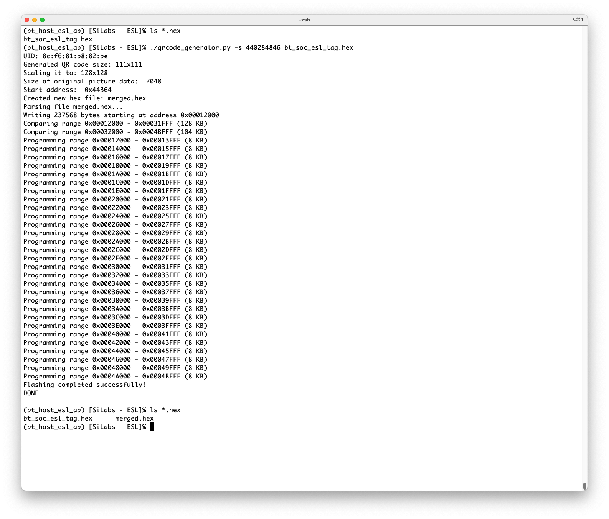

Once the `qrcode_generator.py` has programmed the merged binary to the ESL tag (indicated with line "Flashing completed successfully!"), the ESL tag will boot and display a QR code on the WSTK LCD display.

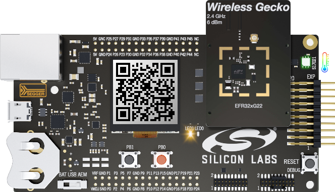

In order to use the demo functionality, also the access point has to be started in demo mode (with command line options --demo -u), or the demo mode can also be enabled via running access point with command demo on.

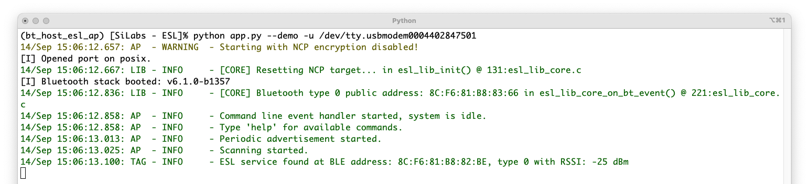

When the access point is used in demo mode, it advertises its existence. Now you can connect to the access point with EFR Connect mobile application. Select the Demo tab, and then the ESL Demo application.

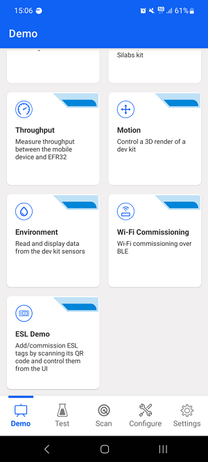

Enabling the Demo feature on the ESL access point will make the access point to advertise, and now the Simplicity Connect mobile application can create a connection to the access point.

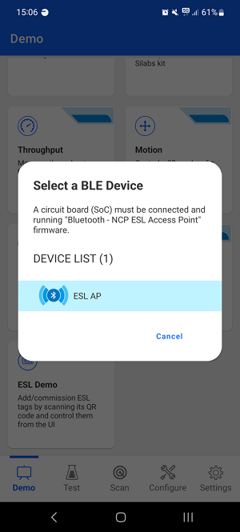

Successful connection creation will also be indicated by the access point, as shown below.

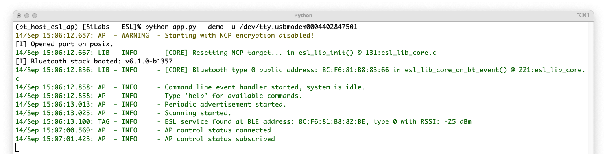

The ESL tags can now be associated to the ESL network by reading the QR code displayed on the WSTK LCD screen with the EFR Connect mobile app. Click the QR code symbol (upper left corner as shown below, and read the ESL Tag's QR code.

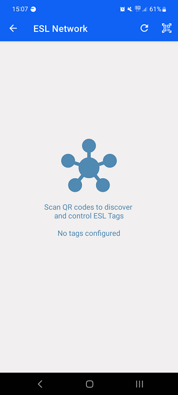

Once the QR has been read, the mobile app will command the access point to connect to the ESL tag in question, and the tag will be in configuring state, as shown below.

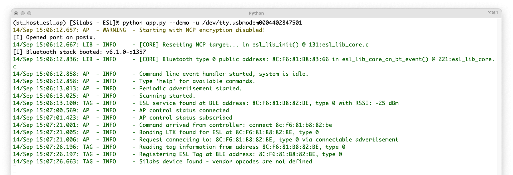

On this state, the mobile app will ask if the tag should be configured, as shown below. If the Configure option is selected, the access point will assign an ESL ID and group for the tag, and read and write all the other necessary configuration parameters, as shown below.

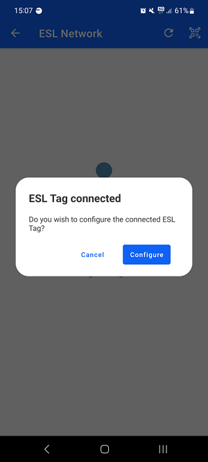

The ESL access point command line interface will also show that the ESL tag has now been configured.

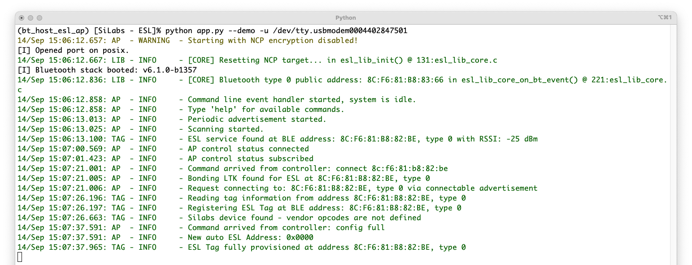

In addition, the Simplicity Connect mobile app will also offer an opportunity to upload an image from the mobile to the ESL tag, and optionally to display the image automatically on the tag.

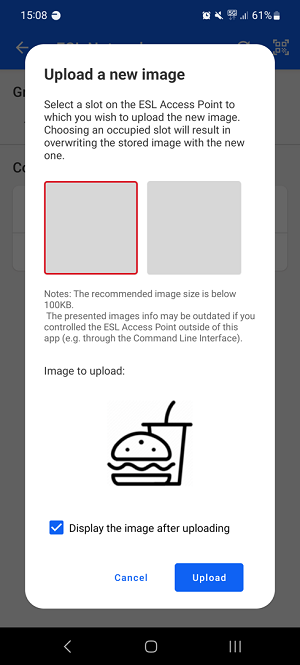

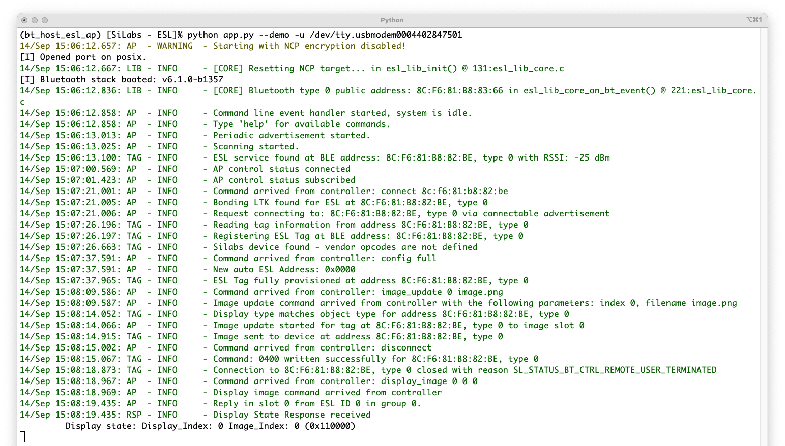

Once the connection to the ESL tag has been closed, the tag can be controlled via Simplicity Connect mobile application. For example, the LED(s) can be turned on.

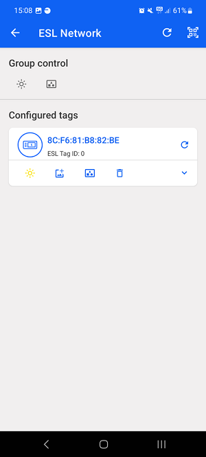

This will also be indicated on the access point command line interface.

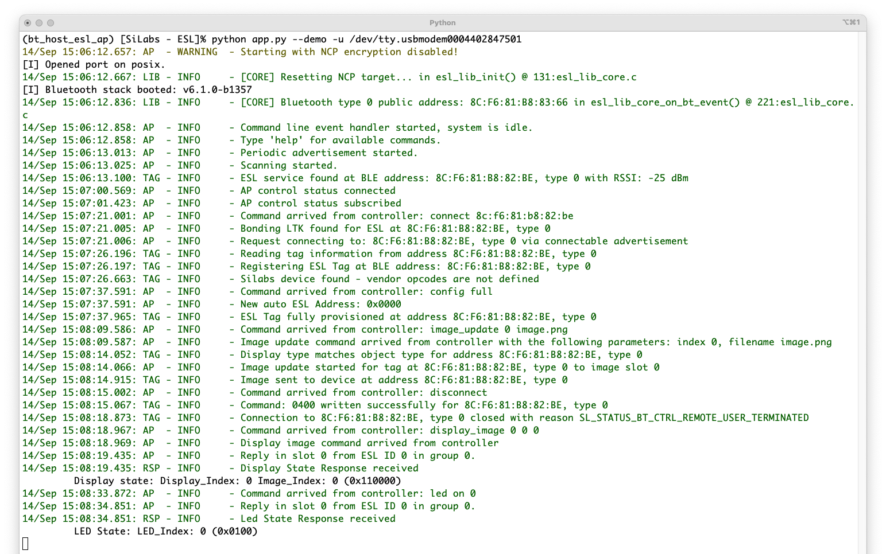
