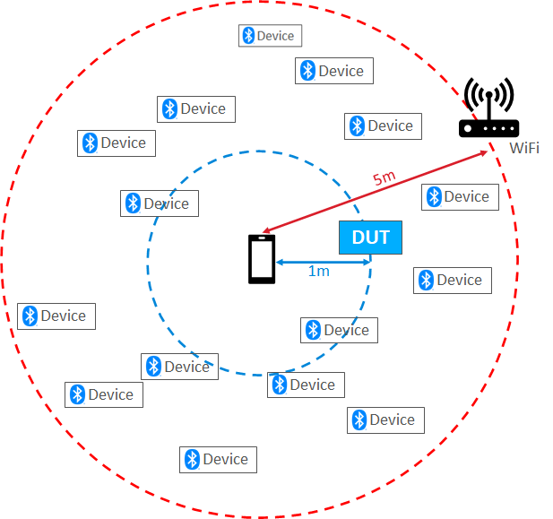

# Test Environment

The overall test environment is described below.

The Device under test (DUT) was placed about 1m away from the mobile phone against which the tests were executed.

The testing was conducted in a generic office environment with the closest WiFi access point about 5m away.

About 15 other interferers in the 2.4Ghz spectrum were active during the testing and were randomly located in the 5m range.

